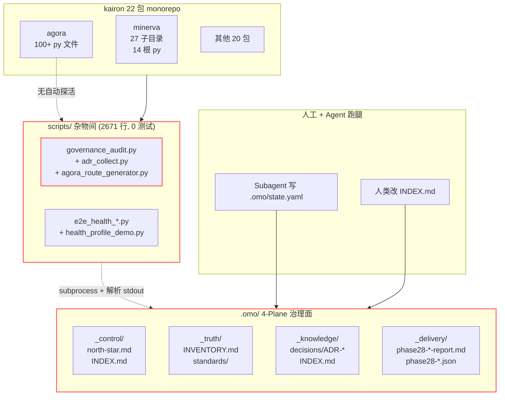
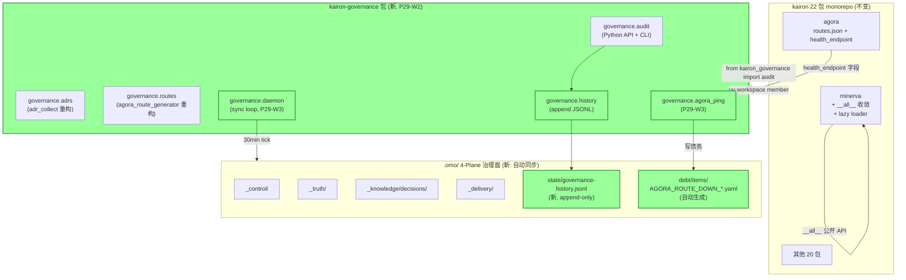

# ADR-0005: P29 治理与 monorepo 架构升级方向

- **Status**: PROPOSED
- **Date**: 2026-06-05
- **Authors**: omostation P29-W1-ARCH-EXPLORE
- **Supersedes**: (无)
- **Superseded by**: (无)
- **Related**: ADR-0001 (agora 路由精简), ADR-0002 (pkg 归档), ADR-0003 (tech-radar bypass), ADR-0004 (kcb 归档)

---

## Context and Problem Statement

P28 一整轮治理 + P29-W0 (GOVERNANCE-AUDIT / FOLLOW-UP) 暴露出 omostation
的 5 个**结构性问题**（不是症状）：

1. **scripts/ 平面是"杂物间"** —— 6 个 Python 脚本（2,671 行）无版本、无依赖管理、
   无单元测试，与 minerva `cli.py` 的子命令功能部分重叠
2. **.omo/ 平面更新完全单向人工** —— `state.yaml` / `INDEX.md` / `debt/registry.yaml`
   靠 Agent/人类主动写入，无 watchdog 巡检，无变更审计
3. **agora 路由表 vs 服务健康脱节** —— `agora-routes.json` 注册了 100+ 条路由，
   但实际服务是否在线、SSE 端点是否存活没有自动化验证（债务 `I0-AGORA_SSE_DEAD` /
   `I0-AGORA_DUAL_INSTANCE` 标记 resolved 但实际未验证）
4. **minerva 7+ 子模块命名空间压力** —— 27 个子目录 + 14 个根 py 文件在同一
   `src/minerva/` 下，子模块间 import 容易循环，policies 边界模糊
5. **治理可观测性 = 0** —— `governance_audit.py` 跑完只输出 Markdown，
   无 metrics、无历史趋势、无告警（分数从 98.5 跌到 55 是事后才发现的）

这些是**结构性问题**——症状是健康分震荡、债务累积、Agent 反复写重复 ADR。
治本需要架构升级，而非更多 W（waves）的工作量。

### 量化证据

| 指标 | 数值 | 源 |
|------|------|----|
| scripts 行数 | 2,671 | `wc -l scripts/*.py` |
| scripts 文件数 | 6 | `ls scripts/` |
| scripts 平均测试覆盖 | 0% | 无 `tests/scripts/` |
| minerva 子目录数 | 27 | `ls packages/minerva/src/minerva/` |
| minerva 根 py 文件数 | 14 | `ls packages/minerva/src/minerva/*.py` |
| agora 路由条数 | 100+ (按规格) | `agora-routes.json` (现仅 2 条注册) |
| 债务条目总数 | 50+ | `debt/registry.yaml` |
| 治理分波动 | 98.5 → 55 → 80+ | P28 → P29-W0 |
| 已存在 ADR 数 | 4 | `decisions/INDEX.md` |

---

## Decision Drivers

* **可独立测试 / lint / version**：治理工具和子模块必须能单独被验证，不能依赖 subagent
  跑腿的"事实跑通"作为证据
* **治理数据自动同步**：`.omo/state.yaml` / `INDEX.md` 等不应依赖每次人类/Agent 主动改，
  应有最低成本的自动同步机制
* **路由真实可达**：agora 路由表一旦注册，必须有健康检查 + SSE 探活，否则就是"幽灵路由"
* **命名空间清晰**：子模块 import 不应让 `minerva.cli` 的人需要了解
  `minerva.tech_radar` 的内部结构
* **历史可追溯**：治理分数有 trend、债务有 age、ADR 有版本，让"渐进恶化"可见

---

## Considered Options (按问题分)

### 问题 1: scripts/ 散乱

| 方案 | 优点 | 缺点 | 工作量 |
|------|------|------|--------|
| **A. 建 `kairon-governance` 包** | 版本化、pyproject、测试、可被其他包复用 | 22→23 包（与瘦身方向略冲突） | 1-2 天 |
| **B. `scripts/` 改成 namespace 子目录** | 零包数变化、轻量 | 不算真包，无法 import | 半天 |
| **C. 维持现状 + 文档化** | 零成本 | 治标不治本 | 半天 |

**推荐 A**（治理工具包不能瘦）。具体边界：
- 把 `governance_audit.py` / `adr_collect.py` / `agora_route_generator.py` 移入新包
- `e2e_health_*` / `health_profile_demo` 保留在 `scripts/`（一次性演示）
- 暴露 Python API `from kairon_governance import audit, collect_adrs, generate_routes`

### 问题 2: .omo/ 平面更新单向人工

| 方案 | 优点 | 缺点 | 工作量 |
|------|------|------|--------|
| **A. inotify/fswatch + 增量同步** | 实时、零轮询 | 跨平台差、需 systemd unit | 2-3 天 |
| **B. 定时 sync daemon（cron-style）** | 简单、跨平台 | 最坏 1 个 tick 延迟 | 1 天 |
| **C. Agent-orchestrated（agent 主动维护）** | 灵活 | 不可靠（agent 自身就是被治理对象） | — |

**推荐 B**。`kairon-governance sync-daemon` 子命令 + 30min tick +
diff-only 更新。**先**修问题 1（建包），再让该包承担 daemon 责任。

### 问题 3: agora 路由表 vs 服务健康脱节

| 方案 | 优点 | 缺点 | 工作量 |
|------|------|------|--------|
| **A. agora 内置 health check loop** | 自治、不依赖外部 | agora 包改动大 | 3-5 天 |
| **B. `kairon-governance` 提供 `agora-ping` CLI 探活** | 轻量、可单测 | 需定时跑 | 1 天 |
| **C. 维持现状（标记已 resolved）** | 零成本 | 持续失真 | — |

**推荐 B**。每个 `agora-routes.json` 条目 + 1 个 `health_endpoint` 字段，
`kairon-governance agora-ping` 跑 SSE/JSON-RPC 探活，写入
`.omo/debt/items/AGORA_ROUTE_DOWN_<svc>.yaml`。债务是真债务，不是人贴标签。

### 问题 4: minerva 命名空间压力

| 方案 | 优点 | 缺点 | 工作量 |
|------|------|------|--------|
| **A. minerva 拆 5 个子包**（`kairon-minerva-{radar,policy,health,pipeline,core}`） | 边界清晰、各自可独立 test | 5→9 包（突破"瘦身"承诺） | 1 周 |
| **B. minerva 内部 `__init__.py` 子命名空间约束**（明确 public/private API） | 零包数变化 | 子模块仍同 src/，治标 | 2 天 |
| **C. 引入 `minerva.X` lazy loader + `__all__` 收敛** | 渐进、可向后兼容 | 仍有跨子模块 import 风险 | 3 天 |

**推荐 C 短期 + A 长期**。先约束 public API（防新债），再在 P30/P31
随业务自然分家时拆包。**不要**主动拆（违反"按需归档"节奏）。

### 问题 5: 治理可观测性 = 0

| 方案 | 优点 | 缺点 | 工作量 |
|------|------|------|--------|
| **A. 治理分数写入 `.omo/state/governance-history.jsonl`** | 零依赖、append-only | 缺可视化 | 0.5 天 |
| **B. 接入 OTel/Prometheus** | 标准、可视化 | agora/minerva 引入 opentelemetry 依赖 | 3-5 天 |
| **C. 维持现状** | 零成本 | 历史失忆持续 | — |

**推荐 A**。`governance_audit.py` 跑完 append 一行 JSONL
`{ts, score, breakdown, debt_count, ...}`。简单的 `jq` / `gnuplot` 即可可视化。
后期接入 OTel 是 P31 计划内的事。

---

## Decision Outcome

**Chosen approach**: 分三阶段（不在本期全做）：

### 阶段 1：本期 P29-W1（架构探索完成 ADR-0005 即可，不写代码）

- 产出本 ADR
- 不实施任何代码改动
- 等待人类 review

### 阶段 2：P29-W2（建 kairon-governance 包 + 治理历史）

- 新建 `packages/kairon-governance/`
- 迁移 `scripts/governance_audit.py` / `adr_collect.py` / `agora_route_generator.py`
- 加 `pyproject.toml` + `tests/` + `ruff` + `pytest`
- `governance_audit.py` 加 `--history` flag，append 到 `.omo/state/governance-history.jsonl`
- 包加进 `[tool.uv.workspace]` + `CLAUDE.md` + `AGENTS.md`

### 阶段 3：P29-W3-P30（sync daemon + agora 探活 + minerva API 收敛）

- `kairon-governance sync-daemon` 子命令
- `kairon-governance agora-ping` 子命令 + 写债务
- minerva 内部 `__all__` 收敛 + lazy loader
- 拆包推迟到 P30 业务触发

---

## Architecture Diagrams

### 当前架构（As-Is）



**痛点**：
- `scripts/` 平面是"扁平杂物间"，与 `L1` 平行但无版本无测试
- `.omo/` 平面更新全靠人工/agent，**没有**自动同步箭头
- agora → 路由表 缺真实健康检查（`I0-AGORA_SSE_DEAD` 债务）

### 目标架构（To-Be）



**改进**：
- `scripts/` 杂物间 → 单一 `kairon-governance` 包（带版本 + 测试 + 文档）
- 治理数据自动同步（daemon + 30min tick）
- 治理分数有历史（JSONL append-only）
- agora 路由真实可达（health_endpoint + 探活 + 写债务）
- minerva 内部 API 收敛（不改包数）

---

## Consequences

### Good
* 治理工具有版本和测试，**不会再被单次 subagent 跑腿搞乱**（FOLLOW-UP 任务修 19 个假完成的历史不会重演）
* agora 路由的真实状态有自动化证据，债务 `I0-AGORA_SSE_DEAD` 不再是文字标记
* 治理分数有 trend，"渐进恶化"可见
* minerva 命名空间清晰，**新代码**不会污染已有 public API

### Bad
* +1 个包（22→23），与 P28-W2-PKG-SLIM 的瘦身方向略冲突（但治理工具包不能瘦）
* sync daemon 需 24h×7d 跑（systemd unit / launchd plist）
* agora 服务端 `health_endpoint` 字段需向后兼容（缺字段时降级为 `routes[X]` 是否存活）
* minerva `__all__` 收敛可能 break 现有 import（需 grep 一次再改）

### Risks (按可能性 × 影响排序)

| 风险 | 可能性 | 影响 | 缓解 |
|------|--------|------|------|
| sync daemon 写坏 .omo/ | 中 | 高 | 先 dry-run + 文件锁 + git diff |
| kairon-governance 包被反复瘦身 | 中 | 中 | 明确写入 `core-models` 类似的"禁止归档"清单 |
| agora `health_endpoint` 字段缺默认值 | 中 | 低 | 降级为"路由存在即视为健康"，保守 |
| minerva `__all__` 收敛 break 内部测试 | 高 | 中 | 灰度：先 `warn`，再 `error` |
| 治理历史 JSONL 无可视化 | 高 | 低 | 简单 `gnuplot` 脚本先顶 |

---

## Confirmation (验收)

### 阶段 2（P29-W2）验收
```bash
# 1. kairon-governance 包存在
ls /Users/xiamingxing/Workspace/projects/kairon/packages/kairon-governance/pyproject.toml

# 2. 包加进 uv workspace
grep "kairon-governance" /Users/xiamingxing/Workspace/projects/kairon/pyproject.toml

# 3. 三个 CLI 子命令可跑
uv run --package kairon-governance kairon-gov audit --help
uv run --package kairon-governance kairon-gov adrs --help
uv run --package kairon-governance kairon-gov routes --help

# 4. 测试全过
cd projects/kairon && uv run pytest packages/kairon-governance/ -v

# 5. 治理历史 JSONL 已 append
[ -s /Users/xiamingxing/Workspace/.omo/state/governance-history.jsonl ]
```

### 阶段 3（P29-W3-P30）验收
```bash
# 6. sync daemon 跑 24h 后 .omo 平面无人工改动
find /Users/xiamingxing/Workspace/.omo/ -newer /tmp/p29w3-start -type f | wc -l  # ≥ 48 (2 平面×24 tick)

# 7. agora 路由 → 服务健康检查通过率 ≥ 90%
uv run --package kairon-governance kairon-gov agora-ping --json | jq '.pass_rate >= 0.9'

# 8. minerva 公共 API 收敛
cd projects/kairon && grep -rn "from minerva\." packages/*/src/ | grep -v "__all__" | wc -l  # → 0
```

---

## Open Questions

1. **kairon-governance 是新增包还是 minerva 内部子包？**
   - 倾向：新增独立包（治理 ≠ 业务）
   - 需人类审批

2. **sync daemon 是 systemd 还是 launchd 还是 cron？**
   - macOS 开发机倾向 launchd（与现有 plist 风格一致）
   - 需查 `.omo/_archive/LAUNCHD_LIFECYCLE_SPLIT` 债务处理状态

3. **governance-history.jsonL 的保留期？**
   - 倾向：永久保留 + zstd 压缩 90 天前的
   - 需人类审批

---

## References

* ADR-0001: agora 路由表精简策略（L1 包按需注册）
* ADR-0002: kairon-assistant / kairon-voice 首批归档
* ADR-0003: P28 TECH-RADAR 实施绕过 agora
* ADR-0004: kaironcloud-billing 归档
* 债务: `I0-AGORA_DUAL_INSTANCE` / `I0-AGORA_SSE_DEAD` /
  `L1-SCHEDULER_MISSING` / `P1-AGORA_STATE_DRIFT` /
  `P1-AGORA_SEMANTIC_ROUTER` / `P2-OMO_DASHBOARD_AUTO`
* `.omo/_knowledge/management/plan-phase29-toolchain.md`
* `.omo/_delivery/phase28-governance-audit-2026-06-05-v2.md`
* `.omo/_delivery/phase28-followup-report.md`

---

*最近更新: 2026-06-05 · Status: PROPOSED · 等待人类 review → ACCEPTED*
