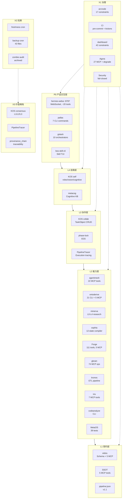

> [!WARNING]
> **DEPRECATED**: 本文档描述的 4+1+3 架构或旧版 eCOS 映射已过时。请参考最新的 **eCOS v5.0 (5+3+1)** 宪法大纲：`~/Documents/学习进化/2-knowledge/基建架构/phase6-完成化/pat-45-eCOS-v5-architecture.md`。

# 4+1+3 架构图

> 系统架构 Mermaid 图，展示 P0/L4/L3/L2/L1 + X1/X2/X3 跨层关系。

## 层说明

| 层 | 名称 | 作用 | 项目数 |
|----|------|------|:------:|
| **P0** | 产品交互层 | 用户与系统交互的所有入口 | 4 |
| **L4** | 自我层 | 系统的身份、愿景、认知框架 | 2 |
| **L3** | 协作层 | 多 Agent 协作、任务分解、共享工作平面 | 3 |
| **L2** | 能力层 | 系统拥有的能力和工具（最厚的层） | 10 |
| **L1** | 契约层 | 数据格式、Schema、协议 | 3 |
| **X1** | 治理 | 约束、规则、审计、安全 | 5 |
| **X2** | 抗熵 | 保鲜、复盘、回收 | 3 |
| **X3** | 价值堆栈 | 共识、追溯、半衰期 | 3 |

## 跨层关系

- 实线 `-->` : 上层消费下层能力（P0 → L4 → L3 → L2 → L1）
- 虚线 `-.->` : X1 治理约束所有 P0/L 层
- 虚线 `X2 -.-> X3` : 抗熵保障价值堆栈的持续积累

> 参考: [4+1+3 架构全映射](../summaries/4-plus-1-plus-3-architecture-mapping.md)
