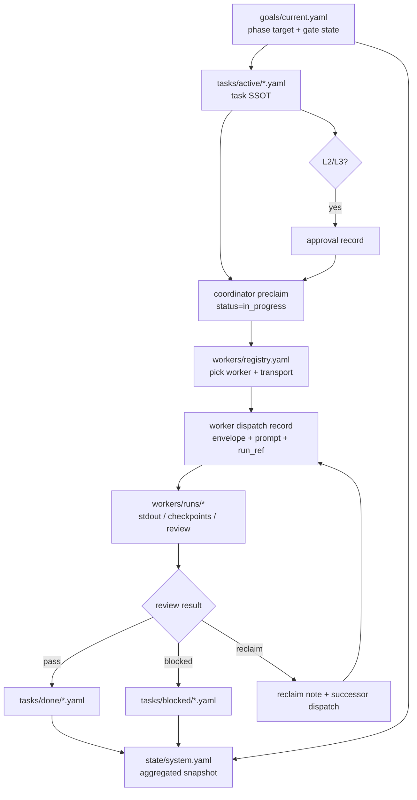

# Control Plane State Flow

```mermaid
flowchart TD
    A[goals/current.yaml<br/>phase target + gate state] --> B[tasks/active/*.yaml<br/>task SSOT]
    B --> C[coordinator preclaim<br/>status=in_progress]
    C --> D[workers/registry.yaml<br/>pick worker + transport]
    D --> E[worker dispatch record<br/>envelope + prompt + run_ref]
    E --> F[workers/runs/*<br/>stdout / checkpoints / review]
    F --> G{review result}
    G -->|pass| H[tasks/done/*.yaml]
    G -->|blocked| I[tasks/blocked/*.yaml]
    G -->|reclaim| J[reclaim note + successor dispatch]
    J --> E
    B --> K{L2/L3?}
    K -->|yes| L[approval record]
    L --> C
    H --> M[state/system.yaml<br/>aggregated snapshot]
    I --> M
    A --> M
```
