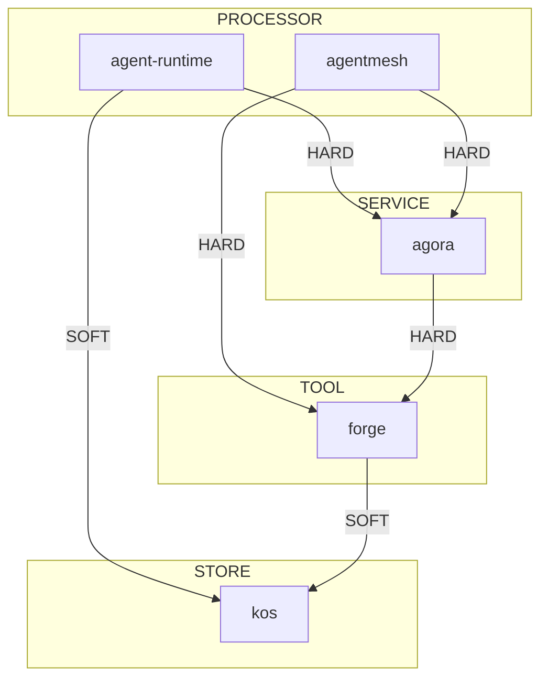

# AI 操作系统 — 完整架构方案与实施路线图

> 版本: v4.0 (综合版) | 日期: 2026-05-26
> 整合: 4+1+3 应用架构 + AAMF 元架构 + 双轨治理 + LLM 本体层
> 状态: **方案已定，进入 Phase 0 实施**

---

## 目录

1. [愿景](#一愿景)
2. [现状审查](#二现状审查)
3. [统一架构蓝图](#三统一架构蓝图)
4. [治理模型：双轨制](#四治理模型双轨制)
5. [路线图总览](#五路线图总览)
6. [Phase 0 — MVP 验证（3 天）](#六phase-0--mvp-验证3-天)
7. [Phase 1 — 宪法与元模型（1 周）](#七phase-1--宪法与元模型1-周)
8. [Phase 2 — 核心对齐（2 周）](#八phase-2--核心对齐2-周)
9. [Phase 3 — 工具链与自动化（2 周）](#九phase-3--工具链与自动化2-周)
10. [Phase 4 — 按需覆盖（持续）](#十phase-4--按需覆盖持续)
11. [风险登记册](#十一风险登记册)
12. [附录：文档索引](#十二附录文档索引)

---

## 一、愿景

### 一句话

> 一个**以人的身份和愿景为顶层**、**契约保证一致性**、**多 Agent 在共享工作平面上协作**、**所有智力资产按价值堆栈管理**、**自身架构可自我发现和自我治理**的递归式 AI 操作系统。

### 关键能力（1-2 年目标）

| 能力 | 当前 | 目标 |
|------|------|------|
| 架构治理 | AGENTS.md 分散在 30+ 项目 | 统一宪法 + 双轨自动校验 |
| 节点发现 | 人工记忆 | Agora 注册 + ARCH_NODE.yaml 自动发现 |
| 热插拔 | 无（替换模块需改 N 个地方） | 依赖图校验 + 接口兼容性检查 |
| 架构漂移检测 | 无 | `arcnode drift-check` cron 每日报告 |
| 进化引擎 | 无 | LLM 驱动 M0→M2 反馈回路 |
| 多 Agent 协作 | A2A 基础 | TaskObject 共享工作平面 |

### 四条第一性原理

```
信息论: 架构的本质是信息处理。InterfaceContract = 信道描述。
图灵机: 架构是分布式状态机。LLM Reasoner = 通用控制器。
系统论: 架构是层级系统。涌现行为不可归约为单节点。
控制论: 治理需要必要多样性。LLM 提供代码约束给不出的多样性。
```

---

## 二、现状审查

### 2.1 项目全景（2026-05-26 快照）

```
核心运行时:
  ✅ Agent Runtime (675 LOC, HTTP:9876, launchd, 10 tools, 11 cron)
  ✅ AgentMesh Engine (5 packages, TypeScript, monorepo)
  🟡 MetaOS (5630 LOC, Python, 38/39 tests pass)

MCP 服务总线:
  ✅ Agora (222 tests, 7 registered services, MCP server)
  🟡 Gateway-Python (精简为 Agora 前端层)

知识工程:
  ✅ eidos (元模型定义, schema 管理)
  ✅ KOS (6 domains, 8,952 docs, LanceDB)
  ✅ minerva (L0-L4 研究系统, MCP server)
  🟡 ontoderive/sophia/pallas (稳定, 低活跃)

数据设施:
  🟡 SSOT (45/46 tests, 12K LOC)
  ✅ gbrain (持久记忆, MCP 待集成)

生态工具:
  ✅ Forge (120 tools, 423 节点知识图谱, MCP server)
  🟡 eCOS (Phase 9, 12 cron, 98 tests)
  🟢 SharedBrain (维护模式, 2.1G 已清理)

CLI / 工具:
  ✅ cron (21 jobs, dual-track 治理修复完成)
  ✅ watchdog (5 服务每 5 分钟监控)
```

**关键结论**：核心运行时稳定，治理是最大短板。18 号审计发现的 5 个问题中，3 个（无宪法、无接口契约、节点游离）是治理问题。

### 2.2 当前治理状态

| 维度 | 现状 | 问题 |
|------|------|------|
| 架构知识 | 分布在 30+ AGENTS.md + 对话记忆 | 无单一权威宪法 |
| 接口契约 | 各项目自定 | 无统一枚举和校验 |
| 节点注册 | 人工管理 | 无发现/热插拔 |
| 漂移检测 | 无 | 声明≠实际 |
| 依赖管理 | 手工追查 | 无自动推导 |
| 安全性 | localhost/Tailscale | 无注册认证 |

### 2.3 已完成的关键修复（本会话内）

| 修复 | 问题 | 方案 |
|------|------|------|
| 12 个 cron 脚本 | no_agent 模式没传 task name | 创建 wrapper 脚本 |
| 微信限流 | 多个 cron 同时推微信 | 分钟偏移错峰 |

---

## 三、统一架构蓝图

### 3.1 4+1+3 应用架构 + AAMF 元架构 = 统一层叠

二者不是竞争关系，而是**不同抽象级别的视图**：

```
┌────────────────────────────────────────────────────────────────┐
│  AAMF 元架构层（治理架构）                                       │
│  ┌────────────────────────────────────────────────────────────┐ │
│  │ M3: ArchitectureModel (元元模型 — 什么是架构节点)           │ │
│  │ M2: 6 MetaType × 6 MetaRelation (元模型 — 分类与关系)      │ │
│  │ M1: ARCH_NODE.yaml (模型层 — 每个节点的声明文件)            │ │
│  │ M0: 运行中的节点 (AgentRuntime/Agora/KOS...)                │ │
│  └────────────────────────────────────────────────────────────┘ │
│             ↓ 治理约束 ↑ 反馈回路的反射关系                            │
│  ┌────────────────────────────────────────────────────────────┐ │
│  │  4+1+3 应用架构（运行时架构）                                 │ │
│  │  ┌──────────────────────────────────────────────────────┐  │ │
│  │  │  L4: 自我层 — 身份/愿景/原则/认知框架                  │  │ │
│  │  │  L3: 协作层 — 共享工作平面/多 Agent/共识               │  │ │
│  │  │  L2: 能力层 — Task/Resource/知识图谱                   │  │ │
│  │  │  L1: 契约层 — Schema/接口/身份                         │  │ │
│  │  └──────────────────────────────────────────────────────┘  │ │
│  │  X1: 治理与安全  X2: 抗熵与进化  X3: 价值堆栈               │ │
│  └────────────────────────────────────────────────────────────┘ │
└────────────────────────────────────────────────────────────────┘
```

**关系**：
- AAMF M1 (ARCH_NODE.yaml) 描述的是 4+1+3 架构中每个节点的声明
- AAMF M2 约束 X1 (治理) 层的规则定义
- AAMF M0→M2 反馈回路实现 X2 (进化) 层的自动化
- 4+1+3 的 X3 (价值堆栈) 映射到 AAMF 的信息论信道

### 3.2 核心组件映射

| 组件 | 4+1+3 层 | AAMF MetaType | 状态 | 接口 |
|------|---------|--------------|------|------|
| Hermes Agent | L3 协作层 | AGENT | ✅ 运行中 | MCP client |
| Agent Runtime | L2 能力层 | PROCESSOR | ✅ 运行中 | HTTP:9876 |
| AgentMesh Engine | L2 能力层 | PROCESSOR | ✅ 运行中 | MCP + HTTP |
| Agora | X1 治理层 | SERVICE | ✅ 运行中 | MCP + HTTP:7430 |
| Forge MCP Server | L2 能力层 | SERVICE | ✅ 运行中 | MCP stdio |
| KOS | L2 能力层 | STORE | ✅ 运行中 | MCP |
| SSOT | L1 契约层 | STORE | 🟡 活跃 | Python API |
| Eidos | L1 契约层 | SERVICE | ✅ 活跃 | Python API |
| Minerva | L2 能力层 | TOOL | ✅ 运行中 | MCP |
| MetaOS | L2 能力层 | PROCESSOR | 🟡 活跃 | Python |
| IMA Copilot | — | TOOL | ❌ 未激活 | — |
| eCOS | L3 协作层 | AGENT | 🟡 运行中 | CLI + cron |

### 3.3 InterfaceContract（统一接口枚举）

```yaml
interface_contract:
  transport:
    protocol: mcp:stdio | mcp:sse | http:rest | ws:stream | cli:stdio | event:pubsub | file:pipe | grpc:stream
    version: semver
    discovery: static | registry | broadcast

  role: provider | consumer | both

  capabilities:
    - id: string               # 全局唯一能力 ID
      input_schema: string     # Eidos Schema 引用
      output_schema: string

  auth:                        # @future: Phase 0 标记为预留
    required: false | true
    type: none | token | mtls | oauth

  governance:
    rate_limit: string         # e.g. "100/1m"
    timeout: string            # e.g. "300s"
    # @future: capacity from information theory
```

---

## 四、治理模型：双轨制

### 4.1 架构

```
ARCH_NODE.yaml / 项目代码
       │
       ▼
┌────────────────────────────────┐
│ 代码层 (Hard Gate — 确定性)     │
│                                │
│ 操作:                          │
│  - Schema 格式校验              │
│  - 枚举类型匹配                 │
│  - 依赖图连通性                 │
│  - 健康检查端点可达性            │
│  - 版本兼容性                   │
│                                │
│ 开销: ~0 tokens                │
│ 输出: PASS / FAIL (硬门禁)      │
└──────────┬─────────────────────┘
           │ 通过
           ▼
┌────────────────────────────────┐
│ LLM 层 (Soft Gate — 语义的)    │
│                                │
│ 操作:                          │
│  - MetaType 语义分类 (O1)      │
│  - 本体论承诺检查 (O5)          │
│  - 宪法合规审查                 │
│  - 架构漂移诊断                 │
│  - M0→M2 模式发现              │
│  - 涌现行为报告                 │
│                                │
│ 开销: ~500-2000 tokens/调用    │
│ 输出: Advisory (建议/警告)      │
│ 必须附带: reasoning trace       │
└──────────┬─────────────────────┘
           │
           ▼
      Governance Report → governance log
```

### 4.2 五项本体论操作

| 操作 | 问题 | 代码能做什么 | LLM 能做什么 |
|------|------|------------|-------------|
| O1 分类 | 这个节点是什么类型？ | 检查 meta_type 枚举值 | 读代码/README 判断语义类型 |
| O2 分体论 | X 是 Y 的一部分吗？ | 检查文件归属 | 判断功能上的包含关系 |
| O3 依赖 | X 没有 Y 能运行吗？ | 检查启动顺序 | 判断运行时依赖的语义强度 |
| O4 同一性 | v2 还是同一个节点？ | 检查版本号 | 判断 API 断裂程度 |
| O5 本体论承诺 | 术语使用一致吗？ | 检查枚举值 | 判断概念使用是否自洽 |

### 4.3 M0→M2 反馈回路

```
Agora 收到新节点注册
  → 代码层校验 (PASS/FAIL)
  → LLM 层校验:
     ├─ MetaType 匹配 → 注册成功
     ├─ 模糊 → 接受但标记 unresolved
     └─ 不存在 → LLM 分析特征 → 建议新类型 → 触发人工审阅

cron: "0 9 * * 1" — 每周审阅 unresolved 队列
  → LLM 汇总同类型 unresolved ≥ 3 → 起草 M2 扩展提案
  → 人工确认后执行
```

---

## 五、路线图总览

```
Phase 0 ──── Phase 1 ──── Phase 2 ──── Phase 3 ──── Phase 4
 3 天         1 周         2 周         2 周         持续
 │            │            │            │            │
 ├─ ARCH_NODE │─ 宪法落盘   │─ 5 核心对齐  │─ 依赖图    │─ 其余按需
 ├─ validate  │─ 元模型精简  │─ Agora 注册  │─ 兼容检查  │─ 进化引擎
 ├─ reason    │─ CLI 实现   │─ 5 项目 YAML │─ drift-    │─ token 微调
 ├─ Agora reg │  schema    │  生成        │  check     │  (500条后)
 └─ MVP 验证   │─ 注册校验   └─ cross-     │─ cross-    │
             │ 实现         validation  │  validation│
             │             loop setup   │  loop done  │
```

### 工时总览

| Phase | 内容 | 工时 | 前置 |
|-------|------|------|------|
| 0 | MVP 验证 | 3 天 | 无 |
| 1 | 宪法 + 元模型 | 1 周 | Phase 0 数据 |
| 2 | 核心对齐 | 2 周 | Phase 1 |
| 3 | 工具链 | 2 周 | Phase 1 |
| 4 | 按需覆盖 | 持续 | Phase 2+3 |
| **总计** | | **~6 周** | — |

---

## 六、Phase 0 — MVP 验证（3 天 / ~24 工时）

### 目标

打通从 ARCH_NODE.yaml 编写到 Agora 注册的端到端链路，验证 LLM Reasoner 能否产出有意义的 Advisory。

### 日维度排期

```
D1 ──── D2 ──── D3
│       │       │
0.1 YAML 0.3 reason  0.5 验证链路
0.2 validate 0.4 register 风险门禁回顾
```

### 精细任务表

| ID | 任务 | 时段 | 工时 | 前置 | 详细描述 | 验收标准 | 产出 | 风险 |
|----|------|------|------|------|---------|---------|------|------|
| 0.1 | 编写 Agent Runtime ARCH_NODE.yaml | D1 AM | 2h | 无 | 创建 `~/.hermes/architecture/arch_nodes/agent-runtime.yaml`。需审查 Agent Runtime 代码确定 provides/depends_on/lifecycle。MetaType 初步定为 PROCESSOR。 | YAML 语法正确，必填字段完整，手动审阅语义合理 | `agent-runtime.yaml` | 低 |
| 0.2 | 实现 `arcnode validate` CLI | D1 PM | 4h | 0.1 | Python 脚本。校验：YAML 格式、必填字段、枚举类型(6 MetaType/6 Relation/transport protocol)、semver 版本、dependency 等级(HARD/SOFT/OPTIONAL)。不含 LLM 调用。 | `arcnode validate agent-runtime.yaml → PASS`。格式错误的 `debug.yaml → FAIL` 给出精确行号 | `~/.hermes/scripts/arcnode-validate.py` | 低，纯 Python |
| 0.3 | 实现 `arcnode reason` CLI | D2 AM | 5h | 0.1 | Python 脚本 + LLM 调用(deepseek-v4-flash)。执行 O1(分类)/O3(依赖)/O5(本体论承诺)三项操作。请求宪法上下文(WORKSPACE_ARCHITECTURE_CONSTITUTION.md，Phase 1 前用 21 号文档代替)。--trace 输出完整推理链。置信度阈值 0.7。 | `arcnode reason --trace agent-runtime.yaml` 输出包含：MetaType 建议+置信度、依赖分析、issues 列表、reasoning trace。对各字段随机测试输出不重复。 | `~/.hermes/scripts/arcnode-reason.py` | 🟡 LLM 可能输出套话，需 prompt 迭代 |
| 0.3.1 | prompt 试错迭代 | D2 AM | (含在 0.3) | 0.3 | 先手动调 prompt 直到输出有意义。核心 prompt 模板见下。 | 对同一个 YAML 连续跑 3 次，每次输出合理且不重复 | prompt 模板 | 同 0.3 |
| 0.4 | Agora 注册端点扩展 | D2 PM | 5h | 0.2+0.3 | 扩展 Agora CLI (`agora/src/agora/cli.py` 或独立模块)：`agora register` 读取 YAML → 调 validate(FAIL则拒绝) → 调 reason(记录 advisory) → 写入 registry。新增 `agora list-nodes` 和 `agora governance-log`。Governance log 位置：`~/.hermes/architecture/governance_log/` | `agora register agent-runtime.yaml → success`。`agora list-nodes` 看到新节点。无效 YAML → 拒绝+错误信息。 | Agora CLI 扩展 | 🟡 需理解 Agora CLI 架构 |
| 0.5 | 端到端验证 | D3 AM | 4h | 0.1-0.4 | 完整链路走一遍：1. agent-runtime.yaml → validate PASS；2. → reason 输出 Advisory；3. → register success；4. → list-nodes 可见；5. → governance-log 可查。输出验证报告。 | 三步骤全部 PASS，governance log 有完整的 reasoning trace | `phase0-verification-report.md` | 低 |
| 0.6 | 风险门禁回顾 | D3 PM | 2h | 0.5 | 检查 4 个门禁是否触发。评估 LLM Reasoner 输出质量。评估单人维护成本。决定是否进入 Phase 1。 | 明确结论："继续 Phase 1" / "暂停" / "需修正" | Phase 1 go/no-go 决策 | 低 |
| 0.7 | [可选] 验证宪法初稿 | D3 PM | 2h | 0.5 | 如果还有时间，为宪法文档写骨架，确保 reason 的宪法合规检查有上下文可用（否则先用 21 号文档）。 | 宪法骨架有 8 个章节标题+一段定义 | `WORKSPACE_ARCHITECTURE_CONSTITUTION.md` 初稿 | 低，可选 |

### 0.3 `arcnode reason` prompt 模板（初始版）

```
你是一个架构治理本体论推理器。你的任务是对一个 ArchitectureNode 声明文件做语义审核。

上下文（宪法定义）：
【META_TYPE 定义】
- PROCESSOR: 执行任务/运行逻辑。特征：有 task handler、workflow engine、scheduler。
- SERVICE: 暴露接口/协议。特征：有 HTTP/gRPC/MCP 端点、服务注册。
- GATEWAY: 路由/代理/转换。特征：有请求转发、协议转换。
- STORE: 持久化数据。特征：有数据库、文件系统、缓存。
- AGENT: 自治行为/决策。特征：有 LLM 对话、自主决策、工具调用。
- TOOL: 提供原子能力。特征：功能单一、无状态、可组合。

【依赖等级】
- HARD: 无此依赖节点完全不可工作
- SOFT: 无此依赖节点降级运行
- OPTIONAL: 无此依赖无影响

请分析以下 ARCH_NODE.yaml，输出 JSON 格式报告:
{
  "classification": {"suggested": "类型名", "confidence": 0-1, "reasoning": "理由"},
  "dependencies": [
    {"id": "deepseek-llm", "suggested_level": "HARD/SOFT/OPTIONAL", "reasoning": "..."}
  ],
  "issues": [
    {"severity": "CRITICAL/WARNING/INFO", "message": "...", "suggestion": "..."}
  ],
  "trace": "..."
}
```

### 风险门禁

| 门禁 ID | 触发条件 | 判定标准 | 行动 |
|---------|---------|---------|------|
| G-0.1 | LLM 输出全为套话 | 对同一 YAML 连续跑 3 次，3 次输出基本相同或全为"看起来正确" | 停止 Phase 1，重写 prompt。加入宪法上下文物种多样性 |
| G-0.2 | validate 漏掉明显错误 | 故意写格式错误的 YAML 通过 validate | 加校验规则后重跑 |
| G-0.3 | Agora 注册链路不通 | `agora register` 返回非预期错误 | 修 Agora 扩展点 |
| G-0.4 | 3 天没完成 | D3 结束时 0.5 未完成 | 砍 0.7（宪法初稿非必需），专注验证链路 |
| G-0.5 | LLM token 消耗过高 | 单次 reason 调用在 5K tokens 以上 | 精简 prompt，缩短宪法上下文 |

---

## 七、Phase 1 — 宪法与元模型（1 周 / ~40 工时）

### 目标

建立统一架构宪法，基于 Phase 0 真实数据精炼元模型，实现代码层校验 CLI。

### 周维度排期

```
D1-2 ─────── D3-4 ────── D5
│            │           │
1.1 宪法落盘  1.3 Schema   1.5 注册校验
1.2 MetaType 1.4 strict   1.6 边界项目审阅
              扩展
```

### 精细任务表

| ID | 任务 | 时段 | 工时 | 前置 | 详细描述 | 验收标准 | 产出 | 风险 |
|----|------|------|------|------|---------|---------|------|------|
| 1.1 | 落盘架构宪法文档 | W1 D1-2 | 8h | Phase 0 数据, 21号文档 | 编写 `~/.hermes/architecture/WORKSPACE_ARCHITECTURE_CONSTITUTION.md`。8章结构：架构定义(ArchitectureObject/M3/M2/M1)、6 MetaType 定义、6 MetaRelation 定义、InterfaceContract 枚举、生命周期管理规则、双轨治理流程、M0→M2 演化流程、安全基线。基于 Phase 0 真实数据和 21 号文档。 | 8 章全部完成，每章定义清晰，无模糊术语。能被 `arcnode reason` 作为上下文引用。 | `WORKSPACE_ARCHITECTURE_CONSTITUTION.md` | 🟡 宪法是权威文档，一经发布不宜频繁修改 |
| 1.2 | 基于 Phase 0 精炼 6 种 MetaType | W1 D2-3 | 6h | 1.1 | 审阅 Phase 0 中 Agent Runtime 的 reason 输出，看分类是否准确。必要时调整 MetaType 定义边界。确认 6 种架构类型、8 种知识类型、6 种关系的定义。写入 schema/ 目录。 | 6 种架构 MetaType 的边界清晰可区分。每个类型有明确判定标准。`meta_types.yaml` 文件完成。 | `~/.hermes/architecture/schema/meta_types.yaml` | 低 |
| 1.3 | InterfaceContract schema 实现 | W1 D3-4 | 8h | 1.1 | Python Schema (`~/.hermes/architecture/schema/interface_contract.yaml` + `arcnode/contract.py`)。定义 transport 枚举、role、capabilities、auth(预留@future)、governance(capacity 预留@future)。实现校验函数。 | Schema 能用于 validate 的枚举校验。预留字段带有 @future 标记不阻塞。 | schema 文件 + Python 校验模块 | 低 |
| 1.4 | `arcnode validate --strict` 扩展 | W1 D4 | 4h | 1.3 | 在 0.2 基础上加 `--strict` 模式：除格式校验外，检查宪法合规（例如：PROCESSOR 必须提供 task_handler 能力、STORE 必须提供至少一个存储接口）。`--strict` 的规则从 schema 中加载，不是硬编码。 | `arcnode validate --strict` 能检测违反宪法的结构性问题。例如：meta_type=STORE 但能力列表无存储接口 → FAIL。 | `arcnode-validate.py` 更新 | 低 |
| 1.5 | Agora 注册时元模型校验 | W1 D5 | 6h | 1.4 | 修改 `agora register`：注册时自动调 `arcnode validate --strict`。FAIL 则拒绝注册并返回详细错误。同时记录 governance log。已有节点不做追溯。 | 违反宪法的 YAML → register 拒绝。合规 YAML → register 成功。 | Agora CLI 更新 | 低 |
| 1.6 | 边界项目审阅 | W1 D5 | 4h | Phase 0, 1.2 | 审阅 4 个核心项目(Agora/AgentMesh/Forge/KOS)的 AGENTS.md。判断它们是否干净匹配 6 种 MetaType。输出边界问题列表供 Phase 2 参考。 | 每个项目的 MetaType 建议+边界问题清单 | `phase1-project-review.md` | 🟡 可能发现项目不完全匹配类型 |
| 1.7 | Buffer / 文档同步 | W1 间 | 4h | — | 处理 Phase 1 中暴露的意外问题。确保 21 号文档与宪法一致。 | — | — | — |

---

## 八、Phase 2 — 核心对齐（2 周 / ~80 工时）

### 目标

5 个核心项目生成 ARCH_NODE.yaml，完成 Agora 注册，实现 cross-validation loop。

### 双周维度排期

```
W1 ──────────────── W2 ────────────────
│                  │
2.2 Agora 注册     2.4 Forge 注册
2.3 AgentMesh 注册  2.5 KOS 注册
                   2.6 cross-validation loop
```

### 精细任务表

#### Week 1: Agora + AgentMesh 对齐

| ID | 任务 | 时段 | 工时 | 前置 | 详细描述 | 验收标准 | 产出 |
|----|------|------|------|------|---------|---------|------|
| 2.1 | Agent Runtime 注册 | W1 D1 | 1h | Phase 0 | 重新运行 end-to-end 验证，确认 Phase 0 的注册仍有效。同步最新的宪法规则。 | `agora list-nodes` 显示 agent-runtime | — |
| 2.2.1 | 审查 Agora 项目 | W1 D1 | 2h | 1.6 | 读 Agora AGENTS.md + CLI 代码 + registry 代码。确定 Agora 完全匹配 SERVICE 类型。记录 provides 列表（MCP 14 tools + REST 16 endpoints + WebSocket）。 | 完成项目审查笔记 | `agora-review-notes.md` |
| 2.2.2 | 生成 Agora ARCH_NODE.yaml | W1 D2 | 2h | 2.2.1 | 编写 `agora.yaml`。MetaType: SERVICE。provides: 列出所有接口。depends_on: minerva/sophia/eidos/iris/kronos/bos-daemon。 | `arcnode validate agora.yaml → PASS` | `arch_nodes/agora.yaml` |
| 2.2.3 | LLM reason + 修正 | W1 D2 | 1h | 2.2.2 | `arcnode reason --trace agora.yaml` → 根据 advisory 修正 YAML。 | reason 输出合理且无 CRITICAL issue | `agora.yaml` 修正版 |
| 2.2.4 | Agora 注册 | W1 D2 | 1h | 2.2.3 | `agora register agora.yaml`。确认 governance log 记录。 | register success, governance log 可查 | registro |
| 2.3.1 | 审查 AgentMesh Engine | W1 D3 | 2h | 1.6 | 读 agentmesh CLAUDE.md + engine 代码。AgentMesh 有 5 个 packages + engine + MCP server + CLI。判断是否为 PROCESSOR（它编排 agent 生命周期）。 | 完成项目审查笔记 | `agentmesh-review-notes.md` |
| 2.3.2 | 生成 AgentMesh ARCH_NODE.yaml | W1 D3 | 2h | 2.3.1 | 编写 `agentmesh.yaml`。MetaType: PROCESSOR。provides: 列出 gateway API + MCP server + engine 能力。depends_on: deepseek-llm (through toolkit)。 | `arcnode validate agentmesh.yaml → PASS` | `arch_nodes/agentmesh.yaml` |
| 2.3.3 | LLM reason + 修正 | W1 D4 | 1h | 2.3.2 | same pattern as 2.2.3 | reason 合理 | `agentmesh.yaml` 修正版 |
| 2.3.4 | AgentMesh 注册 | W1 D4 | 1h | 2.3.3 | `agora register agentmesh.yaml` | success | registro |
| 2.7 | W1 回顾 | W1 D5 | 2h | — | 回顾 W1 问题。检查 Agora 和 AgentMesh 的注册质量。必要时调整宪法或 MetaType。 | W1 回顾笔记 | `phase2-w1-retro.md` |

#### Week 2: Forge + KOS + Cross-validation

| ID | 任务 | 时段 | 工时 | 前置 | 详细描述 | 验收标准 | 产出 |
|----|------|------|------|------|---------|---------|------|
| 2.4.1 | 审查 Forge | W2 D1 | 2h | 1.6 | 读 Forge CLAUDE.md + MCP server 代码。Forge 有 120 tools + 423 节点知识图谱 + 4 层架构 + MCP server。**判断为 SERVICE 类型**（它是管理工具的治理平台，有独立生命周期和运维体系，非 TOOL）。详见 `schema/project-review.md`。 | 完成项目审查笔记 | `forge-review-notes.md` |
| 2.4.2-4 | Forge YAML + reason + register | W2 D1-2 | 4h | 2.4.1 | (同 2.2 模式) YAML → validate → reason → 修正 → register | register success | `arch_nodes/forge.yaml` |
| 2.5.1 | 审查 KOS | W2 D2-3 | 2h | 1.6 | 读 KOS 代码。KOS 有 6 域 8,952 文档 + LanceDB + 14 MCP tools。判断为 STORE 类型（持久化知识数据）。 | 完成项目审查笔记 | `kos-review-notes.md` |
| 2.5.2-4 | KOS YAML + reason + register | W2 D3-4 | 4h | 2.5.1 | (同 2.2 模式) | register success | `arch_nodes/kos.yaml` |
| 2.6.1 | 实现 cross-validation loop | W2 D1-4 | 8h | 2.2-2.5 至少 2 个注册 | Python 脚本 `arcnode-cross-validate.py`。核心逻辑：对每个注册节点，validate 的得分作为 reason 置信度的参考；reason 的 advisory 触发 validate 规则更新。由 cron "0 6 * * *" 每日运行。输出 governance 日报。 | 对已注册节点，cross-validation 输出有意义的交叉校验报告 | `arcnode-cross-validate.py` + cron 注册 |
| 2.6.2 | Cross-validation 试运行 | W2 D5 | 2h | 2.6.1 | 手动跑 cross-validation 看输出质量。修正逻辑。 | 输出合理，无 false positive 洪流 | — |
| 2.8 | Phase 2 总结 | W2 D5 | 2h | 2.2-2.6 | 5 个核心项目全部注册完成。cross-validation loop 就绪。输出 Phase 2 总结 + Phase 3 准备。 | 5/5 核心项目注册成功 | `phase2-summary.md` |

---

## 九、Phase 3 — 工具链与自动化（2 周 / ~80 工时）

### 目标

实现自动依赖图推导、接口兼容性检查、每日架构漂移检测。

### 双周维度排期

```
W1 ──────────────── W2 ────────────────
│                  │
3.1 依赖图        3.3 drift-check cron
3.2 兼容性检查     3.4 unresolved 队列
                  3.5 arcnode report
                  3.6 cross-validation 上线
```

### 精细任务表

#### Week 1: 依赖图 + 兼容性检查

| ID | 任务 | 时段 | 工时 | 前置 | 详细描述 | 验收标准 | 产出 |
|----|------|------|------|------|---------|---------|------|
| 3.1.1 | 实现依赖图推导 | W1 D1-2 | 8h | Phase 2 (至少3个注册) | Python 脚本 `arcnode-graph.py`。从所有已注册的 ARCH_NODE.yaml 中读取 depends_on/provides 关系。生成 Mermaid 格式的依赖图（包含节点类型、依赖方向、依赖等级）。支持 `--format mermaid` 和 `--format dot` 输出。 | 对 5 个注册节点，`arcnode graph` 输出完整的依赖关系 Mermaid 图。图包含：节点名、类型标签、依赖箭头、HARD/SOFT 标记。 | `arcnode-graph.py` |
| 3.1.2 | 依赖图自动更新 cron | W1 D2 | 1h | 3.1.1 | 注册 cron "0 7 * * 1" 每周一自动更新 `ARCHITECTURE_DEPENDENCY_GRAPH.md`。 | cron 成功更新文档 | cron 注册 |
| 3.2.1 | 实现接口兼容性检查 | W1 D3-5 | 8h | Phase 1 (InterfaceContract schema) | 扩展 `agora register`：注册时自动检查新节点的接口是否兼容已有依赖方。核心逻辑：如果节点 B 声明 depends_on: A，新版本 A' 的 provides 列表必须包含 A 版本中 B 使用的所有接口。检查规则：旧 provides ⊆ 新 provides。不兼容则拒绝注册。 | 兼容场景：A' 增加了接口但保留了旧接口 → PASS。不兼容场景：A' 删除了 B 正在用的接口 → FAIL + 精确报告。 | `agora register` 扩展中 | 🟡 "接口匹配"在代码层面只能精确匹配 ID 和 transport。语义匹配留到 LLM reason |
| 3.2.2 | 兼容性检查测试 | W1 D5 | 2h | 3.2.1 | 构造兼容/不兼容场景手动测试。 | 3 个兼容场景 PASS，3 个不兼容场景 FAIL | 测试报告 |
| 3.7 | W1 回顾 | W1 D5 | 1h | — | 回顾 W1，准备 W2 | — | `phase3-w1-retro.md` |

#### Week 2: cron 检测 + 报告

| ID | 任务 | 时段 | 工时 | 前置 | 详细描述 | 验收标准 | 产出 |
|----|------|------|------|------|---------|---------|------|
| 3.3.1 | 实现 drift-check | W2 D1-2 | 8h | 3.2 | Python 脚本 `arcnode-drift-check.py`。对每个注册节点执行：1) 读取 ARCH_NODE.yaml；2) 检查 health_check 端点是否可达；3) LLM 比对 provides 列表与代码中发现的实际接口。输出差异报告：声明中有的但代码没有（假声明）、代码有的但声明没写（漏声明）、完全匹配（OK）。 | 对 agent-runtime，能检测出"声明了 runtime.chat 但实际代码没有此端点" → 报告差异 | `arcnode-drift-check.py` |
| 3.3.2 | drift-check cron 注册 | W2 D2 | 1h | 3.3.1 | 注册 cron "0 5 * * *" 每天 05:00 自动运行。输出自动推送。 | cron 正常运行，输出可读 | cron 注册 |
| 3.4 | unresolved 队列实现 | W2 D3 | 6h | 3.3 | 实现 `agora meta-types list-unresolved` 命令。从 governance log 中提取 unresolved 记录。按 type 分组统计。支持 `--review` 模式输出周报格式。 | `agora meta-types list-unresolved` 输出：分组统计、LLM 建议的扩展类型、推荐动作 | `agora meta-types` CLI 扩展 |
| 3.5 | `arcnode report` 生成 | W2 D3-4 | 6h | 3.1+3.3+3.4 | Python 脚本 `arcnode-report.py`。整合 graph + drift-check + unresolved 输出为一份 Markdown 报告。报告结构：# governance 日报 + 依赖图 + drift 摘要 + unresolved 队列。 | `arcnode report` 输出完整的 Markdown 周报 | `arcnode-report.py` |
| 3.6 | Cross-validation 上线 | W2 D4 | 4h | 3.3+3.5 | 将 cross-validation loop 从 Phase 2 的试运行状态挪到生产状态。与 drift-check cron 合并：daily cron 同时跑 drift-check + cross-validation。输出统一日报。 | cross-validation 与 drift-check 输出互不冲突 | cron 注册更新 |
| 3.8 | Phase 3 总结 + Phase 4 准备 | W2 D5 | 3h | 3.1-3.6 | 回顾三周治理体系运行。评估：LLM token 消耗、维护成本、宪法有效性。输出 Phase 3 总结 + Phase 4 准备材料。 | 总结文档完成，Phase 4 启动条件明确 | `phase3-summary.md` |

### 3.1 依赖图输出示例



### 3.3 drift-check 输出示例

```
📋 Governance Daily Report — 2026-06-15
========================================

✅ agent-runtime (PROCESSOR)
  Health: OK (200ms)
  provides: runtime.run-task ✅ matches code
  provides: runtime.chat ⚠️ YAML声明了但代码中无此端点
  drift: 1 mismatch

✅ agora (SERVICE)
  Health: OK (150ms)
  provides: 8/8 interfaces match code ✅
  drift: 0

⚠️ forge (TOOL)
  Health: OK (300ms)
  provides: mcp.tools ✅
  provides: knowledge.graph ⚠️ 代码中新增了此接口，YAML未声明
  drift: 1 missing declaration

🔴 kos (STORE)
  Health: FAIL (503) ⚠️
  depends_on check: forge affected, agent-runtime affected
  drift: service down

Cross-validation: all PASS — validate/reason ratio stable
Unresolved queue: 0 items
```

---

## 十、Phase 4 — 按需覆盖（持续 / 无固定工时）

### 目标

剩余项目按实际需要加入治理体系。M0→M2 反馈回路常态化运行。预留进化引擎和模型微调入口。

### 任务表

| ID | 任务 | 触发条件 | 工时 | 优先级 | 详细描述 | 验收标准 |
|----|------|---------|------|--------|---------|---------|
| 4.1 | Hermes Agent ARCH_NODE.yaml | 架构变更时顺带 | 2h | P3 | Hermes 是 AGENT 类型。需要确定它有哪些 provides（对话、技能、工具调用）。depends_on: Agent Runtime (LLM 推理委托)。 | `arcnode validate → PASS`, `agora register → success` |
| 4.2 | MetaOS ARCH_NODE.yaml | 架构变更时顺带 | 2h | P3 | MetaOS 是 PROCESSOR 类型（Python 编排层）。 | 同上 |
| 4.3 | SSOT ARCH_NODE.yaml | 架构变更时顺带 | 2h | P3 | SSOT 是 STORE 类型（配置/状态存储）。 | 同上 |
| 4.4 | Minerva ARCH_NODE.yaml | 架构变更时顺带 | 2h | P3 | Minerva 是 TOOL 类型（提供研究能力）。 | 同上 |
| 4.5 | 其他剩余项目 | 按需, 无固定排期 | 1-2h/个 | P4 | Iris、Sophia、Pallas、Kronos、gbrain、eCOS、SharedBrain、hermes-webui 等。只有在架构变更时顺带做，不主动铺开。 | 同上 |
| 4.6 | 进化引擎研究 | Phase 2/3 稳定后评估 | TBD | P3 | 评估是否需要独立的进化引擎（S2 层）。当前 M0→M2 + cross-validation + drift-check 已经覆盖了大部分进化需求。差异分析：是否还有未覆盖的进化场景。 | 研究笔记 + 是否继续的决策 |
| 4.7 | 专用分类模型微调 | governance log 积累 500+ 条分类记录后 | 1-2天 | P4 | 用 governance log 中的 classification + reasoning trace 数据微调轻量分类模型（如 BERT 或 DistilRoBERTa），替代 LLM 做 MetaType 分类。可省 token、提一致性。前置条件：Phase 0-3 运行累积 500+ 条记录（约 1-2 个月运行）。 | 微调模型在验证集上 F1 > 0.90。在 arcnode reason 中作为 O1 操作的第一推荐器，LLM 作为 fallback。 | 微调模型 + `arcnode reason --fast` 模式 |
| 4.8 | 季度架构健康审查 | Phase 3 稳定后, 每季度 | 半天 | P3 | 每季度回顾：1) drift-check 历史趋势（架构熵在增还是减？）；2) unresolved 队列分析（元模型是否需要扩展？）；3) token 成本审计；4) 宪法是否需要修订？ | 季度报告 | `quarterly-governance-review-QX.md` |

### Phase 4 启动条件

进入 Phase 4 之前必须满足以下条件：

| 条件 | 判定标准 | 当前 |
|------|---------|------|
| 5 个核心项目全部注册 | `agora list-nodes` 返回 5+ 节点 | ❌ |
| cross-validation 运行 ≥ 2 周 | cron 日志显示稳定运行 | ❌ |
| drift-check 无 false positive 洪流 | 日均 drift report 不超过 5 条告警 | ❌ |
| governance log ≥ 100 条记录 | `agora governance-log | wc -l` | ❌ |

### 4.6 进化引擎研究要点

```
问题: 当前 AAMF v3 是否已经覆盖了"进化"需求？

现有机制:
  - M0→M2 feedback loop (LLM 发现新模式 → unresolved → 人工审阅)
  - cross-validation (validate/reason 互校 → 规则更新)
  - drift-check (检测声明≠实际 → 建议修正)
  
可能的差距:
  1. 元模型扩展后旧节点自动迁移？目前是人工操作
  2. 进化趋势分析？目前是点状检测，不是趋势分析
  3. 自治进化（无人工参与）？目前不推荐，风险太高

建议: 不做独立进化引擎，把进化能力内嵌到 cross-validation 和 unresolved 队列中。
需要时再启动独立评估。
```

---

## 十一、风险登记册

### 11.1 已经解决的问题

| 风险 | 方案 | 来源 |
|------|------|------|
| 14 种 MetaType 边界重叠 | 精简为 6 种架构 + 8 种知识，分离 | 红队发现 B |
| BEHAVE/JUSTIFY 不可校验 | 删除，只留 6 种可程序化关系 | 红队发现 C |
| InterfaceContract 维度混叠 | 分层定义：transport × role × capability × auth | 红队发现 D |
| 无 M0→M2 反馈回路 | unresolved 队列 + weekly review | 红队发现 E |
| LLM 幻觉 | 双轨制 + reasoning trace + 置信度阈值 | 四专家辩论 |
| 单向自顶向下 | M0→M2 反馈回路 | v2 迭代 |
| 工时乐观 | 6 周，Phase 0 压缩到 3 天 | 红队发现 F |
| 成本收益缺失 | 不做 vs 做的代价分析 | v2 新增 |

### 11.2 剩余风险

| 风险 | 概率 | 影响 | 缓解 | 责任人 |
|------|------|------|------|--------|
| LLM Reasoner 输出不一致 | 低 | medium | reasoning trace + governance log；分歧本身就是信号 | Phase 0 验证 |
| 单人精力不足以维护治理体系 | 中 | high | Phase 0 验证后精确评估维护成本；工具链自动化 | D3 评估 |
| 现有项目不干净匹配 MetaType | 中 | medium | unresolved 队列接受模糊，不强求完美 | Phase 2 |
| drift-check 谁维护？ | 低 | low | 它是 cron 本身的一部分；出问题由 watchdog 捕获 | Phase 3 |
| 宪法落盘后没人读 | 中 | medium | drift-check 自动引用宪法做合规检查；不需要人读 | Phase 1+3 |

---

## 十二、附录：文档索引

### 架构演进线

```
~/Documents/学习进化/基建架构/
├── 09-个人AI操作系统-最终架构方案.md         # 4+1+3 应用架构
├── 09-实施方案-细化方案.md                   # 09 的细化实施
├── 18-深度架构审计-AAMF.md                  # v1: 原始审计 + AAMF 方案
├── 19-AAMF-迭代方案-v2.md                   # v2: 红队迭代 (MVP 先行)
├── 20-AAMF-迭代方案-v3.md                   # v3: 理论底层 + LLM 本体层
└── 21-完整架构方案与实施路线图.md             # v4: 本文件 — 综合方案
```

### 治理线（待 Phase 1 创建）

```
~/.hermes/architecture/
├── WORKSPACE_ARCHITECTURE_CONSTITUTION.md    # 架构宪法 (Phase 1)
├── arch_nodes/                                # ARCH_NODE.yaml 目录
│   ├── agent-runtime.yaml                    # Phase 0
│   ├── agora.yaml                            # Phase 2
│   ├── agentmesh.yaml                        # Phase 2
│   ├── forge.yaml                            # Phase 2
│   └── kos.yaml                              # Phase 2
├── schema/                                    # 元模型定义
│   ├── meta_types.yaml                       # 6 架构 + 8 知识类型
│   ├── relations.yaml                        # 6 关系定义
│   └── interface_contract.yaml               # 接口契约枚举
└── governance_log/                            # 治理审计日志
    └── *.jsonl                                # LLM reasoning trace
```

### CLI 工具线

```
~/.hermes/scripts/
├── arcnode-validate.py                        # Phase 0 — 代码硬门禁
├── arcnode-reason.py                          # Phase 0 — LLM 软推理
├── arcnode-graph.py                           # Phase 3 — 依赖图
├── arcnode-drift-check.py                     # Phase 3 — 漂移检测
└── arcnode-report.py                          # Phase 3 — 报告生成
```

---

> **本文件是 AI OS 4+1+3 应用架构 + AAMF 元架构 + 双轨治理的统一权威定义。**
> 后续所有架构讨论以本文为准。
> 
> **下一步**: Phase 0 实施（3 天）——先为 Agent Runtime 写 ARCH_NODE.yaml，
> 然后实现 `arcnode validate` + `arcnode reason` + `agora register`。
