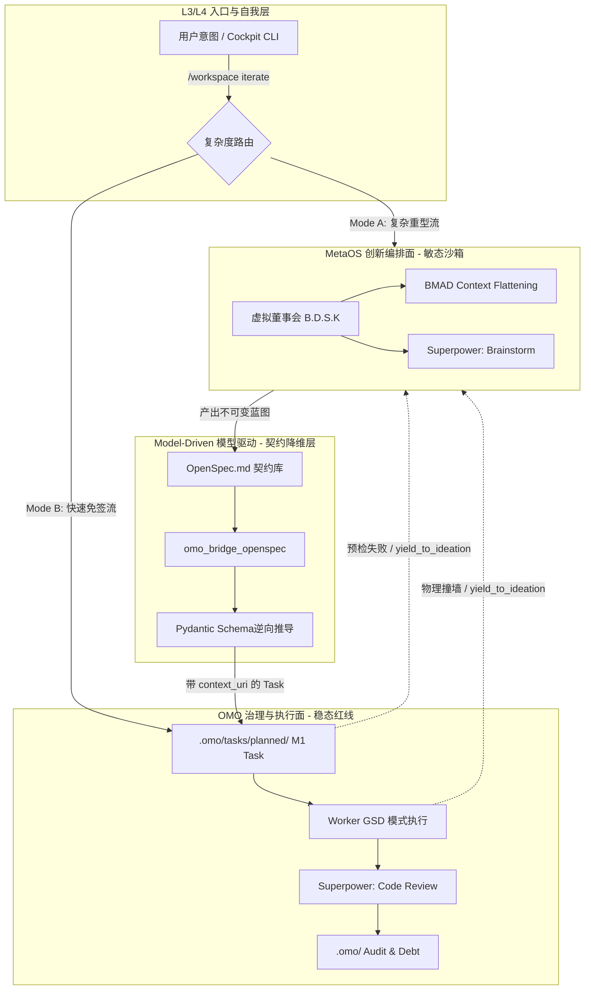

# eCOS v5 迭代编排工作流 (C2G Pipeline v2) 详细设计方案

## 1. 架构总览 (Architectural Overview)

本设计方案旨在解决 eCOS v5 系统中“敏态创造力（BMAD/Superpower）”与“稳态治理力（OMO/GSD）”的融合痛点。
在 v2 演进中，我们将 **C2G (Creative-to-Governance) Pipeline** 从“僵硬的单向瀑布流”升级为“带负反馈的控制论系统”。
确立 `MetaOS` 为上层认知大脑，`Model-Driven` 为跨界翻译官与格式卫兵，`OMO` 为下层执行面，同时引入**柔性回滚、双轨制免签快车道、BOS URI 锚点映射**以降低认知能耗。

---

## 2. 分层拓扑与边界划分 (Topology & Boundaries)

---

## 3. 四阶段全栈状态机 (The 4-Stage State Machine)

### 阶段 I: 认知发散沙箱 (Cognitive Sandbox)
- **主控模块**: `projects/metaos`
- **执行角色**: B.D.S.K 虚拟董事会 (主导: Sage, Devil)
- **行为流**: 
  1. 调用 `kairon_search` 和 `BMAD_flatten` 提取全局依赖。
  2. 接收可能的失败回传（`yield_to_ideation`）进行二次迭代脑暴。
  3. 调用超能力 `superpower(brainstorm)`。
- **存储介质**: 内存态 / `/runtime/ephemeral/` 临时草稿。
- **治理约束**: 零。完全跳过 OMO 审计，允许绝对的思维发散。

### 阶段 II: 架构契约固化 (Specification Freeze)
- **主控模块**: `projects/metaos`
- **行为流**: 将脑暴结论收敛，生成唯一事实来源 (SSOT)。
- **存储介质**: `.omo/_knowledge/design/openspecs/<issue_id>-spec.md`。

### 阶段 III: 降维打击与握手 (Contract Materialization)
- **主控模块**: `projects/model-driven`
- **行为流**: 
  1. `omo_bridge_openspec` 读取 Markdown，并基于 Schema 引擎执行强类型逆向抽取。
  2. 生成带有 `context_uri: bos://memory/openspecs/...` 的 OMO `M1 Node`。
  3. 向 OMO 发起 `omo_pre_check`。如果被红线阻挡，触发软回滚将堆栈回传给阶段 I。
- **存储介质**: `.omo/tasks/planned/<task_id>.yaml`。

### 阶段 IV: 刚性落地 (GSD Execution & Governance)
- **主控模块**: `projects/omo`
- **执行角色**: Builder, Keeper
- **行为流**: 
  1. OMO 派发工单 (`omo_worker_dispatch`)。
  2. Agent 强制进入 **GSD (Getting Shit Done)** 模式。若遇不可逾越的技术阻碍，放弃执行并调用 `omo_yield_task` 发起退回。
  3. 执行 `superpower(write-plan)` 与 `superpower(code-review)`。
  4. 一旦代码跑通且通过测试，写入 Evidence 并 Commit。
- **存储介质**: `.omo/_knowledge/governance-history.jsonl` 及 Git Commit (Mof-extract 钩子)。

---

## 4. C2G v2 核心升级特性

1. **BOS URI 双向映射**: 所有的 Task YAML 均携带指针，GSD 执行器可通过此 URI 拉取详细设计和设计意图。
2. **架构双轨制 (Fast-Track)**: `workspace iterate` 根据任务复杂度，智能分流（Mode A 重型审批流，Mode B 快速免签流）。
3. **柔性回滚机制 (Yield to Ideation)**: 任务可主动或被动退出并回传到沙箱（`yield_to_ideation` 状态），把单向瀑布流转变为螺旋上升的迭代闭环。
4. **Schema 拦截器**: 在桥接层用 `pydantic.model_validate()` 阻击大模型的幻觉输出。

---

## 5. 关键新增 MCP 工具/指令规划

1. **CLI 宏入口**: 
   - `bin/workspace iterate <topic>`：加入复杂度评估判断逻辑。
2. **MetaOS 编排工具**:
   - `metaos_ideation_session(topic, fallback_context)`：新增 fallback 入参接收失败回流。
3. **Model-Driven 降维工具**:
   - `omo_bridge_openspec(spec_path)`：引入 JSON Schema 逆向强制匹配机制。
4. **OMO 治理执行面**:
   - `omo_yield_task(task_id, reason)`：新增的软回滚降级弹射工具。
