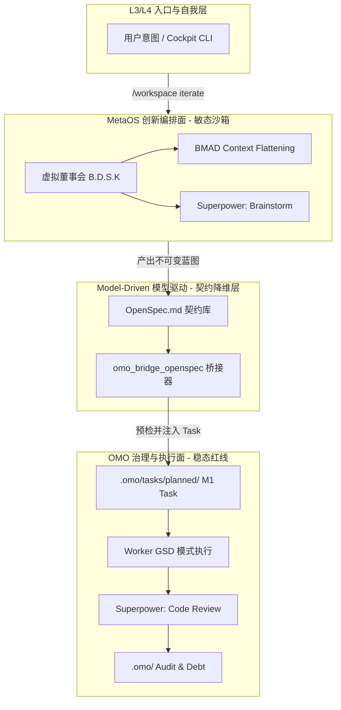

# eCOS v5 迭代编排工作流 (C2G Pipeline) 详细设计方案

## 1. 架构总览 (Architectural Overview)

本设计方案旨在解决 eCOS v5 系统中“敏态创造力（BMAD/Superpower）”与“稳态治理力（OMO/GSD）”的融合痛点。
我们引入 **C2G (Creative-to-Governance) Pipeline**，确立 `MetaOS` 为上层认知大脑的总收口，`Model-Driven` 为跨界翻译官，`OMO` 为下层执行与治理的绝对防御面。

---

## 2. 分层拓扑与边界划分 (Topology & Boundaries)

---

## 3. 四阶段全栈状态机 (The 4-Stage State Machine)

### 阶段 I: 认知发散沙箱 (Cognitive Sandbox)
- **主控模块**: `projects/metaos`
- **执行角色**: B.D.S.K 虚拟董事会 (主导: Sage, Devil)
- **行为流**: 
  1. 调用 `kairon_search` 和 `BMAD_flatten` 提取全局依赖。
  2. 调用超能力 `superpower(brainstorm)`。
- **存储介质**: 内存态 (Memory) / `/runtime/ephemeral/` 临时草稿。
- **治理约束**: 零。完全跳过 OMO 审计，允许绝对的思维发散。

### 阶段 II: 架构契约固化 (Specification Freeze)
- **主控模块**: `projects/metaos`
- **行为流**: 将脑暴结论收敛，生成唯一事实来源 (SSOT)。
- **存储介质**: `.omo/_knowledge/design/openspecs/<issue_id>-spec.md`。
- **内容要求**: 必须包含 UI/UX 设计、数据流走向、API 契约以及 X1-X4 合规声明。

### 阶段 III: 降维打击与握手 (Contract Materialization)
- **主控模块**: `projects/model-driven`
- **行为流**: 
  1. MCP 工具 `omo_bridge_openspec` 介入。
  2. 读取 Markdown，提取结构化任务，生成 OMO `M1 Node`。
  3. 向 OMO 发起 `omo_pre_check` (校验当前 Phase、目标、排期)。
- **存储介质**: `.omo/tasks/planned/<task_id>.yaml`。

### 阶段 IV: 刚性落地 (GSD Execution & Governance)
- **主控模块**: `projects/omo`
- **执行角色**: Builder, Keeper
- **行为流**: 
  1. OMO 派发工单 (`omo_worker_dispatch`)。
  2. Agent 强制进入 **GSD (Getting Shit Done)** 模式。
  3. 执行 `superpower(write-plan)` 与 `superpower(code-review)`。
  4. 一旦代码跑通且通过测试，写入 Evidence。
- **存储介质**: `.omo/_knowledge/governance-history.jsonl` 及 Git Commit (Mof-extract 钩子)。

---

## 4. 关键新增 MCP 工具/指令规划 (Implementation Plan)

为打通此链路，需要最小化补充以下组件：

1. **CLI 宏入口**: 
   - `bin/workspace iterate <topic>`：在 L3 层面封装全流程触发器。
2. **MetaOS 编排工具**:
   - `metaos_ideation_session(topic)`：初始化带有 BMAD 上下文的沙箱，阻止写入正式目录。
3. **Model-Driven 降维工具**:
   - `omo_bridge_openspec(spec_path)`：负责 Markdown -> YAML 的结构化抽取，并向 OMO 注册债务预案（如依赖未决时自动挂载 Debt）。
