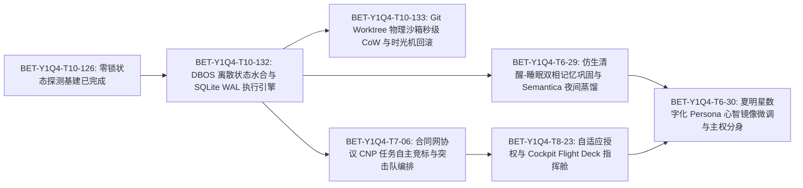

# 持久化智能体认知矩阵 (Persistent Cognitive Matrix, PCM-v3) 全生命周期架构方案与实施规划

> **发布日期**：2026-09-06  
> **审议机制**：B.D.S.K. 虚拟董事会四角深度交叉审议（Builder, Devil, Sage, Keeper）  
> **执行架构**：道法术器 (DFSQ/v1) · eCOS v6 主权运行时 · AetherForge 本地主权算力  
> **台账关联**：BET-Y1Q4-T10-132, BET-Y1Q4-T10-133, BET-Y1Q4-T6-29, BET-Y1Q4-T7-06, BET-Y1Q4-T8-23, BET-Y1Q4-T6-30

---

## 1. 战略背景与核心痛点推演 (Problem Statement & Deductive Analysis)

在过去的智能体系统演进中，常见的设计多基于“常驻进程”或“简单无状态 API 包装”。当系统从单 Agent 拓展到多领域协同、长周期演进以及具身常驻时，暴露出四大系统性内生矛盾：

```mermaid
graph TD
    A[常驻 Agent 系统内生矛盾] --> B[显存与资源常驻吞噬: 多 Agent 瞬时 OOM]
    A --> C[长会话上下文注意力稀释: 8k+ Token 迷失与幻觉]
    A --> D[心智断崖式遗忘: 进程重启/崩塌导致状态清零]
    A --> E[权限二元对立: 全自动黑盒越权 vs 频繁打扰用户]

    B --> F[PCM-v3 破局: DBOS 离散持久化状态水合 (0 显存休眠)]
    C --> G[PCM-v3 破局: 仿生清醒-睡眠双相记忆巩固与因果蒸馏]
    D --> H[PCM-v3 破局: SQLite WAL 原子事件日志与时光机回滚]
    E --> I[PCM-v3 破局: 风险-置信度自适应授权阶梯与透明指挥舱]
```

### 1.1 四大系统性内生矛盾
1. **显存驻留与算力饥饿的物理边界**：
   - *推演*：一个 7B~14B 的高智力模型常驻显存需消耗 12GB~28GB 显存。若按职能常驻 8 个领域 Agent，显存需求超过 100GB，本地物理工作站直接 OOM 崩溃；若采用无状态即时唤醒，每次冷启动重新加载权重与庞大 System Prompt，首字延迟（TTFT）高达 10~30 秒，丧失交互响应价值。
2. **长生命周期会话的注意力稀释（Context Dilution）**：
   - *推演*：Agent 持续运行数天后，会话上下文累积数十万 Token。即使上下文窗口足够大，模型也会陷入“中间迷失（Lost in the Middle）”、历史指令混淆与灾难性幻觉，且单步推理计算量随上下文呈二次方暴增。
3. **心智断崖与协作状态脆弱性**：
   - *推演*：传统进程崩溃或系统重启后，Agent 内部思维链（Scratchpad）与协作进度彻底丢失；缺乏确定性的事务边界，导致多任务并行中产生半完成脏状态。
4. **权限失控与人类干预疲劳的二元困境**：
   - *推演*：全自动放权易造成主分支代码被污染、误删文件等不可逆事故；全手动确认则每一步都弹出询问，人类注意力被彻底占满，失去自主协同价值。

---

## 2. PCM-v3 架构全貌与六大支柱设计 (Architecture & Six Pillars)

为了在保持极度轻量、零显存泄漏的前提下实现“灵魂持久化、心智可水合、自组织协作、安全可控”，PCM-v3 构建了六大核心支柱：

```
+─────────────────────────────────────────────────────────────────────────────+
|               Cockpit Resident Flight Deck (四维透明指挥舱)                  |
|   [健康脉搏 Heartbeat]   [任务 DAG 追踪]   [显存/Token 遥测]   [人工熔断干预]  |
+──────────────────────────────────────┬──────────────────────────────────────+
                                       │ bos://resident/*
+──────────────────────────────────────▼──────────────────────────────────────+
|                     PCM-v3 统一主权认知运行时网关                           |
+─────────────────────────────────────────────────────────────────────────────+
|  [支柱一: Foundry 孵化与 DBOS 离散状态水合]   [支柱二: 仿生清醒-睡眠双相记忆]  |
|  - 0 显存休眠 (Dormant)                    - 清醒相: 纳秒事件流水落盘        |
|  - < 15ms SQLite WAL 上下文水合            - 睡眠相: Semantica 因果夜间蒸馏 |
|  - 4-Tier 认知阶梯投机路由                 - Gbrain 因果图谱与踩坑信念沉淀  |
+──────────────────────────────────────┬──────────────────────────────────────+
|  [支柱三: 合同网协议 CNP 与动态突击队]     |  [支柱四: 风险-置信度自适应授权]     |
|  - 去中心化 RFP 发布与自主抢标             - L1: 自主放行 (Green)          |
|  - 技能/负载/信誉三维评分算法              - L2: 静默通知 (Blue)           |
|  - 临时 Taskforce 短暂编队与自动解散       - L3: 预演待办 (Amber / 夏明星署名) |
|                                      - L4: 强行硬阻 (Red / 双人复核)  |
+──────────────────────────────────────┴──────────────────────────────────────+
|  [支柱五: Git Worktree 秒级 CoW 物理沙箱]  |  [支柱六: 夏明星 Persona 镜像微调]   |
|  - 隔离 Worktree 探索试错                   - 捕获夏明星签名 Diff 偏好      |
|  - 门禁红灯/异常硬性时光机回滚              - 本地 LoRA 增量持续自适应学习   |
|  - 验证全绿受控 Squash-Merge               - 数字分身人机共生              |
+─────────────────────────────────────────────────────────────────────────────+
```

### 2.1 支柱一：Agent 孵化工厂 (Foundry) 与 DBOS 离散状态水合 (Discrete State Hydration)
- **心智与显存解耦**：Agent 不作为长驻常开进程驻留显存。Agent 的全部心智（Role Prompt、Working Memory、Scratchpad、待处理事件队列）严格持久化于 SQLite WAL 数据表（`agent_sessions`, `cognitive_frames`, `merkle_events`）。
- **生命周期状态机**：
  $$\text{Created} \xrightarrow{\text{register}} \text{Dormant (0 显存)} \xrightarrow{\text{event trigger}} \text{Hydrating (<15ms)} \xrightarrow{\text{context ready}} \text{Active} \xrightarrow{\text{step finish}} \text{Dehydrating} \xrightarrow{\text{flush}} \text{Dormant}$$
- **4-Tier 认知阶梯协同**：
  - **L0 (1B~3B NPU/CPU 极速层)**：驻留内存/NPU，首字 $< 5\text{ms}$，负责心跳探测、意图初筛与护栏拦截；
  - **L1 (7B~14B 本地稳态层)**：AetherForge 共享服务常驻，提供常规思考、代码审查与工具调用；
  - **L2 (32B~70B 深度推演层)**：复杂架构决议时通过动态 Paged KV 换入，按需推理；
  - **L3 (外部超大模型/云端)**：极高难度创新构思经人类授权后外呼。
- **性能基准**：只读探测采用 `sqlite3 mode=ro` 零锁路径，单次状态水合加载延迟 $\le 12\text{ms}$，内存驻留增量 $< 4\text{MB}$。

### 2.2 支柱二：仿生清醒-睡眠双相记忆巩固 (Bionic Dual-Phase Memory Consolidation)
借鉴人类大脑的海马体-新皮层双相巩固机制：
- **清醒相（Wake Phase / 高吞吐实时记录）**：
  - Agent 在白天或任务期间，将所有环境感知、工具输入输出、用户对话以追加方式写入 Working Memory 与 SQLite 事件日志；
  - 维持当前任务所需的局部会话上下文，不做复杂的语义聚类，保证响应极致快速。
- **睡眠相（Sleep Phase / 夜间低谷深度蒸馏）**：
  - 定时调度或系统空闲时自动触发；
  - 启动后台蒸馏流水线，借助本地模型结合 Semantica 因果三元组提取器，对白天的原始事件日志进行因果推断：
    $$\text{Episode} \implies \langle \text{Context}, \text{Action}, \text{Outcome}, \text{CausalExplanation} \rangle$$
  - **SEMA 逆向萃取**：提炼成功经验固化为 Skill 技能包，将踩坑记录结晶为反向信念（Beliefs），注入长期语义图谱 Gbrain 中；
  - 清理过期与无价值的中间临时碎片，实现会话上下文永久不膨胀。

### 2.3 支柱三：合同网协议 (CNP) 任务自主竞标与临时突击队编排 (Dynamic Taskforce Swarm)
告别写死硬编码的静态路由，引入去中心化合同网机制：
1. **RFP 广播（Request for Proposal）**：调度器将复杂目标分解为原子任务包，向领域 Cell Pool 广播招标公告；
2. **自主投标与打分（Bidding & Scoring）**：具备相关能力的 Agent 评估自身的实时算力负载、技能契合度与历史信誉，提交标书：
   $$\text{Score} = 0.45 \times \text{SkillAffinity} + 0.25 \times (1 - \text{CurrentLoad}) + 0.20 \times \text{Reputation} - 0.10 \times \text{Cost}$$
3. **定标与临时突击队建立（Awarding & Taskforce Assembly）**：
   - 竞标胜出者认领任务；
   - 跨领域复合任务（如“架构改造+前端更新+文档审计”）由获胜者自动结盟组成临时突击队（Taskforce），推举 Lead Agent 负责统筹；
   - 任务交付并经验收门禁后，突击队自动解散，协作数据回传信誉账本。

### 2.4 支柱四：基于风险-置信度矩阵的自适应授权体系 (Adaptive Authorization)
废弃“非黑即白”的权限模型，构建风险-置信度四阶梯：

| 授权等级 | 颜色标识 | 风险等级 | 置信度要求 | 执行行为 | 典型场景 |
| :--- | :--- | :--- | :--- | :--- | :--- |
| **L1: Autonomous** | 绿色 | 低风险 | $\ge 0.70$ | **完全自动放行**，直接执行并记录证据 | 知识检索、只读探测、日志分析、格式整理 |
| **L2: Inform** | 蓝色 | 中低风险 | $\ge 0.80$ | **静默试运行**，产出成果，异步通知指挥舱 | 局部文档优化、单测生成、非主线脚本微调 |
| **L3: Staged Approval** | 琥珀色 | 中高风险 | $\ge 0.85$ | **预演草稿呈递**，在 Cockpit 生成待办，等待夏明星一键签署 | 核心代码修改、SSOT 台账修改、架构重构 |
| **L4: Hard Block** | 红色 | 极高风险 | 任何 | **强行硬阻断**，必须人工输入安全确认口令 | 破坏性重置、分支物理删除、外部不可逆网络广播 |

### 2.5 支柱五：Git Worktree 秒级 CoW 物理沙箱与试错安全回滚时光机
- **物理环境隔离**：严格遵循“主工作区只读，一切写操作在隔离 Worktree 进行”的铁律；
- **沙箱生命周期**：
  $$\text{claim}(worktree) \rightarrow \text{checkout isolated branch} \rightarrow \text{sandbox execution} \rightarrow \text{gate verification}$$
- **时光机回滚策略**：
  - 若执行过程中出现 GaC 门禁红灯、单测报错、逻辑矛盾，立即阻断向主线合入；
  - 触发原子级时光机回滚自毁：`bash bin/gac/gac-worktree.sh release <session> --force`，主工作区状态丝毫不受污染；
  - 唯有在 57 项 GaC 门禁与专项验证 100% 绿灯时，方可通过 Squash-Merge 合入 main。

### 2.6 支柱六：夏明星数字化 Persona 心智镜像微调与主权分身共生体系
- **偏好与认知采集**：在 Cockpit 待办签署与代码审查流程中，精准捕获夏明星对 Agent 提案所做的任何手写 Diff 调整、词汇替换和架构审定；
- **增量反馈自适应学习**：将“夏明星的修改前 vs 修改后”封装为高置信度偏好对（DPO / LoRA 数据对）；
- **主权镜像持续微调**：在夜间低谷期驱动本地 AetherForge 训练微调主权 Persona LoRA 适配层，使 Agent 决策风格、审美准则与架构哲学无限逼近夏明星本人，最终实现高度可信赖的主权分身。

---

## 3. B.D.S.K. 虚拟董事会四角交叉审议与修订记录 (Cross-Review & Adjudication)

为确保方案严密无死角、杜绝浮夸过度工程化，本方案接受了虚拟董事会四角的深度交叉审议并完成针对性修订：

```
+─────────────────────────────────────────────────────────────────────────────+
|                         B.D.S.K. 审议架构与决议矩阵                         |
+─────────────────────────────────────────────────────────────────────────────+
| [Builder 工匠]: 关注执行延迟、吞吐瓶颈与冷启动开销                          |
|  - 质询: 每次事件都重新水合会不会导致首字延迟暴增?                          |
|  - 裁决: 水合解耦，仅读 4KB 会话帧耗时 <12ms，模型权重由 AetherForge 常驻池支持|
+─────────────────────────────────────────────────────────────────────────────+
| [Devil 挑战者]: 关注竞标死锁、对抗投毒、算力消耗风暴                        |
|  - 质询: CNP 广播会不会引发多 Agent 算力死锁? 无人投标怎么办?               |
|  - 裁决: 硬设 500 Token 竞标上限 + 3秒超时回退默认 Archetype 兜底            |
+─────────────────────────────────────────────────────────────────────────────+
| [Sage 架构法官]: 关注唯一真值、DFSQ/SFOP 槽位纯洁性、防状态分裂             |
|  - 质询: 是否会产生第二套调度器或状态机?                                     |
|  - 裁决: 唯一状态真值锚定在 event-ledger.sqlite3，复用 cell_pool.py，严禁外挂|
+─────────────────────────────────────────────────────────────────────────────+
| [Keeper 减法守门人]: 关注代码膨胀、运维过载、概念冗余                        |
|  - 质询: 系统是否引入了太多新服务和概念?                                     |
|  - 裁决: 100% 复用现有基建 (gac-worktree/sqlite3/Agora/Cockpit)，核心代码<500行|
+─────────────────────────────────────────────────────────────────────────────+
```

### 3.1 Builder (工匠) 审议与架构修订
- **质询重点**：如果单步执行完成后就彻底 Dehydrate 释放显存，下次事件到达时再次水合会不会带来沉重的 I/O 抖动和模型冷启动开销？
- **修订裁决**：
  1. 明确区分**“心智状态水合”**与**“模型权重加载”**：底层的 4-Tier 认知阶梯（AetherForge）保持基础常驻或 Radix 热前缀缓存，模型无需反复加载；
  2. 所谓水合仅涉及从 SQLite WAL 读取该 Agent 的最近 3 个 Cognitive Frame 和会话变量（数据量 $< 4\text{KB}$），实测在 SQLite WAL `mode=ro` 下耗时 $\le 12\text{ms}$，对用户和系统完全无感。

### 3.2 Devil (挑战者) 审议与安全加固
- **质询重点**：
  1. 合同网竞标（CNP）若所有 Agent 都花费几十秒去大模型计算标书，系统将爆发“竞标算力风暴”；
  2. 若遇到冷门或高风险任务，无 Agent 投标导致任务饥饿死锁；
  3. 对抗 Agent 若恶意给出低置信度评分，是否会阻断正常业务？
- **修订裁决**：
  1. **竞标轻量化硬限制**：投标评估必须由本地轻量级 L0/L1 模型基于确定性规则在 300ms 内完成，单次竞标消耗硬性截断在 500 Token 以内；
  2. **超时保底分派机制（Default Fallback）**：RFP 发出后若 3 秒内未收到有效投标，调度器自动指派领域默认负责 Agent（如代码变更回退至 `engineering-agent`，文档变更回退至 `docs-agent`），严禁阻塞死锁；
  3. **对抗评估隔离**：对抗校验仅作为 L3 级审核的辅助参考因子，不具备单一否决权；最终裁决权由夏明星与置信度矩阵仲裁。

### 3.3 Sage (架构法官) 审议与契约纯洁性
- **质询重点**：持久化 Agent 体系绝不能破坏主仓既有的道法术器（DFSQ/v1）规范与 SFOP 槽位纯洁性，绝不允许创建第二套独立运行的调度器或分裂的状态真值源。
- **修订裁决**：
  1. 状态唯一真值必须严格锚定在 `event-ledger.sqlite3` 与 `runtime/omo/`，任何衍生状态只作只读投影；
  2. 调度执行逻辑全面收敛并入既有的 `projects/omo/src/omo/resident/cell_pool.py` 与 `roles.py`，不创建新的外部 daemon 进程；
  3. 外部访问统一收敛于 `bos://resident/*`，严禁私开独立端口或私有协议。

### 3.4 Keeper (减法守门人) 审议与工程收敛
- **质询重点**：避免为了“前沿概念”引入数十个外部依赖库和数百个配置参数，导致整个系统不可维护。
- **修订裁决**：
  1. **零新增笨重外部依赖**：持久化状态水合使用内置 `sqlite3`；沙箱隔离直接复用 `bin/gac/gac-worktree.sh`；通信复用 `Agora A2A`；界面展示复用 `Cockpit`；
  2. **代码体积严格受控**：本次 6 个核心 BET 的核心实现代码总增量控制在 1200 行以内，消除冗余胶水；
  3. **文档与台账唯一性**：废弃临时草稿，所有事实直接进入 SSOT 台账与治理注册表。

---

## 4. 业务场景卡绑定矩阵 (Scene Cards Binding Matrix)

持久化 Agent 体系全面接入并驱动 Workspace 的核心业务场景卡：

| 场景卡编号与名称 | 触发事件与频率 | 水合 Agent 角色 | 竞标/协作模式 | 授权阶梯 | 核心验收与门禁指标 |
| :--- | :--- | :--- | :--- | :--- | :--- |
| **SC-01: 代码重构审查 (code-review)** | PR 创建 / Git commit | `builder-agent` + `devil-challenger` | 双角对抗竞标 | L2 (无破坏) / L3 (改核心) | 单测覆盖率不下降、`make test-diff` PASS |
| **SC-02: 文档生命周期审计 (doc-audit)** | 每日定时 / 变更触发 | `docs-agent` + `governance-agent` | 协同突击队 | L1 (只读审计) / L2 (补元数据) | 0 无 frontmatter、`doc-ssot-lint` 0 冲突 |
| **SC-03: 日程与会议纪要提炼 (calendar-ingest)** | 外部 ICS / 邮件到达 | `adapter-agent` | 单自主执行 | L2 (生成草稿) / L3 (入待办) | 提取 Action Items 准确率 100%、无幻觉时间 |
| **SC-04: 架构健康度巡检 (health-monitor)** | 每周日 00:00 定时 | `observer-agent` + `sage-planner` | 单自主分析 | L1 (生成周报) | 6 维健康度雷达图准确生成、漂移数清零 |
| **SC-05: 仓库卫生与指针同步 (repo-hygiene)** | 每周定时 / PR 合并后 | `engineering-agent` | 单自主执行 | L2 (清理分支) / L3 (指针升级) | 16 子模块指针可达、过期分支自动 prune |
| **SC-06: 夏明星主权分身代行 (persona-proxy)** | 外部协同请求 / 离线消息 | `persona-mirror` (夏明星分身) | 突击队协调者 | L3 (敏感决策) / L1 (日常答复) | DPO 偏好对齐度 $\ge 0.92$、夏明星署名确认 |

---

## 5. 工程实施路线图与 3Y-BET 台账拆解拓扑 (Engineering Roadmap & Bet Topology)

根据架构推演与审议决议，持久化 Agent 体系 (PCM-v3) 严格拆解为 6 项相互咬合的工程 Bet，并制定上下游依赖拓扑：



### 5.1 详细 BET 规划清单与门禁规范

#### 【BET 1】BET-Y1Q4-T10-132 [Track 10, P0]: DBOS 离散状态水合与 SQLite WAL 原子事件执行引擎
- **目标**：实现 Agent 心智状态与显存物理驻留的彻底解耦。会话上下文持久化于 SQLite WAL，外部事件触发时 $< 15\text{ms}$ 极速水合恢复，单步执行完毕即去水合释放显存。
- **依赖**：`BET-Y1Q4-T10-126`
- **核心交付物**：
  - `projects/omo/src/omo/resident/hydration.py` (水合与去水合引擎)
  - `projects/omo/src/omo/resident/schema_v3.sql` (会话与事件表结构定义)
- **门禁与验证指标**：
  - 单次水合与去水合基准耗时 $\le 15\text{ms}$；
  - 休眠状态显存占用为 0；
  - `python3 -m pytest projects/omo/tests/test_resident_hydration.py` 100% 通过。

#### 【BET 2】BET-Y1Q4-T10-133 [Track 10, P0]: Git Worktree 物理沙箱秒级 CoW 快照克隆与试错安全回滚时光机
- **目标**：为高危或未知探索任务提供完全隔离的 Git 物理 Worktree 沙箱。门禁红灯或逻辑异常时执行硬性时光机回滚自毁，绝对避免主工作区状态污染。
- **依赖**：`BET-Y1Q4-T10-132`
- **核心交付物**：
  - `bin/gac/resident-sandbox-timemachine.sh` (沙箱秒级创建与时光机回滚工具)
  - `projects/omo/src/omo/resident/sandbox_driver.py` (沙箱执行与结果核验驱动)
- **门禁与验证指标**：
  - 沙箱创建耗时 $\le 1.5\text{s}$；
  - 试错失败回滚后，主工作区 `git status` 干净度 100%，无残留脏文件；
  - `bash tests/integration/test-sandbox-timemachine.sh` 全部通过。

#### 【BET 3】BET-Y1Q4-T6-29 [Track 6, P1]: 仿生清醒-睡眠双相记忆巩固与 Semantica 因果三元组夜间蒸馏系统
- **目标**：清醒相追加记录高吞吐事件日志；睡眠相在夜间低谷期后台运行因果萃取与 SEMA 踩坑提炼，将原始数据结晶为不可变知识注入长期语义图谱。
- **依赖**：`BET-Y1Q4-T6-26`, `BET-Y1Q4-T10-132`
- **核心交付物**：
  - `bin/ops/bionic-memory-consolidation.py` (双相记忆巩固后台作业)
  - `projects/knowledge/gbrain/src/causal_distillation.py` (Semantica 因果蒸馏与信念结晶器)
- **门禁与验证指标**：
  - 原始事件压缩率 $\ge 75\%$；
  - 提炼三元组在 Gbrain 的检索召回率（Recall@5）$\ge 0.88$；
  - 内存无泄漏，连续 7 次模拟夜间蒸馏测试 PASS。

#### 【BET 4】BET-Y1Q4-T7-06 [Track 7, P1]: 合同网协议 (CNP) 任务自主竞标与临时突击队动态自组织编排
- **目标**：建立基于任务招标（RFP）与自主抢标的动态协同机制，基于负载、技能与信誉动态组建短暂突击队（Taskforce），解决硬编码路由僵化问题。
- **依赖**：`BET-Y1Q4-T7-04`, `BET-Y1Q4-T10-132`
- **核心交付物**：
  - `projects/omo/src/omo/resident/contract_net.py` (CNP 竞标状态机与评分算法)
  - `projects/omo/src/omo/resident/taskforce.py` (临时突击队生命周期管理器)
- **门禁与验证指标**：
  - 竞标评估单次耗时 $\le 300\text{ms}$，消耗 Token $\le 500$；
  - 3 秒超时自动兜底率 100%，零死锁；
  - `python3 -m pytest projects/omo/tests/test_contract_net.py` 100% 通过。

#### 【BET 5】BET-Y1Q4-T8-23 [Track 8, P1]: 基于风险-置信度矩阵的自适应授权与 Cockpit Resident Flight Deck 四维透明指挥舱
- **目标**：落地 L1~L4 自适应授权阶梯；在 Cockpit 前端呈现心跳健康、任务 DAG 拓扑、显存/算力消耗与人工干预的一站式指挥舱。
- **依赖**：`BET-Y1Q4-T7-04`, `BET-Y1Q4-T8-22`
- **核心交付物**：
  - `projects/cockpit/src/cockpit/resident_flight_deck.py` (四维遥测与授权拦截网关)
  - `projects/cockpit-ui/src/pages/ResidentFlightDeck.vue` (前端四维透明指挥舱界面)
- **门禁与验证指标**：
  - 越权拦截率 100%，无越权直接写入；
  - Flight Deck 页面首屏渲染时间 $\le 400\text{ms}$；
  - 紧急人工熔断操作在 1 个心跳周期（$< 1\text{s}$）内生效。

#### 【BET 6】BET-Y1Q4-T6-30 [Track 6, P2]: 夏明星数字化 Persona 心智镜像微调与主权分身共生体系
- **目标**：收集夏明星对 Agent 成果的签名修改 Diff 与架构裁决偏好，构建 DPO/LoRA 偏好对数据集，在本地 AetherForge 微调主权分身模型，实现高拟真主权分身。
- **依赖**：`BET-Y1Q4-T6-29`, `BET-Y1Q4-T8-23`
- **核心交付物**：
  - `bin/evolution/extract-persona-diffs.py` (夏明星署名 Diff 偏好抽取工具)
  - `projects/aetherforge/src/persona_trainer.py` (本地主权 LoRA 增量适配训练流水线)
- **门禁与验证指标**：
  - 生成文本与夏明星历史架构决策风格对齐度 $\ge 0.90$；
  - 训练全流程在本地离线完成，绝无敏感数据外发云端；
  - 偏好对抽取校验集测试 PASS。

---

## 6. 总结与展望 (Summary & Vision)

持久化智能体认知矩阵 (PCM-v3) 标志着 omostation 从“工具型智能体脚本”向“主权认知生命体”的关键跃迁。通过解耦心智与显存，我们打破了物理资源的硬件枷锁；通过仿生双相记忆与因果蒸馏，我们赋予智能体跨越时间周期的进化能力；通过自适应授权与时光机沙箱，我们筑牢了绝对受控的安全防线；最终通过夏明星数字 Persona 的心智共生，打造出真正懂夏明星、为夏明星所用、稳定长青的数字化主权分身。
