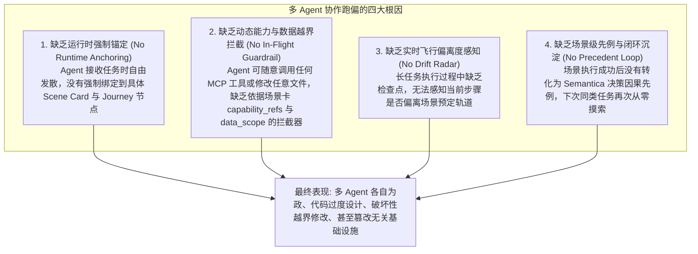
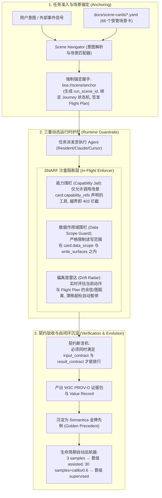

# 场景导航锚点与运行时防跑偏护栏机制（SNARF）及系统扩展方案深度调研报告

> **编制宗旨**：解决多 Agent 协同中的“执行跑偏、自发散、越界破坏与上下文漂移”痛点，将现有静态场景卡资产激活为动态运行时护栏与导航仪；同时细化系统前瞻扩展方向（TinyBOS 边缘具身与 4-Tier 认知分级），实现从战略愿景到工程落地的闭环。  
> **核心归属**：Track 7 (T7-SCENE 场景驱动) · Track 8 (T8-SURFACE 边缘具身) · Track 6 (T6-EVOLUTION 算力演进)

---

## 一、历史相关工作全面调研与盘点

我们全面核查了 OMOStation 既有工程与知识库中与“场景”、“流程”、“约束”相关的历史沉淀，发现了极其深厚但目前存在“断层”的四大既有资产基石：

### 1. 既有核心资产一：场景卡生命周期标准（Scene Card Lifecycle Standard v1/v2）
- **SSOT 位置**：[`.omo/standards/scene-card-lifecycle.yaml`](file:///Users/xiamingxing/Workspace/.omo/standards/scene-card-lifecycle.yaml) 与 `bin/ssot/scene-card-lifecycle.py`；
- **核心定义**：规定了场景卡严格的 5 档生命周期跃迁机制：
  ```
  draft (设计中, can_execute=false)
    └── shadow (Mini-shadow 模式, 需 3-sample 验证门)
          └── assisted (辅助执行, 需 30-sample + calibration≥0.6 校准门)
                └── supervised (受信任主人监督执行, 主人可观察可干预)
                      └── routine (无人值守常态化自主运行)
  ```
- **核心约束字段**：在 `docs/scene-cards/*.yaml`（现有 66 个场景卡定义，如 `document-review.yaml`、`engineering-delivery-dogfood.yaml`）中，显式声明了：
  - `trigger`: 业务触发信号；
  - `input_contract`: 必须满足的输入前置条件；
  - `result_contract`: 必须产出的交付物证据；
  - `data_scope` / `permission_scope`: 允许访问与修改的受限路径；
  - `capability_refs`: 允许调用的工具与能力引用；
  - `falsifier`: 证伪判据（若无实际价值则回退）。

### 2. 既有核心资产二：价值循环标准（Value Loop Standard v1）
- **SSOT 位置**：[`.omo/standards/value-loop-standard.yaml`](file:///Users/xiamingxing/Workspace/.omo/standards/value-loop-standard.yaml)；
- **核心定义**：严格定义了业务闭环的 5 阶段状态机：
  ```
  signal (信号感知) → perception (意图分类) → journey (旅程执行) → value (价值记录) → evolution (自进化微调)
  ```
- **Journey 旅程状态流**：`detected → preflight → executing → verified → complete`，要求每一个状态转换必须记录可验证的证据（Evidence）。

### 3. 既有核心资产三：场景卡治理工具链（Intake & Verification Tooling）
- **工具实现**：
  - `bin/ssot/scene-card-intake.py`：负责场景卡字段验证、规范化与合法性准入；
  - `bin/ssot/scene-card-review.py` / `scene-outcome-recorder.py`：负责样本记录与结果统计；
  - `bin/gac/scene-journey-connector.py` / `signal-scene-connector.py`：尝试连接信号与旅程。

### 4. 既有核心资产四：5 大业务域与 12 维度系统
- **SSOT 位置**：`.omo/standards/business-domains.yaml` 与 `.omo/standards/dimension-system.yaml`；
- **5 域划分**：`work`（工作办公）、`health`（个人健康）、`research`（科研学术）、`knowledge`（知识沉淀）、`governance`（系统治理）。

---

## 二、为什么多 Agent 协作极其容易“跑偏”？——四大根本原因深度剖析

尽管系统拥有上述高质量的标准，但在实际多 Agent 协作（如多个 Claude Code、Cursor、后台常驻 Agent 并发执行）中，跑偏现象仍然频发。经过深度溯源，其核心症结在于**“静态文件与动态执行环境的脱节”**：



1. **根因 1：缺乏任务启动时的强制场景握手（No Admission Handshake）**：
   - 现有的工作流主要检查代码层面的 git/branch 规约，但**没有在业务逻辑层强校验“当前任务属于哪一张 Scene Card”**；
   - 结果：Agent 拿到自然语言需求后，根据 LLM 内部概率随意发散，把简单的一个接口改造成跨 10 个文件的大重构。
2. **根因 2：缺乏执行态的能力与数据沙盒护栏（No In-Flight Boundary Enforcement）**：
   - Scene Card 里虽然写了 `capability_refs: [iris:apple_mail]` 和 `data_scope: [vault://redacted/]`，但这只是**静态声明**；
   - 在运行时，Agent 依然能调用全局所有工具，直接读写根目录或不相关的子模块，没有一个沙盒层在运行时拦截说：“当前处于 `document-review` 场景，严禁调用代码编译工具或修改治理脚本！”。
3. **根因 3：缺乏实时飞行计划与偏离度雷达（No Flight Plan & Drift Radar）**：
   - 复杂长流程任务缺乏“飞行检查点（Checkpoints）”；
   - 一旦第一步略微发散，后续步骤就会产生复合漂移（Compound Hallucination），最终产生面目全非的垃圾输出。
4. **根因 4：场景生命周期缺少自闭环飞轮（Static Cards, Frozen Lifecycles）**：
   - 大多数场景卡停留在 `shadow` 或 `supervised`，缺乏自动统计样本数、校准度和自动晋级的引擎，无法从历史成功经验中提取“金牌导航样例（Golden Navigation Path）”。

---

## 三、全新解决方案：场景导航锚点与运行时护栏框架（SNARF）

为了彻底解决上述问题，我们将现有的场景卡资产全面升级为**一套具备数学确定性与强制拦截能力的运行时机制——SNARF (Scene Navigation Anchor & Runtime Guardrail Framework)**。



### 核心机制详解：

#### 1. 强制锚定握手协议（`bos://scene/anchor`）
- 任何 Agent 在开始执行具体行动之前，必须先调用 `bos://scene/anchor`：
  ```json
  POST bos://scene/anchor
  {
    "objective": "处理卫健委公文拟办审查需求",
    "agent_id": "claude-code-worker",
    "requested_scene_id": "document-review" // 或自动匹配
  }
  ```
- 系统返回**《场景飞行计划》（Flight Plan）**与**会话场景令牌（Scene Token）**，锁定该 Agent 在本次任务中的唯一合法跑道。

#### 2. 三重动态运行时护栏（In-Flight Guardrails）
- **能力围栏（Capability Jail）**：Agent 调用的所有 Tool / MCP 请求在经过网关时进行动态鉴权。若调用的工具不在场景卡 `capability_refs` 中，直接返回错误并告警：`SNARF-ERR-001: Tool [xxx] out of scope for scene [document-review]`；
- **数据作用域围栏（Data Scope Jail）**：文件读写与命令执行严格限制在 `data_scope` / `write_surfaces` 之内，杜绝横向污染无关项目；
- **偏离度雷达（Drift Radar）**：常驻守护进程对执行步骤进行实时监控，一旦检测到循环无意义工具调用或脱离预定流程，触发熔断（Honest Block），唤醒主控介入。

#### 3. 结果契约断言与金牌先例飞轮（Contract Assertion & Gold Precedent Loop）
- 任务完成时，断言机严格核对 `result_contract`；
- 成功交付物自动挂接 W3C PROV-O 证据，写入 Semantica 决策因果图，成为该场景的标准先例；
- 场景卡的样本量自增，驱动其平滑向 `routine` 无人值守进化。

---

## 四、前瞻扩展方向详细方案细化（与业务场景深度呼应）

为使系统具备更广阔的物理延伸与极致的本地响应性能，将前序讨论的两个最具可行性的前瞻方向进行方案细化：

### 1. TinyBOS 极简边缘具身协议与家庭局域网算力网格（Track 8）
- **定位**：使系统突破单一开发终端，成为随时随地伴随夏明星与家庭的“具身主权智能”；
- **核心设计**：
  - **极简端点实现**：使用 Rust/C 编写极轻量 TinyBOS 守护端（内存开销 < 10MB），编译为跨平台二进制（macOS, Linux ARM, WatchOS/iOS Companion）；
  - **近场感知直通**：实时捕捉随身穿戴设备的连续心率变异率（HRV）、压力指数、加速度突变（跌倒/碰撞）、睡眠周期与空间位移，直接打包为 `signal_event`，触发 `health-visit-prep` 等健康场景卡；
  - **家庭局域网自愈漫游**：基于 P2P WireGuard，当 Mac 主工作站休眠合盖时，TinyBOS 网格将常驻任务上下文无损漂移到家庭常开的小主机（Mac mini / NAS），实现 7×24 小时真正的永续运行。

### 2. 四级认知阶梯分级投机推理与 Radix 前缀树热缓存加速（Track 6）
- **定位**：解决端侧本地硬件显存有限、大模型推理耗电过大、首字延迟高的痛点；
- **核心设计**：
  - **L0~L2 分级专家路由**：
    - **L0 边缘神经元（1B~3B Qwen2.5 / 专用 NPU）**：首字延迟 < 5ms，专职处理意图分类、JSON 校验、SNARF 护栏鉴权；
    - **L1 骨干工作专家（7B~14B DeepSeek/Qwen）**：负责 90% 的日常业务场景公文拟办、代码补丁与分析报告生成；
    - **L2 主权重型神谕（32B~70B+）**：仅在场景先例置信度不足（< 0.85）或高危治理冲突时按需唤醒；
  - **Radix KV Cache 热驻留**：
    - 将 66 张场景卡的标准规范、GaC 规约预先编译为 Radix 前缀树 Paged KV Cache，系统启动即常驻内存，彻底消除交互时的 Prompt Prefill 等待时间，使 Agent 决策达到如同本地原生应用般的瞬时响应。

---

## 五、拟定构建落盘的 4 项核心 Bet

```
【Track 7: 业务场景与防跑偏导航机制】
  ├── BET-Y1Q4-T7-04: 多 Agent 场景导航锚点与运行时防跑偏护栏机制 (SNARF) [P0, 3 days]
  └── BET-Y1Q4-T7-05: 业务场景五档生命周期自动巡航与金牌样例自学习闭环 [P1, 2 days]

【Track 8: 边缘具身与泛在表面】
  └── BET-Y1Q4-T8-22: TinyBOS 极简边缘具身协议与家庭局域网算力网格漫游 [P1, 3 days]

【Track 6: 基础设施与认知算力演进】
  └── BET-Y1Q4-T6-28: 四级认知阶梯分级投机推理与 Radix 前缀树热缓存加速引擎 [P1, 3 days]
```

### Bet 详细定义草案：

1. **`BET-Y1Q4-T7-04` (Track 7 | P0 | 3 days)**
   - **标题**：多 Agent 场景导航锚点与运行时防跑偏护栏机制 (Scene Navigation Anchor & Runtime Guardrail Framework)
   - **目标**：建立 `bos://scene/anchor` 握手网关，强制多 Agent 任务启动前必须绑定 Scene Card 与 Journey 节点；在网关拦截层实现 `CapabilityJail`（能力白名单拦截）与 `DataScopeGuard`（数据范围围栏）；建立运行时漂移雷达，彻底根绝多 Agent 协作中的越界发散与盲目自重构。
   - **产出文件**：`projects/omo/src/omo/scene/anchor.py`、`projects/omo/src/omo/guardrail/enforcer.py`、`projects/agora/src/agora/server/tools_scene.py` 等。

2. **`BET-Y1Q4-T7-05` (Track 7 | P1 | 2 days)**
   - **标题**：业务场景五档生命周期自动巡航与金牌样例自学习闭环 (Autonomous Scene Lifecycle Cruiser & Golden Sample Loop)
   - **目标**：实现场景交付成果与 Semantica 因果图的自动对齐，将成功履约的旅程沉淀为场景级金牌样例；常驻 Agent 定期根据样本量与校准度，自动推进场景卡在 `draft → shadow → assisted → supervised → routine` 五档生命周期中自动跃迁，形成自我进化的正向飞轮。
   - **产出文件**：`projects/omo/src/omo/scene/cruiser.py`、`projects/omo/src/omo/scene/golden_samples.py` 等。

3. **`BET-Y1Q4-T8-22` (Track 8 | P1 | 3 days)**
   - **标题**：TinyBOS 极简边缘具身协议与家庭局域网算力网格漫游 (TinyBOS Embodied Protocol & Home LAN Roaming Mesh)
   - **目标**：开发超轻量 TinyBOS 边缘守护端（C/Rust），接入穿戴设备与家庭边缘终端；实现基于 P2P WireGuard 的局域网自组织与任务状态自适应漫游，当主开发机休眠时无缝漂移至低功耗家庭主机，实现全天候物理世界态势感知。
   - **产出文件**：`projects/surface/tinybos/`、`projects/agora/src/agora/transport/p2p_mesh.py` 等。

4. **`BET-Y1Q4-T6-28` (Track 6 | P1 | 3 days)**
   - **标题**：四级认知阶梯分级投机推理与 Radix 前缀树热缓存加速引擎 (4-Tier Cognitive Hierarchy & Radix KV Cache Engine)
   - **目标**：在 AetherForge 中落地 L0（1B~3B 意图与护栏拦截）→ L1（7B~14B 骨干任务处理）→ L2（32B~70B+ 重型仲裁）的分级调度器；将 66 个场景卡与核心 GaC 规约编译为持久化 Radix 前缀树 KV 缓存，实现首字延迟 < 5ms，大幅降低端侧硬件开销。
   - **产出文件**：`projects/aetherforge/src/aetherforge/scheduler/hierarchy.py`、`projects/aetherforge/src/aetherforge/cache/radix_paged.py` 等。
