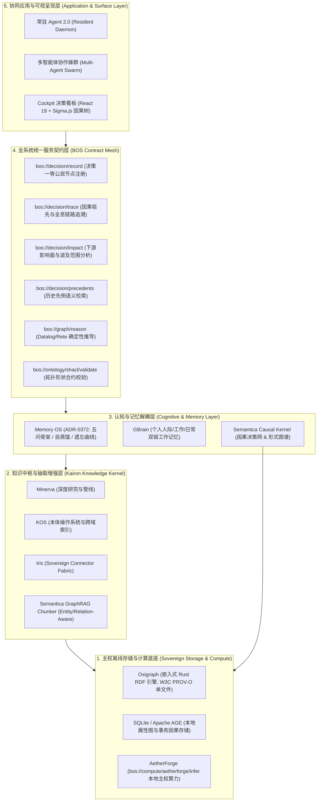
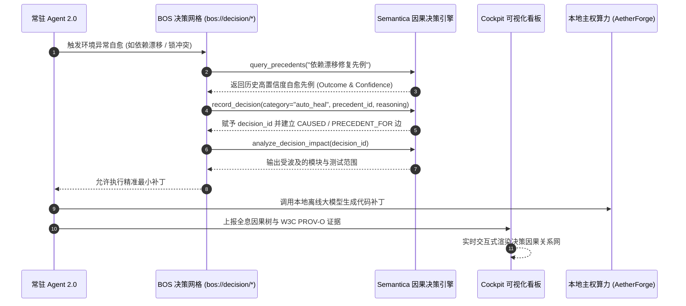
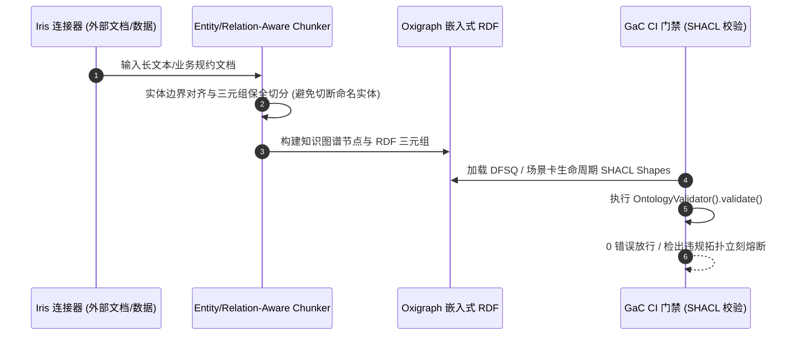

# Semantica 与 OMOStation/eCOS 深度融合长远架构设计方案

> **设计宗旨**：立足 3~5 年主权操作系统演进，构建以“确定性因果图谱”与“可问责决策智能”为基石的认知底座。  
> **核心原则**：分层下沉、内核融合、外延隔离、主权自持、永续可解释。

---

## 一、为什么融合？长远演进中的认知范式跃迁

当前行业 AI Agent 架构正普遍遭遇两大瓶颈：
1. **纯向量检索（Vector RAG）的“语义失明”**：平铺的 Embedding 仅能计算余弦相似度，缺乏图拓扑、因果路径与时态感知，无法解决多跳推理与新旧事实冲突；
2. **黑盒大模型决策的“不可审计性”**：将推理完全托付给概率采样，导致决策不可重现、幻觉不可控，无法满足个人主权系统与受监管场景（金融、健康、法律、系统治理）的可问责要求。

`Semantica` 提供了解决这两个瓶颈的核心基础设施：**图原生上下文（Context Graph）+ 决策一等公民化（Decision Intelligence）+ 完全确定性逻辑推理（Deterministic Reasoning）**。

将 Semantica 深度融合至 OMOStation / eCOS 体系，将使我们的系统实现**三大长远跃迁**：
* **从“文本记录”跃迁为“因果图谱”**：Agent 的每一次巡检、治愈、派工、仲裁不再是散落的日志，而是相互交织、可全息回溯因果的知识节点；
* **从“概率模糊”跃迁为“形式化确定”**：核心依赖与规约校验交由 Datalog 递归逻辑与 Rete 规则网，大模型仅用于非结构化表达，根绝系统级多跳幻觉；
* **从“单时序覆盖”跃迁为“双时序时间旅行”**：通过 Bi-Temporal 双时间轴建模，Agent 随时能够无损重现过去任意时间点的系统认知切片。

---

## 二、五层融合总体架构设计

我们将融合体系明确划分为 5 个层次，确保职责边界绝对清晰，杜绝模块耦合与职能重叠：



---

## 三、四大清晰边界与系统定位

为保持系统长远演进的代码纯洁性与工程确定性，确立以下边界：

| 模块组件 | 在融合架构中的核心定位 | 严令禁止跨越的边界（Non-Goals） |
| :--- | :--- | :--- |
| **Semantica** | **因果图谱、形式化推理与决策归因算子** | ❌ **不作为通用长对话记忆库**；<br>❌ **不直接管理个人双链笔记与日程**；<br>❌ **不引入昂贵的云端独立图数据库**。 |
| **GBrain** | **个人维度的长期工作记忆（Working & Episodic Memory）** | ❌ **不承载企业级 W3C PROV-O 法律审计**；<br>❌ **不参与跨 Agent 治理规约的符号求解**。 |
| **Memory OS (MOS)** | **认知记忆顶层路由、五问骨架、记忆排泄与自蒸馏** | ❌ **不实现底层的图遍历与 Datalog 递归算法**（下沉委托给 Semantica）。 |
| **Kairon (Minerva / KOS / Iris)** | **主权知识摄取、数据加工、跨域检索与深度研究平台** | ❌ **不重复自研简单的规则匹配与散落的图结构**，全面接入 Semantica 内核。 |

---

## 四、核心业务流与长远交互拓扑

### 1. 常驻 Agent 治理自愈与先例仲裁流


### 2. GraphRAG 实体感知摄取与 SHACL 拓扑门禁流


---

## 五、拟定落盘的三大 Bet 规划

结合系统三年规划台账（3Y Bet Ledger）现有进展，将上述长远架构设计分解为三个精细化的交付单元：

```
BET-Y1Q4-T6-26: Semantica 嵌入式图引擎内核集成与 BOS 决策网格 (T6 基础设施与运行时)
  └── BET-Y1Q4-T5-05: 常驻 Agent 2.0 决策因果图化与多 Agent 先例仲裁引擎 (T5 编排与治理)
  └── BET-Y1Q4-T6-27: GraphRAG 实体感知切片与 SHACL 架构形状验证引擎 (T6 演进与增强)
```

### Bet 1: BET-Y1Q4-T6-26
* **轨道**: Track 6 (T6-EVOLUTION)
* **周期**: 2 days | 优先级: P0
* **核心目标**: 在 `projects/knowledge/kairon` 中引入轻量级 Semantica 内核（严格绑定嵌入式 Oxigraph 与本地 SQLite），打通 `bos://decision/*` 与 `bos://graph/*` 契约，完成与 AetherForge 本地算力的对接测试。

### Bet 2: BET-Y1Q4-T5-05
* **轨道**: Track 5 (T5-ORCH)
* **周期**: 2 days | 优先级: P0
* **核心目标**: 常驻 Agent 2.0 巡检、修复与协同仲裁全面接入 `record_decision` 因果图；实现先例检索与下游影响面分析；在 Cockpit 中接入 Sigma.js 交互式决策因果树。

### Bet 3: BET-Y1Q4-T6-27
* **轨道**: Track 6 (T6-EVOLUTION)
* **周期**: 2 days | 优先级: P1
* **核心目标**: 升级 Iris 连接器切分器为实体感知切片（Entity/Relation-Aware Chunking）；将 DFSQ、场景卡生命周期等复杂架构拓扑转译为标准 SHACL Shapes，接入 `make gac-local-gate` 门禁。
