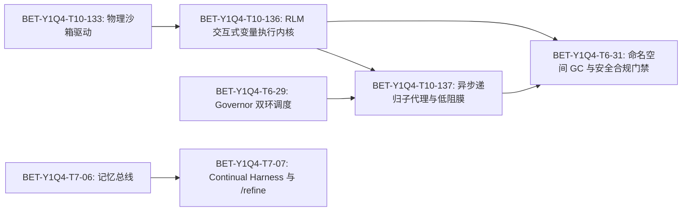

# PCM-RLM: 持久化智能体认知矩阵与递归语言模型自演化机架深度融合架构方案 (Persistent Cognitive Matrix with Recursive Self-Improving Harness)

> **发布日期**：2026-09-07  
> **审议机制**：B.D.S.K. 虚拟董事会深度交叉审议（Builder, Devil, Sage, Keeper）  
> **执行架构**：道法术器 (DFSQ/v1) · eCOS v6 主权运行时 · AetherForge 本地主权算力 · Agora A2A 协议  
> **台账关联**：BET-Y1Q4-T10-136, BET-Y1Q4-T10-137, BET-Y1Q4-T7-07, BET-Y1Q4-T6-31

---

## 1. 架构演进背景与融合动因 (Evolutionary Context & Rationale)

在前序架构迭代中，系统成功落地了 **持久化智能体认知矩阵 (PCM-v3)**，通过 DBOS 离散状态水合、仿生清醒-睡眠双相记忆、Git Worktree 物理沙箱以及风险自适应阶梯，彻底解决了显存常驻 OOM 和进程重启丢失心智的困境。

然而，在面对**极长地平线（Long-horizon）复杂工程任务**（如超大代码库全局重构、跨项目接口契约联调、深度因果推理）时，传统 Agent Harness 暴露出新的结构性瓶颈：
1. **上下文腐化与膨胀 (Context Rot & Bloat)**：工具输出（文件内容、编译日志、搜索结果）被无脑堆积入对话 Transcript，导致 Token 消耗激增、注意力分散与模型性能断崖式下降；
2. **任务隔离与经验失忆 (Stateless Amnesia)**：每次任务完成后，Agent 积累的代码操作技巧和环境踩坑经验无法转化为可直接执行的代码资产；
3. **基础设施脆弱性传导 (Brittle Infrastructure Leakage)**：底层网络微抖动、依赖临时缺失或轻微环境异常直接导致 Agent 认知中断与任务抛错。

**Prime Agent**（Prime Intellect 联合 Princeton/MIT 于 2026 年 8 月开源，arXiv:2608.23552）在 **ARC-AGI-3** 基准中取得 **95.5%**（超越人类专家基线 95.4%）的根本原因，正是提出了 **Recursive Language Model (RLM)** 与 **Continual Harness**：
- **Context as Variables**：持久化 REPL 内存变量替代全量文本拼入 Prompt；
- **Continual Self-Refinement**：证据驱动的 `/refine` 机制，将 Trajectory 经验结晶为 Python Skills as Code；
- **Low-Friction Membrane**：低阻力保护膜，隔离机架基础设施异常与模型认知失败。

本方案旨在将 Prime Agent 的核心优势与 omostation 现有的 **道法术器 (DFSQ/v1)**、**PCM-v3** 以及 **GaC 治理门禁** 深度融合，实现能力收敛与安全闭环。

---

## 2. 深度融合全景拓扑与收敛架构 (Converged Architecture & Topology)

本架构严格遵循 **道法术器 (DFSQ/v1)** 单 S 槽位约束（Mesh 为唯一活动 S 槽位，不引入第二调度器，不增加额外本体）：

```
┌─────────────────────────────────────────────────────────────────────────────────────────────────┐
│                                 PCM-RLM 统一主权认知运行时全景                                 │
└─────────────────────────────────────────────────────────────────────────────────────────────────┘
                                                 │
                   ┌─────────────────────────────┴─────────────────────────────┐
                   ▼                                                           ▼
┌─────────────────────────────────────────┐                 ┌─────────────────────────────────────────┐
│   【道 / 治理与合规】GaC 门禁与安全护栏  │                 │    【法 / 协议总线】BOS URI 与 A2A 网格  │
├─────────────────────────────────────────┤                 ├─────────────────────────────────────────┤
│ • AST 静态代码安全扫描 (防高危 OS 越权) │                 │ • bos://resident/* 认知状态路由         │
│ • Token 预算 / 步数硬限 / 内存熔断      │                 │ • bos://compute/aetherforge/infer 算力  │
│ • 命名空间周期性 GC 与脏状态重置        │                 │ • Agora A2A 异步消息总线                │
└─────────────────────────────────────────┘                 └─────────────────────────────────────────┘
                   │                                                           │
                   └─────────────────────────────┬─────────────────────────────┘
                                                 ▼
┌─────────────────────────────────────────────────────────────────────────────────────────────────┐
│                           【术 / 演化与机架】Continual Harness & /refine                        │
├─────────────────────────────────────────────────────────────────────────────────────────────────┤
│ • Reset-Free 耐久状态层: 跨会话沉淀 Memories / Skills as Code / Supplemental Prompts             │
│ • 证据驱动自演化回路: Trajectory 因果审阅 ──▶ 提炼可执行 Python 技能包 ──▶ 赋予 refinement_id    │
│ • 安全沙箱与无损回滚: 出现负向演化或门禁红灯时，一键原子化 Rollback                               │
└─────────────────────────────────────────────────────────────────────────────────────────────────┘
                                                 │
                                                 ▼
┌─────────────────────────────────────────────────────────────────────────────────────────────────┐
│                 【器 / 执行引擎】RLM 交互式变量执行空间 & Low-Friction 保护膜                   │
├─────────────────────────────────────────────────────────────────────────────────────────────────┤
│ • Context-as-Variables: 沙箱持久化 Python 变量空间，原地切片/统计/过滤，返回紧凑观测            │
│ • 异步递归子代理派生: await rlm(...) / await bos.spawn_subagent(...)，强类型对象返回            │
│ • 低阻力保护膜: 标准化微重试、语法自愈、断点续传，物理隔离环境抖动与模型认知失败                │
│ • Git Worktree 秒级 CoW 物理沙箱隔离，保障主工作区绝对只读                                      │
└─────────────────────────────────────────────────────────────────────────────────────────────────┘
```

---

## 3. 四大融合支柱与工程设计 (Four Fusion Pillars)

### 支柱一：RLM 交互式变量执行空间 (Context-as-Variables Execution Space)
- **消除 Context Rot**：
  在 PCM-v3 的 `Cognitive Sandbox` 中嵌入基于持久化 Python 命名空间（`sandbox_locals`）的执行内核。
  当 Agent 执行大规模文件分析、多仓依赖检索或性能 Trace 诊断时：
  ```python
  # 数据作为 Python 变量留存在沙箱内存中，不直接吐入 Prompt
  repo_ast = parse_ast_from_path("projects/omo/src")
  summary_stats = {
      "total_classes": len(repo_ast.classes),
      "violation_nodes": [n.name for n in repo_ast.check_governance()]
  }
  # 仅将高度浓缩的 summary_stats 返回至 LLM 上下文
  ```
- **内存状态水合联动**：与 DBOS 离散水合引擎对接，休眠时持久化关键变量元数据，清醒时毫秒级水合。

### 支柱二：异步递归子代理派生与低阻力保护膜 (Recursive Subagents & Low-Friction Membrane)
- **代码级原生编排**：
  在 Python 运行时中提供原生异步派生契约：
  ```python
  sub_result = await rlm(
      prompt="审计该模块的 GaC 合规性与依赖完整性",
      context_variables={"target_module": target_module},
      role="qa-agent"
  )
  ```
  子代理在完全独立的 Worktree 沙箱和独立上下文运行，返回强类型 Python 字典，主代理上下文零试错污染。
- **低阻力保护膜 (Low-Friction Membrane)**：
  在 Governor-Scheduler 底层封装异常拦截层：
  - 对网络瞬时抖动、BOS 超时自动执行指数退避重试（Backoff Retry）；
  - 对可推断的 Python 语法小错误自动执行本地 AST 修复尝试；
  - 严禁将底层偶发性基础设施故障暴露为模型任务失败，保障长程长驻任务持久自愈。

### 支柱三：Continual Harness 与证据驱动 `/refine` 管道 (Evidence-Backed /refine Pipeline)
- **打通 SEMA 与 Skills 体系**：
  在任务结案（Closeout）或突破复杂故障后，自动触发 `/refine`：
  1. **轨迹审阅 (Trajectory Audit)**：读取执行历史事件流，提炼成功路径与失败教训；
  2. **代码化技能结晶 (Skills as Code)**：生成符合规范的 Python 模块化函数包，存入 `.agents/skills/`；
  3. **环境提示词补丁 (Supplemental Prompts)**：生成针对当前项目特性的提示词微调补丁；
  4. **版本化与原子回滚**：每一批变更分配唯一 `refinement_id`，经 GaC 门禁验证后入库；一旦后续发现漂移或冲突，可执行原子化 Rollback。

### 支柱四：主权治理守门：变量空间 GC、资源核算与安全门禁 (Namespace GC, Accounting & Safety Gate)
- **弥补 Prime Agent 的原生安全短板**：
  Prime Agent 原生运行于宿主当前用户权限，缺乏沙箱和治理约束。PCM-RLM 引入三重硬核防线：
  1. **AST 静态安全沙箱**：阻断任意未授权的 `os.system`、`shutil.rmtree` 等破坏性调用，所有系统写操作必须经由标准 Worktree 沙箱与受控 Broker；
  2. **命名空间生命周期 GC**：防止长周期长驻任务导致的 Python 变量内存泄漏与脏状态污染，按任务阶段执行引用回收与显存重置；
  3. **资源核算与死循环熔断**：单次 RLM 递归深度硬限 $\le 3$，单任务步数硬限 $\le 100$，Token 预算与执行耗时超时自动熔断。

---

## 4. BET 拆解与台账规划 (BET Breakdown & Ledger Alignment)

本架构收敛拆解为 4 个紧密咬合的核心 BET，全面覆盖执行、协同、记忆与治理四个维度：



| BET 编号 | 归属 Track | 优先级 | 周期 | 核心目标 | 验收标准 (Done When) |
| :--- | :--- | :--- | :--- | :--- | :--- |
| **BET-Y1Q4-T10-136** | Track 10: 智能体成熟度 | P0 | 3-4 天 | RLM 持久化交互执行内核与 Context-as-Variables 空间 | 交付 `projects/omo/src/omo/resident/rlm_kernel.py`，支持沙箱内存变量读写与脚本分析，上下文 Token 压缩比 $\ge 70\%$，单元测试 100% 通过 |
| **BET-Y1Q4-T10-137** | Track 10: 智能体成熟度 | P0 | 3 天 | 异步递归子代理编排与 Low-Friction 保护膜机制 | 交付 `projects/omo/src/omo/resident/rlm_subagent.py` 与低阻异常拦截器，递归派生延迟 $\le 500\text{ms}$，基础设施偶发抖动自愈率 $100\%$ |
| **BET-Y1Q4-T7-07** | Track 7: 记忆与认知系统 | P1 | 3 天 | Continual Harness: 轨迹审阅自演化与 `/refine` 沙箱回滚管道 | 交付 `bin/ops/continual-harness-refine.py`，打通 SEMA 技能萃取与 `refinement_id` 回滚，支持自动生成 Python Skills as Code |
| **BET-Y1Q4-T6-31** | Track 6: 治理与协议架构 | P1 | 2-3 天 | RLM 变量命名空间生命周期 GC、资源核算与 GaC 门禁 | 交付 `projects/omo/src/omo/resident/rlm_governance.py`，支持 AST 高危调用静态拦截率 100%，内存泄漏检测为 0，递归深度熔断生效 |

---

## 5. 验收门禁与风险控制 (Verification & Circuit Breakers)

1. **台账契约门禁**：
   - 必须通过 `python3 bin/plan/bet-ledger.py lint`，无任何格式、依赖环与字段缺失错误；
2. **架构合规性验证**：
   - 严格遵循 DFSQ/v1，不修改 DFSQ 槽位定义，通过 `make architecture-check`；
3. **熔断器机制 (Circuit Breaker)**：
   - 若 RLM 脚本执行超时（超过 60s）或内存占用激增超过 2GB，沙箱驱动强行终止子进程并重置命名空间，防止拖垮宿主主机。
