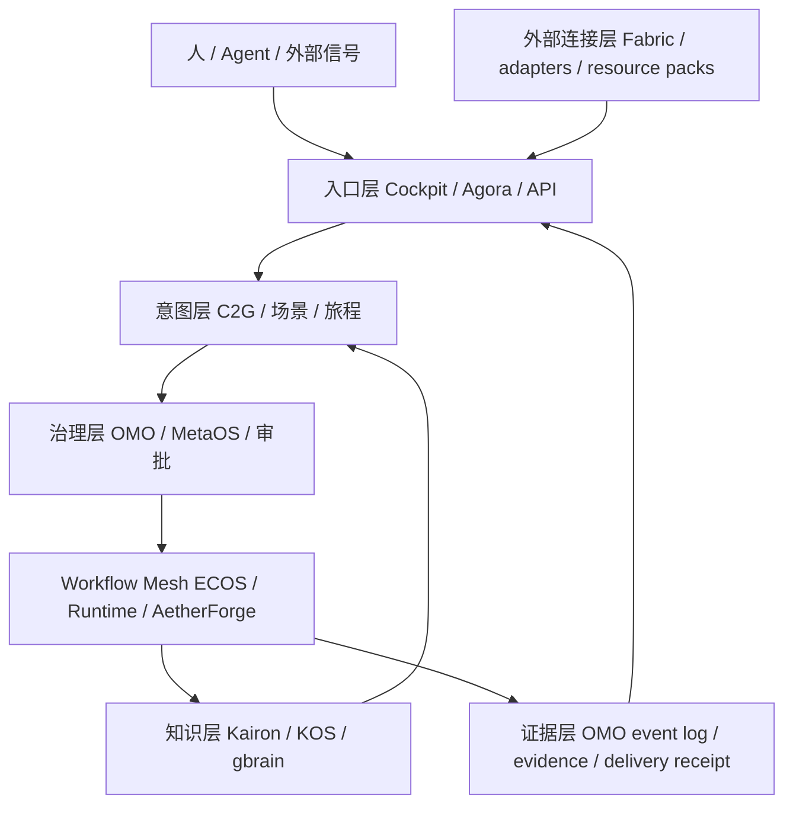
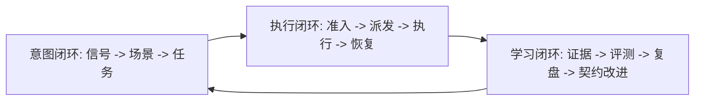

# 织星项目架构战略基线与长周期落地规划

## 1. 结论先行

织星当前处于 **平台工程化完成、产品场景化验证前** 的阶段。核心运行链已经具备：入口收敛、能力发现、任务治理、Workflow Mesh 事件链、执行租约与恢复、知识持久化、真实样本评测、外部资源目录和模型晋级门禁均已有工程契约或实现。

但这不等于业务产品已经成熟。当前仍缺少三个决定性事实：

1. 一个持续发生、低风险、可重复的真实业务消费场景。
2. 一份来自真实业务过程的稳定标注评测集。
3. 一次由人或 OMO 明确批准的生产启用决策。

因此，系统的正确定位不是“自动替用户做所有事情”，而是：

> 把外部信号、个人知识、业务意图和可执行能力连接成可追踪的工作旅程，在关键节点保留人的判断，在每次执行后沉淀证据和可复用经验。

工程上应继续推进基础设施收敛；产品上应优先寻找一个真实、低风险、每周重复发生的闭环；治理上必须维持 proposal、sandbox、shadow、human-approved、production 五个状态的严格边界。

## 2. 愿景与产品定义

### 2.1 愿景

织星的长期愿景是成为个人与小型组织的 **可进化认知与行动操作系统**：

```text
信号进入
  -> 理解与结构化
  -> 形成知识和上下文
  -> 识别意图与场景
  -> 规划工作旅程
  -> 受治理地执行
  -> 人审与交付
  -> 结果、证据、经验回流
```

核心价值不是聊天、搜索或单次自动化，而是减少“从看到信息到完成有价值结果”之间的认知距离、协调成本和遗忘损耗。

### 2.2 面向你的产品假设

结合已有资料、项目结构和实际工作方式，系统最适合服务以下用户形态：

| 用户特征 | 产品含义 |
| --- | --- |
| 同时处理项目、知识、创作、家庭和外部信息 | 必须有统一入口和跨域上下文，而不是按工具分裂 |
| 习惯深度思考、长期规划和复盘 | 必须保存决策依据、假设、结果和反思，不只保存最终答案 |
| 依赖多个 Agent 并行推进 | 必须有任务分派、租约、证据和接管机制 |
| 重视私有资料和本地能力 | 默认最小权限、可撤销、来源可追溯、敏感内容不进入日志 |
| 现实场景不是每天都稳定发生 | 先做低频也有价值的 proposal 和 review，再逐步进入自动执行 |

### 2.3 北极星指标

北极星指标定义为 **有效工作旅程完成率**：一个有明确结果指标的场景，从输入信号开始，最终形成可验证交付、被人接受，并将证据回流为可复用知识的比例。

辅助指标：

- 从输入到首次可用结论的时间。
- 从意图到可执行任务的转化率。
- WorkflowRun 的证据完整率、恢复成功率和重复执行率。
- 知识检索命中后被实际复用的比例。
- 外部资源连接的可用率、过期率和撤销时延。
- 人工确认负担：每个完成旅程需要的确认次数与分钟数。

治理健康分、代码行数、能力数量和 Agent 数量不是产品价值指标，只能作为工程健康的辅助观察量。

## 3. 当前阶段判定

### 3.1 已具备的工程能力

| 能力层 | 当前状态 | 主要落点 |
| --- | --- | --- |
| 入口与路由 | 已收敛 | Cockpit、Agora、BOS URI、统一服务目录 |
| 治理与任务 | 已成型 | C2G、OMO、任务/债务/审批/证据链 |
| Workflow Mesh | 核心链已落地 | ECOS、OMO、Runtime、AetherForge、Cockpit |
| 知识记忆 | 可持久化运行 | KOS、gbrain、事件索引、知识图谱基础 |
| OCR 与表单 | 已有治理基础 | 质量指标、结构化抽取、人工纠偏边界 |
| OMO 派发 | 已有闭环骨架 | dispatch、lease、reclaim、HITL |
| 评测与模型 | 已进入 shadow 门禁 | 真实样本队列、验收报告、重复 shadow、人工晋级 |
| 外部连接 | 目录、计划、扩展契约已具备 | External Connection Fabric |
| 正式产品界面 | 交付视图已可用，仍需场景化打磨 | Cockpit 与 cockpit-ui |

### 3.2 尚未证明的能力

- 真实业务用户是否愿意持续使用同一场景。
- 自动抽取、预测和知识推荐是否在真实数据上产生净收益。
- 外部连接是否能在权限、费用、健康和隐私约束下稳定运行。
- 多 Agent 并行是否真的降低了交付时间，而不是增加协调成本。
- 个人知识图谱是否能支持跨项目决策，而不是形成不可检索的资料堆。

### 3.3 阶段名称

当前应标记为 **M4 平台就绪 / P0 场景待验证**。下一阶段不是继续无边界扩展能力，而是用一个真实场景完成“输入、判断、执行、交付、复用”五段闭环。

## 4. 功能版图与子项目边界

系统采用“一个事实，一个职责，一个入口”的收敛原则。子项目不得互相持有对方的生命周期真相。

| 子项目 | 用户可感知功能 | 事实所有权 | 明确不负责 |
| --- | --- | --- | --- |
| Cockpit / cockpit-ui | 总览、收件箱、旅程、任务、审批、知识、外部资源管理 | 人机操作视图和操作入口 | 不凭文件存在推断执行完成 |
| Agora | 能力发现、BOS 路由、资源选择、健康结果 | 能力与路由结果 | 不持有任务状态和知识真相 |
| OMO | 任务生命周期、审批、事件原文、运行投影、证据和恢复 | 治理与运行状态 | 不实现业务步骤 |
| C2G | 愿景、策略、提案转任务和优先级 | 战略输入和任务物化 | 不直接执行 Agent |
| ECOS | 工作流定义、契约校验、admission、执行编排 | 协议和工作流契约 | 不持有跨模块业务事实 |
| Runtime | 单步执行、心跳、检查点、重试、恢复 | 执行器运行证据 | 不修改工作流定义 |
| AetherForge | Agent、模型、算力、并行资源调度 | 计算和模型资源 | 不成为业务状态 SSOT |
| Kairon / KOS | 摄取、解析、知识卡、知识图谱、检索、评测 | 规范化知识和评测数据 | 不承载一次 WorkflowRun 生命周期 |
| gbrain | 关联检索、推理上下文、记忆派生 | 派生检索视图 | 不成为原始来源真相 |
| MetaOS | 策略、预算、权限、风险和准入规则 | 约束与策略 | 不绕过证据宣布成功 |
| External Connection Fabric | 外部知识、数据、方法、工具、渠道、模型的描述和生命周期 | 连接描述与健康/来源 | 不拥有凭据、任务或知识真相 |

### 4.1 架构层次



边界规则：入口不保存事实，治理不实现业务，执行不改变契约，知识不伪造运行状态，外部连接不绕过准入，模型不自动晋级。

## 5. 最高价值业务场景

### 5.1 场景选择原则

优先级由以下公式决定：

```text
场景价值 = 发生频率 × 单次节省时间 × 可复用性 × 可验证性 × 风险可控度
```

同时满足以下条件才进入真实试点：输入边界清楚、输出可验收、错误可人工拦截、来源可追溯、撤销成本可接受。

### 5.2 场景组合

| 优先级 | 场景 | 入口 | 输出 | 第一阶段自动化边界 |
| --- | --- | --- | --- | --- |
| P0 | 资料/邮件/待办到决策收件箱 | 邮件、OA、SMS、文件 | 结构化事项、优先级、待确认问题 | 只抽取和建议，不自动发送或承诺 |
| P0 | 长文研究到决策简报 | 外部资料、私有知识、方法包 | 来源绑定的结论、反证、下一步 | 生成草案，人工确认后发布 |
| P1 | OCR/表单到结构化记录 | 图片、扫描件、表单 | 字段、置信度、异常队列 | 低置信字段进入双人或单人复核 |
| P1 | 项目意图到多 Agent 交付 | C2G、Cockpit | 任务拆解、PR、测试、证据 | Agent 可执行代码，合并必须人审 |
| P1 | 知识到创作和行动 | KOS/gbrain | 文章、课程、脚本、行动清单 | 只产出候选稿和引用链 |
| P2 | 外部方法、工具和渠道接入 | External Fabric | 可比较的资源卡和连接计划 | 目录、健康探测和 proposal only |
| P2 | 预测与主动提醒 | KEMS | 风险、机会、下一步建议 | shadow 观察，禁止自动改变业务状态 |

### 5.3 首个真实试点建议

首个试点应选择 **“资料/邮件/待办到决策收件箱”**。原因是输入已有、输出可人工复核、风险低、能够自然连接 OCR、KOS、OMO、Workflow Mesh 和 Cockpit，而且不要求短期内拥有成熟预测模型。

试点完成标准：连续四周有真实输入；每周形成可审计的事项清单；用户确认其中一部分建议；每条建议都能回链来源、判断依据和处理结果；系统能够统计节省时间和误报率。

## 6. Workflow Mesh 深度规划

### 6.1 Mesh 的本质

Workflow Mesh 不是另一个工作流引擎，也不是 Agent 编排 UI。它是连接“意图、治理、执行、证据、交付和学习”的公共运行协议。

它必须让以下链路可追踪：

```text
scene_id
 -> journey_id
 -> intent_id
 -> task_id
 -> workflow_run_id
 -> step_run_id
 -> admission_id
 -> evidence_id
 -> delivery_id / pr_id
 -> outcome_metric
```

任何没有场景绑定、结果指标或证据出口的自动化，只能处于 proposal、sandbox 或 shadow，不能被展示为业务完成。

### 6.2 三条闭环



1. 意图闭环：识别为什么做、为谁做、成功是什么。
2. 执行闭环：在权限、预算、能力健康和人工审批后执行，并能重试、接管、补偿和关闭。
3. 学习闭环：将结果、误差、人工修正、资源健康和成本回流为评测数据、知识和下一版契约。

### 6.3 标准状态机

```text
proposed
  -> sandboxed
  -> admitted
  -> dispatched
  -> running
  -> waiting_approval
  -> succeeded / failed / unavailable
  -> verified
  -> delivered
  -> closed
```

要求：

- `succeeded` 只表示执行器返回成功。
- `verified` 必须有 Evidence。
- `delivered` 必须有交付回执或 PR 合并事实。
- `closed` 是不可再推进终态。
- `failed` 和 `unavailable` 必须显式恢复、补偿或关闭。
- 任何重试必须复用可关联的 `workflow_run_id`，用幂等键避免重复副作用。

### 6.4 Mesh 的关键产品功能

| 功能 | 用户体验 | 工程要求 |
| --- | --- | --- |
| 场景卡 | 看见目标、对象、结果和风险 | 固定 scene binding 契约 |
| 旅程时间线 | 看见任务从意图到交付的全过程 | OMO append-only event + projection |
| 任务分派 | 选择 Agent、能力、预算和截止时间 | admission、lease、dispatch envelope |
| 人工闸门 | 在高风险动作前确认 | HITL approval、过期和撤回 |
| 失败接管 | 看到失败原因并接手 | unavailable、reclaim、checkpoint |
| 证据面板 | 看见来源、测试、评测和回执 | evidence_id、provenance、policy_digest |
| 结果复盘 | 标记正确、错误、遗漏和新规则 | adjudication、eval set、ADR/contract 更新 |

### 6.5 运行可靠性边界

Workflow Mesh 的可靠性优先级是：可解释、可恢复、可撤销，然后才是自动化率。必须禁止：无场景执行、无证据成功、静默 fallback、模型自动晋级、外部资源无权限调用、把 Git 文件存在当作运行事实。

## 7. 外部知识、数据、方法、工具与渠道的动态扩展

### 7.1 统一对象模型

所有外部能力使用 `external-resource/v1` 描述，类型包括：

- `knowledge_source`：论文、网站、数据库、邮件、文档库。
- `data_source`：表格、业务 API、导出数据、事件流。
- `method_pack`：理论、框架、研究方法、分析模板、工作法。
- `tool_capability`：搜索、OCR、代码、计算、内容处理能力。
- `channel`：邮件、消息、发布、日历、协作系统。
- `model_provider`：推理、嵌入、评测和训练资源。
- `resource_provider`：可预约、报价或交付的外部服务。

### 7.2 动态扩展流水线

```text
发现 descriptor
 -> 静态契约检查
 -> 凭据引用与权限绑定
 -> 只读健康探测
 -> sandbox 试用
 -> catalog preview
 -> 人工/OMO admission
 -> 场景绑定调用
 -> receipt/evidence
 -> 周期刷新
 -> degraded/quarantine/retire
```

扩展包必须提供 descriptor、provider、health probe、权限引用、回滚方案和 owner。检查阶段不得导入并执行 provider，不得调用生产资源，不得写 OMO，不得创建 WorkflowRun。

### 7.3 资源选择与刷新

Agora 只返回无凭据的选择结果和决策因子，评分维度为相关性、可信度、新鲜度、权限、可用性、成本和延迟。资源健康采用 `active / degraded / quarantined / retired` 生命周期；失效先降级，再不可用，不能默默切到未经批准的替代资源。

刷新计划按资源类型定义节奏，由观察者或调用方执行；刷新本身只允许只读探测和差异记录。资源描述、版本、权限、健康或来源发生变化时，必须重新评估准入，不能沿用旧批准。

### 7.4 外部资源的产品体验

Cockpit 应提供四个视图：

1. 资源目录：我能连接什么，来源和能力是什么。
2. 连接计划：下一步需要什么输入、权限或人工决定。
3. 健康与新鲜度：资源当前可用吗，数据多旧，何时刷新。
4. 使用回执：在哪里被哪个旅程使用，产生了什么成本和证据。

外部能力的价值不是“接得越多越好”，而是让用户能判断“为什么连接、能做什么、风险是什么、如何撤销”。

## 8. 智能化与可进化机制

系统进化采用“事实驱动、人工守门、契约升级”的闭环：

```text
运行事实
 -> 误差/人工修正/成本/健康数据
 -> 评测集与复盘记录
 -> 新提示词/规则/模型/资源 proposal
 -> 离线评测
 -> 重复 shadow
 -> 人工或 OMO 晋级
 -> 小范围启用
 -> 观察与回滚
```

智能化分四级：

| 等级 | 能力 | 允许副作用 |
| --- | --- | --- |
| L0 | 检索、摘要、分类、建议 | 无 |
| L1 | 生成结构化草案、任务拆解、候选回复 | 仅写 proposal |
| L2 | 受审批的低风险执行 | 受场景和权限约束 |
| L3 | 受预算和回滚保护的连续自动化 | 仅限明确白名单场景 |

模型、提示词、方法包和外部资源均采用同一晋级原则：有版本、有 manifest、有离线评测、有重复 shadow、有人工决策、有回滚，不允许“效果看起来不错”直接进入生产。

## 9. 36 个月路线图

### 9.1 0 至 3 个月：首个场景闭环

目标：从平台就绪进入真实使用。

交付：决策收件箱试点、真实输入清单、人工纠偏、基础场景卡、周度复盘、首版真实评测集。

验收：连续四周运行；每条事项可回链来源；人工确认和错误分类有记录；至少一个结果指标改善。

### 9.2 3 至 6 个月：Workflow Mesh 产品化

目标：把一次试点变成可复制旅程。

交付：场景模板、旅程时间线、派发和接管 UI、证据面板、HITL 队列、恢复演练、成本和延迟统计。

验收：同一模板可服务多个输入源；失败可恢复；无证据不能结案；操作员可在 Cockpit 完成全流程。

### 9.3 6 至 12 个月：外部连接和知识复用

目标：让外部资源成为受控扩展，而不是孤立插件。

交付：资源 pack 市场、连接审批、健康刷新、方法包评测、知识图谱跨项目检索、资源使用回执。

验收：新增资源不改核心运行时；失效资源自动降级并进入处理队列；资源使用和产出可关联。

### 9.4 12 至 24 个月：多场景协同

目标：从单一收件箱扩展到研究、项目交付、内容生产和预测提醒。

交付：跨场景 identity、统一 outcome、知识复用推荐、跨旅程依赖、预算和优先级优化。

验收：多个场景共享知识和能力但不共享错误状态；用户能解释系统为何给出建议；高风险动作仍有明确人工闸门。

### 9.5 24 至 36 个月：可进化认知操作系统

目标：系统能根据真实结果优化路由、方法和模型，但不越过治理边界。

交付：自动发现候选改进、离线评测编排、shadow 监控、受控晋级、年度架构审计和能力生命周期治理。

验收：每次智能升级都有可回滚版本和证据；系统可以解释变化来源；核心能力不依赖单一供应商或单一 Agent。

## 10. 近期执行顺序

1. 冻结核心边界：不新增顶级入口，不新增第二套任务真相，不让模型或外部 provider 直接改变业务状态。
2. 选定决策收件箱作为首个真实场景，定义输入、结果指标、人工确认和撤销策略。
3. 建立真实标注和 adjudication 节奏，把人工修正转成评测样本。
4. 用 Workflow Mesh 贯穿该场景，而不是在场景外另写自动化脚本。
5. 每周做一次“结果复盘”，每月做一次“契约复盘”，每季度做一次“架构收敛审计”。
6. 只有在真实场景证明节省时间且风险可控后，才提升自动化等级或扩大外部连接范围。

## 11. 明确不做的事情

- 不把所有资料无差别导入知识图谱。
- 不把 Agent 数量、工具数量或接口数量当作产品进展。
- 不在没有真实标签的情况下训练或启用预测模型。
- 不让外部资源目录自动变成可调用资源。
- 不让 Workflow Mesh 变成隐藏的第二个任务系统。
- 不用文档宣称替代运行证据，不用代码文件存在替代业务结果。

## 12. 复盘节律与决策门

| 节律 | 参与者 | 必须回答的问题 |
| --- | --- | --- |
| 每周 | 用户 + Agent | 本周哪个旅程产生了真实价值，哪里浪费了时间 |
| 每月 | 架构与治理 | 是否出现事实重复、边界越权、僵尸能力或无证据成功 |
| 每季度 | 产品、工程、用户 | 哪个场景扩大、暂停或退出，路线是否仍服务愿景 |
| 每次晋级 | 人或 OMO 审批者 | 数据、评测、权限、回滚、成本和风险是否充分 |

最终判断标准只有三个：用户是否持续使用，结果是否可验证，系统是否能安全地从结果中学习。三者缺一不可。
