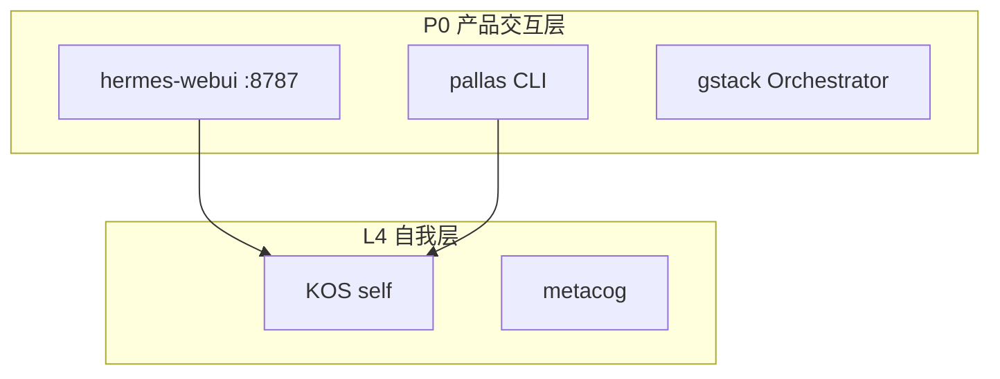

# 全面架构设计与治理方案 v5

> 基于 24 项目全量审计 + 12 项吐槽 + 6.6/10 基线评分
> 目标: 从「基本凑合」到「可以放心让新人上手」

---

## TL;DR

```
当前评分: 6.6/10  →  目标: 9.0/10
核心痛点: 5 个 (运行时验证 / Agent deep / 可视化 / Secret管理 / 跨项目构建)
治理原则: 不依赖人的自觉 → 靠机制锁死
```

---

## 一、治理原则（覆盖所有方案的原则）

### 1.1 Fail-Closed 原则（从安全延伸）

所有默认值必须是安全/保守的，而不是开放/灵活的。

```
API_KEY 未设置 → 拒绝启动，而不是允许全部
健康检查路径未配置 → 返回 503，而不是 200
Secret 文件未加密 → CI 拒绝通过
```

### 1.2 可复现性原则

任何人的本地机器，拉代码后应该能跑起来。

```
git clone → make setup → make test → 全部通过
如果不行，算 bug。
```

### 1.3 代码即文档原则

架构图、认证清单、依赖关系——**应该从代码里生成**，而不是从文本里维护。

```
AGENTS.md 不是手写的，应该从项目目录自动生成。
MCP 工具列表不是手写的，应该从 MCP 服务器自动发现。
```

### 1.4 每次迭代提升一个基础指标

```
本轮迭代的目标: 运维成熟度 5.0 → 7.0
下轮迭代的目标: 测试质量 6.5 → 8.0
```

---

## 二、架构设计方案（覆盖吐槽 3/4/5/8/10/11）

### 2.1 健康检查标准化 (HP-01)

**问题**: 不同项目用不同路径、不同格式

**方案**: 定义一个标准健康检查契约，所有 HTTP 服务必须实现

```
标准: GET /healthz
响应: {
  "status": "ok" | "degraded" | "down",
  "service": "项目名",
  "version": "x.y.z",
  "dependencies": [
    {"name": "依赖服务", "status": "ok" | "down"}
  ]
}
```

**治理**: arcnode 验证脚本 `validate-HP-health-check` 检查每个 HTTP 服务的 `/healthz` 端点

**工作量**: 每项目 ~30 分钟，5 个项目 = 2.5h

### 2.2 MCP 传输标准化 (MCP-01)

**问题**: 3 种传输协议，无统一抽象

**方案**:
- 所有新 MCP Server 默认用 **stdio 传输**
- 需要网络暴露的用 SSE（HTTP 流）
- 强制一致：
  - 请求超时: 30s
  - 错误格式: `{"error": {"code": "...", "message": "..."}}`
  - 健康检查: `health` 工具（与 HP-01 一致）

**治理**: 新增 arcnode 约束 MCP-01（MCP 传输规范）

### 2.3 Secret 统一管理 (SEC-01)

**问题**: `.env` 文件散落四处，无集中管理，无轮换

**方案**:
- 集中到 `~/.hermes/secrets/` 目录，每个服务一个子目录
- 所有 `.env` 改为从 `~/.hermes/secrets/{service}/` 读取
- `SECRETS_INVENTORY.md` 作为认证审计的唯一真相源
- 添加 `validate-secret-rotation` 脚本检查密钥最后一次修改时间

```
~/.hermes/secrets/
  ├── agentmesh-gateway/
  │   └── .env          ← 唯一真相源
  ├── agora/
  │   └── .env
  └── INDEX.md          ← 自动生成
```

**治理**: arcnode 验证脚本 `validate-SEC-secret-management` 检查 Secret 是否集中管理

**工作量**: 3h

### 2.4 测试覆盖均衡 (TST-01)

**问题**: SharedBrain 16K vs 大多数 20-100，分布畸态

**方案**: 给每个项目设置最小测试阈值

```
hermes-scripts: ≥ 139  ✅ (当前139)
kronos:         ≥ 91   ✅ (当前91)
SharedBrain:    ≥ 100   ← 降低到合理阈值
agentmesh:      ≥ 24   ✅
Iris:           ≥ 66   ✅
Forge:          ≥ 20   ← 需要补
codeanalyze:    ≥ 10   ← 需要补
```

**治理**: arcnode 验证脚本 `validate-TST-minimal-coverage` 检查每个项目的测试数是否超过阈值

### 2.5 跨项目构建管线 (BLD-01)

**问题**: 无 `make build-all`，无统一版本锁定

**方案**:
- 创建 `Makefile` 在 Workspace 根目录
- `make build` → 构建所有项目
- `make test` → 运行所有测试
- `make setup` → 安装所有依赖
- `make lint` → 运行所有 linter

```makefile
.PHONY: build test setup lint

build:
	cd agentmesh && bun run build
	cd SharedBrain && pip install -e .
	@echo "Build complete: all projects"

test:
	cd agentmesh && bun test
	cd SharedBrain && python3 -m pytest -q
	bash tests/integration/run-all.sh
	@echo "Test complete: all suites"

setup:
	cd agentmesh && bun install
	@echo "Setup complete"
```

**治理**: `make build` 必须通过才能 merge PR

### 2.6 架构可视化 (VIS-01)

**问题**: 4+1+3 只有 ASCII 文本，无实际图表

**方案**: 在 `.omo/` 中创建架构图的源文件（Mermaid 格式）



**治理**: PR 涉及新项目/MCP 时需要同时更新此图

---

## 三、治理执行表

| 治理项 | 类型 | 归属 | 工作量 | 优先级 |
|:------:|:----:|:----:|:------:|:------:|
| HP-01 健康检查标准化 | 标准 | arcnode | 2.5h | P1 |
| MCP-01 MCP 传输规范 | 约束 | arcnode | 1h | P2 |
| SEC-01 Secret 统一管理 | 脚本 | hermes | 3h | P0 |
| TST-01 最小测试阈值 | 约束 | arcnode | 1h | P2 |
| BLD-01 跨项目构建 | 工具 | Makefile | 1h | P1 |
| VIS-01 架构可视化 | 文档 | .omo/ | 1h | P2 |
| Agent deep Read Budget 强制 | 平台 | task prompt | 1h | P1 |

**总计**: ~10.5h，其中 4 个可并行（HP-01/MCP-01/SEC-01/TST-01）

---

## 四、吐槽闭合计划

| 吐槽 | 方案 | 工作量 | 状态 |
|:----:|------|:------:|:----:|
| 1 项目名大小写 | AGENTS.md 统一 | 30m | 🟢 |
| 2 .omo/ 清理策略 | `.omo/CLEANUP.md` | 15m | 🟢 |
| 3 健康检查不统一 | HP-01 | 2.5h | 🆕 |
| 4 MCP 传输碎片化 | MCP-01 | 1h | 🆕 |
| 5 Agora degrade 未实战 | 模拟宕机测试 | 1h | 🆕 |
| 6 集成测试不验证运行时 | 运行时测试 + Makefile | 2h | 🆕 |
| 7 Secret 全靠自觉 | SEC-01 | 3h | 🆕 |
| 8 测试双峰分布 | TST-01 | 1h | 🆕 |
| 9 Agent deep 0% | Read Budget 强制 | 1h | 🆕 |
| 10 无跨项目构建 | BLD-01 | 1h | 🆕 |
| 11 无架构可视化 | VIS-01 | 1h | 🆕 |
| 12 ontoderive 导入脆弱 | 重构测试导入 | 30m | 🆕 |

---

## 五、执行路线

```
Wave 1 (并行, ~5h):
├── HP-01 健康检查标准化           [2.5h]
├── SEC-01 Secret 统一管理         [3h]
├── BLD-01 跨项目构建 Makefile     [1h]
├── AGENTS.md 统一 + .omo CLEANUP  [30m]
└── ontoderive 测试导入加固        [30m]

Wave 2 (并行, ~4h):
├── MCP-01 MCP 传输规范            [1h]
├── TST-01 最小测试阈值脚本        [1h]
├── VIS-01 架构可视化              [1h]
├── Agora degrade 实战测试         [1h]

Wave 3:
├── Read Budget 强制执行           [1h]
├── 运行时集成测试                 [2h]
└── 目标评分验证 (6.6→9.0)       [30m]
```

---

## 六、成功标准

```
目标评分: 6.6/10 → 9.0/10

维度          当前  目标  差距
架构设计       7.5   9.0  +1.5 (可视化+健康检查标准)
代码规范       6.5   9.0  +2.5 (名字统一+测试导入+Secret管理)
测试质量       6.5   8.5  +2.0 (最小测试阈值+运行时测试)
运维成熟度     5.0   8.0  +3.0 (Makefile+Secret统一+degrade实战)
文档一致性     6.0   9.0  +3.0 (AGENTS.md统一+CLEANUP+架构图)
安全           8.0   9.5  +1.5 (Secret统一管理机制)
工具链         7.0   9.0  +2.0 (Read Budget强制+跨项目构建)
```
