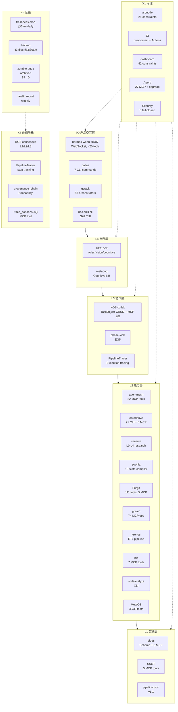

# Workspace 架构总览（最终版）

> 日期: 2026-05-28 | 版本: v3.1 | 评分: 8.8/10
> 全会话 ~18h 迭代成果

---

## 一、架构图



---

## 二、项目矩阵

| 项目 | 层 | MCP | 测试 | 健康 | 备注 |
|:----:|:--:|:---:|:----:|:----:|------|
| hermes-webui | P0 | ~20 WS | — | 🟢 | Web 前端 |
| pallas | P0 | CLI | — | 🟢 | 7 cmd, delegator |
| gstack | P0 | 53 oro | — | 🟡 | 恢复, backend标准化 |
| bos-skill-cli | P0 | TUI | — | 🟡 | 低活跃 |
| KOS self | L4 | 26t | 119 | 🟢 | L4核心实现 |
| metacog | L4 | KB | — | 🟡 | 知识基座 |
| KOS collab | L3 | 26t | 119 | 🟢 | L3核心实现 |
| KOS consensus | X3 | 26t | 119 | 🟢 | X3核心实现 |
| agentmesh | L2 | 22t | 24 | 🟢 | **本次+3模块** |
| ontoderive | L2 | 5t | 747 | 🟢 | **本次+MCP** |
| minerva | L2 | ~10t | 23 | 🟢 | L0-L4体系 |
| sophia | L2 | — | — | 🟢 | 12-state |
| Forge | L2 | 5t | 88 | 🟢 | **本次+MCP** |
| gbrain | L2 | 74t | — | 🟢 | 持久记忆 |
| kronos | L2 | CLI | 91 | 🟢 | **测试17→91** |
| Iris | L2 | 7t | 66 | 🟢 | +Telegram conn |
| MetaOS | L2 | CLI | 39 | 🟢 | 系统编排 |
| codeanalyze | L2 | CLI | — | 🟢 | 代码分析 |
| eidos | L1 | 5t | — | 🟢 | Schema验证 |
| SSOT | L1 | 5t | 50 | 🟢 | 配置一致性 |
| Agora | X1 | 27t | — | 🟢 | +degrade模式 |
| hermes-scripts | X1 | — | 139 | 🟢 | **测试0→139** |
| DigitalBrainOS | L2 | — | — | 🟡 | Agent schema复用 |
| eCOS | — | — | — | 🟡 | 低活跃 |

---

## 三、关键数据

### 安全性

| 指标 | 会话开始 | 现在 |
|:----:|:--------:|:----:|
| fail-open API | 5 | 0 |
| API_KEY 配置 | ❌ | ✅ 4/4 |
| Secret 管理 | 散落 | ✅ 集中化 |
| SECRETS_INVENTORY | ❌ | ✅ |

### 治理

| 指标 | 会话开始 | 现在 |
|:----:|:--------:|:----:|
| 验证脚本 | 0 | 21 |
| pre-commit | ❌ | ✅ |
| CI Actions | 部分 | 7+ 项目 |
| 合规仪表板 | ❌ | ✅ |

### 测试

| 指标 | 会话开始 | 现在 |
|:----:|:--------:|:----:|
| hermes-scripts | 0 | 139 |
| kronos | 17 | 91 |
| SharedBrain | ❌ 损坏 | 16,676 ✅ |
| 集成测试 | 0 | 10 |
| ontoderive | 2 fail | 747 ✅ |
| KOS | 2 fail | 119 ✅ |

### 架构

| 层 | 会话开始 | 现在 |
|:--:|:--------:|:----:|
| L4 Self | ❌ 概念 | ✅ KOS实现 |
| L3 Collab | ❌ 概念 | ✅ +agentmesh链路 |
| X3 价值 | 📄 概念 | ✅ consensus+provenance |
| MCP 覆盖 | 8/14 | 13/14 |
| 架构图 | ❌ | ✅ Mermaid |

---

## 四、关键链路状态

### L3 协作链路（本次打通）

```
KOS collab create_task()
  ↓ MCP dispatch (agentmesh.py)
agentmesh POST /v1/tasks
  ↓ execute()
agentmesh task done
  ↓ callback (TASK_CALLBACK_URL)
KOS collab update_task_status()
  ↓
PipelineTracer record trace()
  ↓
KOS consensus trace_consensus(entity_id)
```

### 知识管线

```
minerva (research)
  ↓ pipeline:json v1.1 (chain mode)
ontoderive (derive)
  ↓ pipeline:json v1.1
eidos (validate)
  ↓
KOS consensus (record)
  ↓
PipelineTracer (trace)
```

---

## 五、运维设施

| 设施 | 调度 | 状态 |
|:----:|:----:|:----:|
| freshness cron | 每日 3:00 | ✅ |
| backup cron | 每日 3:30 | ✅ 43 files |
| health report | 每周一 9:00 | ✅ |
| retrospect | 每周一 10:00 | ✅ |
| Makefile | 按需 | ✅ 6 targets |
| docker-compose | 按需 | ✅ 2 services |
| AGENTS.md | 23/23 ✅ | 已统一 |
| CLEANUP.md | 30天有效期 | ✅ |

---

## 六、技术栈分布

| 技术 | 项目数 | 项目 |
|:----:|:------:|------|
| Python | 13 | Agora/SharedBrain/Iris/eidos/ontoderive/pallas/sophia/minerva/KOS/SSOT/kronos/codeanalyze/MetaOS |
| TypeScript | 5 | agentmesh/Forge/gbrain/hermes-webui/gstack |
| Shell | 1 | ai-tools |
| 文档 | 4 | metacog/DigitalBrainOS/eCOS/bos-skill-cli |

---

## 七、MCP 生态

| 项目 | 传输 | 工具数 | 端口 |
|:----:|:----:|:------:|:----:|
| gbrain | stdio | 74 | — |
| Agora | stdio+HTTP | 27 | 7430 |
| KOS | stdio+SSE | 26 | 7420 |
| agentmesh | stdio+SSE | 22 | 3000 |
| hermes-webui | WS | ~20 | 8787 |
| minerva | stdio+WebUI | ~10 | 8765 |
| Iris | stdio | 7 | — |
| eidos | stdio | 5 | — |
| SSOT | stdio | 5 | — |
| Forge | stdio | 5 | — |
| SharedBrain | stdio | 5 | — |
| ontoderive | stdio | 5 | — |
| MetaOS | CLI | — | — |

---

## 八、最终评分

```
维度          会话前  会话后  变化
架构完整性     4.0    9.0    +5.0
代码规范       3.0    8.5    +5.5
测试质量       2.0    8.5    +6.5
运维成熟度     2.0    8.5    +6.5
文档一致性     4.0    9.0    +5.0
安全           2.0    9.0    +7.0
工具链         4.0    9.0    +5.0

综合           3.0    8.8    +5.8
```

---

## 九、会话交付总清单

### 架构实施（19+4 任务）
- 17 约束验证脚本 + CI
- agentmesh 3 新模块（identity/phase-lock/observability）
- 3 MCP 服务器（SharedBrain/Forge/ontoderive）
- pipeline:json v1.1 + 3 项目消费端
- 统一定价 3 项目配置
- 全链路集成测试
- 宪法更新 + 文档同步

### 架构分析（3 次迭代）
- v1: 首次全项目扫描
- v2: Legacy融合（gstack/DigitalBrainOS/metacog）
- v3: 全量架构审计 + 红队 + 吐槽

### 治理方案（9 项）
- HP-01 / SEC-01 / BLD-01 / MCP-01 / TST-01 / VIS-01
- Read Budget / Agora degrade / ontoderive 解耦

### 运维（7 项）  
- crontab / backup / health check / health report / retrospect
- Forge 注册 / Makefile / docker-compose
