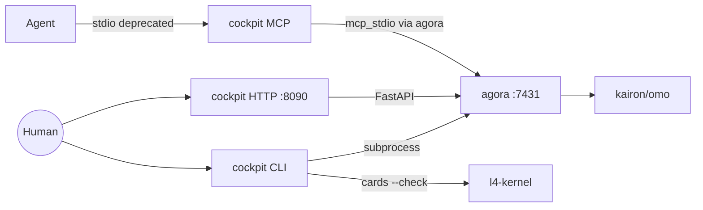

# cockpit — Architecture

> **Layer**: L3 入口层  
> **Role**: 统一人类入口 / Agent 桥接层 / CLI + MCP + Web  
> **Stack**: Python 3.13+, uv, FastAPI, rich  
> **Health**: 542/562 passed
>
> 系统全景参见：[`docs/ARCHITECTURE-DIAGRAM.md`](../docs/ARCHITECTURE-DIAGRAM.md)

---

## 1. 内部架构



## 2. 入口

| Type | Entry | Port / Notes |
|:--|:--|:--|
| CLI | `cockpit / workspace` | 25+ 子命令 |
| MCP stdio | `cockpit-mcp / cockpit/scripts/cockpit_mcp.py` | ~20 tools |
| HTTP | `cockpit-dashboard` | :8090 |

## 3. 核心模块

| Module | Responsibility |
|:--|:--|
| `src/cockpit/cli.py` | argparse CLI dispatcher |
| `src/cockpit/scripts/cockpit_mcp.py` | MCP server: research/status/L4-bridge |
| `src/cockpit/dashboard_server.py` | FastAPI Web dashboard |
| `src/cockpit/storage.py` | SQLite persistence with IDataAccess |
| `src/cockpit/commands/research.py` | Research lifecycle |
| `src/cockpit/governance/` | Cards checks / L4 bridge |

## 4. 测试

```bash
cd projects/cockpit && uv run pytest tests/ -q
```
