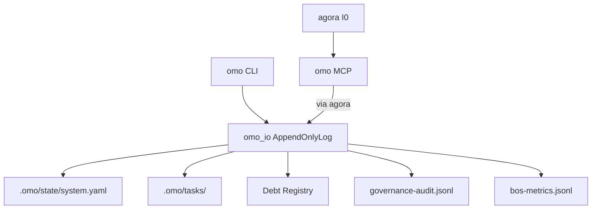

# omo — Architecture

> **Layer**: L2 引擎面  
> **Role**: 治理中枢 — AI Agent OS / Phase / Task / Debt / Audit  
> **Stack**: Python 3.13+, uv, FastMCP  
> **Health**: See local CI and governance audit outputs
> **SSOT**: 运行时健康、测试通过率、CLI/MCP 子命令规模以本项目 CI、治理审计和 workspace governance SSOT 为准
>
> 系统全景参见：[`../../docs/PANORAMA.md`](../../docs/PANORAMA.md)

---

## 1. 内部架构



## 2. 入口

| Type | Entry | Port / Notes |
|:--|:--|:--|
| CLI | `omo` | 子命令 (见 project-registry.yaml: omo.cli_subcommands) (含 deprecated bridge/strategy) |
| CLI | `omo-debt` / `cards` | 债务/CARDS 专用入口 |
| MCP stdio | `omo-mcp` | MCP tools (见 project-registry.yaml: omo.mcp_tools) |
| SSE daemon | `omo-sse-daemon` | |

## 3. 核心模块

| Module | Responsibility |
|:--|:--|
| `src/omo/cli.py` | CLI entry (39 subcommands) |
| `src/omo/mcp_server.py` | MCP server (MCP tools (见 project-registry.yaml: omo.mcp_tools)) |
| `src/omo/omo_io.py` | AppendOnlyLog + fcntl 跨进程锁 |
| `src/omo/_shared/` | advisory_lock, append_only_log, timestamp_model |
| `src/omo/categories/` | audit, bos, debt, governance, worker 分类聚合 |
| `src/omo/omo_debt_*.py` | 债务管理 (17 模块) |
| `src/omo/omo_audit*.py` | 审计 + 同步 + 去重 + rollout (4 模块) |
| `src/omo/omo_bos_*.py` | BOS registry / metrics / dispatch (6 模块) |
| `src/omo/omo_governance_surfaces*.py` | 治理面 lint + ingress registry (11 模块) |
| `src/omo/omo_ingress_*.py` | 入口写入 (9 模块) |
| `src/omo/omo_lint*.py` | 静态校验 (5 模块) |
| `src/omo/omo_worker_*.py` | Worker 调度 (6 模块) |
| `src/omo/omo_self_healing*.py` | 自愈引擎 (2 模块) |
| `src/omo/omo_promotion_*.py` | 晋升流程 (5 模块) |
| `src/omo/omo_task_policy.py` | Reusable task policy checker |
| `src/omo/model_driven_bridge.py` | model-driven 桥接 (factory 模式, 不硬依赖) |
| `src/omo/omo_agora_pool.py` | Agora 连接池 |
| `src/omo/omo_bus_adapter.py` | bus-foundation 适配器 |
| `src/omo/omo_cockpit_bridge.py` | cockpit 桥接 |

## 4. 测试

```bash
cd projects/omo && uv run pytest tests/ -q
```
