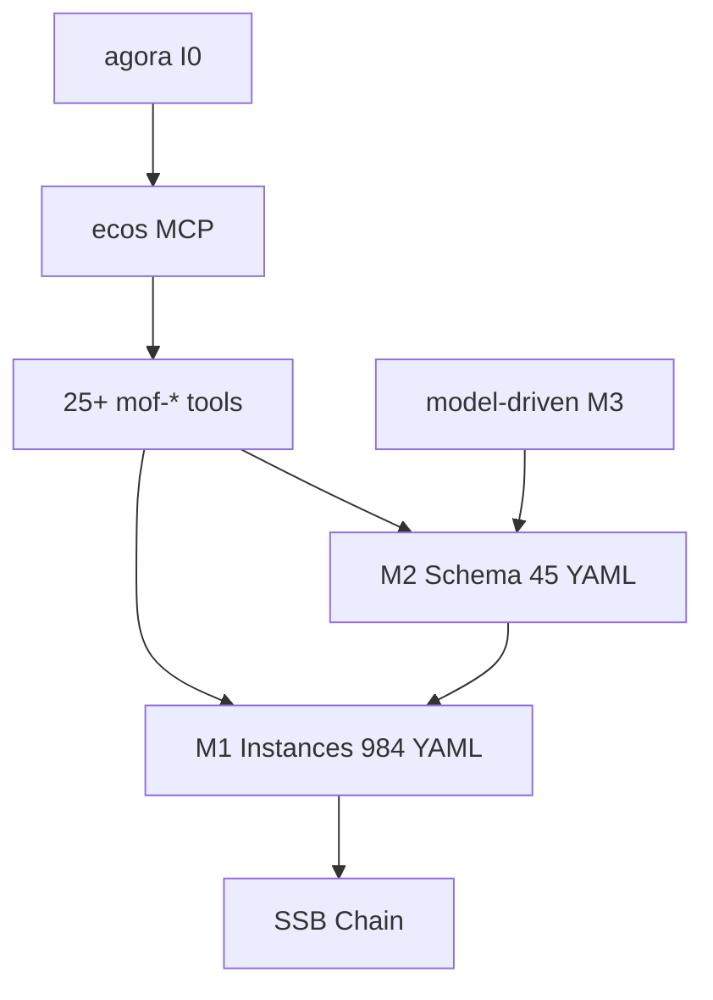

# ecos — Architecture

> **Layer**: L0 协议层  
> **Role**: 协议底座 — SSB 签名链 / MOF 元模型 / 涌现计算 / L0 治理原语  
> **Stack**: Python 3.13+, uv, fastmcp, pyyaml  
> **Health**: See local CI and model/runtime validation
> **SSOT**: 运行时健康、测试通过率、工具链规模以本项目 CI、模型校验和 workspace governance SSOT 为准
>
> 系统全景参见：[`docs/ARCHITECTURE-DIAGRAM.md`](../docs/ARCHITECTURE-DIAGRAM.md)

---

## 1. 内部架构



## 2. 入口

| Type | Entry | Port / Notes |
|:--|:--|:--|
| CLI | `ecos-ssb, ecos-dashboard, ecos-scheduler` |  |
| MCP stdio | `src/ecos/mcp_server.py` | ~19 tools |
| HTTP | `ecos-dashboard` | :9090 |
| Tools | `mof-validate, mof-derive, mof-bridge-sync, ...` |  |

## 3. 核心模块

| Module | Responsibility |
|:--|:--|
| `src/ecos/l0/ssb/` | SSB signature chain |
| `src/ecos/l0/ssot/` | SSOT engine + MOF meta-model |
| `src/ecos/l0/ssot/tools/` | 25+ MOF toolchain |
| `src/ecos/l0/governance/` | 16 L0 governance primitives |
| `src/ecos/l0/emergence/` | Emergence calculation |
| `src/ecos/mcp_server.py` | L0 MCP entry |

## 4. 测试

```bash
cd projects/ecos && uv run pytest tests/ -q
```
