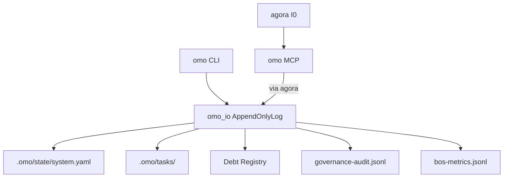

# omo — Architecture

> **Layer**: L2 引擎面  
> **Role**: 治理中枢 — AI Agent OS / Phase / Task / Debt / Audit  
> **Stack**: Python 3.13+, uv, FastMCP  
> **Health**: 530 tests, 57% raw (225 skipped) / 97.4% effective
>
> 系统全景参见：[`docs/ARCHITECTURE-DIAGRAM.md`](../docs/ARCHITECTURE-DIAGRAM.md)

---

## 1. 内部架构



## 2. 入口

| Type | Entry | Port / Notes |
|:--|:--|:--|
| CLI | `omo` | 26+ 子命令 |
| CLI | `omo-debt / cards` |  |
| MCP stdio | `omo-mcp` | 10+ tools |
| SSE daemon | `omo-sse-daemon` |  |

## 3. 核心模块

| Module | Responsibility |
|:--|:--|
| `src/omo/cli.py` | CLI entry |
| `src/omo/mcp_server.py` | MCP server |
| `src/omo/omo_io.py` | AppendOnlyLog + fcntl 跨进程锁 |
| `src/omo/omo_worker_core.py` | Worker dispatch |
| `src/omo/omo_debt_registry.py` | Debt registry |
| `src/omo/omo_audit*.py` | Audit / sync / rollout |
| `src/omo/omo_bos_*.py` | BOS registry / metrics / dispatch |
| `src/omo/model_driven_bridge.py` | model-driven bridge |

## 4. 测试

```bash
cd projects/omo && uv run pytest tests/ -q
```
