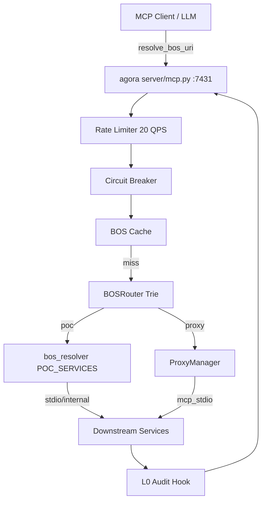

# agora — Architecture

> **Layer**: I0 织层  
> **Role**: MCP 服务网格 / BOS URI 路由网关 / 动态反向代理  
> **Stack**: Python 3.13+, uv, FastMCP  
> **Health**: See local CI and runtime probes
> **SSOT**: 运行时健康、测试通过率、路由/工具计数以本项目 CI、运行时探针和 workspace governance SSOT 为准
>
> 系统全景参见：[`../../docs/PANORAMA.md`](../../docs/PANORAMA.md)

---

## 1. 内部架构



## 2. 入口

| Type | Entry | Port / Notes |
|:--|:--|:--|
| CLI | `agora` | 子命令 (见 project-registry.yaml: agora) |
| MCP stdio | `agora-mcp` |  |
| SSE | `agora-server` | :7431 |
| HTTP | `agora-web` | :7422 / :8080 |

## 3. 核心模块

| Module | Responsibility |
|:--|:--|
| `src/agora/server/mcp.py` | FastMCP server + tool registry + ProxyManager |
| `src/agora/mcp/bos_router.py` | Trie 前缀索引 BOS 路由 |
| `src/agora/mcp/bos_resolver.py` | BOS URI 解析与 downstream 派发 |
| `src/agora/mcp_proxy/client.py` | stdio/HTTP MCP client |
| `src/agora/core/router.py` | Router / SmartRouter / FederationRouter |
| `src/agora/core/registry.py` | ServiceRegistry + health + circuit breaker |

## 4. 测试

```bash
cd projects/agora && uv run pytest tests/ --ignore=tests/e2e -q
```

## 架构概览

参见工作区架构概览图：[`../../docs/ARCHITECTURE-DIAGRAM.md`](../../docs/ARCHITECTURE-DIAGRAM.md)
