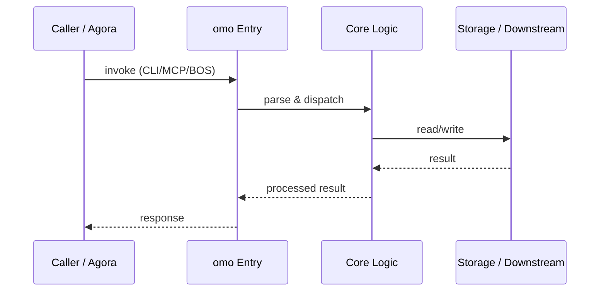

# omo — Call Chain

> 本文档描述 omo 内部最核心的一条调用链 / 数据流。
>
> 通用跨层调用链参见：[`docs/I0-AGORA-CALLCHAIN.md`](../docs/I0-AGORA-CALLCHAIN.md)

---

## 关键路径

1. 1. `omo state` CLI or `bos://governance/omo/state` via agora
2. 2. `omo_io.py` opens append-only log with fcntl lock
3. 3. Reads/writes `.omo/state/system.yaml` and `.omo/tasks/`
4. 4. `omo_audit` consumer writes to governance-audit.jsonl
5. 5. `omo_bos_metrics` consumer records BOS invocation metrics
6. 6. Self-healing engine scans and registers debt when violations found

## Sequence Diagram

