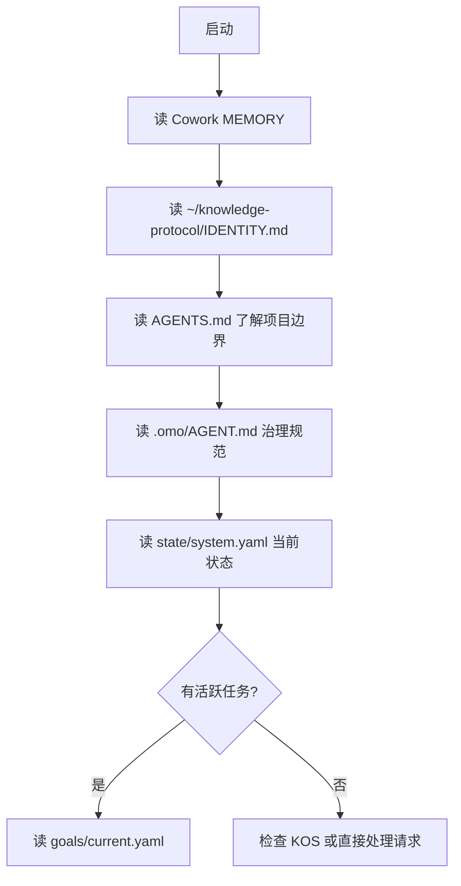

# CLAUDE.md — omostation Workspace

> Personal AI Operating System · Multi-project Knowledge Engineering Workspace
> 基于 omostation (starlink-awaken/omostation) 根仓库

---

## §0 启动强制指令 (MANDATORY · 不可跳过 · 每次对话第一步)

**Agent 首次响应前必须执行以下任一步骤，获取当前上下文：**

1. **通过 MCP**: 连接 `cockpit` MCP server，调用 `workspace_context` 工具
   - 返回: 当前 Phase、活跃 P0 卡片、治理约束、下一步引导
2. **备选 (无 MCP 时)**: 读取 `.omo/_truth/goals/current.yaml` 获取当前阶段和目标
3. **治理宪章**: 所有 5+3+1 架构规范见 `.omo/_knowledge/management/governance-charter-v1.md`
4. **X 轴保障**: X1(审计)/X2(保鲜)/X3(价值)/X4(一致性) 原则见 `LAYER-INDEX.md`，实现见 `.omo/_knowledge/management/x-axis-implementation-registry.md`

**涉及端口时必须**: 先查 `protocols/port-registry.yaml` → 确认端口未被占用 → 注册新端口 → 使用环境变量 `{SERVICE}_PORT`。CI 和 Agora runtime 双重阻断端口冲突。
**强制闭环原则 (Mandatory Commits)**: Agent 修改任何文件后（尤其是 `.omo` 或文档），**必须立即执行 `git commit`**。Git post-commit 钩子承载着 L0 层知识萃取引擎的触发机制。不 commit 意味着你产生的知识将从系统的全局记忆中彻底丢失，这被视为严重故障。

**禁止**: 未获取上下文直接修改代码。禁止跳过 L4 约束检查直接操作 `.omo` 目录。

---

## 项目身份

这是 **omostation** 根仓库 —— 一个多项目融合工作区，整合了知识工程、数字生命 OS、Agent SDK 与知识脑四大子系统。**Phase 28 进行中**（5+3+1 全量审计 + X-Plane 治理控制面落地）。

---

## 架构总览

### 4-Layer 架构 (I0-L4)

| 层级 | 角色 | 项目 |
|------|------|------|
| **I0 — 路由层** | MCP 服务发现/代理/断路 | `kairon/agora` |
| **L1 — 知识工程层** | 31 包 Python monorepo | `kairon/` (eidos, kos, minerva, sophia...) |
| **L2 — 集成层** | 跨系统桥接 | `kairon/sharedbrain-bridge` |
| **L3 — Agent 层** | 多 Agent 网关 | `kairon/agent-runtime`, `kairon/agent-hub`, `kairon/agora`, `kairon/llm-gateway` |
| **L4 — 知识存储层** | Postgres 原生知识脑 | `gbrain/` (TypeScript) |

### 4-Plane 治理架构 (.omo/)

| 平面 | 路径 | 内容 |
|------|------|------|
| **控制面** | `.omo/_control/` | 目标、状态、蓝图 |
| **事实面** | `.omo/_truth/` | 任务、标准、注册表 |
| **知识面** | `.omo/_knowledge/` | 设计文档、复盘、审计 |
| **交付面** | `.omo/_delivery/` | 运行记录、测试、证据 |

### 数据流

```
Worker/User → SharedBrain (轻量数据持久层)
              ↓
           kairon/ (知识处理、推理、研究、治理)
              ↓
           gbrain/ (知识持久化)
```

---

## 子项目清单 (9 项目 · 5+3+1 架构)

| 项目 | 层 | 位置 | 栈 | 规模 | 状态 |
|------|-----|------|-----|------|------|
| **cockpit** | L3 | `projects/cockpit/` | Python (uv, pytest) | CLI 13 + MCP 15 | 🟢 486 tests |
| **agora** | I0 | `projects/agora/` | Python (uv, pytest) | MCP 42 + HTTP 30+ | 🟢 1105 tests |
| **kairon** | L2 | `projects/kairon/` | Python (uv, pytest) | 25 包 | 🟢 1810+ tests |
| **gbrain** | L2 | `projects/gbrain/` | TypeScript (bun) | MCP 67, 163K TS | 🟢 |
| **omo** | L2 | `projects/omo/` | Python (uv, pytest) | CLI 35 + MCP 10 + AppendOnlyLog 5 consumers | 🟢 100+ tests + 3 集成 |
| **metaos** | L2 | `projects/metaos/` | Python (uv, pytest) | MCP 11 | 🟢 163 tests |
| **runtime** | L1 | `projects/runtime/` | Python (uv, pytest) | MCP 30 + HTTP 5 | 🟢 171 tests |
| **ecos** | L0 | `projects/ecos/` | Python (uv, pytest) | SSB + emergence | 🟢 122 tests |
| **protocols** | L0 | `protocols/` | YAML | 16 protocols | 🟢 |
| **SharedBrain** | — | `projects/_archived/` | Python | 已归档 | ⚪ |
| **agentmesh** | — | `projects/_archived/` | TypeScript | 100% 迁移至 kairon | ⚪ |
| **hermes-console** | — | `projects/hermes-console/` | TypeScript | 待集成至 cockpit | 🟡 |

---

## 会话启动流程

每次新会话按以下顺序执行：



具体步骤：

| # | 动作 | 目的 |
|---|------|------|
| 1 | 读 Cowork MEMORY | 了解上次会话遗留 |
| 2 | 读 `~/knowledge-protocol/IDENTITY.md` | 了解用户身份与偏好 |
| 3 | 读 `AGENTS.md` | 项目边界、命令、注意事项 |
| 4 | 读 `.omo/INDEX.md` | 治理知识库导航 |
| 5 | 读 `.omo/state/system.yaml` | 当前 Phase、健康分、活跃任务 |
| 6 | 读 `.omo/goals/current.yaml` | 当前目标和 KPI |
| 7 | 检查 `.omo/tasks/active/` | 可认领的活跃任务 |

---

## 核心命令速查

### 根仓库

```bash
make kairon-test         # 运行 kairon 全部测试
make kairon-lint         # ruff 检查所有包
make kairon-build        # uv sync 安装依赖
make governance-check    # 全量治理检查
```

### kairon (Python monorepo)

```bash
cd projects/kairon && make test           # 全量测试
cd projects/kairon && make test-fast      # 仅单元测试
cd projects/kairon && make lint           # ruff 检查
cd projects/kairon && uv sync             # 安装依赖
cd projects/kairon && uv add <pkg>        # 添加依赖
```

### gbrain (TypeScript)

```bash
cd projects/gbrain && bun test
cd projects/gbrain && bun run ci:local
```

### 集成测试

```bash
bash tests/integration/run-all.sh
```

---

## 编码规范

### Python (kairon)

- **包管理器**: uv (非 pip/poetry)
- **格式化/检查**: ruff (`ruff format`, `ruff check`)
- **行宽**: 120
- **Python 版本**: 3.13+
- **Import 排序**: isort (通过 ruff 启用)

### TypeScript (gbrain)

- **运行时**: bun (非 Node/npm)
- **格式化**: `bun fmt` / `bun run lint:fix`
- **测试**: `bun test` / `bun run ci:local`

---

## SSOT 铁律

> **同一事实不在多处写。知识面文档引用事实面数据时，必须使用相对路径指针，不得复制内容。**

| 数据 | 唯一读源 | 禁止行为 |
|------|---------|---------|
| 任务 | `.omo/tasks/active/` (YAML) | 从知识面文档读取任务状态 |
| 系统状态 | `.omo/state/system.yaml` | 从旧快照文件取状态 |
| 目标 | `.omo/goals/current.yaml` | 直接修改 goals (仅人类可改) |
| 标准 | `.omo/standards/` | 从计划文档读标准 |

---

## 路由规则

| 场景 | 路由 |
|------|------|
| 找知识/跨域搜索 | 优先用 KOS (`kos/`, `kairon/kos` 包) |
| 工作公文 | `~/Documents/公文/CLAUDE.md` |
| 借调事务 | `~/Documents/国转中心/CLAUDE.md` |
| 随手记录 | WPS Note，标签路由 |
| 运行 Worker | 遵循 `.omo/workers/` 注册表 |

---

## 执行习惯

1. **3 步以上任务**先列 TodoList
2. **起草任何内容**需确认「主题+时间+接收对象+核心内容」
3. **完成后一句话汇报**，不确定标注「需确认」
4. **修改 .omo/ 内文件**需谨慎，遵循 AGENT.md 规范
5. **代码变更**前先读对应项目的 AGENTS.md / CLAUDE.md

---

## 重要上下文文件

| 文件 | 作用 |
|------|------|
| `README.md` | 项目总览、快速开始 |
| `AGENTS.md` | 开发者指南、命令、陷阱 |
| `LAYER-INDEX.md` | 分层架构索引（I0-L4） |
| `convergence.yaml` | 融合治理状态 |
| `.omo/_knowledge/management/append-only-log-pattern-2026-06-09.md` | **AppendOnlyLog 模式 (5 轮收口)** |
| `.omo/_knowledge/management/governance-charter-v1.md` | 5+3+1 治理宪章 |
| `.omo/INDEX.md` | 治理知识库导航 |
| `data/` | 数据层（`db/`, `kos/`, `sharedbrain/`） |
| `.omo/state/system.yaml` | 当前系统运行状态 |
| `.omo/goals/current.yaml` | 当前 Phase 目标 |
| `.omo/MASTER-BLUEPRINT.md` | 长期蓝图 |
| `projects/kairon/CLAUDE.md` | kairon 31 包 monorepo 指南 |
| `projects/gbrain/AGENTS.md` | gbrain 开发者指南 |
| `projects/*/AGENTS.md` | 各子项目开发者指南 |

---

## Phase 上下文

- **当前 Phase**: 28 (5+3+1 全量审计纪元 — X-Plane 治理控制面已落地)
- **下一里程碑**: Phase 28 X-Plane 档位③ 战果已落盘,探活覆盖率 90.5%,待推进 Phase 29
- **健康分**: 77.5/100 (X-Plane 接入后真实值,2026-06-08 实测,健康分因子 = raw(100) × dw(1.0) × xplane_factor(0.775))
- **完成度**: Phase 1-28 已完成,X-Plane 战役 5 笔 commit 落盘,档位①②③ 全部交付;xplane_score=25,coverage=90.5%,真戳破 5+ 真 RED
- **当前活跃任务**: (无活跃任务;预存 9 bug 已登记)
- **关键原则**: OMO MCP 化完成,agora 网关隔离固化,llm-gateway 统一算力调度,gbrain 图谱记忆共享上线,**X-Plane 戳破声明/现实分裂**

---

## 注意事项 / Gotchas

1. ✅ kairon 用 **uv**，不是 pip/poetry
2. ✅ Python 目标版本 **3.13+**
3. ✅ agentmesh 和 gbrain 用 **bun**，非 Node/npm
4. ✅ 数据库路径 (`data/db/`) 已 gitignore
5. ✅ 根目录 `SharedBrain/` 是轻量化数据持久层（Phase 17），非独立项目
6. ✅ `.omo/` 是治理核心
7. ❌ 不要直接从旧快照文件 (HEALTH_DASHBOARD.md) 取状态
8. ❌ 不要复制事实到知识面文档 —— 用指针引用
9. ❌ 不要修改 goals/current.yaml（仅人类可改）
10. ❌ 不要删除旧的运行记录（仅可标记 archived）
