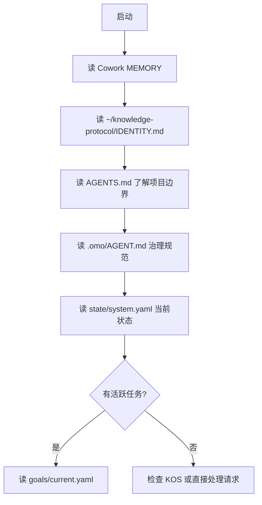

# CLAUDE.md — omostation Workspace

> Personal AI Operating System · Multi-project Knowledge Engineering Workspace
> 基于 omostation (starlink-awaken/omostation) 根仓库

---

## 项目身份

这是 **omostation** 根仓库 —— 一个多项目融合工作区，整合了知识工程、数字生命 OS、Agent SDK 与知识脑四大子系统。**Phase 27 进行中**（OMO 蜂群网络纪元 — Swarm Network Era）。

---

## 架构总览

### 4-Layer 架构 (I0-L4)

| 层级 | 角色 | 项目 |
|------|------|------|
| **I0 — 路由层** | MCP 服务发现/代理/断路 | `kairon/agora` |
| **L1 — 知识工程层** | 31 包 Python monorepo | `kairon/` (eidos, kos, minerva, sophia...) |
| **L2 — 集成层** | 跨系统桥接 | `kairon/sharedbrain-bridge` |
| **L3 — Agent 层** | 多 Agent 网关 | `kairon/agent-runtime`, `kairon/agent-hub`, `kairon/agora`, `kairon/llm-gateway` |
| **L4 — 知识存储层** | Postgres 原生知识脑 | `gbrain/` (TypeScript) |

### 4-Plane 治理架构 (.omo/)

| 平面 | 路径 | 内容 |
|------|------|------|
| **控制面** | `.omo/_control/` | 目标、状态、蓝图 |
| **事实面** | `.omo/_truth/` | 任务、标准、注册表 |
| **知识面** | `.omo/_knowledge/` | 设计文档、复盘、审计 |
| **交付面** | `.omo/_delivery/` | 运行记录、测试、证据 |

### 数据流

```
Worker/User → SharedBrain (轻量数据持久层)
              ↓
           kairon/ (知识处理、推理、研究、治理)
              ↓
           gbrain/ (知识持久化)
```

---

## 子项目清单

| 项目 | 位置 | 栈 | 规模 | 说明 |
|------|------|-----|------|------|
| **kairon** | `projects/kairon/` | Python (uv, ruff, pytest) | 30 包 | 知识工程与研究栈（已吸收 SharedBrain + agentmesh） |
| **SharedBrain** | `projects/_archived/SharedBrain-original/` | Python | 已归档 | 源码已迁移至 kairon，根目录 SharedBrain/ 仅存数据持久层 |
| **agentmesh** | `projects/_archived/` | TypeScript | 已归档 | 100% 迁移至 kairon（agent-hub/agent-runtime/agora/forge/llm-gateway） |
| **gbrain** | `projects/gbrain/` | TypeScript (bun, Postgres) | 74+ 工具 | Postgres 知识脑 |
| **hermes-console** | `projects/hermes-console/` | TypeScript (React) | 34 源文件 | Hermes 管理控制台 |
| **_archived** | `projects/_archived/` | — | 24 项/6.3 GB | 已迁移旧项目备份 |

---

## 会话启动流程

每次新会话按以下顺序执行：



具体步骤：

| # | 动作 | 目的 |
|---|------|------|
| 1 | 读 Cowork MEMORY | 了解上次会话遗留 |
| 2 | 读 `~/knowledge-protocol/IDENTITY.md` | 了解用户身份与偏好 |
| 3 | 读 `AGENTS.md` | 项目边界、命令、注意事项 |
| 4 | 读 `.omo/INDEX.md` | 治理知识库导航 |
| 5 | 读 `.omo/state/system.yaml` | 当前 Phase、健康分、活跃任务 |
| 6 | 读 `.omo/goals/current.yaml` | 当前目标和 KPI |
| 7 | 检查 `.omo/tasks/active/` | 可认领的活跃任务 |

---

## 核心命令速查

### 根仓库

```bash
make kairon-test         # 运行 kairon 全部测试
make kairon-lint         # ruff 检查所有包
make kairon-build        # uv sync 安装依赖
make governance-check    # 全量治理检查
```

### kairon (Python monorepo)

```bash
cd projects/kairon && make test           # 全量测试
cd projects/kairon && make test-fast      # 仅单元测试
cd projects/kairon && make lint           # ruff 检查
cd projects/kairon && uv sync             # 安装依赖
cd projects/kairon && uv add <pkg>        # 添加依赖
```

### gbrain (TypeScript)

```bash
cd projects/gbrain && bun test
cd projects/gbrain && bun run ci:local
```

### 集成测试

```bash
bash tests/integration/run-all.sh
```

---

## 编码规范

### Python (kairon)

- **包管理器**: uv (非 pip/poetry)
- **格式化/检查**: ruff (`ruff format`, `ruff check`)
- **行宽**: 120
- **Python 版本**: 3.13+
- **Import 排序**: isort (通过 ruff 启用)

### TypeScript (gbrain)

- **运行时**: bun (非 Node/npm)
- **格式化**: `bun fmt` / `bun run lint:fix`
- **测试**: `bun test` / `bun run ci:local`

---

## SSOT 铁律

> **同一事实不在多处写。知识面文档引用事实面数据时，必须使用相对路径指针，不得复制内容。**

| 数据 | 唯一读源 | 禁止行为 |
|------|---------|---------|
| 任务 | `.omo/tasks/active/` (YAML) | 从知识面文档读取任务状态 |
| 系统状态 | `.omo/state/system.yaml` | 从旧快照文件取状态 |
| 目标 | `.omo/goals/current.yaml` | 直接修改 goals (仅人类可改) |
| 标准 | `.omo/standards/` | 从计划文档读标准 |

---

## 路由规则

| 场景 | 路由 |
|------|------|
| 找知识/跨域搜索 | 优先用 KOS (`kos/`, `kairon/kos` 包) |
| 工作公文 | `~/Documents/公文/CLAUDE.md` |
| 借调事务 | `~/Documents/国转中心/CLAUDE.md` |
| 随手记录 | WPS Note，标签路由 |
| 运行 Worker | 遵循 `.omo/workers/` 注册表 |

---

## 执行习惯

1. **3 步以上任务**先列 TodoList
2. **起草任何内容**需确认「主题+时间+接收对象+核心内容」
3. **完成后一句话汇报**，不确定标注「需确认」
4. **修改 .omo/ 内文件**需谨慎，遵循 AGENT.md 规范
5. **代码变更**前先读对应项目的 AGENTS.md / CLAUDE.md

---

## 重要上下文文件

| 文件 | 作用 |
|------|------|
| `README.md` | 项目总览、快速开始 |
| `AGENTS.md` | 开发者指南、命令、陷阱 |
| `LAYER-INDEX.md` | 分层架构索引（I0-L4） |
| `convergence.yaml` | 融合治理状态 |
| `.omo/INDEX.md` | 治理知识库导航 |
| `data/` | 数据层（`db/`, `kos/`, `sharedbrain/`） |
| `.omo/state/system.yaml` | 当前系统运行状态 |
| `.omo/goals/current.yaml` | 当前 Phase 目标 |
| `.omo/MASTER-BLUEPRINT.md` | 长期蓝图 |
| `projects/kairon/CLAUDE.md` | kairon 31 包 monorepo 指南 |
| `projects/gbrain/AGENTS.md` | gbrain 开发者指南 |
| `projects/*/AGENTS.md` | 各子项目开发者指南 |

---

## Phase 上下文

- **当前 Phase**: 27 (OMO 蜂群网络纪元 — Swarm Network Era)
- **下一里程碑**: Phase 27 G27.1-G27.4 全部完成，待启动 Phase 28
- **健康分**: 97.0/100
- **完成度**: Phase 1-27 已完成，G27.1-G27.4（Agora MCP 隔离、算力调度统一、图谱记忆共享、OMO MCP 化）全部 done
- **当前活跃任务**: (无活跃任务)
- **关键原则**: OMO MCP 化完成，agora 网关隔离固化，llm-gateway 统一算力调度，gbrain 图谱记忆共享上线

---

## 注意事项 / Gotchas

1. ✅ kairon 用 **uv**，不是 pip/poetry
2. ✅ Python 目标版本 **3.13+**
3. ✅ agentmesh 和 gbrain 用 **bun**，非 Node/npm
4. ✅ 数据库路径 (`data/db/`) 已 gitignore
5. ✅ 根目录 `SharedBrain/` 是轻量化数据持久层（Phase 17），非独立项目
6. ✅ `.omo/` 是治理核心
7. ❌ 不要直接从旧快照文件 (HEALTH_DASHBOARD.md) 取状态
8. ❌ 不要复制事实到知识面文档 —— 用指针引用
9. ❌ 不要修改 goals/current.yaml（仅人类可改）
10. ❌ 不要删除旧的运行记录（仅可标记 archived）
