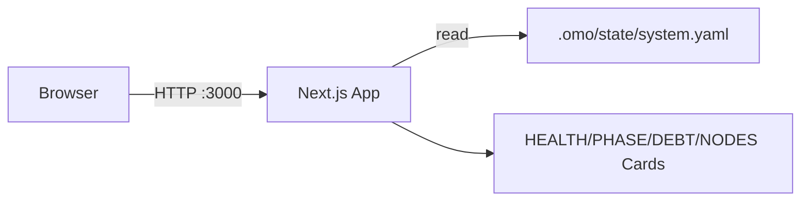

# agora-dashboard — Architecture

> **Layer**: L3 入口层  
> **Role**: Web 可视化大盘 — cockpit 的 Web 视图扩展（只读观察 OMO 状态）  
> **Stack**: TypeScript, Next.js 16, React 19, TailwindCSS 4  
> **Health**: No test runner configured
>
> 系统全景参见：[`docs/ARCHITECTURE-DIAGRAM.md`](../docs/ARCHITECTURE-DIAGRAM.md)

---

## 1. 内部架构



## 2. 入口

| Type | Entry | Port / Notes |
|:--|:--|:--|
| HTTP dev | `npm run dev` | :3000 |
| Build | `npm run build` |  |

## 3. 核心模块

| Module | Responsibility |
|:--|:--|
| `src/app/page.tsx` | Dashboard server component reading .omo/state/system.yaml |
| `src/app/layout.tsx` | Root layout + fonts |
| `src/app/globals.css` | Cyberpunk dark theme |

## 4. 测试

```bash
cd projects/agora-dashboard && npm run lint && npm run build
```
