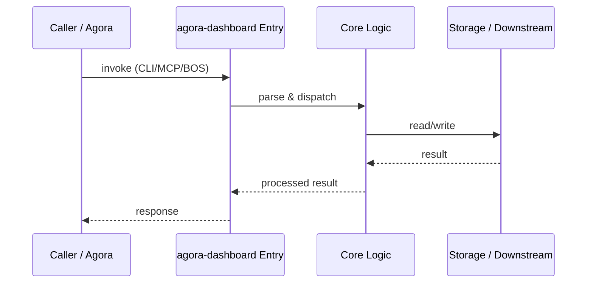

# agora-dashboard — Call Chain

> 本文档描述 agora-dashboard 内部最核心的一条调用链 / 数据流。
>
> 通用跨层调用链参见：[`docs/I0-AGORA-CALLCHAIN.md`](../docs/I0-AGORA-CALLCHAIN.md)

---

## 关键路径

1. 1. `npm run dev` starts Next.js dev server
2. 2. `page.tsx` reads `../../.omo/state/system.yaml` at request time
3. 3. Renders HEALTH_SCORE, ACTIVE_PHASE, SYS_DEBT, ACTIVE_NODES cards
4. 4. Static assets served from `public/`

## Sequence Diagram

