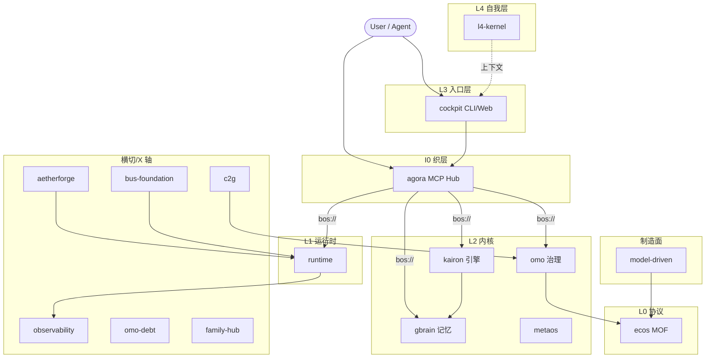

# ARCHITECTURE-DIAGRAM.md — eCOS v6 Workspace Architecture Overview

> 工作区架构概览：5 层（L0-L4）+ 4 维治理（X1-X4）+ 1 织层（I0）+ M0 制造面。
> 本文档给出层间关系与各项目入口链接，作为项目级 `ARCHITECTURE.md` 的回指目标。
> 运行时事实（健康分、测试数、服务数、端口）以各 SSOT 为准，不在此处硬编码。

## Source Of Truth

| Need | Read |
|------|------|
| 架构契约与依赖方向 | [`ARCHITECTURE.md`](../ARCHITECTURE.md) |
| 项目元数据 | [`docs/project-registry.yaml`](project-registry.yaml) |
| 派生层级表 | [`docs/generated/project-layer-index.md`](generated/project-layer-index.md) |
| BOS 服务清单 | [`projects/agora/etc/bos-services.yaml`](../projects/agora/etc/bos-services.yaml) |
| 系统全景与 BOS 路由 | [`docs/PANORAMA.md`](PANORAMA.md) |
| 调用链白盒 | [`docs/I0-AGORA-CALLCHAIN.md`](I0-AGORA-CALLCHAIN.md) |
| 架构演进路线 | [`docs/ARCHITECTURE-EVOLUTION.md`](ARCHITECTURE-EVOLUTION.md) |

## Layer Model

依赖方向（稳定契约，由 [`ARCHITECTURE.md` §2](../ARCHITECTURE.md) 拥有）：

```text
entry surfaces -> routing mesh -> engines/runtime/protocol -> governed state and evidence
```

层与项目映射（层级归属以 [`docs/project-registry.yaml`](project-registry.yaml) 为准）：

| Layer | Role | Projects |
|------|------|----------|
| L4 | 自我层 / 纯文档上下文 | [`l4-kernel`](../projects/l4-kernel/ARCHITECTURE.md) |
| L3 | 入口层（CLI / MCP / Web） | [`cockpit`](../projects/cockpit/ARCHITECTURE.md) |
| L2 | 内核（治理 / 引擎 / 记忆） | [`omo`](../projects/omo/ARCHITECTURE.md) · [`kairon`](../projects/kairon/ARCHITECTURE.md) · [`gbrain`](../projects/gbrain/ARCHITECTURE.md) · [`metaos`](../projects/metaos/ARCHITECTURE.md) |
| L1 | 运行时（健康 / 调度 / KEI） | [`runtime`](../projects/runtime/ARCHITECTURE.md) |
| L0 | 协议（MOF / M1 节点 / M2 类型 / 工具链） | [`ecos`](../projects/ecos/ARCHITECTURE.md) |
| I0 | 织层（MCP Hub / BOS 路由） | [`agora`](../projects/agora/ARCHITECTURE.md) |
| M0 | 制造面（模型驱动生成） | [`model-driven`](../projects/model-driven/ARCHITECTURE.md) |
| X  | 横切（网关 / 总线 / 观测 / 债务 / 家庭） | [`aetherforge`](../projects/aetherforge/ARCHITECTURE.md) · [`bus-foundation`](../projects/bus-foundation/ARCHITECTURE.md) · [`c2g`](../projects/c2g/ARCHITECTURE.md) · [`observability`](../projects/observability/ARCHITECTURE.md) · [`omo-debt`](../projects/omo-debt/ARCHITECTURE.md) · [`family-hub`](../projects/family-hub/ARCHITECTURE.md) |

## Workspace Diagram



## Entry Surfaces

| Audience | Entry | Contract |
|----------|-------|----------|
| Human operator | `cockpit` CLI/Web | 单一人工入口（L3） |
| AI agent | `agora` MCP via `bos://` URI | 跨层调用经织层 |
| Governance automation | `omo` CLI/MCP broker | 受治理的状态变更 |
| Web/API consumers | cockpit-mounted HTTP | 公网入口收敛于 L3 |

详见 [`ARCHITECTURE.md` §3 Entry Architecture](../ARCHITECTURE.md)。

## Governance Surfaces

```
.omo/                 -> state plane: goals, state, evidence, tasks, audits
projects/omo/         -> kernel plane: schemas, brokers, audit/lint/sync logic
projects/c2g/         -> ingress plane: strategy/pitch-to-task materialization
projects/ecos/        -> protocol plane: MOF and L0 constraints
```

## X-Axis Guarantees

| Axis | Question | Registry |
|------|----------|----------|
| X1 Audit | 操作是否可追溯且安全？ | [`.omo/_truth/x1-governance-policies.yaml`](../.omo/_truth/x1-governance-policies.yaml) |
| X2 Freshness | 状态是否足够新鲜？ | [`.omo/_truth/x2-freshness-rules.yaml`](../.omo/_truth/x2-freshness-rules.yaml) |
| X3 Value | 工作是否值得成本？ | [`.omo/_truth/x3-value-stack.yaml`](../.omo/_truth/x3-value-stack.yaml) |
| X4 Consistency | 规则与表面是否一致？ | [`.omo/_truth/x4-consistency-rules.yaml`](../.omo/_truth/x4-consistency-rules.yaml) |

## Related Documents

| Document | Role |
|----------|------|
| [`ARCHITECTURE.md`](../ARCHITECTURE.md) | 架构契约（层、依赖方向、入口、BOS 域） |
| [`docs/PANORAMA.md`](PANORAMA.md) | 系统全景与 BOS 路由 |
| [`docs/ARCHITECTURE-DETAILED-MAP.md`](ARCHITECTURE-DETAILED-MAP.md) | 架构深潜（模块、数据流、控制流） |
| [`docs/I0-AGORA-CALLCHAIN.md`](I0-AGORA-CALLCHAIN.md) | Agora BOS URI 调用链白盒 |
| [`docs/ARCHITECTURE-EVOLUTION.md`](ARCHITECTURE-EVOLUTION.md) | 架构演进路线与项目边界 |
| [`docs/FUNCTIONAL-CAPABILITY-MAP.md`](FUNCTIONAL-CAPABILITY-MAP.md) | 功能能力图（8 域 32 能力） |
| [`LAYER-INDEX.md`](../LAYER-INDEX.md) | 人类可读的层级索引 |
