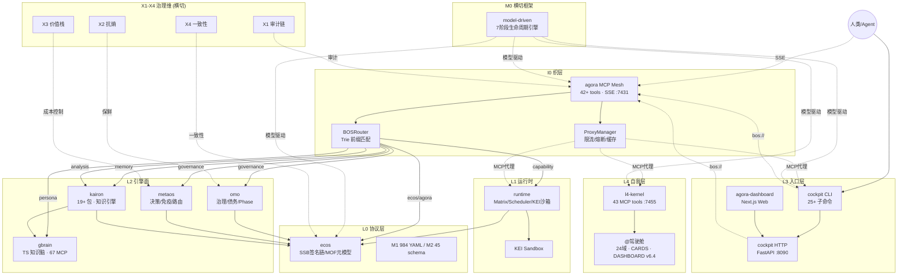
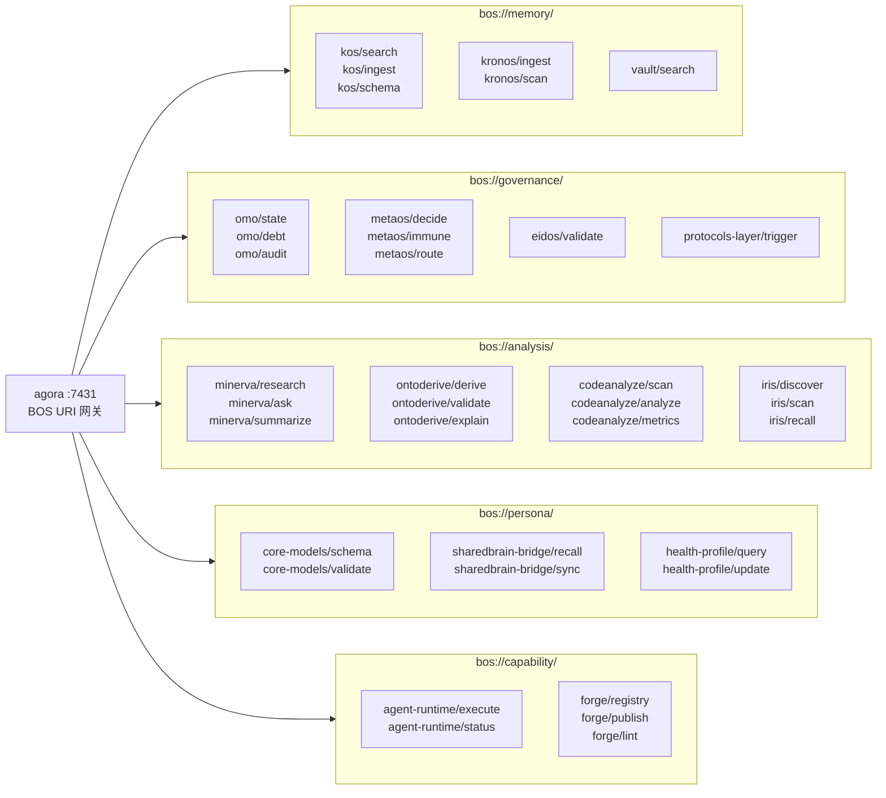
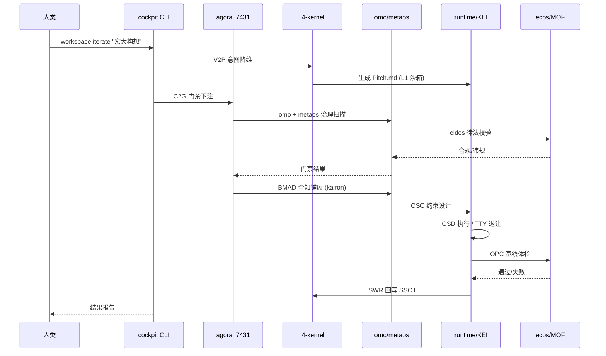
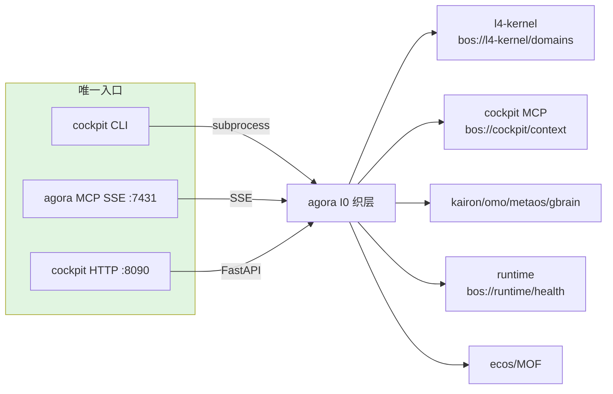

# eCOS v6 架构全景图

> 基于 5+4+1+1 架构模型 · 2026-06-16 · Phase 42
>
> 配套文档：
> - [PANORAMA.md](./PANORAMA.md) — 系统全景文字描述
> - [LAYER-INDEX.md](../LAYER-INDEX.md) — 项目分层索引
> - [I0-AGORA-CALLCHAIN.md](./I0-AGORA-CALLCHAIN.md) — I0 层调用链
> - [ARCHITECTURE-EVOLUTION.md](./ARCHITECTURE-EVOLUTION.md) — 架构演进对比

---

## 1. 5+4+1+1 拓扑总图

---

## 2. BOS URI 命名空间路由图

---

## 3. `workspace iterate` 用户旅程

---

## 4. 入口收敛后拓扑

> 已下线入口：cockpit MCP stdio、l4-kernel MCP stdio、runtime MCP stdio。

---

## 5. 分层职责速查

| 层 | 项目 | 端口 | 核心能力 |
|:--:|:--|:--:|:--|
| L4 | `l4-kernel` + `@驾驶舱` | :7455 | 24 域注册表、CARDS、KEMS 健康 |
| L3 | `cockpit` / `agora-dashboard` | :8090 | CLI/MCP/Web 入口 |
| I0 | `agora` | :7431 | BOS URI 路由、限流熔断、MCP 代理 |
| L2 | `kairon` / `gbrain` / `omo` / `metaos` | — | 知识引擎、记忆脑、治理、编排 |
| L1 | `runtime` | — | Matrix 调度、KEI 沙箱 |
| L0 | `ecos` | — | SSB 签名链、MOF 元模型 |
| M0 | `model-driven` | — | 7 阶段生命周期引擎 |
| X1-X4 | `.omo/standards/` | — | 审计、抗熵、价值、一致性 |
