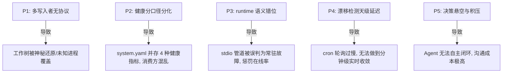

# 织星架构演进与方案设计（2026H2）

> **核心宗旨**: 一切运行时事实以 Workspace 数据面为唯一源头，让事实（Runtime Facts）彻底取代文档宣称（Narrative Claims）成为系统的第一公民。

本文基于 2026-07-02 两工作区综合审计暴露的结构性缺陷，进行系统性架构设计与演进方案设计，确立 2026H2 的落地路线图（Roadmap）。

---

## 一、 系统现状与痛点解构

经过 S1 与 S2 阶段的门禁升级，本地 GaC 已实现“提交时 + 天级”双层漂移拦截。然而，当前的工程体系依然存在如下结构性痛点：



为了彻底治本，织星架构正式确立以下演进蓝图。

---

## 二、 核心架构原则

为了保证架构演进不退化，MOF M2 元模型将增加并强制约束以下三条原则：

### 原则 A · 运行事实单源 (Single Source of Truth)
所有控制面数据（Phase 状态、健康分、服务状态等）只允许在数据面生成一次。任何 L4 意图面（如 `CLAUDE.md`、`README.md`）不得手抄运行时状态与数字，只能通过 `AUTOGEN` 视图嵌入或使用 URI 相对指针回指。

### 原则 B · 单写者模型 (Write Ownership)
任何 Workspace 关键状态文件必须在 MOF 中声明唯一的 **Write Owner**（可为特定的 Human 角色、特定的 daemon-id 或 script-id）。非 Owner 对该文件发起的写入均被判定为系统异常。

### 原则 C · 门禁即免疫 (Gate Immunity)
门禁体系从单纯的“失败拦截”（exit 1）向“自愈与预防”上演进：
- **L1 (拦截)**: 拦截非法变更；
- **L2 (自愈)**: 检测失败后自动在本地生成修复草案 commit，提供人审；
- **L3 (预防)**: 将直接文件修改收拢为唯一命令入口（CLI Brokers）。

---

## 三、 方案设计与六大工作流 (Workflows)

### WS-1: 单写者所有权机制 (Write Ownership)
为了彻底消灭未知进程或缓冲过期的编辑器对核心状态文件（如 `compass_radar.py`、`ci.yml`）的神秘覆盖（治 P1）：

1. **元模型属性扩充 (MOF)**:
   在 `projects/ecos/src/ecos/ssot/mof/m2/` 的元模型定义中引入 `write_owner` 节点：
   ```yaml
   properties:
     write_owner:
       type: string
       enum: [ human, script, daemon ]
       description: "The declared exclusive writer of the file surface."
   ```
2. **所有权注册 (M1)**:
   对高频状态面文件补全声明：
   - `.omo/state/system.yaml` -> `script:omo-state-bridge`
   - `docs/generated/*` -> `script:doc-ssot-generator`
   - `.github/workflows/ci.yml` -> `human:owner`
3. **blame 静态审计器**:
   新建 `bin/ssot/write-owner-audit.py` 静态检查工具，比对 staged 变更的提交者或文件的 mtime 修改进程是否属于声明的白名单，异常发现写入 `BRIEF.md`。

---

### WS-2: 治理健康度指标重构与在线率纠偏 (Health Refactoring)
解决健康分口径蔓延（system.yaml 并存复合分、Raw分、Debt分、X-Plane分等）以及 stdio 服务被误杀的问题（治 P2+P3）：

1. **口径废弃决议**:
   废弃 `xplane_score` 等僵尸口径，在 `system.yaml` 仅保留 `composite_score`（复合健康分）与 `dual_track`（docs 轨 + code 轨完成度）。
2. **Invocation Health (调用率健康度)**:
   针对 stdio 服务的在线率问题，修改 `port-registry.yaml` 注册属性，增加 `activation` 枚举：
   - `resident`: 常驻守护进程（如 agora-server），计入物理在线率分母；
   - `on-demand`: 管道式调用服务（如 cockpit-mcp），不计入在线率分母。针对此服务，新增 `invocation_health` 指标，读取 `agora` 调用日志近 7 天成功率。

```text
+-----------------------+      +---------------------------+
| resident daemon       | ---> | 物理在线率 (Online Ratio)  | ---> [Composite Score]
+-----------------------+      +---------------------------+
| on-demand stdio/pipe  | ---> | 调用成功率 (Success Rate)  | ---> [Composite Score]
+-----------------------+      +---------------------------+
```

---

### WS-3: 基于 launchd 的实时事件驱动生成 (WatchPaths)
消除天级/提交时检测的空窗，将漂移收敛窗口缩短至分钟级（治 P4）：

1. **launchd Plist 监听器**:
   编写 `~/Library/LaunchAgents/com.l4.governance.watch.plist`，使用 `WatchPaths` 物理监听以下关键变动面：
   - `.omo/_truth/registry/`
   - `projects/ecos/src/ecos/ssot/`
2. **Debounce 抖动缓冲**:
   事件触发后唤醒生成器，加设 30s 缓冲窗口合并批量文件修改，随后执行 `domain-sync --write` 与 `bridge-refresh`。
3. **修复草案 (Auto-fix Draft)**:
   若发生校验失败，生成器自动在本地创建隐藏的分支草稿 `draft/auto-fix-<timestamp>` 或 stash，并以链接形式置于 `BRIEF.md`，实现自愈免疫。

---

### WS-4: 决策收件箱机制 (Decision Inbox)
彻底解决决策悬空、Agent 会话交办后遗忘、代办卡片堆积等问题（治 P5）：

1. **卡片生命周期规范**:
   在卡片元数据中，若出现需要 HITL（人机协同）确认的阻断项，卡片显式声明标签：`needs-human`。
2. **BRIEF.md 收件箱合并**:
   `bin/session-brief.py` 自动扫描所有 `needs-human` 债务、`write-owner` 违规记录与超期文档，在 `BRIEF.md` 顶部生成「待决策收件箱」区块，每一项提供 **上下文链接** 和 **推荐执行命令行**。

---

### WS-5: X3 价值指标与创作发布度量 (Value Metrics)
随着系统健康度接近 100 分，传统的“防御性发现数”指标已无法体现开发人效，必须向“价值产出型指标”跃迁（治 P6）：

1. **产出足迹扫描**:
   X3 审计套件自动扫描以下目录：
   - 创意发布：`@创意创作/_outputs/` (发布数统计)
   - 工作交付：`spaces/` 下有无新的 delivery 卡片 (工作量交付)
   - 知识复用：KOS 检索命中次数与知识链长度。
2. **DASHBOARD 呈现逻辑**:
   在 [bin/gac/governance-dashboard.py](file:///Users/xiamingxing/Workspace/bin/governance-dashboard.py) 中重构，当治理健康度分数 $\ge 95$ 时，折叠技术债等防御指标，置顶显示 X3 本周价值指标（创作、交付、复用数据），实现“无感治理，突出产出”。

---

### WS-6: 会话工作流资产化 (Workflow Codification)
改变目前依赖会话隐性经验大扫除的被动局面，将“审计-修复-验证”的方法论沉淀为可执行资产（治 P7）：

1. **Workflow 注册**:
   在 `.omo/_truth/registry/agent-workflows.yaml` 中注册 `governance-audit` 标准流：
   ```yaml
   - id: governance-audit
     title: Workspace Systemic Governance Audit
     steps:
       - name: scan-baseline
         executor: bin/gac/gac-healthcheck.py --json
       - name: verify-ssot
         executor: bin/ssot/ssot-guardian.py
       - name: check-freshness
         executor: bin/gac/state-freshness-check.py
   ```
2. **冷启动挂接**:
   新会话冷启动时，Agent 检索此 workflow，直接运行 `agent-workflow start governance-audit`，即可一键复现 80% 的系统性审计覆盖面，不再依赖 prompt 隐性记忆。

---

## 四、 实施路线图 (Roadmap)

我们将架构演进拆分为 5 个核心里程碑，覆盖接下来的 180 天时间线：

```text
 M1 (T+7): 止血定位        M2 (T+30): 单写者+收件箱  M3 (T+60): 实时自愈
      │                          │                          │
      ▼                          ▼                          ▼
 ┌──────────┐               ┌──────────┐               ┌──────────┐
 │WS-1.1修复│ ------------> │WS-1 MOF  │ ------------> │WS-3 事件 │
 │ci.yml恢复│               │WS-4 BRIEF│               │自愈 L2   │
 └──────────┘               └──────────┘               └──────────┘
                                                            │
                                                            ▼
 M5 (T+180): 终态定型       M4 (T+90): 价值转向 <-----------┘
      │                          │
      ▼                          ▼
 ┌──────────┐               ┌──────────┐
 │system.yaml│ <----------- │WS-5 价值 │
 │彻底物理拆分│               │指标折叠  │
 └──────────┘               └──────────┘
```

### 4.1 里程碑规划表

| 时间窗 | 里程碑 | 主要交付物 | 验收标准 (Acceptance Gate) |
|--------|--------|------------|----------------------------|
| **T+7** | M1 止血 | WS-1.1 排查结论；`ci.yml` 正常恢复；`compass_radar.py` 合并 | 恢复被意外回滚的工作区状态，`gac-local-gate` 保持静默通过。 |
| **T+30** | M2 单写者与决策收件箱 | MOF `write_owner` schema 落地；`write-owner-audit.py` 上线；`BRIEF.md` 决策箱上线 | 注入非 owner 写入会触发 BRIEF 异常；BRIEF「待决策」区块呈现所有 `needs-human` 项。 |
| **T+60** | M3 实时自愈与事件驱动 | launchd 监听 Plist 部署；`WatchPaths` Minute级自愈；`governance-audit` 标准工作流资产化 | 修改 `registry.yaml` 后 60s 内自动收敛；新冷启动会话运行标准流可复现 audit 过程。 |
| **T+90** | M4 价值转向 | X3 三项指标入 BRIEF；`governance-dashboard.py` 指标折叠逻辑上线；混沌演练机制首跑 | 治理分 $\ge 95$ 时，折叠技术债，置顶显示价值行；手动注入漂移，混沌演练能成功报警并自动生成修复草案。 |
| **T+180** | M5 终态定型 | `system.yaml` 彻底拆分并完成 7 个消费方改造；KEMS 升级为 7.5 版本 | 控制面与数据面完全分离；所有架构图与入口 100% 对应；年度审计零违例。 |

### 4.2 运行节律 (Cadence)
- **日频**: launchd 事件触发自愈，cron 天级兜底；
- **周频**: 人工消费 BRIEF 决策收件箱（≤ 5 分钟）；
- **月频**: 废除僵尸门禁，调整指标权重；
- **季频**: 运行混沌注入演练，进行架构真实性审计。

---

## 五、 风险与对策

| 风险点 | 影响评估 | 对策措施 |
|--------|----------|----------|
| **回滚源未查明前导致修改丢失** | 高 (阻断开发) | 在 WS-1.1 止血完成前，冻结 `compass_radar.py` 与 `ci.yml` 类文件修改，提交后立刻通过 git history 复查。 |
| **WatchPaths 诱发无限调用风暴** | 中 (性能损耗) | launchd 调用的脚本内置 debounce 逻辑（30秒缓冲窗口），并且生成器的写入必须是幂等的。 |
| **自动修复 commit 产生历史污染** | 低 (管理混乱) | 自动修复仅保存在 `stash` 或临时分支中，**绝对不允许**自动运行 `git push` 到远端，必须由人工审核后 cherry-pick 合入。 |
| **价值指标导致刷分行为 (Goodhart's Law)** | 中 (失去指标意义) | 价值指标（创作、交付、复用数）只做 BRIEF 可视化展示，**不计入**健康分权重，阻断任何刷分激励。 |
