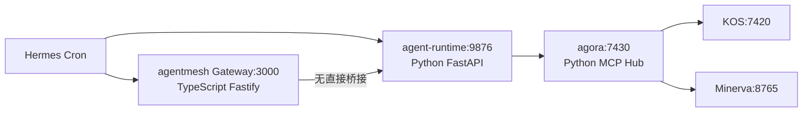
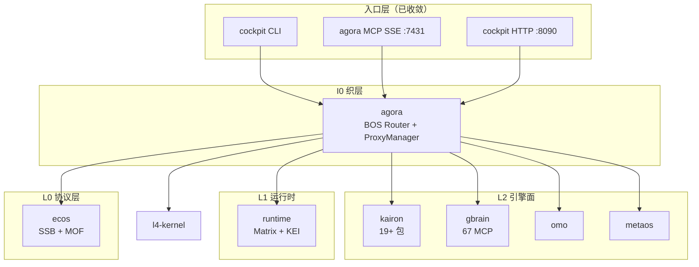
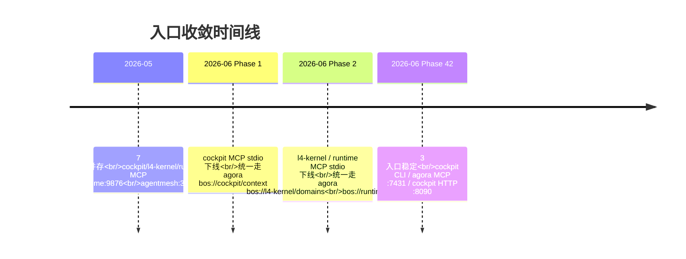

# 架构演进对比：2026-05 收敛提案 vs eCOS v6 当前状态

> 基准文档：
> - 历史提案：`.omo/standards/ARCHITECTURE_CONVERGENCE.md`（2026-05-28）
> - 当前架构：`docs/PANORAMA.md`、`LAYER-INDEX.md`、`.omo/state/system.yaml`
>
> 对比时点：2026-06-16 · Phase 42

---

## 1. 拓扑对比

### 1.1 历史提案（2026-05-28）

- **三个独立运行时**：`agent-runtime:9876`（Python 任务执行）、`agentmesh Gateway:3000`（TS 多 Agent 编排）、`agora:7430`（Python MCP Hub）；
- **agent-runtime 与 gateway 无直接桥接**，形成孤岛；
- **12 个 cron jobs** 直接调用 `agent-runtime:9876`；
- 知识管线：KOS / Minerva / Sophia / OntoDerive / Pallas 等并存但松耦合。

### 1.2 当前 eCOS v6（2026-06-16）

- **入口收敛为 3**：cockpit CLI、agora MCP :7431、cockpit HTTP :8090；
- **agent-runtime HTTP:9876 不再作为独立入口**，其能力被拆入 `projects/runtime/`（L1 运行时）；
- **agora 从"MCP Hub"升级为 I0 织层**，强制所有跨层调用走 `bos://`；
- **新增 M0 横切框架 `model-driven`**，提供 7 阶段生命周期引擎；
- **新增 X1-X4 治理维**，作为贯穿所有层的约束面。

---

## 2. 关键差异表

| 维度 | 2026-05-28 提案 | eCOS v6 当前 | 状态 |
|:--|:--|:--|:--:|
| **架构模型** | 三层网关 + 任务执行器 | 5+4+1+1（L0-L4 + I0 + M0 + X1-X4） | ✅ 已收敛 |
| **Agent 入口** | agent-runtime:9876 / agentmesh:3000 / agora:7430 | agora MCP :7431 | ✅ 已收敛 |
| **人类入口** | Hermes / cockpit CLI | cockpit CLI + cockpit HTTP :8090 | ✅ 已收敛 |
| **跨层调用** | 直接 HTTP / MCP / subprocess | 强制 `bos://` URI 经 agora 路由 | ✅ 已收敛 |
| **agent-runtime** | 独立 Python FastAPI :9876 | 能力并入 `projects/runtime/`（L1） | 🟡 部分收敛 |
| **agentmesh Gateway** | TypeScript Fastify :3000 | 未出现在当前 LAYER-INDEX 核心层 | 🟡 待确认 |
| **Agora 定位** | Python MCP Hub :7430 | I0 织层：路由/限流/熔断/缓存/审计 | ✅ 已升级 |
| **MOF 元模型** | 存在但非核心 | L0 协议层核心：984 M1 / 45 M2 | ✅ 已强化 |
| **model-driven** | 未出现 | M0 横切框架：7 阶段生命周期 | ✅ 已新增 |
| **治理框架** | OMO 治理 + 债务 | X1-X4 四维 + OMO + AppendOnlyLog 5 consumer | ✅ 已扩展 |
| **cron jobs** | 12 个 cron 调 agent-runtime | runtime scheduler + Hermes cron 混合 | 🟡 迁移中 |
| **BOS URI** | 初步概念 | 34+ 条已实现路由 + Trie 索引 | ✅ 已落地 |

---

## 3. 组件收敛状态

### 3.1 已完全收敛

| 组件 | 收敛方式 |
|:--|:--|
| cockpit MCP stdio | 下线，走 `bos://cockpit/context` |
| l4-kernel MCP stdio | 下线，走 `bos://l4-kernel/domains` |
| runtime MCP stdio | 下线，走 `bos://runtime/health` |
| agora web/dashboard | 并入 cockpit / agora-dashboard |
| kairon-governance | 并入 `omo` |
| SharedBrain 原始目录 | 归档至 `_archived/SharedBrain-original/` |
| agent-runtime HTTP API | 能力迁移至 `runtime` |

### 3.2 部分收敛 / 仍需关注

| 组件 | 历史角色 | 当前状态 | 遗留项 |
|:--|:--|:--|:--|
| **agent-runtime** | Python 任务执行器 :9876 | 并入 `projects/runtime/` | 12 个 `task_definitions/*.json` 是否全部迁移到 runtime scheduler 待确认 |
| **agentmesh Gateway** | TypeScript Fastify :3000 | 不在当前核心层索引中 | 是否已归档、合并到 agora-dashboard，或作为独立项目仍在运行需确认 |
| **Hermes Cron** | cron 调度入口 | 仍驱动部分任务 | 与 runtime 内置 scheduler 的边界待明确 |

### 3.3 新增核心组件

| 组件 | 角色 | 出现阶段 |
|:--|:--|:--|
| `model-driven` | M0 横切框架，7 阶段生命周期 | Phase 33+ |
| `l4-kernel` | L4 自我层统一管理面 | Phase 34+ |
| `BOSRouter` | agora 内 Trie 路由索引 | Phase 45 W2 |
| `AppendOnlyLog` 5 consumer | OMO 审计/指标/同步/告警/事件 | Round 1-5 收口 |
| `X1-X4` 治理维 | 审计/抗熵/价值/一致性 | Phase 42 强化 |

---

## 4. 入口收敛历程

---

## 5. 结论

- **已达成**：eCOS v6 完成了从"多网关孤岛"到"5+4+1+1 大一统分层"的跃迁；入口收敛、BOS URI 路由、MOF 元模型、X1-X4 治理维均已成为系统基石。
- **遗留风险**：`agent-runtime` 的历史 cron 任务与 `agentmesh Gateway:3000` 路径是否完全收敛到 `runtime`/`agora` 仍需审计；建议在 Phase 43 前做一次「legacy runtime 能力完整性检查」。
- **下一步建议**：
  1. 扫描 `projects/runtime/` 是否已接管全部 12 个 `task_definitions/*.json`；
  2. 确认 `agentmesh Gateway` 当前状态（归档/独立/合并）；
  3. 将本对比文档结论注册为 OMO Debt 或 planned task。

---

## 6. 参考索引

| 文档 | 路径 | 用途 |
|:--|:--|:--|
| 历史收敛提案 | `.omo/standards/ARCHITECTURE_CONVERGENCE.md` | agent-runtime / agentmesh / agora 三足鼎立分析 |
| 当前全景 | `docs/PANORAMA.md` | eCOS v6/v6 系统全景 |
| 分层索引 | `LAYER-INDEX.md` | 项目与域映射 |
| I0 调用链 | `docs/I0-AGORA-CALLCHAIN.md` | agora BOS URI 9 步路由链 |
| 架构图 | `docs/ARCHITECTURE-DIAGRAM.md` | Mermaid 可视化 |
