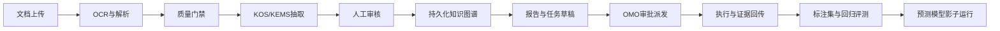

# KEMS 生产化实施方案

> 状态：实施中，进入集成预生产
> 更新：2026-08-03
> 范围：OCR 质量治理、正式 UI/表单、持久化知识图谱、OMO 任务派发、真实标注评测集、预测模型
>
> 本文定义实施顺序、系统边界、数据契约和放行条件。它不把目标指标冒充为当前能力，也不把真实业务材料放入代码仓库。

## 1. 目标与当前阶段

KEMS 当前已经具备受控导入、政策分析、运行记录、证据绑定、OCR 质量治理、正式审核工作台、持久化图谱、OMO 草稿适配、真实标注队列、评测 manifest 和 shadow 预测候选实现。当前处于“工程闭环已贯通、生产放行未完成”的阶段：

```text
文档 -> 解析 -> 规则分析 -> 证据化结果 -> 运行记录
                                      |
                                      +-> 人工/模型增强
```

M1～M6 的工程基础已落地到 Kairon/KOS、Cockpit 和 Runtime：`kems.ocr-quality.v1` 提供 OCR 页级质量、指标门禁和 `pass/review/reject` 状态；Cockpit 提供 OCR 审核与图谱工作台；KEMS 提供持久化图谱、双人标注与 adjudication 约束、`kems.evaluation-manifest.v1`、候选模型 shadow 评测、manifest-bound Shadow Evaluation 报告和生产 preflight。生产 preflight 现在还显式要求 `kems.persistence-recovery-evidence.v1`，证明 PostgreSQL 备份/恢复演练和图谱快照可恢复。真实源队列目前已具备结构化标签回执与双人/adjudication 队列，但仍等待真实低风险样本完成复核和脱敏 manifest；生产连接器和 OMO 批准仍未提供，因此不能宣称真实业务准确率或生产动作已开放。

当前实现与验收证据集中记录在本机物理路径 `/Users/xiamingxing/Documents/@驾驶舱/_knowledge/20-operations/2026-07-31-BOS多源私有知识神经网落地验收与上线闸门报告.md`；生产前置检查入口见 `projects/runtime/scripts/kems_production_preflight.py`。

本轮目标是把它推进到可审计的业务闭环：



## 2. 目标架构与职责

| 层 | 责任 | 明确不负责 |
| --- | --- | --- |
| KOS/KEMS | 解析、抽取、证据、领域分析、图谱写入 | 不绕过 OMO 直接执行任务 |
| Cockpit | 正式 UI、表单、审核工作台、图谱和评测看板 | 不自行维护任务状态机 |
| OMO | 审批、派发、执行、验收、证据回写 | 不解释业务文档内容 |
| Aetherforge | 模型路由、模型版本、调用审计、成本 | 不持有业务事实主数据 |
| Evaluation | 标注集、基准、回归、失败案例 | 不把演示 fixture 当生产准确率 |

生产环境建议使用 PostgreSQL 作为图谱权威存储，SQLite 继续用于本地开发和离线缓存。第一阶段不引入 Neo4j；只有关系查询和图遍历成为实际瓶颈时，才重新评估专用图数据库。

## 3. 统一运行契约

所有文档、分析、审核、任务和预测操作都必须产生可追踪的 `run_id`，并关联原始文件哈希、版本、模型和证据。

```yaml
run_id: kems-run-<uuid>
scenario_id: policy-analysis|ocr-review|graph-extract|task-draft|forecast
request_id: <request-id>
source_sha256: <sha256>
source_version: <version-id>
status: pending|running|review|approved|rejected|completed|failed
model:
  provider: rules|aetherforge|local
  model_id: <model-id>
  model_version: <version>
evidence_refs: []
review_state: not_required|pending|approved|rejected
audit_ref: <audit-id>
created_at: <timestamp>
```

统一 API 响应至少包含：`run_id`、`source_sha256`、`model_version`、`evidence_refs`、`review_state`、`audit_ref`、`next_action`。

生产持久化放行必须额外提交 `kems.persistence-recovery-evidence.v1`：仅允许
PostgreSQL 备份/恢复演练的安全元数据和 `vault://evidence/` 引用，要求源图谱与恢复后图谱
快照 SHA-256 一致，实际 RPO/RTO 不超过目标，并注明验证方法。证据缺失、泄露 DSN/凭据/原文
或校验不一致时，preflight 与 closeout 均保持 fail-closed，M3/G2 不得标记通过。

## 4. OCR 质量治理

### 4.1 实施链路

1. 原文件进入隔离区并计算 SHA-256。
2. OCR、版面分析、表格识别分别记录引擎和版本。
3. 产出页级、字段级和表格级质量指标。
4. 低质量页面进入 Cockpit 人工校正队列。
5. 校正结果进入评测集候选池，不直接覆盖原始 OCR。
6. 未通过质量门禁的内容不得自动写入图谱或生成任务。

### 4.2 OCRRun 契约

```yaml
run_id: ocr-<uuid>
document_id: doc-<id>
engine: mineru|arkcli|local-ocr
model_version: <version>
page_metrics:
  - page: 1
    text_confidence: 0.97
    layout_confidence: 0.91
    table_confidence: 0.84
quality:
  cer: 0.03
  field_accuracy: 0.96
  table_cell_f1: 0.93
status: pass|review|reject
evidence_refs: []
```

首轮目标值需要用真实样本校准，建议初始门槛为：印刷体 CER 不高于 3%，扫描件 CER 不高于 8%，关键字段准确率不低于 95%，表格单元格 F1 不低于 90%。

### 4.3 必须交付

- OCR 质量报告生成器。
- 页面/字段/表格级人工审核队列。
- 失败案例分类：漏字、错字、版面错位、表格错列、跨页错误。
- 引擎和模型版本回归比较。
- 质量未达标自动转 `review`，禁止静默通过。

## 5. 正式 UI 与表单

在 Cockpit 增加 KEMS 工作台，不新建孤立前端。首期页面为：

1. **文档收件箱**：上传、分类、质量分、负责人、处理状态。
2. **OCR 审核页**：原文与识别结果并排显示，支持逐字段修订。
3. **业务表单**：政策、问题、整改、会议任务、风险事项使用独立 schema。
4. **图谱页面**：实体、关系、来源证据、时间和历史版本。
5. **任务草稿页**：从分析结果生成 OMO 草稿，人工确认后派发。
6. **评测页面**：数据集版本、模型对比、失败样本和回归报告。
7. **预测页面**：只展示影子预测、置信区间、基线和人工反馈。

表单原则：

- 所有写操作幂等。
- 所有事实可定位到来源页、坐标或文本片段。
- 高风险操作必须人工确认。
- UI 必须展示审核状态、证据和模型版本。
- 失败操作可重试，历史运行记录不可覆盖。

## 6. 持久化知识图谱

### 6.1 数据表

首期使用关系型图谱模型：

```text
documents
document_versions
entities
entity_aliases
relations
evidence_spans
extraction_runs
review_decisions
task_links
graph_snapshots
```

### 6.2 实体/关系约束

```yaml
entity_id: ent-<uuid>
entity_type: organization|policy|indicator|problem|task|person
canonical_name: <name>
source_document_id: <document-id>
source_version_id: <version-id>
evidence_span: <page-or-offset>
confidence: 0.93
review_state: machine|human_verified|rejected
valid_from: <timestamp>
valid_to: <timestamp-or-null>
created_by_run: <run-id>
```

没有来源证据的实体和关系不得进入权威图谱。实体合并必须保留别名、原始 ID、合并理由和审核记录；图谱更新采用追加版本，不能破坏历史查询。

### 6.3 验收目标

- 图谱事实证据覆盖率 100%。
- 任一节点可以反查文档、版本、运行和审核记录。
- 重建同一输入可以得到相同版本结果。
- 关系支持有效期和失效，不把历史事实当当前事实。

## 7. OMO 任务派发

KEMS 只生成任务草稿，OMO 接管状态机：

```text
task_draft -> planned -> approved -> dispatched -> executing -> verified -> closed
```

任务适配器输入：

```json
{
  "source_run_id": "kems-run-001",
  "task_type": "整改",
  "title": "...",
  "owner": "...",
  "due_at": "...",
  "priority": "P1",
  "evidence_refs": [],
  "graph_refs": [],
  "approval_required": true
}
```

派发门禁：没有证据不能建任务；高风险任务不能自动激活；负责人、截止时间和验收标准不能为空；`source_run_id + task_key` 必须幂等；完成证据必须回写 KEMS。

建议接口：

```text
POST /api/kems/tasks/draft
POST /api/kems/tasks/{id}/approve
POST /api/kems/tasks/{id}/dispatch
GET  /api/kems/tasks/{id}
```

## 8. 真实标注评测集

评测集是全项目第一优先级，必须与 OCR 治理并行启动。首批建议 100～300 份真实、脱敏、覆盖异常类型的材料。

```text
evaluation/
  manifests/
  raw/              # 不入 Git
  redacted/
  annotations/
  splits/
  reports/
  failure-cases/
```

标注任务包括：OCR 页面文字和表格、文档分类、实体关系、行动项、负责人、期限和结果指标。

规则：

- 原始材料不进入 Git。
- 数据集必须有版本、来源、脱敏记录和访问权限。
- 关键样本双人标注或抽样复核。
- 测试集按时间或组织切分，禁止随机泄漏。
- 测试集不得用于提示词调优。
- 每次引擎、模型或提示词变更自动回归。

## 9. 预测模型

预测先做影子运行，不能直接触发行政处置。候选场景包括指标趋势、整改逾期、问题复发、机构风险分层和任务完成周期。

实施顺序：

1. 规则和统计基线。
2. 季节性朴素预测、线性模型和树模型。
3. 数据量足够后再评估时序深度模型。
4. 注册模型版本、特征、训练时间和数据范围。
5. 返回置信区间、基线差异和解释字段。
6. 连续评测周期稳定优于基线后，再进入小范围辅助决策。

禁止用未审核 OCR 训练，禁止未来数据泄漏，禁止预测结果自动触发高风险任务。

## 10. 里程碑

| 里程碑 | 周期 | 交付物 | 放行条件 |
| --- | --- | --- | --- |
| M0 基础契约 | 1～2 周 | 数据分级、权限、运行和证据契约 | 契约评审通过 |
| M1 OCR 治理 | 2～4 周 | OCRRun、质量门禁、审核队列 | 低质输入自动拦截 |
| M2 真实评测集 | 2～5 周并行 | 标注规范、首批样本、基准工具 | 样本脱敏且可复现 |
| M3 图谱持久化 | 4～6 周 | 图谱表、版本、证据和审核 | 可反查、可重建 |
| M4 正式 UI | 4～6 周 | 收件箱、审核、表单、图谱、任务页 | 全链路人工可操作 |
| M5 OMO 派发 | 2～4 周 | 适配器、审批、执行证据回写 | 幂等且无无证据任务 |
| M6 预测影子 | 4～6 周 | 基线、回测、模型注册、看板 | 稳定优于基线 |
| M7 试点收口 | 2 周 | 演练、问题清单、上线评审 | G1～G4 全部通过 |

### 10.1 当前状态

| 里程碑 | 工程状态 | 当前缺口 |
| --- | --- | --- |
| M0 基础契约 | 已落地 | 持续按 SSOT 与运行证据维护 |
| M1 OCR 治理 | 已落地 | 需要真实业务样本持续校准阈值 |
| M2 真实评测集 | 工具、双人标注队列与 Workflow Mesh manifest 材料化通路已落地 | 真实低风险消费者仍需产生双人标注、adjudication 和脱敏样本；当前不等同于已有真实评测集 |
| M3 图谱持久化 | 工程能力已落地 | 生产 PostgreSQL 备份/恢复演练及 `persistence-recovery-evidence` 待业务/运维执行 |
| M4 正式 UI | 核心工作台已落地 | 业务表单和评测看板仍需按试点场景扩展 |
| M5 OMO 派发 | 草稿、审批契约和生产等价测试已落地 | 真实 OMO 批准任务与企业 ReachBridge 仍待接入 |
| M6 预测影子 | 候选预测器、manifest 绑定、acceptance 校验和 Shadow Evaluation 报告契约已落地 | 依赖真实低风险消费者形成可复现的 adjudicated manifest 后才能形成真实 acceptance；报告仍保持激活禁止 |
| M7 试点收口 | 未完成 | 生产 preflight/closeout fail-closed；G1～G4 与外部恢复证据齐备后执行 |

总周期预估 12～16 周。M1、M2、M3、M4 可部分并行；M5 依赖图谱主键和证据契约稳定；M6 依赖真实评测集。

## 11. 全局放行门

### G1 数据可用

真实样本已脱敏，标注规范冻结，正常和异常样本均有覆盖，原始材料不进代码库。

### G2 结果可信

低质量 OCR 自动拦截，事实均有证据，人工修改可审计，图谱可按版本重建。

### G3 流程可执行

Cockpit 可以审核和追踪，OMO 任务不会重复派发，完成证据可回写，失败可以安全重试。

### G4 模型可上线

预测连续回测优于基线，置信度和失败案例透明，先影子运行，不拥有自动高风险处置权限。

## 12. 首批实施拆分

本轮先做四项基础交付：

1. 冻结统一 `run_id`、证据、审核状态和模型版本契约。
2. 落地 OCRRun 质量报告和评测样本目录规范。
3. 把现有 KEMS 路线图升级为 M0～M7 里程碑视图。
4. 为 Cockpit、图谱和 OMO 保留稳定的 API 边界。

后续代码实现必须从契约测试开始，再进入 KOS、Cockpit 和 OMO 子模块，避免六条链路各自定义一套状态和 ID。

### 12.1 Phase 63 Shadow Evaluation 运行约束

Phase 63 将候选模型评测收敛为一个显式的、可重复的离线报告步骤。运行必须同时提供 `run_id`、`scenario_id`、
脱敏且 `adjudicated` 的 `kems.evaluation-manifest.v1`、脱敏数值输入和候选模型标识；输入 `case_id` 必须与 manifest
中的 `sample_id` 精确一致。输出 `kems.shadow-evaluation-report.v1` 只保留 manifest SHA、输入 SHA、样本 ID、基线对比、
模型策略和控制面，不保留原文、OCR、prompt 或模型自由文本。

报告的 `controls` 必须固定表达 `activation=forbidden`、`provider_invocation=false`、`workflow_run_creation=false` 和
`automatic_promotion=false`。`shadow_pass` 仅表示在绑定数据上的离线指标满足阈值，不是生产放行，也不会自动改变 Workflow Mesh
准入、任务状态或外部资源路由。真实业务运行前，仍需完成低风险消费者、真实回执、双人标注、adjudication、脱敏 manifest 和人工审批。

### 12.2 Phase 64 真实工程交付消费者

先选工程研发交付作为低风险、可验证的真实元数据场景：消费已合并 PR、请求/合并时间、merge SHA、CI/PR 证据引用和对应 WorkflowRun，
不读取业务原文，不调用外部 provider，不创建运行，不触发任务派发。入口为 OMO 的
`consume-engineering-delivery --workflow-run-id <id> --stdin`，输入是脱敏的交付摘要；输出同时落
`external-connection-receipt/v1` 和 `outcome-feedback/v1`，以统一 `scene_id/journey_id/outcome_metric` 关联到 Mesh。

运行顺序必须是：

```text
WorkflowRequested(scene-bound) -> admitted -> succeeded
  -> consume merged delivery -> receipt + outcome feedback
  -> human verification -> PRMerged -> closed
```

消费者是幂等的，重复消费不增加证据或反馈记录；输入不完整、场景不匹配、WorkflowRun 未成功或已进入后续状态但缺少既有
receipt 时 fail-closed。该消费者只证明“真实工程交付元数据可以回到证据链并被人消费”，不证明业务价值，也不解除 M2/M6 门槛。
下一轮应在此接口上接入真实责任人的人工 `reviewed/adopted` 反馈，再将同一批真实 run 纳入双人标注和 adjudicated manifest。

### 12.3 Phase 65 工程交付人工复核与运营队列

Phase 65 将机器摄取与人工消费拆开：`consume-engineering-delivery` 的唯一初始反馈状态为 `submitted`，不得通过参数伪造
`reviewed` 或 `adopted`。责任人必须使用 `review-engineering-delivery`，提供稳定 actor、复核时间、决策和复核证据引用；反馈仍复用
`outcome-feedback/v1`，因此能够沿同一 `workflow_run_id/outcome_id` 追加并保持幂等。

`engineering-delivery-review-queue` 是只读运营投影，输出待复核数量、最新决策、WorkflowRun 状态、receipt、交付时长和证据数量，
后续正式 UI 直接消费该投影。它不改变 Workflow Mesh 状态、不执行 OMO 派发、不调用 provider；只有真实责任人的连续反馈完成后，
才可把样本送入双人标注、adjudication 和脱敏评测 manifest。

操作顺序固定为：

```text
omo external-resources consume-engineering-delivery --workflow-run-id <id> --stdin
  -> omo external-resources engineering-delivery-review-queue --json
  -> omo external-resources review-engineering-delivery --workflow-run-id <id> --actor <human-ref> --stdin
```

摄取输入只允许交付 ID、仓库引用、PR、merge SHA、时间和证据引用；人工复核输入只允许交付 ID、决策、复核时间和复核证据引用。
原文、prompt、模型输出、凭据和任意外部 provider 数据均不得进入这两个入口。

### 12.4 Phase 66 Cockpit 工程交付复核工作台

Phase 66 将人工复核能力放入 Cockpit 的既有 Workflow Mesh 入口，形成可供后续 UI 表单直接消费的 L3 契约：

```text
GET  /api/workflow-mesh/engineering-delivery/review-queue
POST /api/workflow-mesh/engineering-delivery/review
```

队列接口只投影 OMO 的真实 receipt、WorkflowRun 状态、反馈阶段、最新决策、交付时长和证据数量，支持按
`workflow_run_id` 限定范围；复核接口只接收有限 envelope，并将 `actor_ref` 从业务载荷中分离后交给 OMO broker。
Cockpit 不直接写 `.omo`，也不持有人工状态真相。两个接口均返回无 provider、无 WorkflowRun 变更、无自动晋升的控制面，
OMO 不可用或 envelope 不合法时 fail-closed 地返回结构化错误。

这一步完成“可操作的人类入口”，但不等于真实业务场景已经验证。下一步仍需由责任人连续提交真实低风险工程交付反馈，
再将通过复核的样本送入双人标注、adjudication、脱敏 manifest 和 shadow evaluation。

### 12.5 Phase 67 Cockpit UI 工程交付复核工作台

Phase 67 在 Cockpit 中新增独立的工程交付复核页面，承接 Phase 66 的两个 L3 API，不重新实现 OMO 状态机。页面提供：

1. 队列摘要：交付总数、待复核、已复核及决策分布。
2. 收件箱列表：交付 ID、WorkflowRun、Workflow 状态、场景绑定、交付时长和证据计数。
3. 详情和表单：责任人引用、`reviewed/adopted/rejected` 决策、复核时间和证据引用。
4. 控制面提示：只读队列、WorkflowRun 不变更、provider 不调用、自动晋升关闭。

页面只提交以下窄 envelope：

```json
{
  "workflow_run_id": "run-...",
  "actor_ref": "operator://...",
  "delivery_id": "delivery-...",
  "decision": "reviewed|adopted|rejected",
  "reviewed_at": "2026-08-04T00:00:00Z",
  "evidence_refs": ["evidence://..."]
}
```

UI 不读取 `.omo` 原始日志、不保存自由文本、不直接改状态，也不把“已采纳”展示为模型或业务自动放行。它只证明工程交付元数据具备可操作的人机复核链路；
真实业务试点仍需满足 G1～G4，并补齐真实样本、双人标注、裁决、恢复证据和人工上线评审。

### 12.6 Phase 68 工程交付真实样本与双人标注入口

Phase 68 选择工程交付作为当前唯一低风险 dogfood 数据源：不是读取业务私有原文，而是消费 OMO 已形成的、经过人工复核的
工程交付元数据投影。Kairon 新增 `kems_sync_engineering_delivery_queue.py`，在输入边界检查
`engineering-delivery-review-queue/v1`、固定场景绑定、只读控制面和稳定交付字段，仅将 `review_status=reviewed` 的行转换为
`kems.adjudication-queue.v1` 的 pending 样本。

该转换不把 `adopted` 当成标签真值。样本只带确定性的 sample ID、source SHA-256、脱敏 `vault://redacted/` 引用、场景和 split；
真正的 `delivery_quality`、`evidence_sufficiency`、`workflow_alignment` 和 `requires_follow_up` 必须由两名独立标注员分别提交，
再由第三名独立裁决者确认。没有两份独立标注和明确裁决，不得生成 `kems.evaluation-manifest.v1`。

当前 M2 放行状态仍是“真实样本入口已落地，真实标注与裁决待执行”；这一步不代表已经获得业务准确率，也不开放模型训练、预测晋升或 OMO 自动派发。

### 12.7 Phase 69 KEMS 持久化健康与恢复闭环

Phase 69 为 KEMS 的 OCR、标注、评测、运行检查点和 shadow 预测 SQLite 存储补齐统一的只读运行态检查与恢复入口。健康报告只输出数据库路径、完整性结果、外键违规数、表名、行数和文件权限，不读取或导出任何正文、OCR、prompt、模型自由文本或私有载荷。

```bash
PYTHONPATH="$KAIRON_ROOT/packages/kos/src" \
  uv run --project "$KAIRON_ROOT" python \
  "$KAIRON_ROOT/scripts/kems_health_check.py" \
  --database adjudication="$HOME/.kems/adjudication.sqlite" \
  --database ocr="$HOME/.kems/ocr.sqlite" \
  --database model_acceptance="$HOME/.kems/model-acceptance.sqlite"
```

备份和恢复使用 SQLite 原生 backup API，写入临时文件、设置 0600 权限、原子替换，并在落盘后再次执行完整性检查。已存在的目标默认拒绝覆盖，恢复必须显式提供 `--force`。恢复后的数据库仍需通过健康检查，未通过则不得继续生成 manifest 或执行 shadow 评测。

该阶段只完成“可检查、可备份、可恢复、可重放”的生产基础，不改变 `shadow`、`blocked_until_omo_approval` 和 `provider_invocation=false` 等放行边界；下一步才是把健康摘要接入 Cockpit/外部资源目录，并建立真实 OCR 质量样本与预测 shadow 运行的连续指标。

### 12.8 Phase 71 重复 Shadow 评测与模型晋级门禁

Phase 71 在已有单次 `kems.model-acceptance.v1` 之上增加 `kems.model-promotion-gate.v1`。它接收多次、脱敏、同一
`dataset_id`、`dataset_version` 和 `evaluation_manifest_sha256` 绑定的 shadow 报告，重新计算加权 MAE 和相对提升，并同时检查：

- 最低 shadow 运行次数和最低观测量；
- 每次运行都必须是 `shadow_pass`，且提升不低于门槛；
- 报告中的相对提升必须与 `model_mae`/`baseline_mae` 一致；
- 报告不能重复，不能跨 manifest 混用，不能携带原文、prompt 或模型自由输出。

根仓 Kairon 提供 `scripts/kems_model_promotion_gate.py`，结果只有 `blocked` 或 `eligible_for_human_approval`。后者只是进入人工/OMO
审批的资格投影，仍固定 `promotion=blocked_until_omo_approval`、`automatic_promotion=false`，不会写模型注册表、改变路由、创建 WorkflowRun
或触发外部 provider。

运行链路收敛为：

`redacted manifest -> repeated shadow reports -> weighted metrics/reproducibility gate -> human/OMO approval -> canary -> rollback`

真实业务准确率仍需真实低风险消费者持续产生样本后才能声明；fixture 通过只证明门禁逻辑正确。

### 12.9 Phase 72 场景化生产策略

KEMS 的后续生产化不以继续增加模型或抽取能力为目标，而以一个真实、低风险、每周重复的业务旅程为目标。建议先从资料/邮件/待办到决策收件箱开始：KEMS 负责结构化和候选建议，OMO 负责任务与审批，Workflow Mesh 负责执行和证据，Cockpit 负责人工复核，结果再回流为真实标注和评测样本。

在没有持续真实消费者、真实标注裁决、脱敏 manifest 和人工/OMO 批准前，KEMS 继续保持 shadow 和 proposal-only。跨模块边界与 36 个月落地路线见
[`docs/ARCHITECTURE-STRATEGY-CLOSEOUT-2026-08.md`](ARCHITECTURE-STRATEGY-CLOSEOUT-2026-08.md)。
