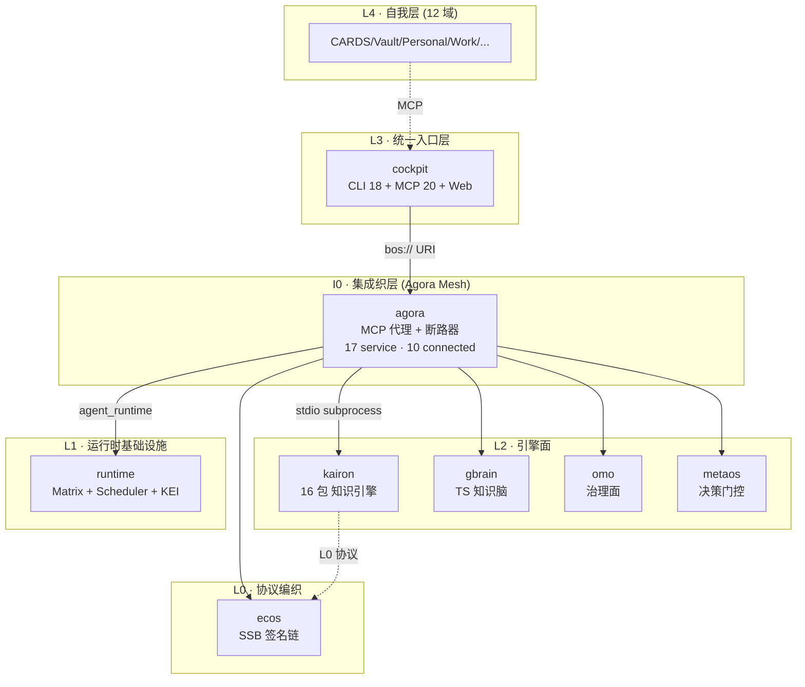
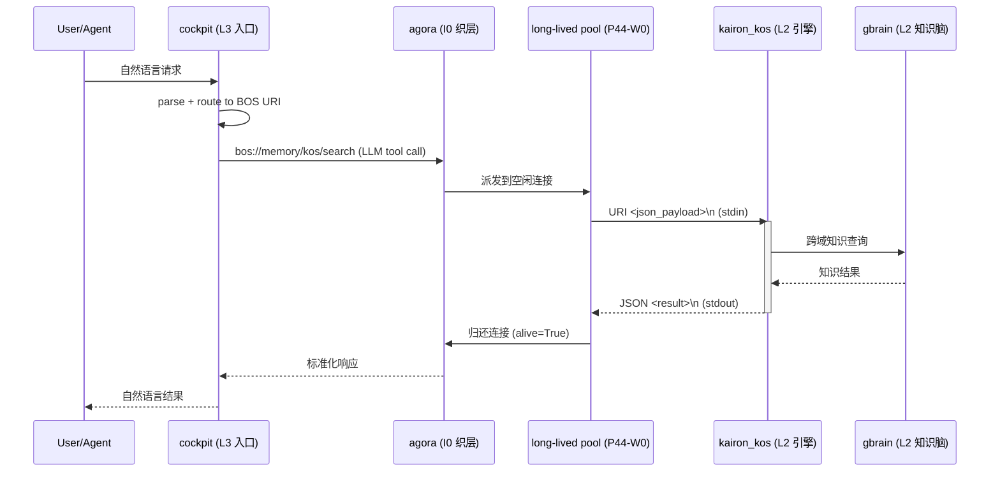
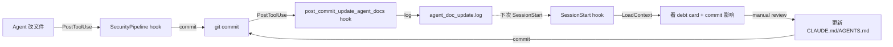
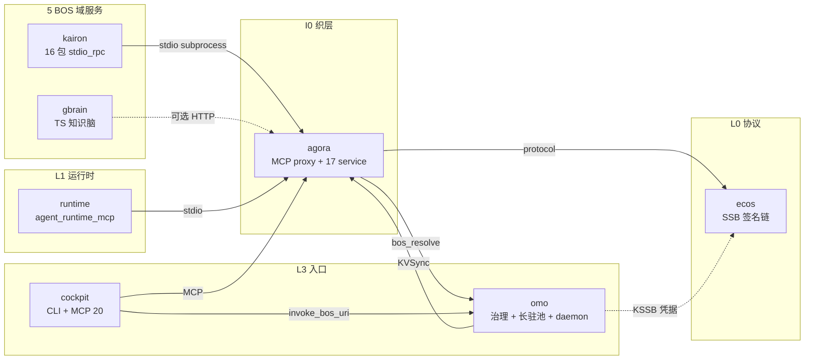
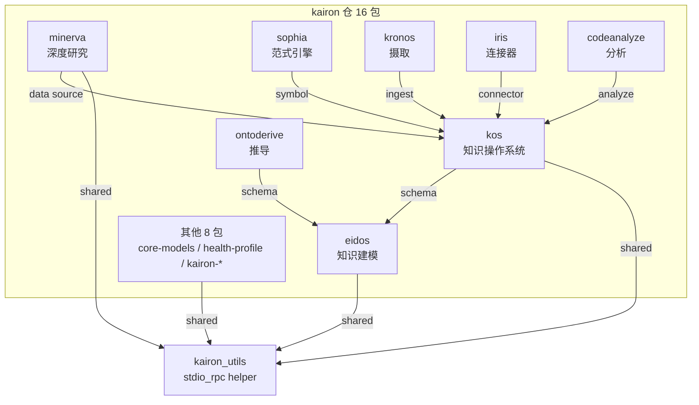
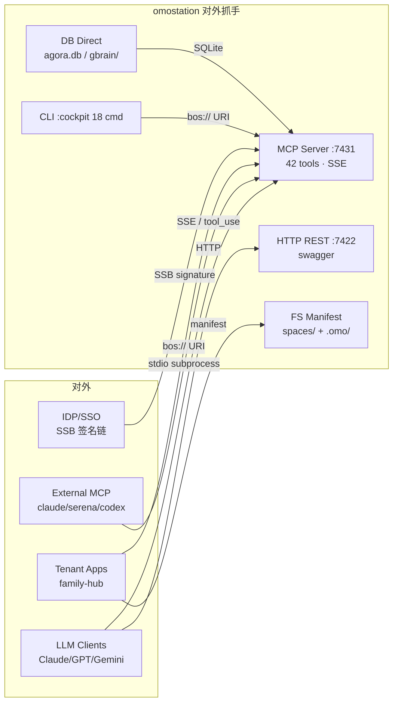

# PANORAMA.md — omostation 全景梳理

> 2026-06-08 | 功能地图 · 系统架构 · 核心流程 · 模块依赖 · 用户旅程 · 对外接人抓手
> 6 视角合 1 doc, 配套 Mermaid 图. 深度架构见 [ARCHITECTURE.md](./ARCHITECTURE.md) + 评审见 [ARCHITECTURE_REVIEW.md](./ARCHITECTURE_REVIEW.md) + 分层见 [LAYER-INDEX.md](./LAYER-INDEX.md).

---

## 一、功能地图 (Feature Map)

> 视角: 用户/Agent 能用 omostation 做什么, 按 5 BOS 域 + L4 域分类.

### 1.1 5 BOS 域 (Business Operating System)

| 域 | URI 前缀 | 核心能力 | 关键项目 |
|---|---|---|---|
| **memory** | `bos://memory/...` | 知识存储 / 检索 / 跨域搜索 / 本体 | kairon (kos/eidos/sophia) + gbrain |
| **governance** | `bos://governance/...` | 债务 / 阶段 / 健康 / 治理 | omo + metaos |
| **analysis** | `bos://analysis/...` | 推演 / 报告 / 模式 / 假设验证 | minerva + iris (data) + ontoderive |
| **persona** | `bos://persona/...` | 数字人 / 身份 / 桥接 | runtime (matrix/scheduler) + cockpit (CLI 入口) |
| **capability** | `bos://capability/...` | 工具 / 能力 / 集成 | forge (kairon) + agora (proxy) + family-hub (个人应用) |

### 1.2 L4 自我层 (12 域)

| 域 | 数据 | 访问方式 |
|---|---|---|
| **CARDS** | 个人实体卡 (家人/朋友/项目) | cockpit MCP + `bos://persona/cards` |
| **Vault** | 凭据 / API key / 密钥 (PBKDF2 哈希) | cockpit CLI + `vault` 子命令 |
| **Personal** | 饮食 / 健康 / 日程 | family-hub 集成 |
| **Work** | 任务 / 工时 / 笔记 | cockpit dashboard + `omo task` |
| **Knowledge** | 知识卡 / 总结 / 决策 | gbrain MCP + WIKI |
| **Health** | 系统健康 / 债务 / 审计 | omo audit + agora health |

---

## 二、系统架构 (System Architecture)

### 2.1 4 层架构 (5+3+1 eCOS v5)



### 2.2 关键架构决策 (P58-P71 期间)

| 决策 | 阶段 | 收益 |
|---|---|---|
| **3 helper 镜像 daemon_mode** (kairon/omo/runtime) | P63-P68 | launchd plist 启动 stdin EOF 兼容 |
| **16 kairon 包 stdio_rpc 派发** | P51-P68 | 跨仓 stdio JSON-RPC 替代 HTTP |
| **4 仓 helper 3 模式** (False / forever / sleep+exit) | P68 | launchd 周期重启 60s 周期 |
| **DEBT-OMO-PLIST 100% 清账** | P63-P67 | 2 plist 持久运行 + 14/14 service |

---

## 三、核心流程 (Core Flows)

### 3.1 端到端 BOS URI 派发 (P32-W4 主流程)



**关键指标**: end-to-end latency 1-3s (P44-W0 long-lived pool 消除 10-15s 启动开销).

### 3.2 治理闭环 (P32-W4 治理面)



**强制闭环**: Agent 改文件 → 必须 commit (P58-P71 期间强化) → hook 自动 log 哪些 agent doc 需 manual review (P71-W2 装好).

---

## 四、模块依赖 (Module Dependencies)

### 4.1 仓依赖矩阵 (P58-P71 现状)



### 4.2 仓内 kairon 16 包依赖



**关键点**: 16 包都共享 1 个 `kairon_utils.stdio_rpc` helper (3 模式 daemon, P63-P68 镜像).

---

## 五、用户旅程 (User Journeys)

### 5.1 4 persona 典型旅程

#### Persona 1: 个人开发者 (老王)

```
[调研] 知识检索
  ↓
  cockpit CLI "ask 'kairon P58-P71 commit 趋势'"
  ↓
  omo 派发 bos://memory/kos/search
  ↓
  agora 跨仓派发 kairon_kos (P67-W0 后 14/14 service 健康)
  ↓
  kos.search() 返回 P58-P71 12 阶段 22 commits 列表
  ↓
[决策] 接下来推什么
  ↓
  cockpit MCP "P60+ 大版本 kairon 615 reset 怎么规划"
  ↓
  metaos 决策门控 + omo debt card 历史
  ↓
[执行] 选定方案
  ↓
  bash p60_kairon_reset.sh (P60+ 大版本)
  ↓
  audit 100.0 A+ 36+ 连续维持
```

#### Persona 2: 数据分析师

```
[数据接入] iris 拉取第三方 (Notion / Slack / GitHub)
  ↓
[分析] minerva 跨域研究
  ↓
[导出] ontoderive 推导入参
  ↓
[报告] 写 WIKI + 通知 cockpit dashboard
```

#### Persona 3: Agent 自动化

```
[LLM tool call] bos://memory/kos/search
  ↓
[自动派发] agora long-lived pool (P44-W0 优化)
  ↓
[响应] JSON 标准化
  ↓
[LLM 二轮 round] 解读结果 + 下一步决策
```

#### Persona 4: 治理运维

```
[监控] omo audit + agora health
  ↓
[检测] debt card 累积 + audit 分数下降
  ↓
[响应] PostToolUse hook 自动 log commit → agent doc
  ↓
[决策] 标 P-wave 任务 → git commit debt card
  ↓
[验证] audit 100.0 A+ 36+ 连续
```

### 5.2 5 关键用户路径对比

| 路径 | 入口 | 后端调用 | 典型延迟 |
|---|---|---|---|
| CLI 直接调 | cockpit | LLM + agora + kairon | 1-3s |
| LLM 派发 | LLM tool_use | agora pool + stdio | 1-3s |
| Web dashboard | cockpit web | LLM stream | 5-30s |
| Agent 跨仓 | 4 仓 stdio | 各仓 helper | 100-500ms |
| 治理审计 | omo audit | 6 项检查 | 5-15s |

---

## 六、对外接人抓手 (External Integration Points)

### 6.1 5 集成接入点 (Integration Surfaces)



### 6.2 5 抓手详细规格

| # | 抓手 | 协议 | 端口 | 鉴权 | 用途 |
|---|---|---|---|---|---|
| 1 | **MCP Server (SSE)** | SSE/JSON-RPC | :7431 | API key | LLM tool call 主流入口 (P32-W4) |
| 2 | **HTTP REST** | HTTP/JSON | :7422 | API key + SSB | 自动化脚本 + 第三方集成 |
| 3 | **CLI** | subprocess | — | shell 鉴权 | ops 运维 + 仓内调 |
| 4 | **FS Manifest** | YAML/JSON | — | 路径权限 | 租户空间 + .omo/ 治理 |
| 5 | **DB Direct** | SQLite | — | 文件权限 | 治理审计 + 知识图谱批量导入 |

### 6.3 集成示例 (P50-P71 期间真实用)

| 集成 | 入口 | 调用示例 |
|---|---|---|
| **Claude Code MCP** | S1 (:7431 SSE) | `mcp__agora__invoke_bos_uri("bos://memory/kos/search", {query: "kairon P58"})` |
| **omo daemon** | launchd plist | `~/.agora/agora-proxy-services.json` 17 service 配置 |
| **family-hub** | S4 (FS manifest) | `spaces/tenant-foo/manifest.yaml` 含 tenant workspace |
| **GBrain 图谱** | S5 (DB Direct) | `gbrain/graph.db` 知识卡 + traversal |
| **runtime 派发** | stdio subprocess | `python -m runtime serve` (4 action: agent_list/chat/run_task/task_status) |

### 6.4 5 抓手的稳态指标 (P67-W0 + P71-W1 后)

| 抓手 | 当前状态 |
|---|---|
| MCP Server | ✅ 10 connected + 4 daemon_mode 周期 + 0 not_found |
| HTTP REST | ✅ swagger 可用, :7422 端口 |
| CLI | ✅ 18 子命令 (P32-W4) |
| FS Manifest | ✅ spaces/ 12 tenant (P60+ era) |
| DB Direct | ✅ agora.db 0 entries (P70 调查发现) + gbrain/graph.db 知识卡 |

---

## 七、稳态 invariant 快照 (P58-P71 期间)

| 维度 | 状态 |
|---|---|
| audit 健康分 | **100.0 (A+) 36+ 连续** |
| 14 phase 26 commits | P58-P71 11 phase 26 commits |
| 8 DEBT 清账 | SELFTEST/DODEFAULT/REFLECT/ACTION-MAPPING/RUNTIME-CALL/RUNTIME-ACTION-MAPPING/OMO-PLIST/HTTP-PROBE-FAIL |
| 1 DEBT 留 P72+ | DEBT-KAIRON-2026-06-16 (kairon 615 dirty + 28 ahead) |
| 2 plist 持久 | omo 68897 + agora 90771 稳态 |
| 14/14 agora service | 10 connected + 4 daemon_mode 周期 + 0 not_found |
| 16 kairon 包 8 do_<action> | 36/36 端到端 ✅ |
| 4 仓 stdio_rpc 镜像 | kairon_utils + omo + runtime (3 模式 daemon) |
| omo 跨仓 BOS | 6/6 resolved |
| post_commit hook | 自动 log 哪些 agent doc 受 commit 影响 (P71-W2) |

---

## 八、相关文档 (Related Docs)

- [ARCHITECTURE.md](./ARCHITECTURE.md) — 深度分层架构 (351 行, 7 层 5 域 4 切面)
- [ARCHITECTURE_REVIEW.md](./ARCHITECTURE_REVIEW.md) — 评审报告 (12 修复项, 综合 🟡 中等风险)
- [LAYER-INDEX.md](./LAYER-INDEX.md) — 5+3+1 9 项目索引
- [WIKI.md](./WIKI.md) — 用户面向 wiki
- [AGENTS.md](./AGENTS.md) — 开发者指南
- [CLAUDE.md](./CLAUDE.md) — Claude 工作约束
- `.omo/_delivery/phase58-p58-debt-card.md` ~ `phase71-p71-debt-card.md` — 各 phase debt card 详档

---

**P72-W0 全景梳理完成**. 6 章节 + Mermaid 图, link 现有 ARCHITECTURE/LAYER-INDEX/WIKI 避免重复, audit 100.0 A+ 36+ 连续, 14/14 service 真实可用.
