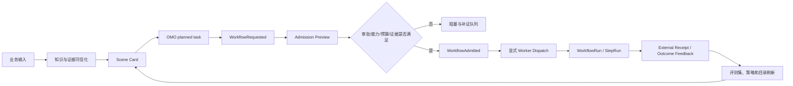

# BOS 多源私有知识与 Workflow Mesh 场景战略架构

## 1. 战略判断

这个项目的核心产品不是“再做一个知识库”，也不是“再做一个 Agent 平台”。它要成为个人和小团队的私有工作系统：

> 把分散在文件、邮件、OA、短信、网页、模型、方法和工具里的信息，转成可追溯的判断，再转成受治理的行动，最后用真实结果反哺知识和策略。

因此产品价值链应固定为：

`输入 -> 可信化 -> 理解 -> 场景化 -> 决策 -> 受控执行 -> 结果回执 -> 学习进化`

当前项目已经完成了大量基础设施和治理建设，处于“从能力堆栈进入场景产品化”的阶段。下一阶段的首要目标不是继续增加孤立能力，而是选出少数高频场景，打通从业务意图到结果反馈的完整链路。

## 2. 产品分层

### 2.1 输入与连接层

负责接触事实，不负责判断事实价值：

- 私有输入：文件、邮件、OA、公文、短信、会议和本地知识库；
- 外部输入：网页、论文、报告、数据库、API、工具、模型和方法资源；
- 采集方式：导入、观察、探活、人工提交、受控连接和定期刷新；
- 原则：所有输入都携带来源、时间、权限、敏感级别和质量状态。

### 2.2 可信化与知识层

负责让系统知道“这是什么、从哪里来、能否相信”：

- OCR 质量、文本抽取、去重、版本和 provenance；
- KOS 负责知识对象和检索，GBrain 负责理解、问答和推理辅助；
- 知识图谱先服务于实体、关系、来源和时间线，不提前做成全量复杂本体；
- 任何推理结论必须能回指来源和证据，不把模型生成内容当事实。

### 2.3 场景与决策层

负责把“信息问题”变成“业务场景”：

- C2G 把愿景、目标、赌注、约束和路线转成治理任务；
- Scene Card 描述场景、旅程、结果指标、候选能力、输入和风险；
- 外部资源目录回答“有什么”，连接计划回答“下一步缺什么”；
- 场景预检只产生 proposal 或 planned task，不等于激活或执行。

### 2.4 工作流与治理层

负责把决策变成可审计动作：

- OMO 是任务、审批、admission、证据和状态的治理内核；
- Workflow Mesh 是统一运行事实和事件状态机；
- Cockpit 是人和系统的产品入口，只读投影运行事实，写操作必须经过 broker；
- AetherForge 负责受控算力和模型路由，Agora 负责能力发现、健康和路由证据；
- Worker、provider、外部连接和业务写入都必须在显式准入之后发生。

### 2.5 结果与进化层

负责回答“执行有没有产生价值”：

- WorkflowRun、StepRun、evidence、external receipt 和 outcome feedback 组成结果闭环；
- 结果消费、采纳、引用、提交和拒绝必须显式记录；
- 评测集从真实场景和真实反馈中沉淀，不用静态 demo 代替生产效果；
- 反馈可以改变排序、提示、能力选择和路线优先级，但不能绕过治理门禁自动改变策略。

## 3. 高价值业务场景

### 场景 A：每日运营与事务闭环

输入是邮件、OA、短信和待办。系统抽取事项、责任人、截止时间、风险和依赖，形成任务草稿；用户确认后进入 OMO planned task。只有具备业务场景、证据计划和风险级别的任务，才允许请求 Workflow。

验收标准：事项召回率、误报率、待办转化率、按期完成率和人工修正时间。

### 场景 B：研究与决策简报

输入是论文、报告、网页和内部资料。系统输出带来源的事实卡、观点差异、证据缺口和决策选项，形成 research-brief Scene Card。Workflow 只负责受控整理、对比、草拟和引用，不直接替用户作最终决策。

验收标准：引用覆盖率、事实可回溯率、简报采纳率、决策延迟和复核时间。

### 场景 C：工程交付与治理

输入是目标、代码变更、测试、PR 和运行证据。系统把工程意图映射到任务、WorkflowRun、证据和结果消费，形成 Delivery Journey。该场景是当前最适合持续 dogfood 的主场景，因为边界清晰、证据丰富、反馈周期短。

验收标准：交付 lead time、门禁通过率、回滚率、证据完整率和结果消费率。

### 场景 D：知识到行动

输入是知识引用、经验、方法和用户问题。系统不直接执行，而是生成带 knowledge_refs 的任务，要求明确场景、结果指标和证据计划，再进入 Workflow Mesh。这个场景连接 KOS/GBrain、C2G、OMO 和 Cockpit，是产品差异化的核心。

验收标准：引用到任务转化率、任务完成率、知识行动反馈率和重复劳动减少量。

### 场景 E：外部能力触达

输入是外部知识源、数据源、方法论、模型、工具和渠道。系统先发现和观察，再做健康、评测、权限和场景复核，最后才允许受控触达。没有真实消费者时，停在目录、连接计划或评测，不伪造激活结果。

验收标准：资源发现新鲜度、候选到场景转化率、连接失败恢复率、真实 receipt 覆盖率和外部能力带来的业务增益。

## 4. 子项目能力边界

| 子项目 | 负责 | 不负责 |
| --- | --- | --- |
| 根仓 omostation | 架构、SSOT、治理、组合和跨项目契约 | 业务运行时数据的第二份真相 |
| OMO | 任务、审批、admission、事件、证据、外部 receipt | 产品 UI、provider 私有协议 |
| Cockpit | API 适配、场景入口、状态投影、人工操作 | 自建任务状态机、绕过 OMO 写状态 |
| cockpit-ui | 场景化交互、解释、导航和人工确认 | 直接调用 provider 或保存运行事实 |
| Agora | 能力目录、健康、资源观察、路由建议 | 业务结果和最终执行授权 |
| AetherForge | 模型、算力、执行后端和受控路由 | 业务审批和知识真相 |
| eCOS | 协议、契约、跨层边界和服务基础设施 | 场景判断和用户策略 |
| C2G | 愿景、目标、赌注、战略入口和任务物化 | 低层执行和运行态管理 |
| GBrain/KOS/Kairon | 知识对象、检索、理解、模型和知识生产 | admission、worker 和业务写入 |
| Runtime | 受控执行、effect journal、运行回执 | 决策授权和场景定义 |
| bin/ (ex scripts/bin) | 治理、诊断、生成、门禁和运维 | 长期业务状态和隐式写入 |

## 5. Workflow Mesh 目标状态

状态边界必须保持单向、可解释：

- `proposal` 只代表候选；
- `planned task` 代表待处理治理任务；
- `WorkflowRequested` 代表已有运行意图，不代表可执行；
- `Admission Preview` 是只读判定，必须返回 blocker、所需证据、健康快照和下一步；
- `WorkflowAdmitted` 代表授权包已形成，不代表 worker 已启动；
- `dispatch`、外部调用和业务写入必须有独立的受控入口；
- `receipt` 和 `outcome feedback` 是结果事实，不由 UI 自行推断。

## 6. 外部知识、数据、方法、理论、渠道和工具的动态扩展

### 6.1 统一资源模型

所有外部资源都归一为 `ExternalCapabilityDescriptor`，至少包含：

- `resource_id`、`kind`、`title`、`source_ref`；
- `capabilities`、`supported_scenes`、`input_contract`、`output_contract`；
- `permission_ref`、`sensitivity`、`owner_ref`、`cost_hint`；
- `health_policy`、`evaluation_policy`、`freshness_policy`、`rollback_policy`；
- `adapter_ref`、`catalog_digest`、`observed_at`。

`kind` 只用于分类，不为每种资源建立一套特例引擎。知识、数据、资料、方法、理论、渠道、工具和模型共享同一生命周期，差异通过契约和评测维度表达。

### 6.2 资源生命周期

`declared -> discovered -> observed -> evaluated -> reviewed -> scene_bound -> admission_ready -> active -> degraded -> retired`

- `declared`：由用户、目录、pack 或外部索引声明；
- `discovered`：系统能识别资源，但未证明可访问；
- `observed`：只读探活或 observation receipt 成功；
- `evaluated`：有针对场景的质量、成本、延迟和风险证据；
- `reviewed`：人工确认权限、用途、敏感度和回滚；
- `scene_bound`：至少绑定一个真实业务旅程和结果指标；
- `admission_ready`：满足 OMO 规则，可进入正式准入；
- `active`：真实使用并持续产生 receipt；
- `degraded/retired`：健康或价值下降，进入恢复、替换或下线。

前六个阶段都可以在没有外部副作用的情况下完成。`active` 不是目录字段，而必须由真实调用、真实回执和结果反馈共同证明。

### 6.3 动态触达架构

外部扩展采用五个可替换部件：

1. `Descriptor`：描述资源和能力，不执行；
2. `Adapter`：把统一能力契约映射到具体 API、文件、网页、数据库、MCP、BOS 或模型；
3. `Observation`：探活、schema、freshness、权限和成本观察；
4. `Evaluation`：使用真实或脱敏样本评测准确性、覆盖度、延迟、成本和风险；
5. `Receipt`：记录实际触达、结果引用、错误、回滚和用户消费。

新增资源只需新增 descriptor、adapter manifest、观察实现和评测样本，不得修改 Workflow Mesh 状态机。所有 adapter 调用必须经过 Agora/AetherForge 的能力路由和 OMO 的 admission，禁止在 Cockpit 中直接写 provider。

### 6.4 外部扩展队列

产品上将外部扩展显示为队列，而不是连接器开关：

| 队列 | 触发条件 | 下一步 |
| --- | --- | --- |
| 发现队列 | 只有描述或索引 | 补充来源和能力契约 |
| 健康队列 | 发现但无新鲜观察 | 探活、schema 和权限检查 |
| 评测队列 | 可访问但无场景证据 | 建立脱敏样本和指标 |
| 场景队列 | 评测通过但无消费者 | 创建 Scene Card 和 consumer contract |
| 准入队列 | 场景、权限、回滚和证据齐备 | OMO Admission Preview |
| 运行队列 | 已真实触达 | 观察 receipt、反馈、成本和漂移 |
| 恢复队列 | 健康或质量退化 | 替换、降级、回滚或退休 |

## 7. 长周期路线

### 0-3 个月：闭环可用

- 以工程交付、知识到行动和研究简报为三类 dogfood 场景；
- 完成 Task Center 的请求状态、Admission Preview 和结果反馈连续体验；
- 补齐真实评测样本最小集和外部 receipt 质量检查；
- 对真实低风险样本完成双人结构化标注、冲突 adjudication 和脱敏 manifest；
- 让外部目录、连接计划、Scene Card、Task Center 和 Workflow Operations 共享同一场景绑定。

### 3-6 个月：外部能力可控扩展

- 固化 descriptor/adapter/observation/evaluation/receipt 契约；
- 建立动态资源变化评审、健康降级和恢复队列；
- 将邮件、OA、文件和网页接入统一输入治理，先做质量和权限，不追求全量自动化；
- 形成按场景选择知识源、方法、模型和工具的路由证据。

### 6-12 个月：可进化的个人工作系统

- 持久化知识图谱只围绕高价值实体、任务、项目、来源、决策和结果演进；
- 从真实反馈中训练排序、路由和预测模型，模型只提供建议，不直接拥有执行权限；
- 形成场景模板、证据模板、评测模板和恢复模板的复用体系；
- 以业务结果而不是工具数量衡量自动化收益。

### 12-24 个月：多场景协同与半自治

- 允许多个场景共享资源、证据和结果，但通过 tenant/space、权限和 provenance 隔离；
- 对低风险、可回滚、证据充分的 L0/L1 动作提供有限自动派发；
- 对高风险动作保持人工审批、双人复核或分段执行；
- 让系统能够发现“缺什么能力”和“哪个方法在什么场景有效”，但保留人类战略判断权。

## 8. 成功指标与硬边界

核心指标按价值链观察：输入覆盖、可信率、场景转化率、请求到准入转化率、证据完整率、真实执行成功率、结果消费率、外部资源新鲜度和恢复时间。

硬边界：

- 不为每个子项目复制一套任务或工作流状态机；
- 不把静态目录、模型回答、预览结果或 UI 成功提示当成真实业务结果；
- 不在没有真实消费者时建设大规模生产激活链；
- 不把个人私有数据默认上传外部 provider；
- 不让预测模型、路由模型或 Agent 绕过 OMO admission；
- 不用复杂图谱、微服务或插件市场替代真实场景和反馈。

## 9. 当前落点

当前最优先的交付顺序是：

`Task Center 请求投影 -> Admission Preview 场景化 -> 真实执行回执 -> 结果反馈 -> 评测样本准备度 -> 双人标注/adjudication -> manifest -> 外部资源受治理刷新 -> freshness/恢复队列`

Phase 58 已完成任务中心对 WorkflowRequested 的安全投影和准入工作台导航；Phase 59 已补齐外部回执 broker 的产品入口和
真实评测样本准备度投影。当前系统仍处于“可观察、可验证、可反馈，但默认不激活 provider”的阶段，下一步应以真实低风险
消费者产生第一批 `ready` 样本。Phase 60 已将外部目录的显式刷新、OMO 观测回执和过期恢复状态接入产品入口，Phase 61 又补齐了
结构化人工标签回执和双人/Adjudication 队列，但仍保持默认不激活 provider。模型训练与预测服务必须等脱敏 manifest、标注一致性、
规则/人工基线、评测门禁和人工审批同时成立后再独立立项。
