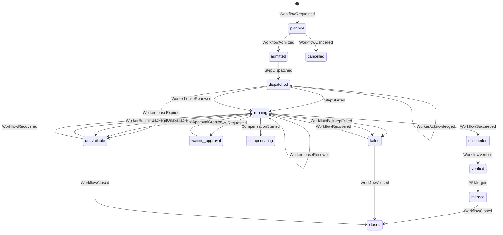

# Workflow Mesh 实施架构与交付路线

## 1. 目标

Workflow Mesh 不是新增一个工作流引擎，而是把现有 C2G、OMO、ECOS、Agora、Runtime、AetherForge、Cockpit 的执行边界收敛到一条可追踪、可恢复、可验收的运行链上。

核心结果是：每一项业务意图都能沿着 `scene_id -> journey_id -> intent_id -> task_id -> workflow_run_id -> step_run_id -> evidence_id -> pr_id` 找到真实执行、失败原因、验证结果和交付结果。

## 2. 模块边界

| 模块 | 责任 | 不负责 |
| --- | --- | --- |
| C2G | 把愿景、策略和业务意图转成受治理任务 | 不直接执行代码或调度 Agent |
| OMO | 任务生命周期、审批、事件原文、运行态投影和审计证据 | 不实现业务步骤 |
| ECOS | M1 工作流定义、契约校验、后端解析和执行编排 | 不持有跨模块事实库 |
| Agora | 能力发现、路由和入口适配 | 不把不可用后端伪装成成功 |
| Runtime | 单步执行、心跳、重试、检查点和恢复 | 不改变工作流定义 |
| AetherForge | Agent、模型和并行计算资源编排 | 不成为业务状态 SSOT |
| Cockpit | 任务操作、运行态、验证和交付可视化 | 不凭 Git 文件存在推断运行成功 |
| gbrain / KOS | 事实记忆和索引检索 | 不承载一次运行的生命周期 |
| MetaOS | 策略、预算、权限和准入约束 | 不绕过执行证据直接宣布完成 |
| External Connection Fabric | 外部资源描述、健康、来源和生命周期 | 不拥有任务、知识、凭据或运行状态真相 |

## 3. 运行身份与事件契约

所有执行必须拥有稳定的 `workflow_run_id`，默认让 `trace_id` 与其一致；调用方重试时可复用同一 ID，禁止为同一次业务执行创建无法关联的新运行。面向产品的执行还必须绑定 `scene_id`、`journey_id` 和 `outcome_metric`，否则只能进入 proposal-only 或 sandbox。

事件采用 `workflow-mesh/v1` 信封，至少包含：

`event_id`、`event_type`、`trace_id`、`workflow_run_id`、`occurred_at`、`producer`、`schema_version`、`idempotency_key`、`payload`。

OMO 只追加原始事件，再由投影器生成运行快照。重复 `event_id` 或重复 `idempotency_key` 且内容相同是幂等成功；内容冲突必须失败。只有 `closed` 是不可再推进的终态；`succeeded`、`failed`、`unavailable` 必须分别进入验证、关闭或显式恢复，不得被提前当成结案。

## 4. 状态机



`succeeded` 表示执行步骤成功，`verified` 表示验证证据已通过，`merged` 表示交付已进入主线，`closed` 表示生命周期已结案；这几个状态不能混用。失败和不可用只能通过 `WorkflowRecovered` 回到运行态。

## 5. 本轮已落地

- ECOS 增加统一运行元数据和事件信封生成器。
- 明确指定但未注册、无法导入的后端现在 fail-closed，不再偷偷执行 default。
- Agora、Runtime、Swarm 在服务不可用时返回 `BACKEND_UNAVAILABLE`，不再返回 fake mock success。
- ECOS 检测嵌套的 mock/simulation 结果并阻断“假成功”。
- ECOS 支持注入 OMO-compatible event sink，执行开始和结束可以写入同一条 trace。
- ECOS 执行 admitted、step dispatch/start、step failure 和 terminal 事件，并为事件生成稳定幂等键。
- OMO 增加 Workflow Mesh 事件信封、按 event/idempotency key 幂等的 AppendOnlyLog 存储和严格运行态投影。
- OMO 快照保留 workflow、task、intent、evidence、PR 元数据，支持从事件恢复业务链路。
- Cockpit 将“有 Git worktree”与“有活动 Agent Workflow run”分开；无活动 run 时显示 `stale`。
- Cockpit 在 Agent Workflow YAML 缺失时直接消费 OMO Mesh 快照，展示真实运行、验证、PR 和证据阶段。
- Runtime `AgentRuntime.run_task` 支持注入 `event_sink`，发出 requested/admitted、step dispatch/start、heartbeat、checkpoint、failure 和 terminal 事件；payload 不包含提示词和模型输出。
- AetherForge `GraphWorkflow.run` 支持相同的 `workflow_run_id / trace_id / event_sink` 入口，并在 Swarm RPC 中透传，节点执行可直接投影到 OMO。
- 根仓跨模块验收已用真实 Runtime 与 Swarm 执行写入 OMO append-only store，并验证两个运行快照均收敛到 `succeeded`。
- Runtime 提供 append-only `WorkflowCheckpointStore`，保存安全执行边界并支持同一 run 恢复；完成态恢复直接返回已持久化结果，避免重复调用模型。
- AetherForge Swarm 图执行器支持从最后一个已提交节点 checkpoint 继续，失败节点会重放，已经成功的节点不会重复执行。
- OMO 快照现在包含 `step_runs`、`checkpoints`、`evidence`、`approvals`，提供 StepRun/Evidence 查询入口，并拒绝没有 Evidence 的 `WorkflowVerified`。
- ECOS 将 `workflow_run_id / trace_id` 透传到后端；Runtime 子进程通过环境变量接收，AetherForge CLI 通过显式参数接收。
- ECOS 生成带 `admission_id / step_run_ids / policy_digest / expires_at / proof` 的短期执行授予；OMO 校验授予后才接受 StepRun 事件，Runtime 与 AetherForge 在 Mesh 运行中缺少或伪造授予时 fail-closed。
- Runtime/AetherForge 的子进程传播会为具体执行器派生子授予，保留父授予关联并避免把未获准的内部步骤伪装成已授权。
- OMO 增加 admission/dispatch broker：审批、能力健康、预算门禁通过后才追加 `WorkflowRequested` 与 `WorkflowAdmitted`，并把同一授予注入 worker envelope/dispatch record。
- OMO 的 `WorkflowRequested` 已支持稳定的 `scene_binding`，强制包含 `scene_id`、`journey_id` 和 `outcome_metric`；后续事件不得静默改变绑定，投影会保留同一业务上下文。
- Cockpit Delivery Journey API 和 cockpit-ui 已消费 `scene_binding`，在交付链旁显示业务场景、用户旅程和结果指标；没有绑定时显式显示未绑定，不用技术状态推断业务成功。
- Cockpit Delivery Journey 现在区分 `live/active`、`live/completed`、`stale/waiting_for_run`、`failed` 和 `unavailable`；仅有可读 Git worktree 而没有受治理 WorkflowRun 时，显示等待状态，不再生成 `git-live-session` 假活跃旅程。产品投影同时暴露 `scene_binding` 和 `next_action`，绑定只来自真实 Run 上下文。
- OMO 将 worker 派发桥接到 Mesh：`StepDispatched` 绑定 `dispatch_id`、`worker_id`、`step_run_id` 和 `admission_id`；worker ACK、租约续期、租约失效和接管分别落为 `WorkerAcknowledged`、`WorkerLeaseRenewed`、`WorkerLeaseExpired`、`WorkerReclaimed`，并在同一 append-only 日志中幂等投影。新增 `omo worker mesh-watchdog`，默认 dry-run，显式 `--apply` 才从 Mesh 事件日志发现并追加过期事件；它不自动选择 successor、不自动 reclaim。
- OMO 新增 `mesh-watchdog-run` 受治理 runner，并接入既有 `omo daemon` tick；每次运行使用跨进程非阻塞锁，默认 dry-run，显式 `--apply` 才允许追加 `WorkerLeaseExpired`。运行摘要写入 `.omo/_log/workflow-mesh-watchdog-runs.jsonl` 和 latest 投影，账本写入失败或扫描失败均 fail-closed；runner 不新增 scheduler、不选择 successor、不执行 worker。
- Agora 增加只读 capability health projection，将 agent、Swarm node、服务和 backend 的心跳/可用性投影成统一快照；它只提供证据，不替 OMO 迁移状态或越权放行。
- Agora 增加 `ExternalConnectionCatalog`：通过 `external.resources` entry point 动态发现 descriptor，执行场景/权限/健康/期限/回滚准入，按决策因子路由，并在无候选时返回显式 unavailable。
- Agora 增加 `SceneCard` 激活契约：外部连接必须携带目标、触发、输入/结果契约、消费者、审批人、责任人、失败代价、数据范围、三到十个脱敏样本引用，以及需求证据或机会窗口；原文和凭据 fail-closed。`activate_with_scene_card` 通过后才复用旧 `SceneBinding` 进入既有权限/健康/期限/回滚准入，旧绑定继续服务兼容路由但不再代表完整业务激活。
- Iris 将 connector 同时暴露为 `iris.connectors` 和 `external.resources`，新增连接器不需要修改 Agora 路由代码。
- `ConnectionReceipt` 只携带 receipt、来源、策略、摘要哈希和结果状态，可直接生成 OMO `EvidenceRecorded` payload；`proposal_only` 资源不执行副作用。
- OMO 新增外部 receipt broker：执行方通过 `omo worker external-receipt` 或 `record_external_receipt()` 回写最小 receipt；broker 校验来源、策略、时间、摘要和结果状态，以稳定事件身份幂等追加 `EvidenceRecorded`，并在投影中保留 provenance/decision factors。失败、不可用和 proposal receipt 不会被提升为成功证据。
- Agora 的动态发现结果现在通过 `external-resource-catalog/v1` 归一为只读目录快照：统一暴露资源类型、生命周期、健康探针、新鲜度、来源引用、错误记录和显式不可用原因；根仓 `bin/ssot/external-resource-catalog.py` 只调用 provider 明确声明的只读 `health_probe`，不调用业务方法、不写 OMO。
- 外部目录增加受治理观察链：根仓 `--observe` 通过 OMO CLI broker 追加 `external-resource-observation/v1`，OMO 独占观察日志和最新投影写入；重复目录按 `observed_at + catalog_digest` 去重，Cockpit 默认读取观察并在缺失时显式回退到动态发现。
- Cockpit 提供 `GET /api/external-resources`，cockpit-ui 提供 `/external-resources` 目录页；它是人类判断外部能力是否值得进入 Scene Card 的观察面，不是激活面或执行面。
- Cockpit 首页现在按数据源表达 `loading`、`complete`、`partial`、`unavailable`，移除默认健康分、示例告警/任务和随机趋势；刷新失败会清空未标记的旧读数。该展示契约由 ADR-0308 和 `HomePage.truthfulness.test.tsx` 固化，避免 Mesh unavailable 被用户误读为正常运行。
- Cockpit 首页新增只读“今天需要处理”区，消费 `/api/cockpit/system-map` 的 `project_focus` 和 `project_portfolio.priority_projects`，将队列原因、项目 `next_action` 和 TaskCenter/SystemMap 导航放回第一入口；焦点接口失败时独立显示 unavailable，不计算或复制第二套任务真相。契约见 ADR-0309。
- Runtime 增加显式 retry policy、稳定 effect key 的副作用日志和 replay，AetherForge 增加节点重试与可选 compensation hook；默认不重试，避免隐式放大副作用。Runtime effect journal 输出 `runtime-effect-outcome/v1` 安全摘要和可供 OMO broker 消费的 credential-free receipt；本地 replay 所需的工具结果不进入 Mesh 事件、receipt 或证据投影。journal 的读-判重-写已由跨进程锁保护，网络超时/连接失败会落为 `unavailable` 和稳定错误码。
- OMO 增加 `workflow_eval`：从真实 append-only 事件生成 `workflow-mesh-eval/v1` 数据集，保留事件 ID 作为标签来源，并提供只读的候选策略离线评估/人工审批 proposal。
- Phase 28 将外部资源选择评估升级为可追踪证据：OMO 通过 `external-resource-evaluation-observation/v1` 持久化安全观察，`external-resource-selection-eval/v1` 只读 join 评估、真实 Mesh 事件、external receipt 和显式 Outcome Feedback；未执行或歧义样本不会被标成成功。Cockpit 提供显式记录开关、评测集摘要和 proposal-only 策略比较，仍不激活 provider、不改变 admission/WorkflowRun。
- Phase 29 将已有 admission、worker lease 和 receipt broker 串成一个最小可回放的 sandbox ToolPack 闭环：`omo worker sandbox-tool` 只允许确定性的 `sandbox.digest_ref`，要求 `sandbox.tool.invoke` admission 能力和 live WorkerLease，只接收安全引用与 SHA-256 摘要，追加 `ToolInvocationRecorded` 后完成 `WorkflowSucceeded -> EvidenceRecorded`。该执行器固定 `activation=sandbox`、`external_side_effects=disabled`，不调用 provider、不读取原文、不运行任意命令；Cockpit 的 OMO 运营投影同时暴露 sandbox invocation/receipt 计数。
- Phase 30 为同一 sandbox ToolPack 增加 provider-neutral outcome 契约：`ToolInvocationRecorded` 必须声明 `succeeded`、`failed` 或 `unavailable`；非成功结果分别落为 `StepFailed` 或 `BackendUnavailable`，只保留稳定错误码，不创建 receipt/evidence。失败调用可幂等回放；租约失效后必须先由既有 watchdog/reclaim 交接，再用新的 StepRun attempt 执行。运营投影增加 outcome 计数，继续把 sandbox 验证与真实业务结果分开。
- Phase 31 修正 `BackendUnavailable` 的 StepRun 投影：当不可用事件携带合法 `step_run_id` 时，WorkflowRun 与 StepRun 都投影为 `unavailable`；恢复、重试和 successor 选择仍由既有协调流程显式完成。
- Phase 32 关闭 Agora 动态路由注册旁路：BOSRouter、POC seed、M1 热加载和 AGENTS.md 自动发现统一经过 admission；拒绝、provider 异常和非法结果不落入路由表，批量注册只统计实际接受项，并保留 credential-free 的拒绝摘要。该门禁仍独立于 ExternalConnectionCatalog 的 SceneCard 激活和 OMO Workflow admission，未激活真实 provider。
- Phase 33 增加 `bin/ssot/external-activation-preflight.py`：把完整 Scene Card、外部资源只读目录和必需能力合并成 `external-activation-preflight/v1`，明确输出 `blocked`、`proposal_only` 或 `ready_for_admission_preview`。它始终 `activation=forbidden`，不调用 provider、不写 OMO、不创建 WorkflowRun；没有真实消费者和结果证据时，系统可以持续准备但不会误激活。
- Phase 37 将外部资源风险投影接入 Cockpit 只读复核队列：`GET /api/external-resources/review-queue` 只读取 OMO 最新观测，按 `review_required` 展示安全变更字段、风险分类和风险码；没有观测时显示 `empty`，观测格式或 OMO 不可用时显示 `unavailable`。该队列是 `latest_observation_delta`，不是持久审批状态机，不触发实时发现、provider 调用、WorkflowRun 或激活。
- Phase 38 将复核队列接入 Cockpit UI 的外部能力目录页，使用同一接口展示 `attention`、`clear`、`empty`、`unavailable` 四态，并在条目中展示资源、风险码和变化字段；UI 不提供批准、激活或写入按钮，避免把观察面误做成授权面。
- 各模块增加 fail-closed、事件投影、幂等和 stale 状态测试。

## 6. 分阶段路线

### P0：执行真相收敛

1. 将所有跨层调用统一映射到 `workflow_run_id / trace_id`（ECOS、OMO、Cockpit、Runtime、AetherForge 已具备注入式入口；CLI/subprocess 传播仍需在真实部署链路中逐步打开）。
2. 给 Runtime 和 Agent 执行补齐 `StepDispatched`、`StepStarted`、`StepHeartbeat`、`StepFailed`、`CheckpointSaved`（ECOS、Runtime、AetherForge 已完成事件发射；当前 checkpoint 是控制面进度证据，尚不是可恢复的业务状态快照）。
3. 将审批、预算、权限和后端可用性纳入 admitted gate；ECOS 现在签发短期 admission grant，OMO、Runtime、AetherForge 三侧共同校验；没有证据就不能进入 verified。
4. Cockpit 优先读取 OMO 投影和事件证据；在没有 Mesh 事件的历史兼容场景保留 `stale` 降级，不把 Git 文件存在推断为成功。

### P1：可恢复执行

1. OMO 将事件投影扩展为 WorkflowRun、StepRun、Approval、Evidence 的权威读接口；写入仍统一走事件 sink。
2. Runtime 和 AetherForge 已以持久化 checkpoint 实现断点恢复与完成态幂等，并要求 Mesh 运行携带有效 admission grant；Runtime effect journal 已能产出结构化成功/失败/重放摘要，并通过 OMO receipt broker 写入同一条证据链。跨进程 effect journal、网络失败分类和显式补偿生命周期已落地；真实外部系统的 provider-specific 补偿回执仍需等真实 Channel/Tool 场景激活后接入。
3. Agora 已增加能力健康 projection 和 MCP 查询入口；版本、权限声明与降级原因的生产级采集仍需绑定真实节点注册和服务心跳。
4. ECOS 已将运行身份和子授予传递到 Runtime/AetherForge；sandbox 已验证资源失败回写 `unavailable/failed` 的事件边界，真实 provider 的错误分类、补偿和成本回执仍需等具体 Scene Card 激活后接入。

### P2：智能化与进化

1. 用历史运行事件和验证结果生成真实标注评测集，按业务旅程评估成功率、误报率和恢复率。
2. 让模型只提出候选分解、路由和重试策略，准入与状态迁移仍由契约和策略控制。
3. 建立基于证据的 workflow 版本比较、成本分析和自动淘汰机制。
4. 将高频稳定流程提升为模板，将不稳定流程沉淀为治理债务和人工审批规则。
5. `workflow_eval` 先完成事件衍生标签和 proposal-only 反馈；待真实运行样本达到业务阈值后，再引入预测模型，模型不得直接写入 admission 或状态机。
6. 用 sandbox ToolPack 先验证 admission、租约、确定性执行、receipt、幂等回放和运营可见性；只有真实低风险 Scene Card、责任人和结果指标齐备后，才把同一执行契约替换为真实 Tool/Channel provider。

### P1.1：Effect Outcome 与 Receipt 边界

Runtime 的 effect journal 是执行恢复面，不是 OMO 的事实库。每个副作用使用稳定的
`effect_key`，本地记录成功结果用于幂等 replay，同时生成不含 prompt、tool arguments、provider
output 或 secret 的 `runtime-effect-outcome/v1` 摘要。成功或降级 outcome 可以进一步编译为
`external-connection-receipt/v1`，交给 OMO 的 `record_external_receipt()` broker；失败只保留
`error_code` 和失败状态，必须继续走 `StepFailed`/`BackendUnavailable`，不能伪造证据。

这条边界有三个固定不变量：

1. 同一 `effect_key` 的成功执行只产生一次真实工具副作用，后续执行返回本地 journal 结果并标记
   `replayed=true`。
2. receipt 的 `receipt_id`、时间、结果摘要和决策因素基于首次成功记录稳定生成；重放不会产生
   冲突的 OMO 事件。
3. Runtime 不直接写 OMO、不调用 provider broker；调用方负责把安全 receipt 交给 OMO，OMO 负责
   admission 上下文、幂等身份和 EvidenceRecorded 投影。

当前验证路径是：`AgentRuntime -> WorkflowEffectStore -> safe receipt ->
omo.omo_external_receipt.record_external_receipt -> EvidenceRecorded -> WorkflowVerified`。只有在有
真实低风险场景时才接入外部 Tool/Channel；receipt 已可写回不等于 Runtime 已完成业务目标。

KEMS 生产路径在进入真实派发前还必须通过 Runtime 的
`kems.persistence-recovery-evidence.v1` 检查：PostgreSQL 备份/恢复演练、图谱快照 hash、RPO/RTO
和验证方法都进入安全 preflight evidence；缺失或不一致时保持 `blocked`，不能把本地 SQLite
测试或 fixture 评测当作生产放行。

### P1.2：跨进程 Effect 与显式补偿

本阶段把 P1.1 的本地恢复边界从“单进程可用”提升为可部署的执行基础：

1. `WorkflowEffectStore` 使用进程内线程锁和同路径 lock file 的 `flock`，把读取、判重和追加
   放进同一临界区；两个 Runtime 进程共享一个 `effect_key` 时最多一个执行真实 effect。
2. `TimeoutError` / `ConnectionError` 进入 `unavailable`，分别输出 `EFFECT_TIMEOUT` /
   `EFFECT_BACKEND_UNAVAILABLE`；权限和未知异常也使用稳定错误码，异常原文只留在调用方日志。
3. 补偿必须由调用方显式确认并调用 `compensate()`；它要求前向 effect 已成功，使用独立的
   compensation journal 记录并对成功补偿幂等 replay。Runtime 可用
   `AgentRuntime.compensate_effect()` 将 `CompensationStarted -> WorkflowRecovered` 或
   `StepFailed -> WorkflowFailed` 写入同一条 Mesh 事件链。
4. 不对超时自动补偿。超时可能代表远端已提交副作用，必须先由业务/连接器判断，再执行
   provider-specific compensation；没有安全补偿方案时保持 `unavailable`，不能假装回滚。
5. 补偿结果和 effect 结果都只以安全摘要跨边界，补偿不会生成 `EvidenceRecorded`；业务验证仍
   需要独立证据。

本阶段验收覆盖：双进程同 key 单次副作用、超时不可用分类、补偿成功幂等、Runtime 安全摘要、
OMO `CompensationStarted/WorkflowRecovered` 投影，以及原有 receipt -> `EvidenceRecorded` 链。

### P2.5：外部连接与触达

1. 所有外部知识、数据、资源、方法、工具、模型和渠道先登记为统一 descriptor，再由 OMO 按场景准入。
2. SourcePack 默认 live query 或有期限快照；未经审批不得全量复制私人原文。
3. MethodPack 由 Sophia 编译为候选工作流，必须经过离线评测、proposal-only、shadow 和人工批准。
4. ToolPack、ModelPack 和 ChannelPack 由 Agora、AetherForge、Runtime 分别路由和执行，回执必须回到同一条 Mesh 事件链；Agora 的 `ConnectionReceipt.evidence_payload()` 直接生成 `EvidenceRecorded` 所需的最小字段。
5. 外部不可用、权限过期、数据过时或预算超限时，工作流进入 `degraded/unavailable`，禁止假成功。
6. 外部 provider 通过 `external.resources` 动态加入；descriptor 变更先记录差异并重新评估准入，单个 provider 探活失败只隔离该候选。目录命令可读取调用方提供的上一份快照，生成 `external-resource-catalog-diff/v1`；需要审计的目录再通过 `--observe` 交给 OMO 持久化，不建立第二份写入真相。
7. SourcePack、MethodPack、ModelPack 和 ChannelPack 必须携带刷新/评测/回滚证据；没有真实场景、结果指标和责任人时保持 `sandbox` 或 `proposal_only`。
8. 目录投影将 provider 探活缺失、健康过期、生命周期未到 active、描述符过期和插件加载错误分别转成可解释的 `reason_codes`；任何无法确认的新鲜度或来源的资源都不得伪装成可用。
9. 外部调用 receipt 对 provider 异常只允许输出稳定的 `EXTERNAL_*` 错误码，统一区分超时、后端不可用、权限拒绝、响应不合法和未知 provider 失败；异常原文不跨越 Agora/OMO/Cockpit 边界。descriptor 还必须递归拒绝常见凭据字段和原始内容字段，确保动态扩展不能把凭据或载荷藏进 `metadata`、`health` 或 `provenance`。
10. 动态路由写入也必须先过 Agora admission；目录可见不等于路由可用，M1/AGENTS 自动发现和 POC seed 的拒绝结果必须在注册统计中如实体现。
11. 进入正式 OMO admission 前先运行 external activation preflight，统一检查 Scene Card 完整性、目录快照安全性、能力可用性和 proposal-only 降级；preflight 通过不等于获准执行。

### 6.2 当前垂直切片与下一道门

当前已经打通的是“工程交付”垂直切片：Workflow Mesh 记录业务绑定，OMO 生成可信投影，Cockpit 后端暴露投影，cockpit-ui 展示绑定和未绑定状态。它证明了产品可以把技术交付阶段放回业务旅程，而不证明任何外部连接已经产生业务收益。

#### 6.2.1 工程 dogfood 端到端验收

Phase 17 增加了一个隔离的工程 dogfood 验收器
[`test_workflow_mesh_task_dogfood.py`](../projects/omo/tests/test_workflow_mesh_task_dogfood.py)。它使用临时
OMO 工作区和受控的本地 worker 注册，不调用外部 provider、不读取私人业务资料，实际走过：

`create_planned_task -> promote_task_to_active -> dispatch_admitted_workflow -> WorkerAcknowledged ->
execution record -> complete_task -> EvidenceRecorded -> WorkflowVerified -> WorkflowClosed`。

该验收器同时检查任务 YAML 与 Mesh 快照：任务必须以物理 evidence path 进入 `done`，Mesh 必须以
同一个 `workflow_run_id` 收敛到 `closed`，并保留 `scene_id / journey_id / outcome_metric`、worker
租约上下文和 evidence projection。准入桥现在显式接受 `scene_binding`，绑定只在
`WorkflowRequested` 建立，后续由 Mesh 状态投影保证不可静默变更。决策记录见
[`ADR-0310`](../.omo/_knowledge/decisions/0310-workflow-mesh-engineering-dogfood-verifier.md)。

这条验收链是 M1 的工程真实性门槛，不等于外部连接已激活，也不能用来替代真实业务 Scene Card、
权限、责任人、结果指标和 receipt 证据。

下一道门是 **J4 外部知识与能力触达的真实激活**，不是继续扩展连接器数量。进入 active 前必须同时满足：

1. 有一个连续使用或明确机会窗口的真实场景，以及唯一的 `scene_id`、`journey_id` 和 `outcome_metric`。
2. 有一张完整 `Scene Card`，包含业务目标、触发、输入/结果、消费者、审批人、责任人、失败代价、三到十个脱敏样本引用，以及明确的数据范围、操作人、`permission_ref`、来源新鲜度、成本上限和副作用边界。
3. 有最小可用的 SourcePack/ToolPack/MethodPack/ChannelPack 组合，并能返回真实 receipt；不可用、过期、权限失败和预算超限都要进入 `degraded/unavailable`。
4. 有人工可消费的结果、验证证据和回写位置，能比较接入前后的时间、质量、人工介入和恢复成本。

没有这四组证据时，External Connection Fabric 继续保持 `sandbox`/`proposal_only`。这样既保留动态扩展能力，也避免在没有场景的时期提前建设大规模采集、OCR、知识图谱或预测模型生产链。

当前已先落地 J4 的“观察门”：`external-resource-catalog/v1` 目录允许系统持续发现外部知识、数据、方法、工具、模型和渠道，并把健康、新鲜度、来源和隔离错误交给人判断；通过 `--previous-snapshot` 还能识别新增、移除、健康变化和错误恢复，`--observe` 则把安全投影纳入 OMO 的可审计观察链。只有在真实场景证据齐备后，才从目录观察进入 Scene Card 评审，再进入 OMO/Agora 的正式准入链。

Phase 33 在 Scene Card 评审和正式准入之间增加只读 preflight。它把完整卡片的业务字段、脱敏引用、
需求/激活证据、必需能力与目录中的候选资源做一次确定性 join；`ready_for_admission_preview` 只说明
输入材料满足前置条件，仍必须由 OMO admission 产生短期授予。`blocked` 和 `proposal_only` 的原因
会落在安全投影中，方便业务负责人知道下一步补什么，而不是直接把目录结果当成执行许可。

目录差异是调用方驱动的纯投影：上一份快照由调度器、审计任务或人类操作方保存和传入，根仓命令只读取它并输出变化；需要持久化时只能通过 OMO 的 `external-resources observe` broker 写入观察日志，不写入 provider 本地状态。这样可以先获得动态扩展的可观察性，等真实业务场景出现后，再由 Scene Card 和 OMO admission 接管业务执行证据。

Phase 27 又补齐了观察到选择之间的只读评估层：Agora 的 `evaluate_candidates()` 对目录中的全部资源
生成 `external-resource-evaluation/v1`，明确记录候选、淘汰原因、排序因子、策略摘要和安全边界；
`POST /api/external-resources/evaluate` 与 Cockpit UI 将其作为人工评估入口。它复用 `route()` 的同一套
决策算法，但不调用 provider、不写 OMO、不创建 WorkflowRun，`activation` 固定为 `forbidden`。因此
系统现在能回答“为什么选它、为什么排除其他候选”，但还没有把排序结果当作业务质量标签；真实标签、
调用 receipt 和结果指标仍需在下一阶段的场景评测闭环中形成。

Phase 28 完成了这条评测闭环的证据前置：用户只有显式选择记录观察时，Cockpit 才调用 OMO broker
追加安全评估记录；评测构建器再按显式 run、唯一 trace 或未绑定状态关联 Mesh 事件、真实 receipt
和消费反馈。输出 `external-resource-selection-eval/v1`，区分 `not_executed`、`incomplete`、
`failed`、`unavailable`、`degraded` 和 `success`，并保留事件、receipt、feedback 的来源 ID。
该数据集目前用于离线指标和 proposal-only 对比，不是预测模型训练集，也不是自动路由准入依据。

Phase 29 补上执行闭环的低风险验证层。sandbox runner 复用同一条 WorkflowRun 状态机和 worker lease，
但只执行无副作用的 `sandbox.digest_ref`：输入是受限 URI 和已有摘要，输出是新的摘要与
`sandbox-tool-receipt/v1` 观察。它用于验证“已准入的 StepRun 能否被正确占用、执行、回放和留证”，
不代表外部 provider 已激活，也不代表业务结果成立。运营投影仅报告 invocation/receipt 事实，业务消费
仍需独立的 Outcome Feedback；Phase 30 又把同一执行器的失败、不可用和恢复边界固化为
provider-neutral outcome：非成功只留下 `StepFailed` 或 `BackendUnavailable` 与稳定 `error_code`，
不产生成功 receipt。worker lease 失效后，恢复路径是既有 `WorkerLeaseExpired -> WorkerReclaimed`，
再由 successor 生成新的 attempt；不能复用失效 worker 上下文，也不能把 reclaim 事件当成执行成功。
下一阶段的真实 provider 接入必须保留相同的 invocation identity、receipt、失败/不可用和 replay 边界。

### 6.3.1 J2 task -> WorkflowRequested 晋升

Phase 23 将知识到行动漏斗从 `task_created` 推进到一个可审计、但尚未执行的 Workflow Mesh 请求：

`知识引用 -> planned task -> 人工请求 -> WorkflowRequested(planned) -> approval/admission -> dispatch`

产品入口是 Cockpit 的知识到行动页面，后端入口为 `POST /api/tasks/{task_id}/request-workflow`，
核心 broker 为 `omo.workflow_promotion.request_workflow_from_task()`。请求阶段固定执行以下门禁：

1. 任务必须仍在 OMO `planned` 队列，且至少带一个知识引用；
2. 必须有完整 `scene_id / journey_id / outcome_metric`、工作流名称/版本、操作级别和证据计划；
3. 请求操作级别不能超过任务允许级别；L2/L3 保留 `approval_required`，不会因为请求成功而放行；
4. 只写 `WorkflowRequested` 和对应的 `knowledge-action/v1` 回执，事件投影停留在 `planned`；
5. 请求使用稳定幂等身份，重复点击返回 `deduplicated`，不重复写事件、不重复写行动回执；
6. 返回体和 UI 明确声明 `worker_launch=false`、`external_side_effects=disabled`。

这个阶段的验收标准是“请求可审计、边界可解释、可幂等回放”，不是“工作流已经运行”。只有在真实
业务 Scene Card、人工审批、能力健康、预算和结果证据齐备后，才调用既有 `admit_workflow()`；
外部连接仍保持 `proposal_only/sandbox`。

### 6.3 候选发现与激活边界

在业务资料尚未形成连续使用场景时，系统只运行候选发现，不运行连接激活。入口
`bin/ssot/scene-card-candidates.py` 将现有 `.omo/_truth/scenarios` 合同和显式维护的
`docs/scene-card-candidate-seeds.yaml` 归一为 `scene-card-candidate/v1` 投影，供产品、业务
负责人和架构治理共同审阅。

候选投影的固定边界是：

1. `mode=candidate_only` 且 `activation=forbidden`；
2. 只输出来源引用、能力引用和安全观察，不读取或导出私人原文、样本和凭据；
3. `activation_evidence_refs`、`sample_refs`、`demand_evidence_refs` 和 `opportunity_window`
   在业务确认前保持为空；
4. 不调用外部 provider，不写 OMO 运行态，不创建或派发 WorkflowRun；
5. 只有完整 Scene Card、真实消费方、结果指标、权限边界、回滚方案和证据引用齐备后，才允许
   进入 `proposal_only`/`sandbox`，再由既有 Agora Scene Card gate 和 OMO admission 继续处理。

当前已固化一张内部 dogfood 卡片 [`engineering-delivery-dogfood.yaml`](./scene-cards/engineering-delivery-dogfood.yaml)。
它完整填写 Scene Card 结构，但仍保持 `proposal_only` 和 `activation=forbidden`，只用于验证人工
消费、结果回写和证据引用的产品路径；不能把工程 PR 证据当作外部业务批准，也不能据此跳过正式
业务负责人、权限和 OMO admission。

可重复验证命令：

```bash
uv run --with pyyaml python bin/ssot/scene-card-candidates.py --root .
uv run --with pyyaml --with pytest pytest tests/test_scene_card_candidates.py -q
```

这一步的产品意义是把“想做什么”与“已经获准执行什么”明确分开：候选可以持续从战略和已登记合同中
演化，但任何智能化建议、外部资源扩展或业务自动化都必须在同一张 Scene Card 上完成确认、评测、
审批和可回滚交付。

### 6.4 人工消费与评审回执

候选投影可以通过 `bin/ssot/scene-card-review.py` 进入人工评审队列。评审器只接受
`scene-card-candidate/v1` 且 `activation=forbidden` 的输入，并输出 `scene-card-review/v1`
回执：`pending` 表示待分派，`needs_evidence` 表示业务证据不足，`rejected` 表示候选关闭，
`blocked` 表示任何试图批准但尚未完成 Scene Card 的请求。

评审回执是人工消费记录，不是 OMO 状态迁移。工具不会调用外部 provider、写 OMO 运行态或创建
WorkflowRun；人工备注只保留哈希，回执只包含安全候选摘要和缺失字段。具体命令、状态表和进入
真实场景的门槛见 [`SCENE-CARD-REVIEW-RUNBOOK.md`](./SCENE-CARD-REVIEW-RUNBOOK.md)。

Cockpit 已提供同一边界的正式消费入口：`GET /api/scene-cards` 返回候选投影，
`POST /api/scene-cards/review` 返回 proposal-only 评审回执，页面入口为 `/scene-cards`。
后端直接加载仓内的纯候选/评审模块，评审人引用和备注只在内存中生成摘要哈希，不进入 OMO
或命令行参数；两条 API 都不写 OMO、不创建 WorkflowRun、不激活外部连接。`approve` 仍以
`blocked` 回执结束，必须先补齐真实业务证据和完整 Scene Card，再进入既有 Agora admission
闸门。接口不可用时返回显式 `unavailable`，不以空列表伪造正常状态。

### P1.5：派发与健康闭环

1. 通过 OMO admission/dispatch broker 生成唯一的 `workflow_run_id`、短期 grant 和 worker dispatch packet；任何 capability、approval 或 budget gate 失败都不得产生执行派发。
2. Agora 以 `workflow_capability_health` 输出统一的 `healthy/degraded/unhealthy` 快照，附带每项 capability 的来源节点、服务或 backend，作为 admission 的输入证据。
3. Runtime effect outcome 和外部连接 receipt 已通过 OMO broker 回写同一条 Mesh 事件链；成功/降级 receipt 形成 `EvidenceRecorded`，失败/不可用必须走明确的 StepFailed/BackendUnavailable 路径。worker ACK、租约心跳、超时失效和接管的事件合同已经落地。`mesh-watchdog-run` 已由现有 `omo daemon` tick 调用，launchd/cron 只负责启动已有 cadence，不在 OMO 内新增 scheduler；默认 dry-run，显式 `--apply` 才追加过期事件。下一道交付是将真实低风险 Channel/Tool 调用接入相同 broker，并让 provider-specific 补偿回执使用 P1.2 的显式边界，不能只把 packet 生成当成执行完成。

4. 外部连接调用必须使用 `resource_id + trace_id + receipt_id` 作为可重放边界；原文不进入 Mesh
   事件，只有 provenance、摘要、哈希和结果状态进入证据面。

### 6.1 Worker 控制面合同

`dispatch.yaml`、envelope、prompt 和 checkpoint 是操作与交接材料，不是 WorkflowRun 的事实来源。
真实 worker 生命周期必须以同一组上下文写入 OMO：

| 事件 | 前置条件 | 结果 |
| --- | --- | --- |
| `StepDispatched` | admitted grant、已生成 dispatch artifact | 绑定 worker 和 StepRun |
| `WorkerAcknowledged` | worker 身份与 dispatch 匹配 | 建立首个租约，保持 `dispatched` |
| `WorkerLeaseRenewed` | 当前租约仍有效且 ACK 已存在 | 更新 heartbeat 和到期时间，进入 `running` |
| `WorkerLeaseExpired` | 观测时间不早于租约到期 | 进入 `unavailable`，保留失效原因 |
| `WorkerReclaimed` | 已存在失效租约 | 绑定 successor worker/dispatch，恢复 `running` |

所有事件都要求 `dispatch_id`、`worker_id`、`step_run_id`、`admission_id`，并使用稳定的
`idempotency_key`。重复且内容一致的调用返回原事件；内容冲突或越权 worker 必须失败。当前
可通过 `omo worker mesh-ack`、`mesh-heartbeat`、`mesh-expire`、`mesh-reclaim` 调用；
`omo worker mesh-watchdog --json` 只读检查租约，`--apply` 才追加过期事件。watchdog 不负责
选择 successor 或执行 reclaim，实际 cadence 由现有调度基础设施承载。生产 cadence 使用
`omo daemon start` 的默认 tick；单次运维或 cron 调用使用 `omo worker mesh-watchdog-run`。
runner 通过 `.omo/_log/workflow-mesh-watchdog-run.lock` 防止并发扫描，并将隐私安全的运行摘要
追加到 `.omo/_log/workflow-mesh-watchdog-runs.jsonl`，最新结果投影到
`.omo/_log/workflow-mesh-watchdog-latest.json`。

外部调用完成后，执行方把 `ConnectionReceipt.to_dict()` 写入受控文件，再调用
`omo worker external-receipt <workflow_run_id> --receipt-file <path> --step-run-id <id> --json`。
broker 只接受 `succeeded/degraded` receipt 作为 `EvidenceRecorded`，以
`workflow_run_id + receipt_id` 生成稳定事件身份；`failed/unavailable/proposed` 必须通过
对应的失败、不可用或 proposal 事件表达。receipt 文件只应包含摘要、哈希、来源、策略和决策
因素，不得携带 provider 原文、模型输出或凭据。

## 7. 关键里程碑与验收

| 里程碑 | 交付条件 | 验收口径 |
| --- | --- | --- |
| M0 执行真实 | 后端不可用不再 fake success | 不可用路径全部有明确错误码和测试 |
| M1 证据贯通 | 一条运行能关联事件、步骤和验证 | 任意 run 可由 ID 重建快照 |
| M2 可恢复 | 中断后可从 checkpoint 继续 | 重试不重复产生业务副作用 |
| M3 业务闭环 | 任务从意图走到验证和交付 | 每周统计真实完成旅程，不统计声明数 |
| M4 自进化 | 评测集、成本和策略反馈闭环 | 新策略先过离线评测，再进入受控灰度 |

建议持续观察：真实完成旅程数、端到端成功率、无证据完成率、后端不可用率、恢复成功率、人工介入率、单旅程成本和事件投影延迟。

### 7.1 J1 运营投影与消费边界

Phase 20 已将上述观察收敛为 OMO 的 `workflow-mesh-operations/v1` 事件派生快照，并由
Cockpit `GET /api/workflow-mesh/operations` 只读展示。快照提供状态、验证、证据、恢复、
交付收口、场景归因和确定性复盘队列；它不写入运行态，也不创建第二套指标数据库。详细字段和
验证命令见 [`docs/operations/workflow-mesh-operations.md`](./operations/workflow-mesh-operations.md)。

当前最重要的诚实边界是 `consumption.status=not_observed`：`WorkflowClosed`、
`WorkflowVerified`、`PRMerged` 或 `EvidenceRecorded` 都不能推断业务用户已消费、采用或完成
结果回写。

Phase 21 已补齐独立的 `outcome-feedback/v1` 反馈契约：OMO 将最小化、隐私安全的结果消费回执
追加到 `_knowledge/workflow-mesh/outcome-feedback.jsonl`，运营投影聚合为 `observed`、
`rejected` 或 `not_observed`，Cockpit 提供只记录回执的人工表单。反馈要求 WorkflowRun 已进入
可反馈状态并且 `scene_binding` 完全一致，备注只保留 `sha256:` 摘要；它不改变 WorkflowRun
状态，不新增第二套状态机，也不触发外部资源或业务系统。契约细节见
[`docs/operations/outcome-feedback.md`](./operations/outcome-feedback.md) 和 ADR-0314。

### 7.2 J2 知识到行动垂直切片

Phase 22 将 `知识检索 -> 引用 -> 受治理任务 -> 行动回执` 接入同一条产品路径。OMO 新增
`knowledge-action/v1` 参考平面，追加日志位于 `_knowledge/knowledge-mesh/actions.jsonl`，只允许
`ref/title/source_type/rank` 等引用元数据和 `sha256:` 查询摘要；原文、prompt、模型输出、凭据和
用户输入均拒绝落盘。Cockpit 的 `/knowledge-action` 页面通过 `GET /api/kos/search` 读取候选，
`POST /api/tasks` 只承接 `knowledge_refs: string[]`，再以 `POST /api/knowledge/action-receipt`
写入 `task_created` 回执。任务创建成功而回执失败时，界面明确显示“任务已创建、回执未记录”，
不得伪造闭环完成。

`build_operations_snapshot()` 同时挂载 `knowledge_action` 的日志派生投影，提供检索、引用、任务、
工作流请求和结果回执漏斗；它不创建第二个工作流引擎、不替代任务状态机，也不自动调用外部系统。
当真实业务场景和外部连接准入条件成熟后，才允许从 `task_created` 进入 `workflow_requested`，
并沿用既有审批、证据和外部 receipt 契约。字段、验证命令和恢复语义见
[`docs/operations/knowledge-to-action.md`](./operations/knowledge-to-action.md) 和 ADR-0315。

### 7.3 Phase 24 请求到准入的受治理漏斗

Phase 24 将 Phase 23 的 `WorkflowRequested` 承接到两个明确步骤：

```text
WorkflowRequested(planned)
       -> admission preview(read-only)
       -> approval + active task + capability health + budget
       -> WorkflowAdmitted
       -> 后续显式 dispatch
```

`preview_requested_workflow()` 只读取事实并返回 `eligible/blocked`，不写事件、不改变任务、不
启动 worker。`admit_requested_workflow()` 不再重复创建请求事件，只能承接已存在的请求，并将
场景绑定作为不可变上下文保留。缺少 active 任务、审批、健康能力或预算时 fail-closed；重复 apply
返回 `deduplicated`。Cockpit 暴露 `/workflow-admission-preview` 和 `/admit-workflow` 两个显式
入口，均声明外部副作用关闭，apply 不含 worker 启动。

同时新增 `workflow-request-eval/v1` 请求评测集和运营投影 `workflow_requests`，把 pending、
approval-required、admitted 等漏斗状态纳入事实统计。它只保留事件 ID、摘要哈希和最小场景字段，
不把请求变成执行结果，也不为预测模型提供未经标注的成功标签。

### 7.3.2 Phase 34 状态投影的时间戳语义

Phase 34 修复了 OMO `system.yaml` 语义比较对运行元数据的误判。`health_score_generated_at`、
`governance_feedback_last_run` 和 `updated_at` 只表示投影新鲜度或最后一次运行时间，不构成业务
状态变化；它们在 `normalize_system_yaml()` 中从比较面排除。健康分、阶段、任务计数等业务字段仍
参与比较，变化时必须产生 canonical projection 写入和状态同步证据。

该规则只影响“是否需要写入投影”的判定，不删除或改写文件中的运行时间字段，也不改变
WorkflowRun、StepRun、事件日志或外部 receipt 的事实语义。回归测试同时覆盖“仅时间戳变化为 0
变更”和“健康分变化产生 2 个投影变更”两条路径。

### 7.3.3 Phase 35 外部资源目录 freshness 与失效回退

Phase 35 将目录快照自身的新鲜度从 provider health 中拆出。`external-resource-catalog/v1`
现在携带 `catalog_ttl_seconds`；它描述“这份目录观察在进入 activation preflight 前最多可信多久”，
与资源内部的 `health_ttl_seconds`、descriptor 的 `expires_at/review_at` 分别负责三层不同事实。

`bin/ssot/external-activation-preflight.py` 会输出 `catalog_freshness`，并将 `fresh`、`stale`、
`unknown` 区分开。目录过期、缺少观察时间、时间格式非法或 TTL 非法时，preflight 必须进入
`blocked`，不能因为候选资源仍显示 `available` 就进入 `ready_for_admission_preview`。刷新动作仍然
是只读观察，既不激活 provider，也不写 OMO WorkflowRun；Cockpit 的 unavailable projection 同样
声明目录 TTL，避免降级返回伪装成新鲜目录。

这形成外部动态扩展的三层失效模型：目录快照过期先阻断；资源 health/descriptor 过期再隔离单项；
真正的 provider 失败最终进入 `unavailable/degraded` 与既有 receipt/补偿链。恢复顺序是刷新观察、
重新做 preflight、重新走 admission，不复用过期的 activation 结论。

### 7.3.4 Phase 36 外部资源变化风险分类与复核投影

Phase 36 将目录 diff 从单纯的 `changed_count` 提升为可操作的风险投影。Agora 对每一项新增、
移除或变更输出 `review_required`、`risk_class` 和 `risk_codes`：新增/移除资源，以及 provider、
protocol、version、capabilities、mode、lifecycle、permission、expiry/review 或 rollback 等
描述符变化，归类为 `manual_review`；仅 health、availability、reason code 波动归类为
`operational_observation`。

OMO 观察记录只持久化上述安全摘要和计数，不把它变成第二套审批状态机。它让 Cockpit、运营报表和
后续人工评审能够回答“发生了什么变化、是否影响准入、下一步是否需要复核”；真正的 active、
admission、WorkflowRun 和外部调用仍必须经过既有 Scene Card、OMO admission、receipt 和补偿边界。
没有复核结论时，不得把 `manual_review` 当成自动激活许可；health 波动也不能被误报成能力版本变更。

### 7.3.5 Phase 37 Cockpit 只读外部资源复核队列

Phase 37 把 Phase 36 的 `review_required` 投影变成 Cockpit 可消费的人工工作面：
`GET /api/external-resources/review-queue` 返回 `external-resource-review-queue/v1`，每个条目包含
资源 ID、变化类型、`manual_review` 风险分类、稳定风险码、变化字段，以及经过字段白名单裁剪的
前后安全快照。它不读取 provider 原文、凭据或未知字段，且始终声明 `activation=forbidden`、
`external_side_effects=disabled` 和 `worker_launch=false`。

队列明确采用 `queue_semantics=latest_observation_delta`：它只反映 OMO 最新一次目录观察中的
差异，不记录“已看/已批准/已驳回”，也不跨观察周期保留待办。这样可以先提供真实的人工判断入口，
不凭空新增第二套审批状态机。没有 OMO 观测时返回 `empty` 并提示先运行受治理观测；观测损坏或
存储不可用时返回 `unavailable`，不得回退到动态发现来制造一个看似新鲜的复核队列。

运营人员的正确处理链是：

```text
review queue -> 核查风险码/变化字段 -> 补齐或更新 Scene Card -> preflight
             -> OMO admission -> provider/WorkflowRun -> receipt/evidence
```

复核队列的 `attention` 只表示“需要人看”，不表示资源可用、业务批准或执行成功；纯 health、
availability、reason code 波动继续作为 `operational_observation` 计数，不进入人工复核条目。
产品契约和边界见 [`ADR-0330`](../.omo/_knowledge/decisions/0330-external-resource-review-queue.md)。

### 7.3.6 Phase 38 Cockpit UI 复核队列消费面

Phase 38 在已有“外部能力目录”页面中消费 `external-resource-review-queue/v1`，不新增独立导航或
第二套复核工作台。UI 保留四种可观察状态：

| 状态 | UI 表达 | 业务含义 |
| --- | --- | --- |
| `attention` | 需要人工复核 + 资源条目 | 当前最新观测包含 descriptor/准入相关变化 |
| `clear` | 当前无待复核变化 | 当前观测只有运营观察或没有变化 |
| `empty` | 尚无观测 | 还没有受治理的 OMO 外部资源观察 |
| `unavailable` | 独立错误和重试 | 观测源不可用或契约损坏，不回退动态发现 |

条目只展示资源 ID、变化类型、`manual_review`、风险码和变化字段；前后快照仍由后端白名单裁剪，
UI 不显示原文、凭据或未知字段。页面明确展示 `latest_observation_delta` 和
`activation=forbidden`，不提供批准、激活、派发或修改生命周期的操作。

这样形成“观察 -> 人工判断 -> Scene Card/preflight -> OMO admission”的连续产品路径：UI 让人
看见风险，但不会把看见风险误判为已完成复核，更不会把复核结果直接写成准入事实。契约见
[`ADR-0331`](../.omo/_knowledge/decisions/0331-external-resource-review-queue-ui.md)。

### 7.3.7 Phase 39 Scene Card 业务输入闸门

Phase 39 补齐“候选/评审 -> 完整业务输入”的缺口。根仓
`bin/ssot/scene-card-intake.py` 接收 `scene-card/v1`，输出 `scene-card-intake/v1`，检查业务
合同、3-10 个 `sample://`/`evidence://` 等不透明引用、需求或机会证据、激活证据、能力标识和
proposal-only 生命周期。原文、凭据、非不透明引用和请求激活的字段都 fail-closed；输入摘要哈希
只用于确定性识别，不构成业务批准或执行证据。

输入结果只有两个产品状态：

| 状态 | 下一步 | 边界 |
| --- | --- | --- |
| `blocked` | 补齐字段或修正引用后重新提交 | 不写 OMO、不调用 provider、不创建 WorkflowRun |
| `proposal_only` | 运行 external activation preflight | 仍然 `activation=forbidden`，不代表已批准或可执行 |

Cockpit 通过 `POST /api/scene-cards/intake` 提供同一入口。它只做 L3 请求适配，返回安全投影和
`persistence=none`，不建立第二套审批状态机，也不把“输入通过”显示成“工作流成功”。真实业务
场景出现后，必须继续沿着 `preflight -> OMO admission -> WorkflowRun -> receipt/evidence`，
由业务负责人确认消费者、责任人、权限、回滚和结果指标。

这一步的长期价值是把动态外部知识、资料、方法、模型和渠道的扩展入口统一到一张可审计的业务卡片；
没有真实场景时，系统仍能验证安全输入、提案态和 sandbox 契约，但不会提前建设或激活生产 OCR、
持久化知识图谱、预测模型或外部写入渠道。决策见
[`ADR-0332`](../.omo/_knowledge/decisions/0332-scene-card-intake-gate.md)。

### 7.3.8 Phase 40 Scene Card -> activation preflight 产品闭环

Phase 40 将 Phase39 的输入闸门接入可消费的只读 preflight。Cockpit 新增
`POST /api/scene-cards/preflight`：先执行 `scene-card-intake/v1`，再读取 OMO 最新的
`external-resource-catalog/v1` 观察，最后输出 `external-activation-preflight/v1`。API 不接受
调用方传入的目录作为运行事实，不回退到实时 provider discovery；没有受治理观察时明确返回
`blocked + catalog_observation`，观察存储不可用时返回 `unavailable`。

Scene Card 页面现在提供正式输入表单，收集业务目标、旅程、触发、输入/结果契约、结果消费者、
审批人、责任人、失败代价、数据范围、操作人、权限、回滚、3-10 个脱敏样本引用、需求/机会证据、
激活证据和所需能力。生命周期和激活状态由界面固定为 `proposal_only` / `forbidden`，避免用户
通过表单字段绕过治理边界。

产品状态和后续动作如下：

| 状态 | 含义 | 后续动作 |
| --- | --- | --- |
| `blocked` | Scene Card 不完整、目录没有受治理观察、目录过期或能力不可用 | 补字段、补证据或刷新观察 |
| `proposal_only` | 卡片与目录检查完成，但至少一个能力仍是提案态 | 替换/评估能力后再请求 admission preview |
| `ready_for_admission_preview` | 输入、证据、目录 freshness 和能力候选均满足只读预检 | 人工确认后进入既有 OMO admission |
| `unavailable` | preflight 依赖或观察存储不可用 | 修复依赖/观察链后重试 |

`ready_for_admission_preview` 不是 `admitted`，更不是 WorkflowRun 成功或业务结果成立。页面不提供
激活、派发或修改生命周期的操作；所有真实 provider、外部写入和业务 receipt 仍需沿用
`Scene Card -> OMO admission -> WorkflowRun -> receipt/evidence` 控制链。决策见
[`ADR-0333`](../.omo/_knowledge/decisions/0333-scene-card-preflight-readiness.md)。

### 7.3.1 Phase 25 真实能力健康证据闭环

Phase 25 将准入所需的 `capability_health` 从调用方手工输入收敛为服务端可追溯证据：Cockpit
通过内部只读 MCP HTTP transport 调用 Agora `workflow_capability_health`，只接受带有
`source=agora.workflow_health`、`observed_at` 和逐能力来源的快照。Cockpit 暴露
`GET /api/workflow-mesh/capability-health`，统一返回健康状态、证据来源、观测时间和
`external_side_effects=disabled`、`worker_launch=false` 的安全边界。

### 7.3.9 Phase 41 外部扩展包一致性预检

Phase 41 补上动态外部能力的“接入前”一层。未来外部知识、数据、资料、方法、理论、渠道、工具和模型
先提交 `external-resource-pack/v1` manifest，由 `bin/ssot/external-resource-pack.py` 做只读一致性
检查，再决定是否允许进入动态 catalog。

预检检查四类事实：

1. pack 身份和扩展入口：`external.resources`、`external_descriptor`、只读且必需的 `health_probe`；
2. descriptor 合同：`external-resource/v1`、kind/capability 组合、权限引用、回滚方案、owner 和起始生命周期；
3. 数据边界：递归拒绝 token、密码、Authorization、Cookie、私有原文、样例数据和输入输出载荷；
4. 行为边界：预检过程禁止安装、provider import、health probe、业务调用、OMO 写入和 activation。

返回 `external-resource-pack-check/v1`，状态含义如下：

| 状态 | 含义 |
| --- | --- |
| `blocked` | 扩展包不能进入目录，必须修正合同、能力、权限、生命周期或敏感字段问题 |
| `proposal_only` | 可被观察，但方法/模型/工具能力继续停留在提案、离线评测或 shadow 阶段 |
| `ready_for_catalog_preview` | 可交给 catalog 做动态发现和隔离探活，不代表准入或可调用 |

这一步不新增运行时注册中心。责任链保持收敛：pack checker 负责接入前静态安全，Agora catalog 负责
发现和健康，Scene Card/OMO 负责业务准入，Agora/Workflow Mesh 负责路由、执行和 receipt。扩展包合规
不能替代真实消费者、结果指标、权限边界、回滚方案或人工批准。

验证：

```bash
uv run --with pyyaml --with pytest python -m pytest -q tests/test_external_resource_pack.py
```

运营工作台现在可执行以下人工确认链：

```text
required_capabilities -> Agora health observation -> admission preview
                       -> human confirmation -> OMO admission
```

健康不可用、证据来源不合法、预览未通过或任务不满足 OMO 状态门槛时，链路在当前层停止；
UI 不伪造健康、不把 preview 当成 admitted，也不启动 worker。该能力只解决内部运行态证据
闭环，真实外部知识、渠道和业务写操作仍必须等待 J4 Scene Card、权限、receipt 和补偿证据。

## 8. 明确延期和边界

当前不引入第二套工作流引擎、不把 Cockpit 做成状态写入端、不直接把 gbrain/KOS 当运行时数据库，也不在缺少真实业务场景时提前建设大规模 OCR、知识图谱或预测模型生产链。外部连接同样必须先绑定真实业务旅程，再扩大覆盖面。

## 9. 验证命令

```bash
cd projects/ecos && uv run pytest -q tests/test_workflow_mesh_contract.py tests/test_m1_adversarial.py tests/test_adversarial_m1.py tests/test_swarm_no_subprocess.py
cd projects/omo && PYTHONPATH=src uv run --no-project --with pytest --with pyyaml --with pydantic --with httpx python -m pytest -q tests/test_workflow_mesh.py tests/test_worker_lifecycle_mesh.py tests/test_workflow_dispatch.py tests/test_omo_io_pydantic.py
cd projects/omo && PYTHONPATH=src uv run --no-project --with pytest --with pyyaml --with pydantic python -m pytest -q tests/test_workflow_admission.py tests/test_workflow_eval.py
cd projects/omo && PYTHONPATH=src uv run --no-project --with pytest --with pyyaml --with pydantic --with httpx python -m pytest -q tests/test_mesh_watchdog_runner.py tests/test_omo_daemon_mesh_watchdog.py
cd projects/omo && PYTHONPATH=src uv run --no-project --with pytest --with pydantic --with pyyaml --with httpx python -m pytest -q tests/test_omo_external_receipt.py
cd projects/omo && PYTHONPATH=src uv run --no-project --with pyyaml python -m omo.cli worker mesh-watchdog-run --json
PYTHONPATH="projects/omo/src:projects/agora/src" uv run --no-project --with pytest --with pydantic --with pyyaml --with fastmcp python -m pytest -q tests/test_external_connection_runtime.py
cd projects/cockpit && PYTHONPATH=src uv run --no-project --with pytest --with fastapi --with pyyaml --with httpx --with rich python -m pytest -q src/cockpit/tests/test_delivery_journey.py src/cockpit/tests/test_delivery_journey_mesh_states.py src/cockpit/tests/test_delivery_journey_workflow_mesh.py src/cockpit/tests/test_agent_workflow_command.py
cd projects/omo && PYTHONPATH=src uv run --no-project --with pytest --with pytest-asyncio --with pyyaml --with httpx python -m pytest -q tests/test_knowledge_action.py
cd projects/omo && PYTHONPATH=src uv run --no-project --with pytest --with pyyaml python -m pytest -q tests/test_omo_ingress_state.py tests/test_omo_governance_data.py
uv run --no-project --with pytest --with pyyaml python -m pytest -q tests/test_external_resource_catalog.py tests/test_external_activation_preflight.py
uv run --no-project --with pytest --with pyyaml python -m pytest -q tests/test_scene_card_intake.py
uv run --no-project --with pytest --with pyyaml python -m pytest -q tests/test_external_activation_preflight.py
cd projects/agora && PYTHONPATH=src uv run --no-project --with pytest --with pydantic --with pyyaml --with fastmcp python -m pytest -q tests/test_external_connections.py
cd projects/cockpit && PYTHONPATH="src:../omo/src" uv run --no-project --with pytest --with fastapi --with httpx python -m pytest -q src/cockpit/tests/test_api_external_resources.py
cd projects/cockpit && PYTHONPATH="src:../omo/src" uv run --no-project --with pytest --with fastapi --with httpx python -m pytest -q src/cockpit/tests/test_api_scene_cards.py
cd projects/cockpit-ui && bun run vitest run src/components/__tests__/SceneCardIntakePanel.test.tsx src/components/__tests__/SceneCardReviewView.test.tsx
cd projects/cockpit-ui && bun run build
cd projects/cockpit-ui && bunx eslint src/api/endpoints.ts src/api/hooks.ts src/components/SceneCardIntakePanel.tsx src/components/SceneCardReviewView.tsx src/components/__tests__/SceneCardIntakePanel.test.tsx
cd projects/cockpit-ui && bun run vitest run src/components/__tests__/ExternalResourceCatalogView.test.tsx
cd projects/cockpit-ui && bun run build
cd projects/cockpit-ui && bunx eslint src/api/endpoints.ts src/api/hooks.ts src/components/ExternalResourceCatalogView.tsx src/components/__tests__/ExternalResourceCatalogView.test.tsx
cd projects/agora && PYTHONPATH=src uv run --no-project --with pytest --with pydantic --with pyyaml --with fastmcp python -m pytest -q tests/test_external_connections.py
cd projects/omo && PYTHONPATH=src uv run --no-project --with pytest --with pyyaml python -m pytest -q tests/test_omo_external_resources.py
cd projects/cockpit && PYTHONPATH="src:../omo/src" uv run --no-project --with pytest --with fastapi --with httpx python -m pytest -q src/cockpit/tests/test_api_knowledge_actions.py src/cockpit/tests/test_tasks_api.py
cd projects/runtime/projects/runtime && PYTHONPATH=src uv run --no-project --with pytest --with pydantic python -m pytest -q tests/test_workflow_mesh_runtime.py
cd projects/aetherforge && PYTHONPATH="packages/swarm/src:packages/mesh/src:src" uv run --no-project --with pytest --with pyyaml python -m pytest -q packages/swarm/tests/test_workflow_mesh.py packages/mesh/tests/
PYTHONPATH="projects/omo/src:projects/runtime/projects/runtime/src:projects/aetherforge/packages/swarm/src:projects/aetherforge/packages/mesh/src:projects/aetherforge/src" uv run --no-project --with pytest --with pydantic --with pyyaml --with httpx python -m pytest -q tests/integration/workflow_mesh/test_runtime_and_swarm_projection.py
```
