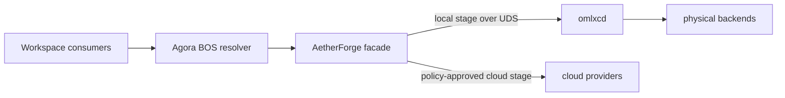

# AetherForge × omlxc v3 收敛契约

> AetherForge 是唯一公共策略门面，`omlxc` 是唯一的本地物理算力中枢。
> 公共推理只通过 `bos://compute/aetherforge/infer` 暴露。

## 1. 收敛后的调用链



这条链只有一个公共入口和一个本地 placement owner：

- Agora 负责 BOS 注册、发现和 transport，不解释模型或执行推理。
- AetherForge 负责调用方认证、逻辑模型别名、敏感流、成本与云端策略。
- `omlxcd` 负责本地节点、容量、驻留、健康、物理 fallback 与推理执行。
- oMLX App、LM Studio / LM Link 和 Ollama 是 `omlxcd` 的 backend adapter。

不得为 `omlxc` 新增公共 BOS URI，也不得让 AetherForge 在 active 本地路径重复实现
MemoryGuard、模型加载、后端发现或物理 fallback。

## 2. AetherForge 内部职责

| 组件 | v3 职责 |
|---|---|
| `llm_gateway` | OpenAI 兼容门面、认证、别名解析、敏感流与 local/hybrid/cloud 上层策略 |
| `OmlxcClient` | 通过私有 Unix Socket 调用 versioned route、chat、stream 与 embedding 契约 |
| `compute_mesh` | 非本地物理 placement 的上层 provider / 成本视图；不扫描或调度 `omlxc` 节点 |
| `swarm_engine` | 目标与任务编排；只消费 gateway 能力，不直接选择本地 backend |
| compatibility shims | 保持既有 Python 导入兼容，不形成第二套路由配置 |

HTTP 门面、BOS stdio 入口和仓内调用必须复用同一逻辑模型与安全策略。它们可以有
不同 transport，但不能各自维护别名或本地 fallback。

## 3. 模式契约

`AETHERFORGE_OMLXC_MODE` 只允许以下迁移状态：

| 模式 | 行为 | 用途 |
|---|---|---|
| `legacy` | 使用旧路径，不调用 `omlxcd` 推理 | 可恢复回滚 |
| `shadow` | 调用一次只读 route plan，真实推理仍仅执行一次 legacy 路径 | 路由对账 |
| `active` | local 阶段完全交给 `omlxcd`；AetherForge 保留上层策略 | v3 正式路径 |

`shadow` 不允许第二次推理。`active` 不允许读取旧跨仓模型 JSON、调用 `omlxc`
子进程、直连每模型端口或在 AetherForge 内复制本地 placement。

## 4. 模型与 fallback 所有权

```text
logical model / alias
  owned by AetherForge
      ↓ resolve exactly once
local model ID
      ↓ private typed request
physical placement
  owned by omlxcd
```

- AetherForge 把已解析的本地模型 ID 交给 `omlxcd`，不传业务别名让 daemon 猜测。
- `omlxcd` 在本地 backend 间按健康、能力、容量、延迟和策略选择 placement。
- typed `unavailable`、`no_capacity` 或 `timeout` 只说明本地阶段结果；是否进入云端
  由 AetherForge 的 routing mode 与敏感流策略决定。
- `local` 与敏感流失败闭合。`hybrid` 只有在策略明确允许时才进入既有云端链。
- 未知下游错误不能任意透传状态或内容；公共错误必须白名单映射并脱敏。

## 5. 流式与 thinking 契约

- 首个实际 content token 之前，AetherForge 可以把 typed 本地失败转换为对应 HTTP
  错误；元数据块不能提前锁定成功状态。
- content 已发出后，断流通过 SSE typed error 表达，不重放、不伪造 `[DONE]`。
- pre-token 元数据缓冲必须有事件数、字节和 deadline 上限，超限失败闭合并关闭源。
- 取消、timeout 和 transport 断开必须收敛底层流，不能遗留推理进程。
- thinking 默认关闭。只有调用方明确授权且质量策略允许时才可请求 reasoning；
  AetherForge 和 `omlxc` 都不得把隐藏推理作为普通正文返回。

## 6. SSOT 与禁止的副本

| 事实 | SSOT |
|---|---|
| AetherForge 认证、别名、云策略 | AetherForge 配置与策略代码 |
| 本地节点、backend、placement 与策略 | `omlxc` schema v1 TOML |
| 本地运行时健康、容量、Job、路由、指标 | `omlxcd` API |
| Workspace 服务生命周期 | [服务注册表](../../.omo/_truth/registry/services.yaml) |
| ComputeEngine / ModelDefinition | [eCOS MOF](../../projects/ecos/src/ecos/ssot/mof/m1/) |
| BOS 入口 | Agora service registry 中的 `bos://compute/aetherforge/infer` |

以下实现不再是正式路径：

- 跨仓读取旧模型 JSON；
- AetherForge 通过 subprocess 执行 `omlxc`；
- AetherForge 直连独立模型端口并自行拉起服务；
- 用 LM Link 取代 `omlxcd` 的节点身份、容量与 placement；
- Workspace 或 autopilot 直接改写彼此的模型状态。

运行时端点、节点、模型、测试数量和服务端口属于机器 SSOT，不复制进本文。

## 7. 服务与安全边界

- AetherForge 的公共 transport 必须认证；扩大绑定范围时不允许取消鉴权。
- AetherForge 启动路径不能依赖外部网络，并应隔离无关系统代理。
- `omlxcd` 只监听权限受限的 Unix Socket，不暴露公共网络服务。
- tailnet 节点由 `omlxc` 通过稳定身份与 allowlist 校验；SSH 只做控制，不承载
  公共推理。
- K1 内容不得进入云端 fallback、日志或未授权 metadata。

## 8. 发布判据与回滚

发布验证必须覆盖：

1. Agora 从 YAML registry 解析唯一 BOS URI，而不是命中 fallback 注册表；
2. AetherForge 完成认证与逻辑模型解析；
3. active local 请求只调用一次 `omlxcd` 推理且不触发云端；
4. chat、stream、embedding 与 typed failure 契约一致；
5. thinking 关闭，日志与错误无敏感内容；
6. 子仓提交、发布标签和 Workspace gitlink 都可从远端到达。

回滚不改变所有权边界：先把 AetherForge 切回 `legacy`，再停止 `omlxcd` 并恢复
旧 CLI / 配置快照。旧提交和标签保持不可变；恢复通过新提交完成，不 force push、
不 hard reset。

本地算力的操作手册见
[omlxc v3 × AetherForge 本地算力中枢](../local-compute/omlx-cluster-architecture.md)。
