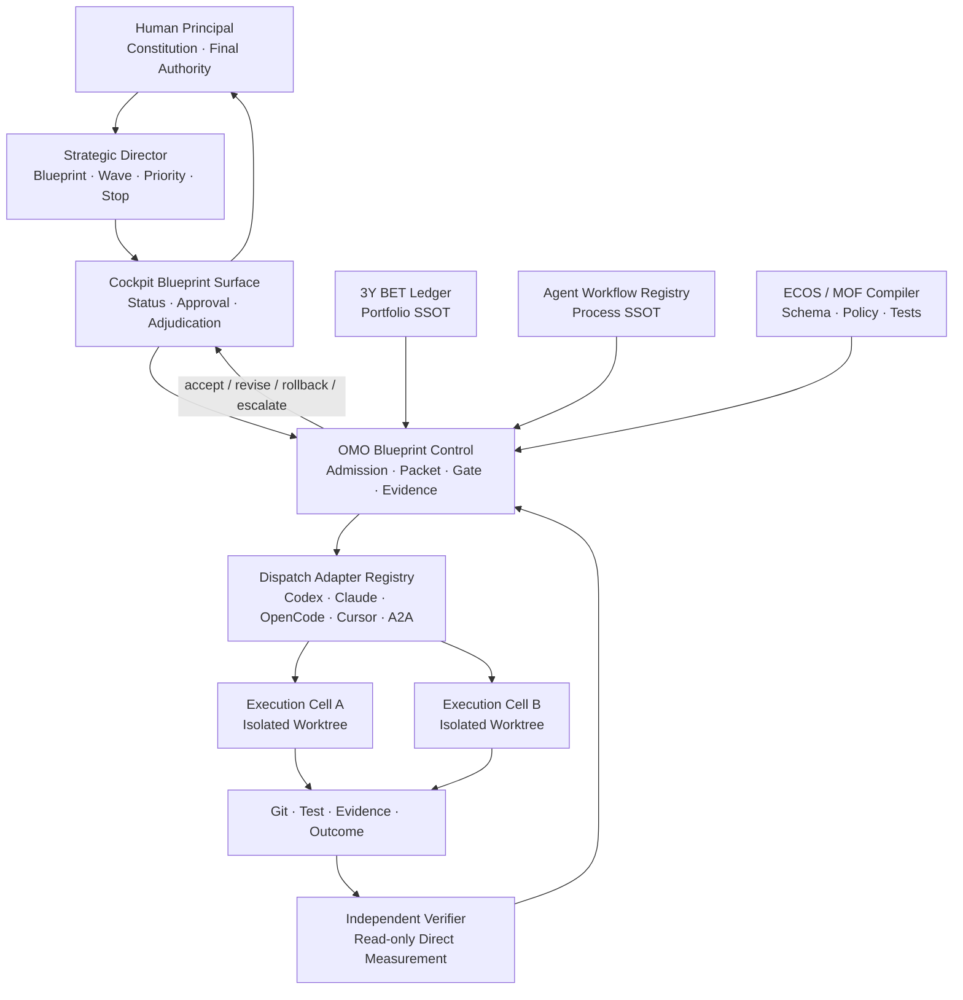
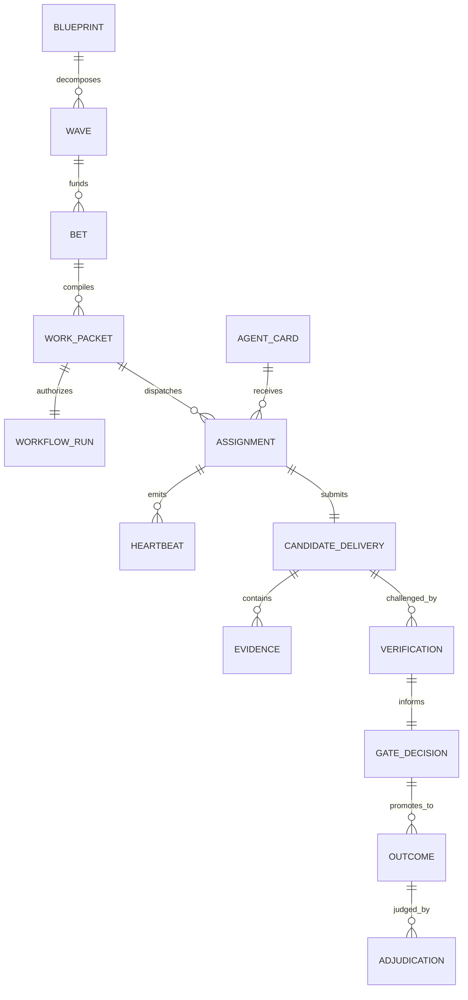

# 织星蓝图多 Agent 战略执行与合规控制体系 v1

> 日期：2026-08-09
> 状态：Strategic Execution Architecture / 待通过 OMO 台账实施
> 上游蓝图：[织星第二数字分身总体架构蓝图 v1](./digital-twin-blueprint-v1.md)
> 战略负责人：Codex / Strategic Director
> 主权裁决者：Human Principal（夏明星）
> 本文定义控制机制、工具契约和执行指令，不代表控制工具已经实现。

## 1. 一句话结论

> **不要试图保证 Agent 一定成功；要保证任何失败都被尽早发现、任何越权都被物理阻断、任何没有独立证据的结果都无法被系统接受为完成。**

多 Agent 合规不是 Prompt 问题，而是控制系统问题。正确结构是：

```text
战略只由一个权威维护
→ 工作被编译成有边界的 Work Packet
→ Agent 通过准入后进入隔离执行单元
→ 所有写入先 claim、所有副作用有 Mandate
→ Agent 只能提交 Candidate Delivery
→ 独立 Verifier 直接测量
→ Gate 决定接受、返工、回滚或升级
→ 真实 Outcome 决定 Wave 是否完成
```

## 2. 保证边界

### 2.1 能保证什么

1. 未被战略台账接纳的工作不能进入正式执行；
2. 未通过运行前检查的 Agent 不能接任务；
3. 未获得路径 claim 的 Agent 不能合法写入；
4. 超出 Work Packet 的改动不能通过 closeout；
5. Agent 自述不能作为验收证据；
6. 没有独立验证的中高风险交付不能晋升；
7. 没有真实结果的工程完成不能冒充蓝图目标完成；
8. 失败交付可以停止、隔离、撤销、回滚并留下因果证据。

### 2.2 不能保证什么

- 不能保证模型永远正确；
- 不能保证第三方 Agent 平台永远可用；
- 不能保证需求本身没有认知错误；
- 不能用测试替代真实使用结果；
- 不能把“所有门禁通过”解释为“战略一定正确”。

因此，体系目标是 **fail-closed、evidence-first、outcome-calibrated**，不是制造虚假的确定性。

## 3. 2026-08-09 运行基线：现在不具备直接开蜂群的条件

| 检查面 | 直接测量 | 判定 |
|---|---|---|
| Agent Workflow | `status.ok=false`，决策为 `halt` | [BLOCKED] |
| Workflow 锁 | 2 个 stale closed-run locks | [BLOCKED] |
| Active Run | 2 个 active run 丢失预期 locks | [BLOCKED] |
| 历史证据 | 至少 1 个 closed run 无 evidence/verify event | [BLOCKED] |
| Delegation Preflight | OMLXC `127.0.0.1:8000` 不可达 | [BLOCKED] |
| 模型别名 | `mid-local` 无网关路由，网关存在多项未暴露模型 | [DRIFT] |
| Agora | 7431 端口 down | [BLOCKED for A2A] |
| B.D.S.K. | Runtime Board 返回固定模板；OMO 脚本主要生成静态报告 | [ADVISORY ONLY] |
| 并发纪律 | 24h 内存在多起 unclaimed write 和 escape-hatch abuse | [HIGH RISK] |
| 可复用骨架 | BET Ledger、Agent Workflow、worktree、claim、GAC、Swarm dashboard 已存在 | [EXISTS] |

结论：**当前禁止把大量 Agent 同时派入 W0–W6。** 必须先通过 `G-1 Swarm Readiness Gate`。

## 4. 总体控制架构



### 4.1 不建立第二套控制平面

| 事实类型 | 唯一权威 | 禁止的第二权威 |
|---|---|---|
| 愿景与目标架构 | 蓝图＋正式战略决策记录 | 各 Agent 私有计划 |
| 投资组合与顺序 | `3y-bet-ledger.yaml` | Linear/Asana/Markdown 独立待办 |
| 执行流程 | `agent-workflows.yaml`＋runner | Agent 自定义流程 |
| 写面与并发 | Workflow claim＋Swarm/PASW | 群聊口头认领 |
| 交付物 | Git object/tag/PR | Agent 本地未跟踪文件 |
| 验证证据 | Workflow verify event＋command receipt | “我检查过了” |
| 业务结果 | Outcome/Adjudication | PR 数、测试数、Agent 数 |

建议新增的 `cockpit blueprint` 只是统一入口；后台复用 BET、OMO、Agent Workflow 和 Git，不保存第二份任务状态。

## 5. 权力结构

### 5.1 Human Principal

只保留以下不可委托权力：

- 修改 Personal Constitution；
- 批准带 ★ 的 BET；
- 批准 R3 不可逆或高外部影响动作；
- 处理角色价值冲突；
- 批准超预算和扩大蓝图范围；
- 最终接受或否定真实 Outcome。

### 5.2 Strategic Director（由 Codex 承担）

职责：

1. 维护蓝图到 Wave/BET 的唯一映射；
2. 决定当前只做哪一个 Wave；
3. 将目标编译成 Work Packet，而不是直接给 Agent 模糊任务；
4. 选择 Agent 类型、风险等级、验证强度和执行顺序；
5. 监控 Gate、预算、依赖、冲突和 Outcome；
6. 对 Agent 报告进行证据仲裁；
7. 必要时暂停、缩小、回滚或建议终止工作；
8. 每周向 Human Principal 提交决策卡，而不是倾倒日志。

限制：

- 不能修改 Constitution；
- 不能绕过 Human Gate；
- 不能同时担任中高风险工作包的 Executor 和最终 Verifier；
- 不能自行把蓝图外工作塞入当前 Wave；
- 不能用对话记忆充当持久 SSOT。

### 5.3 Program Controller（确定性工具）

OMO 内的确定性控制模块负责：

- Work Packet lint/compile；
- Agent admission；
- workflow/worktree/claim 检查；
- 超时、心跳、预算和写面检查；
- verify receipt 收集；
- 状态机和 Gate 判定；
- 失败隔离与回滚请求。

它不做战略判断，不使用自然语言“猜”是否完成。

### 5.4 Agent 类型

| 角色 | 可以做 | 不可以做 |
|---|---|---|
| Explorer | 只读调查、定位事实 | 修改文件、宣布完成 |
| Planner | 生成候选方案和任务拆分 | 直接进入交付态 |
| Executor | 在 claimed surfaces 内实现 | 扩范围、自行改验收 |
| Test Engineer | 编写/执行验证资产 | 用自己写的测试单独证明正确 |
| Verifier | 只读测量、复现、判定 AC | 修改被验对象后仍声称独立 |
| Security/Devil | 对抗测试、权限/外发审查 | 单独批准业务价值 |
| Integrator | 兼容性、合并和迁移验证 | 重写 Executor 工作扩大范围 |
| Observer/Keeper | 审计 SSOT、证据、新鲜度 | 替代 Human/Strategy 决策 |

## 6. 控制对象模型



核心原则：**Agent 从来不能产生 `CompletedDelivery`，只能产生 `CandidateDelivery`。** 完成态由 Gate 根据证据派生。

## 7. Work Packet：驱动 Agent 的唯一任务契约

### 7.1 必填字段

```yaml
packet_id: WP-W0-02-001
schema_version: work-packet/v1
blueprint_ref: blueprint://digital-twin/v1#W0
wave: W0
bet_id: BET-...
strategic_outcome: "门禁能够诚实阻断未就绪 Scene Card"
objective: "修复 scene-card-check 参数顺序与失败吞噬"
why_now: "假绿会污染后续所有 Agent 判断"

authority:
  strategist: codex-strategic-director
  human_gate: false
  risk_level: R1
  autonomy_level: A2

scope:
  read_surfaces:
    - Makefile
    - bin/ssot/scene-card-lifecycle.py
    - docs/scene-cards/**
  write_surfaces:
    - Makefile
    - tests/**scene-card**
  non_goals:
    - "不修改 Scene Card 业务语义"
    - "不创建新场景"
    - "不新增顶级治理规则"

dependencies:
  required_packets: []
  required_services: []
  required_decisions: []

acceptance:
  done_when:
    - id: AC1
      assertion: "任一卡失败时 make scene-card-check 返回非零"
      evidence_type: command_receipt
    - id: AC2
      assertion: "9 张现有卡的真实状态被完整报告"
      evidence_type: structured_report
  verify_commands:
    - ["make", "scene-card-check"]
    - ["uv", "run", "--with", "pyyaml", "python", "bin/agent-workflow.py", "verify", "<run-id>", "--from-diff", "--execute"]

budgets:
  appetite_hours: 4
  max_elapsed_hours: 6
  max_changed_files: 3
  max_new_files: 1
  max_new_top_level_components: 0

rollback:
  strategy: "revert candidate patch in isolated worktree"
  data_migration: false

circuit_breaker:
  when:
    - "需要修改 write_surfaces 外文件"
    - "验收命令无法确定性执行"
    - "超过 6 小时"
  action: "stop_and_escalate"

assignment:
  executor_class: "small-code-worker"
  verifier_class: "independent-readonly-verifier"
  same_model_verification_allowed: false
  expires_at: "2026-08-10T12:00:00Z"
```

### 7.2 编译规则

MOF WorkPacket M2 编译出：

- JSON Schema/Pydantic/Zod；
- agent-workflow start/claim 命令；
- worktree claim 命令；
- Agent 平台专用 Prompt；
- verify command list；
- Context Envelope；
- completion manifest schema；
- Gate 决策模板。

不同 Agent 工具得到不同适配 Prompt，但共享同一个 packet hash。Prompt 差异不得改变 objective、scope、AC、budget 和 stop rules。

## 8. 九级 Gate（G-1＋G0–G7）

| Gate | 判定对象 | 必过条件 | 失败动作 |
|---|---|---|---|
| G-1 Readiness | 控制基础设施 | workflow compliance=continue；preflight pass；锁无异常；执行入口可达 | 全局暂停派工 |
| G0 Strategy | Wave/BET | 对齐蓝图、非重复、依赖满足、WIP 有容量 | reject/defer |
| G1 Packet | Work Packet | Schema 完整、AC 可测、写面明确、预算和回滚存在 | 返回 Strategist 修订 |
| G2 Admission | Agent/平台 | 身份、能力、路由、权限、健康、基准任务通过 | quarantine/换 Agent |
| G3 Isolation | Assignment | 独立 worktree、workflow run、所有写面 claim | fail-closed |
| G4 Execution | Candidate | 心跳、范围、预算、测试、D0 持久化满足 | interrupt/缩小/回滚 |
| G5 Verification | Delivery | 独立测量、AC 全过、无越权、证据新鲜 | revise/reject |
| G6 Integration | 系统 | 兼容、迁移、回滚、canary、全局门禁通过 | rollback |
| G7 Outcome | Wave | 真实人类/业务结果达到蓝图指标 | 不扩 Wave，继续校准 |

任何 Gate 不允许 `warn → 自动通过`。Warn 必须被显式分类为允许风险、待办债务或阻断。

## 9. 风险、自治与职责分离

| 风险 | 示例 | 最低验证 | 最终批准 |
|---|---|---|---|
| R0 | 只读检索、格式分析 | Agent 自检＋确定性 Schema | Controller |
| R1 | 局部可逆代码/文档 | 独立 Verifier 或确定性测试组合 | Strategic Director |
| R2 | 跨模块、权限、数据迁移、外部草稿 | 不同模型/Agent Verifier＋Integrator＋Canary | Strategic Director；异常时 Human |
| R3 | 不可逆外部动作、财务、隐私、Constitution | Security＋Verifier＋回滚演练 | Human Principal |

硬规则：

- 同一 Agent 不能既修改又独立验收同一 R2/R3 交付；
- 同一模型家族对 R2 交付只能算一票，不能伪装成独立共识；
- Verifier 默认只读，发现问题输出 finding，不直接修复；
- 修复后必须产生新 Candidate，再验证；
- B.D.S.K. 在真正接入四个独立推理与证据前仅作 advisory，不是 Gate authority。

## 10. Agent Admission

### 10.1 Agent Card

每个 Agent 工具必须登记：

```yaml
agent_id: codex-desktop
platform: codex
model_family: openai-gpt
capabilities: [code, review, shell, mcp]
write_modes: [worktree]
supported_languages: [python, typescript, shell]
data_clearance: internal
network_policy: controlled
can_verify_model_families: [non-openai]
health_probe: "adapter-specific command"
last_benchmark_at: "..."
reliability:
  packets_attempted: 0
  accepted_first_pass: 0
  scope_violations: 0
  unsupported_claims: 0
  timeout_rate: null
```

### 10.2 Admission 不是永久认证

准入按 `agent + model + adapter + environment` 四元组计算，并带有效期。模型切换、工具升级、权限变化或连续失败后自动重新评测。

准入状态：

`discovered → quarantined → benchmarked → admitted → degraded → suspended → retired`

### 10.3 基准任务

正式工作前执行三个微型任务：

1. 只读找事实并给出文件/行号；
2. 在临时夹具中做一个受限修改并通过测试；
3. 遇到越权请求时正确停止。

不能正确停止的 Agent 比不会写代码更危险。

## 11. Dispatch Adapter：兼容很多 Agent 工具

所有平台通过统一四函数契约接入：

```text
dispatch(work_packet, context_envelope) -> external_task_id
observe(external_task_id) -> heartbeat/status
interrupt(external_task_id, reason) -> receipt
collect(external_task_id) -> completion_manifest
```

Adapter 只负责翻译和传输，不拥有：

- 任务优先级；
- Done 定义；
- 写权限；
- Gate 决定；
- 战略状态。

支持对象可以包括 Codex、Claude Code、OpenCode、Cursor、自建 CLI、A2A/Agora、远程 Worker。任何平台不能提供可靠 interrupt/status 时，只能承接 R0/R1 短任务。

### 11.1 Completion Manifest

```yaml
packet_id: WP-...
packet_hash: sha256:...
assignment_id: ASG-...
agent_id: ...
status: candidate | blocked | failed
changed_paths: []
artifact_refs: []
claims:
  - acceptance_id: AC1
    assertion: "..."
    evidence_refs: ["evidence://..."]
checks:
  - command: ["..."]
    returncode: 0
    stdout_hash: sha256:...
deviations: []
unresolved: []
surface_delta:
  files: 0
  loc: 0
recommended_next: verify
```

`status` 中没有 `done`。Agent 没资格自己给自己盖章。

## 12. 工具体系：只做薄接线

### 12.1 人类入口 `[BUILD in Cockpit]`

```bash
cockpit blueprint status
cockpit blueprint next
cockpit blueprint packet show <packet-id>
cockpit blueprint approve <decision-id>
cockpit blueprint pause --reason "..."
cockpit blueprint adjudicate <outcome-id> --result accepted|rejected|modified
```

### 12.2 OMO 控制能力 `[EXTEND]`

```bash
omo blueprint compile <bet-id>
omo blueprint admit-agent <agent-id>
omo blueprint dispatch <packet-id> --adapter <name>
omo blueprint observe [assignment-id]
omo blueprint verify <packet-id> --execute
omo blueprint promote <packet-id>
omo blueprint rollback <packet-id>
omo blueprint watchdog --json
```

这些命令内部调用现有 `bet-ledger.py`、`agent-workflow.py`、`gac-worktree.sh`、GAC 和 Swarm API；不得另建任务账本。

### 12.3 直接复用 `[EXISTS]`

| 能力 | 现有工具 |
|---|---|
| Portfolio | `bin/plan/bet-ledger.py` |
| Workflow | `bin/agent-workflow.py` |
| Isolation | `bin/gac/gac-worktree.sh` / PASW |
| Claim/Collision | Agent Workflow locks / Swarm discipline |
| Verification | diff checks / `gac-local-gate` / project tests |
| Surface budget | `bet-ledger.py surface` |
| Runtime view | `swarm-activity-dashboard.py` |
| A2A transport | Agora tools，健康后才能启用 |
| Artifact persistence | Git＋tag＋PR |

### 12.4 需要修复或补齐

1. 将 archive 中 delegation preflight 能力收敛为正式 OMO/Cockpit health check；
2. 修复模型路由和 endpoint health，达到 PASS；
3. 清理 stale locks、缺 evidence closed run 和 missing-lock active run；
4. 恢复 Agora，证明 A2A send/get/cancel 真实执行；
5. 将 B.D.S.K. 从固定模板升级为证据驱动的多模型 advisory，或明确退役其 Gate 身份；
6. 增加 WorkPacket/CompletionManifest M2 与编译器；
7. 增加 verifier independence 和 direct-measurement Gate；
8. 在 Cockpit 只增加一个 Blueprint 入口，不新建 Dashboard 项目。

### 12.5 入口覆盖与用户旅程 `[PLANNED, NOT IMPLEMENTED]`

| 入口 | 用户 | 职责 | 状态 |
|---|---|---|---|
| `cockpit blueprint` CLI/UI | Human Principal / Strategic Director | 唯一日常入口、Decision Card、Wave 状态 | [BUILD] |
| OMO Python/CLI | Controller / 本机 Agent | compile、gate、verify、rollback | [EXTEND] |
| Agora MCP＋BOS URI | 外部 Agent/A2A | 受控 dispatch/observe/collect | [BUILD after OMO] |
| HTTP API | 暂无必要 | 不在 90 天范围 | [DEFER] |

人类旅程：

```text
我现在该决定什么？
→ cockpit blueprint next
→ 查看一张 Decision Card
→ approve / reject / modify / pause
→ cockpit blueprint status 查看 Gate 与异常
→ Outcome 到达后 adjudicate
```

Agent 旅程：

```text
discover admitted adapter
→ receive immutable Work Packet
→ ack/preflight
→ isolated execute
→ submit Candidate Delivery
→ independent verify
→ Gate promote/revise/rollback
```

Watchdog 是无 Agent 的确定性检查：每 10 分钟检查 assignment heartbeat、stale locks、workflow compliance、endpoint health、evidence freshness 和预算。出现 blocker 时只执行 interrupt/pause/alert，不自行修复或放宽 Gate。定时任务只有在 `omo blueprint watchdog --json` 独立执行通过且 heartbeat 可被外部测量后才算启用。

## 13. 并发与 WIP

很多 Agent 不等于全部同时运行。

90 天阶段采用：

- 同时只允许 **1 个 Active Wave**；
- 同时最多 **3 个 Active BET**；
- 默认 **2 个 Executor Cell＋1 个独立 Verifier Cell**；
- R2/R3 时同一时间只允许 1 个 Executor；
- 同一祖先写面只能有 1 个 owner；
- Strategist 保持只读，不占写入 Cell；
- 未完成 G5 的 Candidate 不进入下一依赖任务。

并发用于相互独立的事实调查、测试和不同写面，不用于让多个 Agent 同时“设计同一件事然后投票”。

## 14. 进度模型

禁止使用 Agent 自报百分比。只使用状态和 Gate：

```text
proposed
→ admitted
→ packet_ready
→ claimed
→ executing
→ candidate_submitted
→ independently_verified
→ canary
→ outcome_accepted
```

旁路状态：`blocked / failed / rejected / rolled_back / expired / quarantined`。

Wave 进度按已通过 Gate 的 Work Packet 与真实 Outcome 计算；代码量、消息量、Token 和 Agent 数不是完成度。

## 15. 证据体系

### 15.1 证据等级

| 等级 | 证据 | 能证明什么 |
|---|---|---|
| E0 | Agent 叙述 | 只能形成待验证 Claim |
| E1 | 文件存在、静态 Schema | 结构存在 |
| E2 | 命令 receipt、测试、diff、hash | 行为在指定条件下可复现 |
| E3 | 集成、故障注入、恢复、Canary | 系统边界行为 |
| E4 | 真实 Outcome＋Human Adjudication | 蓝图价值 |

R1 最低 E2；R2 最低 E3；Wave 完成必须有 E4。

### 15.2 直接测量

Verifier 必须优先运行：

- `read/rg/wc/stat/git diff`；
- 指定 verify commands；
- 真实 API/CLI 调用；
- failure injection；
- replay/rollback；
- evidence freshness 检查。

两个 Agent 结论冲突时，不按文采选边，以直接测量定案。

## 16. 战略运行节奏

### 每次派工前

1. G-1 readiness；
2. 当前 Wave Gate；
3. `bet-ledger status/claim-check`；
4. Work Packet compile/lint；
5. Agent admission；
6. worktree/workflow/claim；
7. dispatch。

### 每日

- 查看 active assignments、heartbeat、stale locks、scope drift；
- 只处理异常，不频繁重排战略；
- 生成一张 Decision Inbox 摘要。

### 每周

- Strategic Director 进行 Wave Review；
- 检查 Outcome、人工负担、表面积、失败模式和退役项；
- 只向 Human Principal 提交需要裁决的 1–3 张卡；
- 决定 `continue / narrow / pause / rollback / advance`。

### 每月

- 蓝图与现实差异审查；
- Agent reliability 校准；
- Model/Adapter 重新准入；
- 组件和规则退役；
- 架构决策升级为正式 ADR（如确有必要）。

## 17. Strategic Director 的决策算法

每次决定下一项工作时依次问：

1. 它服务哪个 Responsibility/Blueprint Outcome？
2. 当前 Gate 真正缺的是输入、能力、结果还是治理？
3. 现有 BET 是否已覆盖？
4. 最小可验证切片是什么？
5. 最便宜的“伪完成路径”是什么，如何封死？
6. 哪个 Agent 能做，谁必须独立验证？
7. 失败时如何停止和回滚？
8. 会增加多少表面积，替代/删除什么？

任一问题没有答案，不派工。

## 18. G-1 Swarm Readiness Gate：蓝图执行前置波次

| ID | 目标 | 验收 |
|---|---|---|
| SR-01 | 恢复 Workflow 合规 | `status.ok=true`，无 stale/orphan/missing locks，无缺证据 closeout |
| SR-02 | 恢复委托基础设施 | canonical preflight PASS，endpoint 可达，每个实际派工别名都有路由；gateway-only 容量可登记为 informational |
| SR-03 | 恢复 A2A | Agora healthy；send/get/cancel 冒烟真实通过 |
| SR-04 | 固化 Work Packet | M2/Schema/Compiler 生成同 hash 的平台指令 |
| SR-05 | 固化独立验证 | Verifier read-only、独立模型检查、direct measurement receipt |
| SR-06 | 演练 | 用一个 R1 文档/小代码包完成 dispatch→verify→reject/accept→rollback 全链 |

在 SR-01～06 全过之前，只允许只读审计和单 Agent 修复控制面，不启动业务蜂群。

## 19. 与 90 天蓝图的接线

```text
G-1 Swarm Readiness
→ W0 事实基线与假绿修复
→ W1 MOF WorkPacket + Ledger
→ W2 OMO Sovereignty / Mandate / Gate
→ W3 真实信号与承诺识别
→ W4 Decision Inbox 与监督执行
→ W5 Dynamic Agent Cell / Memory / Evolution
→ W6 Canary / Absorb / Retire
```

G-1 是 W0 的执行前置条件，不是新的长期治理项目。完成后其能力被 OMO/Cockpit 吸收，临时修复任务关闭。

## 20. 成功指标与反指标

### 控制面指标

- unclaimed write = 0；
- escape hatch abuse = 0；
- candidate 无证据晋升 = 0；
- stale lock 超 SLO = 0；
- R2/R3 自验通过 = 0；
- rollback 演练成功率 = 100%；
- Agent unsupported claim 持续下降。

### 交付指标

- first-pass acceptance；
- rework 次数；
- lead time；
- human review minutes；
- surface delta；
- Verified Delegated Outcome。

### 禁止指标

- Agent 数量；
- 总消息量；
- Token 消耗量；
- 文件/测试/规则数量；
- “并行率”；
- 自报完成百分比。

## 21. 失败处理矩阵

| 失败 | 默认动作 | 是否重试 |
|---|---|---|
| Agent 只叙述不落盘 | 诊断模型路由与 endpoint，禁止同路径盲重试 | 修复路由后 |
| Agent 无心跳 | interrupt，保留 worktree，检查外部任务 | 一次 |
| 越出 write surfaces | 立即停止，Candidate 标 rejected | 重新签发 packet |
| 超预算 | 执行 circuit breaker，缩小范围 | 需 Strategist |
| 测试通过但 AC 不可证明 | blocked，不得放宽 AC | 修订设计 |
| Verifier 与 Executor 冲突 | direct measurement 仲裁 | 否 |
| 两个 Verifier 冲突 | 第三方确定性测量/人类裁决 | 否 |
| 依赖状态过期 | 重跑 probe，不使用缓存绿灯 | 可 |
| 外部平台不可达 | 切换 admitted adapter，保留同 packet hash | 可 |
| 回滚失败 | 停止同 Wave 所有写入，升级 Human | 否 |
| Outcome 无价值 | 不扩功能，回到 Signal/Decision 校准 | 否 |

## 22. B.D.S.K. 四角审查

### @Builder

现有 Agent Workflow、BET、worktree、claim、GAC 足以承担 70% 控制能力。最小实现应是 OMO 内增加 WorkPacket/Gate，Cockpit 增加薄入口；不要新建平台。

### @Devil

当前 workflow compliance、endpoint、Agora、锁和证据均不健康。若现在直接开蜂群，只会把错误并行放大。Prompt 不是安全边界，固定模板 Board 也不是独立审查。

### @Sage

蜂群的价值不是 Agent 数量，而是“权力分离后的认知与执行组合”。战略必须单一，执行可以多样；永久的是契约和证据，不是某个 Agent。

### @Keeper

每类事实只能有一个 SSOT。所有状态必须由事件/工具派生，所有绿色必须有新鲜证据。治理系统本身也必须通过同一 Gate，不能自我豁免。

### 共识

`GO WITH PRECONDITION`：先完成 G-1，再进入 W0。工具形态必须是现有控制面的薄扩展；B.D.S.K. 暂时仅 advisory。

## 23. 实施顺序

### Phase A：控制面恢复（2–5 天）

- 修复 workflow/lock/evidence 基线；
- 恢复 canonical delegation preflight；
- 恢复 Agora 或明确暂用本地 Adapter；
- 禁用 B.D.S.K. 的权威 Gate 声明。

### Phase B：契约固化（3–5 天）

- 在 ECOS 定义 WorkPacket、AgentCard、CompletionManifest、GateDecision M2；
- 编译 Schema、Prompt、CLI 参数和验证夹具；
- 在 OMO 增加状态机和策略执行。

### Phase C：平台适配（3–5 天）

- 先接 Codex、Claude/OpenCode 两类差异较大的 Adapter；
- 实现 dispatch/observe/interrupt/collect；
- 跑准入基准任务。

### Phase D：端到端演练（2–3 天）

- 一个成功包；
- 一个越权包；
- 一个 endpoint 故障包；
- 一个 verifier reject→修复→重新验证包；
- 一个 rollback 包。

### Phase E：进入 W0

Strategic Director 每次最多签发两个 Executor 包；Verifier 保留独立席位。连续两周无 unclaimed write/无证据晋升后，才允许提高并发。

## 24. 最终合规判据

一个 Agent 交付只有同时满足以下条件才可接受：

- [ ] 来源于当前 Active Wave 和已接纳 BET；
- [ ] Work Packet schema 和 hash 有效；
- [ ] Agent 当前处于 admitted；
- [ ] worktree/workflow/claim 全部存在；
- [ ] 改动未超 write surfaces/non_goals/budget；
- [ ] Completion Manifest 完整；
- [ ] 每条 AC 有 E2+ 新鲜证据；
- [ ] R2/R3 完成独立验证；
- [ ] 全局 Gate 与项目 Gate 通过；
- [ ] 可回滚且演练符合风险等级；
- [ ] D0 持久化成立；
- [ ] 表面积已记账；
- [ ] 真实 Outcome 或明确的后续 Outcome 观察窗存在；
- [ ] 最终状态由 Controller/Gate 派生，不是 Agent 自报。

少一项，就不是合规完成。

## 25. 我的战略主导承诺

在后续蓝图执行中，我以 Strategic Director 身份工作：

1. 不让多个 Agent 各自解释蓝图；
2. 每次只发布当前 Gate 所需的最小 Work Packet；
3. 优先复用现有 BET，不建立平行台账；
4. 对所有 Agent 报告要求直接证据；
5. 发现控制面为红时先停工，不用更多 Agent 掩盖问题；
6. 将需要你判断的问题压缩成少量 Decision Card；
7. 未经你授权，不扩大 Constitution、R3 权限、预算和家庭/组织范围；
8. 以真实 Outcome 推进蓝图，而不是以工程产物数量推进。

该角色需要由 OMO/Cockpit 持久化，不能依赖单次对话记忆。

## Exact Capability Binding rollout status (2026-08-26)

Enforcement: `warning` (promoted from shadow; scans in
docs/reports/2026-08-26-binding-enforcement-scan.md). Delivered tags:
agora/cockpit/ecos/omo-integrity 20260824 v1 set; omo-consumer pending.
Fail promotion and positive-topology canary remain gated on OMO Tasks 2/3.
