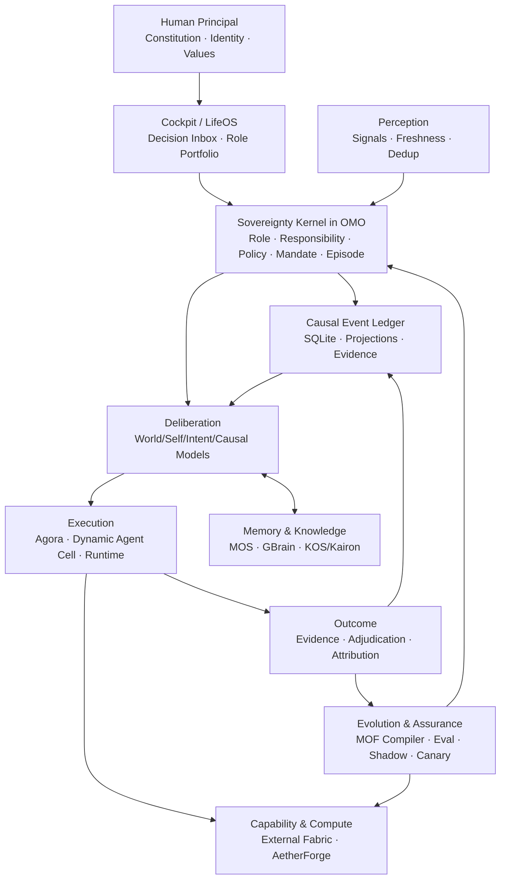
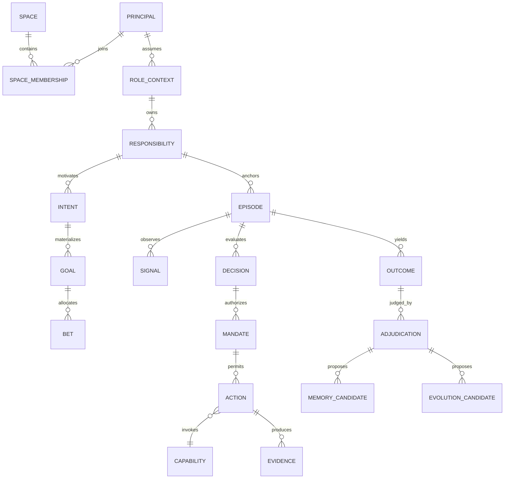
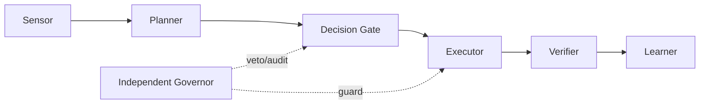
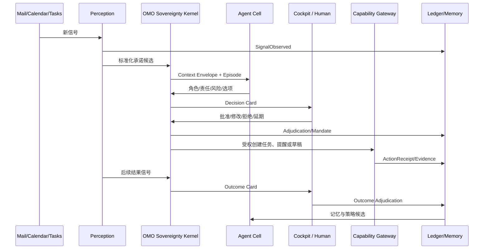
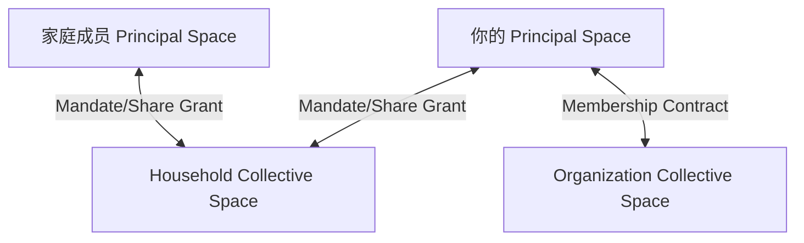

# 织星第二数字分身总体架构蓝图 v1

> 日期：2026-08-09
> 状态：Architecture Review Baseline / 待进入 OMO 执行台账
> 范围：个人数字分身优先，家庭与组织作为递归扩展约束
> 依据：项目实证审计、29 项访谈决策、现有三年战略、5+4+1+1、8D、MOF/本体、OMO/Agora/ECOS/GBrain/AetherForge 资产
> 本文只定义目标架构、迁移机制和验收门，不代表代码已经实现。

## 1. 一句话架构

> **一个由人类宪法约束、以角色责任驱动的 Decision Episode 为运行脊柱、通过可撤销 Mandate 调度动态 Agent Cell，并以真实世界结果持续校准和进化的本地主权数字分身系统。**

## 2. 执行摘要

### 2.1 核心判断

项目不是缺少架构、治理、Agent、模型或工具，而是出现了四个结构性失衡：

1. **主权分裂**：OMO、MetaOS、L4 Kernel、Model-Driven 等多个部分都在承担“内核”职责。
2. **事实分裂**：YAML、JSONL、Registry、State、Evidence、Memory、Dashboard 都可能被当作 SSOT。
3. **价值链断裂**：中段治理和能力极厚，真实世界输入、外部动作和人类结果裁决极薄。
4. **验证能力落后于生产能力**：多个 Agent 以机器速度生成资产，人类无法以相同速度验证，未验证资产继续被后续 Agent 当作事实。

因此，目标不是再增加一个“超级大脑项目”，而是完成五个收敛：

- 从多个控制中心收敛到一个**瘦 OMO 主权内核**；
- 从多套状态文件收敛到一个**SQLite 因果账本**；
- 从 Task/Skill/Agent 各自运行收敛到一条**Decision Episode 因果链**；
- 从静态 Agent 人格收敛到**动态职责 Cell＋最小上下文**；
- 从模型资产数量收敛到**MOF Control Compiler 生成的可执行约束与测试**。

### 2.2 最重要的战略修正

现有三年战略“结构正确，形状错误”的判断仍然成立；本蓝图在其上增加了此前缺失的主权、角色、责任、委托、家庭递归和因果账本。

未来 12–18 个月只证明一个人的闭环价值。家庭和组织不作为当前产品功能扩张，但从第一天保留 `principal_id / space_id / role_context / mandate_id` 等递归扩展边界。

### 2.3 北极星

北极星不是代码量、规则数、Agent 数、场景数、自动化率或治理分数，而是：

> **每周被本人接受的、可验证的委托结果数量与价值，且主要服务于家庭、健康、职业、成长与创作等真实角色责任。**

任何“系统建设者”角色的治理产出不能成为主要价值分子。

## 3. 当前基线审计

### 3.1 已有优势

| 能力 | 当前判断 | 复用方向 |
|---|---|---|
| L0 协议、MOF、L0 约束 | [EXISTS] 资产丰富 | ECOS 继续拥有协议与模型契约，升级为 Control Compiler |
| OMO 治理、Workflow Mesh、证据 | [EXISTS] 主链基础 | 收敛成唯一主权控制内核与 Episode Ledger Broker |
| Agora、BOS URI、MCP | [EXISTS] 连接织层 | 继续负责路由、发现、执行，不拥有决策主权 |
| Cockpit / Cockpit UI | [EXISTS] 统一入口基础 | 收敛成人类 Decision Inbox 与角色组合工作台 |
| GBrain / KOS / MOS | [EXISTS] 知识与检索基础 | 明确语义知识、记忆控制与分析引擎分工 |
| AetherForge | [EXISTS] 模型与算力基础 | 统一模型调用、成本、隐私和数据外发策略 |
| Scene Card / Journey | [EXISTS] 场景契约基础 | 改为从真实 Episode 生长，禁止模板数量冒充成熟度 |
| BET / C2G / Agent Workflow | [EXISTS] 工程迭代基础 | 作为系统建设者责任下的执行机制，不凌驾于人生责任 |
| 审计、哈希链、SQLite 使用经验 | [EXISTS] 可复用 | 统一到 Ledger、Audit、Projection 的清晰职责 |

### 3.2 关键实证

| 实证 | 当前事实 | 架构含义 |
|---|---|---|
| 系统表面积 | 现有战略记录 src 约 72.6 万行、344 ADR、134 规则、200 BOS URI | 继续扩张必然超过可验证能力 |
| BET 状态 | 当前 71 个 BET，34 done、37 candidate | 工程生产力强，但不能证明个人价值闭环 |
| 真实结果 | `adjudications.jsonl` 只有一条 CLI smoke test；PR harvest 主要是工程事件 | 结果面尚未形成业务反馈 |
| Scene Card | 9 张卡按正确命令全部未就绪 | 场景资产存在，真实运行成熟度不足 |
| Scene Card 门禁 | Makefile 参数顺序错误，且 `|| echo` 吞掉失败 | 典型“声明绿色、执行失败” |
| 信号健康 | Apple Mail 标记 healthy，但 `last_signal_at` 已违反自身新鲜度契约 | 健康状态不是实时事实 |
| Workflow Mesh 事件 | JSONL 主日志约 1,289 条、900KB；追加路径需要全量读取/重放 | 当前规模可用，增长和并发模型不可持续 |
| MOF 资产 | 当前注册表记录 55 个 M2、1,196 个 M1、34 个 MOF 工具 | 不是缺模型，而是缺模型到运行产物的编译链 |
| 项目边界 | OMO、MetaOS、L4、Model-Driven、Bus、OMO Debt 等职责交叠 | 需要 Bridge→Absorb，不需要新项目 |

### 3.3 根因树

```text
愿景过宽且没有单一验收主线
├── 多 Agent 并行生成大量资产
│   ├── 模型差异导致语义和实现风格漂移
│   ├── Agent 读取旧声明并继续扩张
│   └── 验证速度远低于生产速度
├── 多种“真相”并存
│   ├── 文本状态被直接修改
│   ├── 运行态与投影态混淆
│   └── 健康指标缺少实时证据
├── MOF/本体使用位置错误
│   ├── 强调模型完整度
│   ├── 编译出的约束、DDL、测试不足
│   └── 模型缺少真实 M0 消费反馈
└── 外部输入与结果裁决缺失
    ├── 系统只能观察自己
    ├── 治理改进成为自我循环
    └── 无法从真实结果学习
```

## 4. 愿景、边界与验收

### 4.1 目标定义

织星不是通用 Agent 平台，也不是人格聊天机器人。它是你的**授权数字代表和个人业务操作系统**，负责：

1. 感知与你责任相关的真实变化；
2. 在角色上下文中识别承诺、风险和机会；
3. 提供可解释的判断与选项；
4. 在明确 Mandate 下执行可授权动作；
5. 获取真实结果并接受你的裁决；
6. 将裁决转化为受控记忆、策略和能力进化。

### 4.2 当前不做

- 不建设通用 SaaS、多租户平台或 Agent 市场；
- 不建设拥有无限上下文和权限的“中央超级 Agent”；
- 不允许无人监督修改 Constitution、主权边界和高风险权限；
- 不以新项目、新层级、新规则或新场景数量作为进展；
- 不在 90 天内引入 Kafka、Temporal Server、EventStoreDB 等重基础设施；
- 不把家庭成员作为你的子账号，不把家庭角色做成新的顶级产品；
- 不开展大爆炸式项目合并或数据库一次性迁移。

### 4.3 成功与证伪

90 天 Golden Scenario 门：

- 连续 4 周，每周至少产生 3 条被接受的真实委托结果；
- 所有正式结果都能追溯到角色、责任、Episode、Mandate 和证据；
- 无越权外部动作、无 Restricted 数据外发、无关键历史丢失；
- 人工审批与纠错总时间小于系统节省的时间；
- 系统建设类工作不突破角色组合 Policy 的上限；
- 至少一条能力或策略通过完整 Evolution Pipeline 晋升，至少一项无价值资产进入退役流程。

未达到时不扩场景、不提高自治、不建设家庭蜂群，先退回修复信号、判断或结果链。

## 5. 第一性原理

| 理论 | 本系统中的问题 | 架构结论 |
|---|---|---|
| 信息论 | 外部信号有噪声、缺失、时效和带宽限制；人的注意力是最稀缺信道 | 每条信号有来源、时间、置信度；Decision Inbox 有通知与审批预算 |
| 图灵模型 | 系统必须明确当前状态、合法转换、可恢复历史和停止条件 | Episode 是状态机；Ledger 是 tape；Capability Action 是受控计算步骤 |
| 系统论 | 个人、角色、家庭、组织、Agent 和工具是不同边界，不可混成一体 | Principal/Space/Role/Agent 分离；系统采用递归空间结构 |
| 控制论 | 没有结果反馈就无法纠偏；单一全局控制器容易振荡和越权 | 建立反射、Episode、角色组合、战略、宪法五个时间尺度回路 |
| 可计算性 | 价值冲突、身份承诺和不可逆选择无法由通用算法可靠决定 | 保留人类裁决；自治只覆盖可定义、可观察、可回滚的问题 |

## 6. 目标逻辑架构



### 6.1 五层问题重新澄清

保留现有 L0–L4 作为代码归属视图，但重新明确每层只回答一个问题：

| 层 | 唯一问题 | 目标责任 | 主要归属 |
|---|---|---|---|
| L4 Sovereignty | 我是谁、为什么、什么不可改变？ | Constitution、Principal、角色、责任、价值红线 | OMO 主权模块＋Cockpit 人类确认 |
| L3 Experience | 人需要看什么、决定什么、如何协作？ | Decision Inbox、角色组合、结果裁决、空间协作 | Cockpit/Cockpit UI |
| L2 Cognition & Control | 当前应做什么、谁被授权做？ | Episode、Policy、Mandate、规划、投影、记忆控制 | OMO＋C2G＋MOS |
| L1 Execution | 动作在哪里、怎样可靠执行？ | Agent Runtime、沙箱、调度、连接器、算力 | Runtime＋Agora＋AetherForge |
| L0 Contract & Model | 数据和行为遵守什么格式？ | MOF、Schema、协议、事件、能力契约 | ECOS |
| I0 Fabric | 怎样发现和路由能力？ | BOS URI、MCP、事件传输、服务发现 | Agora |
| X Cross-cutting | 如何持续安全、可观察和进化？ | 风险、隐私、成本、评测、演进、反熵 | OMO/ECOS/AetherForge/Observability adapters |

5+4+1+1 不再承担产品价值链描述；8D 不再作为另一套物理分层。两者都映射到同一个 Episode 主链：

| 8D 概念 | 新架构中的位置 |
|---|---|
| LifeOS | L4 主权＋L3 角色组合入口 |
| C2G | Responsibility/Intent 到 Goal/BET 的编译器 |
| Goals | 责任的时间边界表达，不是孤立任务树 |
| Agora | 执行与能力路由 |
| AetherForge | 模型、算力、隐私和成本路由 |
| AGE-v2 | Dynamic Agent Cell 的运行实现候选 |
| MOS/KOS/GBrain | 多类型记忆和知识面 |
| X-Plane | Policy、评测、演进和反熵横切控制 |

## 7. 物理组件收敛图

标记：`[EXISTS]` 已存在；`[EXTEND]` 原边界内增强；`[BUILD]` 缺失；`[ABSORB]` 迁入既有边界；`[RETIRE]` 退役；`[CONCEPT]` 远期概念。

| 组件 | 状态 | 目标职责 | 收敛动作 |
|---|---|---|---|
| Cockpit / UI | [EXTEND] | 唯一人类入口、Decision Inbox、Role Portfolio | 吸收家庭场景入口与 outcomes 视图 |
| OMO | [EXTEND] | 唯一主权控制内核、Episode、Ledger、Policy、Projection | 内部切薄，旧治理能力移到外围适配器 |
| ECOS | [EXTEND] | 协议、MOF、Schema、Control Compiler | 不拥有运行状态，不进入业务热路径解释 YAML |
| Agora | [EXTEND] | BOS/MCP 路由、Capability Gateway、Agent Cell dispatch | 吸收 Bus Foundation 传输能力 |
| Runtime | [EXTEND] | 沙箱、租约、调度、补偿、可恢复执行 | 作为 Agent 无关运行面 |
| AetherForge | [EXTEND] | 模型/算力/隐私/成本路由 | 不参与价值决策 |
| GBrain | [EXTEND] | 语义事实、实体关系、检索 | 与 KOS 明确存取边界，受 MOS 控制 |
| MOS | [EXTEND] | 记忆权限、巩固、遗忘、时间有效性 | 成为控制面，不复制存储引擎 |
| KOS/Kairon | [EXTEND] | 分析、索引、本体推理、来源处理 | 不与 GBrain 争夺事实主权 |
| C2G | [EXTEND] | Vision/Responsibility 到 Goal/BET 提案 | 保持无状态意图编译器 |
| MetaOS | [ABSORB] | 有价值的决策门控并入 OMO，工作流规划并入执行层 | Bridge→Shadow→Absorb→关闭独立入口 |
| L4 Kernel | [ABSORB] | 域注册/KEMS 有效能力迁到主权或记忆层 | 消费者清零后退役顶级边界 |
| Model-Driven | [ABSORB] | 并入 ECOS，成为 MOF 编译/校验库 | 退出运行关键路径 |
| Bus Foundation | [ABSORB] | 并入 Agora 传输适配 | EventBus 不拥有事实 |
| OMO Debt | [ABSORB] | 并回 OMO 投影与治理适配器 | 不保持独立项目 |
| Family Hub | [RETIRE] | 转为 Cockpit 家庭场景包 | 数据迁移后归档 |
| Observability 空壳 | [RETIRE] | 采用 OTel adapter 接入真实 Trace | 无消费者空壳退役 |
| Household/Org Runtime | [CONCEPT] | 18 个月后递归空间扩展 | 当前只保留 Schema 约束 |

## 8. 核心领域模型



### 8.1 不可缺少的关系链

```text
Constitution
→ Role Charter
→ Responsibility
→ Intent/Goal
→ BET
→ Decision Episode
→ Delegation Mandate
→ Action/Evidence
→ Outcome/Adjudication
→ Memory/Policy/Capability Evolution
```

正式 Goal、BET、Journey、Task、Agent Action 必须至少关联一个 Responsibility。无责任来源的工作只能进入探索沙箱。

## 9. Decision Episode

### 9.1 Episode 是统一运行单元

一个 Episode 不是聊天 Session，也不等于 Workflow Run。它是一次完整、可解释、可裁决的现实决策回路。

建议生命周期：

```text
observed
→ contextualized
→ deliberating
→ awaiting_authority
→ authorized
→ executing
→ waiting_external
→ evaluating
→ adjudicated
→ consolidated
→ closed
```

异常分支：`blocked / compensating / cancelled / expired / failed`。只有 `closed` 是不可推进终态；纠错通过新事件产生，不修改历史。

### 9.2 最小事件链

```text
SignalObserved
RoleContextAssigned
ResponsibilityLinked
OptionsGenerated
DecisionProposed
MandateGranted
ActionDispatched
EvidenceRecorded
OutcomeObserved
AdjudicationRecorded
MemoryCandidateProposed
EpisodeClosed
```

## 10. 一个因果账本，多种投影

### 10.1 真相分层

| 类型 | 权威 | 可否重建 |
|---|---|---|
| 规范真相 | Git 版本化 Constitution/Policy/Schema | 否，需人类修订历史 |
| 运行真相 | SQLite append-only Event Ledger | 否，是因果事实源 |
| 状态投影 | SQLite projection tables / Cockpit views | 是，可从 Ledger 重建 |
| 认知资产 | GBrain/KOS/MOS | 是推断或巩固结果，需保留来源 |
| 大对象 | Content-addressed object store | 由 hash 和备份验证 |
| 文本事件 | JSONL/Parquet/Markdown export | 是导出，不可反写为权威 |

### 10.2 Ledger 最小物理模型

```sql
event_log(
  sequence INTEGER PRIMARY KEY AUTOINCREMENT,
  event_id TEXT NOT NULL UNIQUE,
  event_type TEXT NOT NULL,
  schema_version TEXT NOT NULL,
  episode_id TEXT,
  principal_id TEXT NOT NULL,
  space_id TEXT NOT NULL,
  role_context_id TEXT,
  responsibility_id TEXT,
  mandate_id TEXT,
  correlation_id TEXT NOT NULL,
  causation_id TEXT,
  producer TEXT NOT NULL,
  idempotency_key TEXT NOT NULL,
  occurred_at TEXT NOT NULL,
  recorded_at TEXT NOT NULL,
  privacy_class TEXT NOT NULL,
  payload_json TEXT NOT NULL CHECK(json_valid(payload_json)),
  evidence_uri TEXT,
  previous_hash TEXT,
  event_hash TEXT NOT NULL,
  UNIQUE(producer, idempotency_key)
)

projection_checkpoint(projector_id PRIMARY KEY, last_sequence, updated_at)
event_outbox(event_id, destination, state, attempts, next_attempt_at,
             PRIMARY KEY(event_id, destination))
schema_migration(version PRIMARY KEY, applied_at, checksum)
integrity_anchor(anchor_id PRIMARY KEY, from_sequence, to_sequence, root_hash, signed_at)
```

必要索引：

- `(episode_id, sequence)`；
- `(principal_id, space_id, recorded_at)`；
- `(responsibility_id, recorded_at)`；
- `(event_type, recorded_at)`；
- `(mandate_id, sequence)`；
- `event_outbox(state, next_attempt_at)`。

物理约束：

- 数据库 Trigger 拒绝 `UPDATE/DELETE event_log`；
- 唯一 Ledger Broker 串行化写事务，Agent 无直接数据库权限；
- `event_id + idempotency_key` 防重复；
- 原始 `SignalObserved` 可暂时没有 `episode_id`；Decision/Mandate/Action/Evidence/Outcome 类事件必须关联 Episode；
- 小型结构化 payload 入库，大附件只存 URI/hash；
- Outbox 保证“账本提交”与“事件发布”不双写；
- 每日在线备份、周期 integrity anchor、定期恢复演练；
- SQLite 使用 WAL 时配置 busy timeout、checkpoint 观测；运行版本必须为官方已修复版本（≥3.51.3，或含修复的 3.44.6/3.50.7 回移版本），否则禁止启用正式 WAL 写入；
- Hash chain 只能发现篡改，不能单独阻止篡改；必须配合外部签名 anchor、加密备份和恢复演练；
- 家庭/多机阶段出现真实并发需求后，通过 `EventStore` 端口迁移 Postgres，不改变领域协议。

### 10.3 事件与 Trace 标准

事件信封借鉴 CloudEvents 的公共元数据；跨进程因果链借鉴 OpenTelemetry/W3C Trace Context。内部至少携带：

```json
{
  "specversion": "1.0",
  "id": "evt_...",
  "source": "bos://perception/apple_mail/inbox",
  "type": "commitment.detected.v1",
  "subject": "episode/ep_...",
  "time": "2026-08-09T10:00:00Z",
  "traceparent": "00-...",
  "episode_id": "ep_...",
  "principal_id": "principal_xmx",
  "role_context_id": "role_family_builder",
  "responsibility_id": "resp_family_commitments",
  "privacy_class": "sensitive",
  "data": {}
}
```

## 11. MOF：数字基因组与 Control Compiler

### 11.1 正确定位

MOF 不减少使用，而是从 YAML 资产中心升级为生成运行约束的编译系统：

```text
M3 元模型
  ↓ 约束可定义的类型与关系
M2 核心类型
  ↓ 实例化
M1 角色、责任、策略、场景、能力配置
  ↓ MOF Control Compiler
DDL / JSON Schema / Pydantic / Zod / Policy / SDK / Tests / Docs
  ↓
M0 Ledger 中真实 Episode、Event、Action、Outcome
  ↓ M0 Feedback
使用率 / 漂移 / 失败 / 新概念候选 / 腐蚀信号
```

### 11.2 首批 M2 类型

不扩 M3；先在现有 M3 能力内建模：

`Principal, Space, RoleContext, RoleCharter, Responsibility, Episode, EventEnvelope, Decision, DelegationMandate, CapabilityAsset, PolicyDecision, ActionReceipt, Evidence, Outcome, Adjudication, MemoryCandidate, EvolutionCandidate`。

### 11.3 编译产物

| 输入 | 编译产物 | 运行消费者 |
|---|---|---|
| Episode/Event M2 | SQLite DDL、JSON Schema、Pydantic/Zod | OMO Ledger、Cockpit、Agora |
| Mandate/Policy M2 | PDP input/output、PEP hooks、非法样例 | OMO Policy、Capability Gateway |
| Capability M2 | BOS descriptor、权限、健康、评测模板 | Agora/AetherForge |
| Journey M2 | 状态机、转换表、补偿骨架、回放夹具 | Runtime/Workflow Mesh |
| Role/Responsibility M2 | Cockpit 表单、Context Envelope、ACL | Cockpit/MOS/Agent Cell |
| Outcome/Adjudication M2 | 指标 projector、校准样本 | OMO/Cockpit/Evolution |

### 11.4 MOF 硬门

每个正式模型元素必须同时具备：

1. 真实消费者；
2. 可执行编译产物；
3. 自动测试；
4. 责任所有者；
5. M0 使用或验证证据；
6. 语义版本和迁移策略。

没有消费者的 M1/M2 进入 candidate，不进入正式 SSOT。LLM 本体推理只做分类、关系发现和冲突建议；确定性 Schema/代码门禁保持最终权威。

## 12. Constitution、角色与责任

### 12.1 最小 Personal Constitution 八章

1. 主权与 Principal；
2. 核心价值和不可逾越红线；
3. 角色、责任与关系边界；
4. 委托、代表与对外披露；
5. 数据、记忆、隐私和所有权；
6. 风险、自治与人类裁决；
7. 自我进化、修订和版本；
8. 审计、恢复、退出和关停。

Constitution 保持 5–12 条稳定核心约束；细节分别下沉到 Role Charter、Policy、Preference、Procedure 和 Decision Record。

### 12.2 角色模型

初始稳定主角色建议：

- Self Operator：健康、时间、财务、成长；
- Family Builder：丈夫、父亲、子女、家庭运营；
- Professional：职业职责和公共承诺；
- System Builder：数字基础设施建设；
- Learner/Researcher：学习、研究和认知更新；
- Creator/Communicator：创作、表达和对外传播。

具体情境使用 `primary_role + 0..N supporting_roles`。角色不做永久总排序，采用动态责任组合：最低保障、最高上限、WIP、注意力预算、算力预算和弹性池。System Builder 建议先试行不超过人工注意力的 25%，该数字属于可校准 Policy，不进入 Constitution。

## 13. 委托、风险和自治

### 13.1 Delegation Mandate

正式外部动作必须有：

```text
principal
executor
role_context
responsibility
purpose
capability_scope
risk_ceiling
valid_from / expires_at
approval_mode
disclosure_policy
budget
revocation
trace
```

### 13.2 双轴模型

避免现有 L0–L3 同名冲突，使用：

- `A0–A3`：自治置信等级；
- `R0–R3`：动作影响等级。

|  | R0 只读 | R1 内部可逆 | R2 外部有限可逆 | R3 高影响/不可逆 |
|---|---|---|---|---|
| A0 Observe | 观察 | 不执行 | 不执行 | 不执行 |
| A1 Suggest | 建议 | 建议 | 建议 | 建议＋明确风险 |
| A2 Supervised | 可自动 | 批准后执行 | 逐次批准 | 禁止自动 |
| A3 Delegated | 可自动 | Mandate 内自动 | 白名单＋预算＋可撤销 | 始终人类裁决 |

不可自我修改：Constitution、身份/数据所有权、权限授予、隐私隔离、自治阈值、不可逆动作规则和对外法律/财务承诺。

### 13.3 PDP/PEP

借鉴 Policy-as-Code 的决策与执行分离：

```text
Agent Proposal
→ Policy Decision Point（允许/拒绝/需审批/需降级）
→ Policy Enforcement Point（Capability Gateway / Sandbox）
→ Action Receipt
→ Ledger
```

Policy 必须在最接近副作用的位置执行，不能只存在于 YAML 或 Prompt。

## 14. Agent 蜂群

### 14.1 动态 Cell



规则：

- Agent 角色是稳定协议，模型是可替换执行提供者；
- 每个 Episode 按风险动态组 Cell；
- 低风险可合并职责，中高风险强制提案/批准/执行/验证分离；
- Agent 默认短生命周期，持久的是角色协议、能力评测和工作证据；
- 不使用无限群聊，使用结构化 Work Packet、Event、Handoff、Evidence；
- 调度依据历史评测、成本、延迟、隐私和可用性，不依据模型品牌；
- 模型差异通过契约、回放、评测、Guardrail 和验证者吸收。

### 14.2 Context Envelope

所有 Agent 共享 Constitution、协议、Schema、风险矩阵和评测标准；不共享裸脑。

```text
principal_id
space_id
role_context
responsibility
episode_id
mandate
allowed_capabilities
data_views
privacy_filters
budget
deadline
expected_output_schema
```

家庭、健康、财务、凭证和未成年人数据默认隔离。Handoff 必须进行输入过滤，只传递接收者完成职责所需的最小上下文。

## 15. Capability Asset 与“手脚”

### 15.1 类型

`Tool / Connector / Skill / Method / Model / AgentProfile / Workflow` 使用统一资产信封，但允许不同运行时。

### 15.2 生命周期

```text
Discovered
→ Quarantined
→ Contracted
→ Evaluated
→ Admitted
→ Active
→ Degraded
→ Revoked / Retired
```

每项能力声明来源、版本、许可证、供应链 hash、Schema、副作用、权限、凭证、隐私、成本、延迟、风险上限、健康、测试、幂等、补偿、撤销和适用场景。

现有 External Connection Fabric 直接升级，不新建连接器项目。BOS URI 是寻址，不强迫所有 Skill 变成微服务。凭证由独立 Broker 生成短期能力令牌，不进入 Prompt、Ledger payload 或长期记忆。

## 16. 场景与业务流程

### 16.1 场景生长

```text
真实 Episodes
→ 聚类重复责任/信号/决策/动作/结果
→ Scene Candidate
→ 人工引导
→ Supervised Shadow
→ Limited Canary
→ Controlled Autonomy
→ 持续评测或退役
```

Scene Card 定义赌注、责任、触发、风险和成功；Journey 定义状态机、等待、会签、补偿和升级。没有真实 Episode、Trial 和 Outcome 的 Scene 不能标记 ready。

### 16.2 Golden Scenario：跨角色承诺守护者



自治阶梯：

1. 只读发现与汇总；
2. 角色/责任归属与行动建议；
3. 批准后创建内部任务和提醒；
4. 生成外部回复草稿但不发送；
5. 评测稳定后仅开放低风险、可撤销、白名单动作。

## 17. Decision Inbox

Cockpit 只暴露三类卡片：

- `FYI`：低风险完成结果，批量摘要；
- `Approval`：建议明确，需要授权；
- `Decision`：存在价值冲突或不确定性，需要选项裁决。

每张卡包含角色、责任、为什么现在处理、建议、替代方案、不行动后果、证据、置信度、风险、权限、截止时间和可执行按钮。

默认批处理；只有 Constitution 红线、紧急承诺和安全事故实时打断。设通知预算、审批预算、安静时段和升级规则。批准、拒绝、修改、延期、忽略全部形成结构化 Adjudication。

## 18. 记忆、知识与人格

### 18.1 多类型记忆

| 类型 | 权威位置 | 生命周期 |
|---|---|---|
| Working | Episode Context | Episode 后清理或摘要 |
| Episodic | Event Ledger | 追加、长期可追溯 |
| Semantic | GBrain/Knowledge Graph | 来源、置信度、有效期、纠错 |
| Procedural | Capability/Harness Registry | 版本、评测、退役 |
| Preference | Policy/Preference Store | 可修订、有适用上下文 |
| Autobiographical | Episode 派生叙事视图 | 版本化、不可替代原始事件 |
| Shared | Space Memory | ACL、用途、保留期、撤销 |

写入链：`Observation → Candidate → Evidence → Conflict Check → Consolidation → Decay/Forget/Revoke`。Agent 推断不能直接成为“关于你的事实”。

### 18.2 数字人格

```text
Identity Core
→ Role Charter
→ Mental Models
→ Relationship Context
→ Expression Style
```

Identity Core 只能由本人确认；Mental Model 可由系统提出但必须标记推断；表达风格可以学习，价值立场不能自动补全。数字分身是授权代表，不冒充独立法律身份或主观意识。

## 19. 神经系统：分层控制回路

| 回路 | 时间尺度 | 传感 | 控制 | 执行 | 反馈 |
|---|---|---|---|---|---|
| Reflex | 秒–分钟 | 权限、错误、配额 | 熔断/限流/重试 | Gateway/Sandbox | Action Receipt |
| Episode | 分钟–小时 | 进度、等待、结果 | 计划/补偿/升级 | Agent Cell | Evidence/Outcome |
| Role Portfolio | 天–周 | 承诺、冲突、负担 | 预算/WIP/优先级 | Cockpit/Planner | Adjudication |
| Strategy | 月–季度 | 目标、价值、成本 | Goal/BET/能力投资 | C2G/OMO | Verified Outcomes |
| Constitution | 低频事件 | 价值冲突/重大变化 | 人类修订 | Human only | Amendment history |

快回路不能修改慢回路目标；加入迟滞、冷却、速率限制、置信区间和最大重试，防止 Agent 振荡。

## 20. 自我进化

唯一通道：

```text
Observation/Failure
→ Improvement Hypothesis
→ Candidate Change
→ Historical Episode Replay
→ Sandbox
→ Live Shadow
→ Limited Canary
→ Outcome Adjudication
→ Promote / Reject / Rollback / Retire
```

候选变更包括 Policy、Skill、Prompt、Model Route、Journey、Connector 和代码。晋升要求：真实结果改善、安全隐私不回退、成本在预算内、复杂度增量可接受、可观察、可回滚。

每个资产有复审时间和退出机制。连续无价值、被替代、长期退化或维护成本过高的资产必须提出退役。

## 21. 家庭与组织递归扩展



原则：

- 每个人是独立 Principal，拥有身份、记忆、Agent 和撤销权；
- 家庭/组织拥有独立 Charter、共同责任、目标、预算和共享 Memory；
- 个人 Agent 只能代表个人；获得集体 Mandate 后才能代表集体；
- 数据声明 owner、custodian、visibility、purpose、retention、revocation；
- 未成年人采用监护授权和更严格默认拒绝，但保留未来迁移/撤销权；
- 集体 Policy Overlay 不能覆盖个人 Constitution 红线。

## 22. 隐私、安全与数据主权

| 等级 | 示例 | 默认路由 |
|---|---|---|
| Public | 公开资料 | 可用合规云能力 |
| Internal | 普通计划、非敏感项目 | 最小化/脱敏后可外发 |
| Sensitive | 私人邮件、关系、工作内部信息 | 默认本地，逐次授权 |
| Restricted | 凭证、财务、健康、家庭隐私、未成年人 | 禁止外部模型 |

所有模型调用通过 AetherForge；外发生成 Egress Receipt。核心主权、Ledger、Mandate 和权限记录本地保存。云服务不可用时，主权、记忆、任务和低风险决策仍可运行。

Restricted 数据和备份必须静态加密，密钥不进入 Ledger、Prompt 或长期记忆；Ledger payload 只保留决策所需最小字段，原文优先存入受控对象库并以 URI/hash 引用。

## 23. 架构治理：少规则、硬执行、真证据

### 23.1 十条核心 Fitness Functions

1. 正式工作必须关联 Responsibility 和 Episode；
2. 外部副作用必须关联有效 Mandate；
3. Event Ledger 只能追加，投影必须可重建；
4. Restricted 数据不能外发；
5. R3 动作必须人类裁决；
6. Model 元素必须有消费者、编译产物和测试；
7. 健康绿色必须有未过期实时证据；
8. 新顶级项目必须证明安全/故障/扩缩容隔离必要性；
9. 自我修改必须经过 Evolution Pipeline；
10. 新增长期组件必须声明替代/退役对象或证明不可缺少。

其余治理规则下沉为领域 Policy，不继续扩大全局红线。治理预算看绝对人工时间和外部价值，不仅看可被游戏的比例。

### 23.2 变更准入

```text
Requirement/Signal
→ Responsibility Link
→ Architecture Impact
→ MOF Semantic Diff
→ Consumer/Schema/Migration Impact
→ Episode Replay
→ Shadow/Canary
→ Evidence Gate
→ Promotion
```

LLM 做语义建议和盲点发现；代码、数据库、Policy 和副作用网关做硬门禁。

## 24. 可靠性与错误处理矩阵

| 错误码 | 场景 | 默认动作 | 重试 | 人类升级 |
|---|---|---|---|---|
| SIG-STALE | 信号超过新鲜度 | 标记 degraded，不生成“无事件”结论 | 按源退避 | 连续失败升级 |
| SIG-DUPLICATE | 重复消息 | 幂等丢弃并留计数 | 否 | 否 |
| LEDGER-BUSY | SQLite 写锁竞争 | Broker 排队＋短退避 | 有上限 | 持续拥塞报警 |
| LEDGER-INTEGRITY | hash/sequence 异常 | 停止正式写入，切只读 | 否 | 立即升级 |
| SCHEMA-UNKNOWN | 未知事件版本 | 隔离到 quarantine | 否 | 需要迁移决策 |
| POLICY-DENY | Policy 拒绝 | 阻止执行并返回理由 | 否 | 仅允许正式申诉 |
| MANDATE-EXPIRED | 授权过期/撤销 | 立即停止、补偿可逆动作 | 否 | 重新授权 |
| CAP-UNHEALTHY | 能力不可用 | 熔断，切降级能力 | 有限 | 无替代时升级 |
| AGENT-INVALID | Agent 输出不符合 Schema | 重试一次或换模型 | 有限 | 仍失败则人工 |
| PROJECTION-LAG | 投影落后 | 从 checkpoint 重放 | 自动 | 超阈值报警 |
| MEMORY-CONFLICT | 新记忆与现有事实冲突 | 保留双方、降置信、请求裁决 | 否 | 重要事实升级 |
| OUTCOME-MISSING | 动作无结果证据 | Episode 保持 evaluating | 定时追踪 | 超时后人工 |
| EGRESS-BLOCKED | 数据不允许外发 | 转本地模型或最小化 | 否 | 逐次授权可选 |
| HUMAN-TIMEOUT | 审批超时 | 延期、降级或取消，不默认批准 | 否 | 红线事件升级 |

## 25. 90 天实施路线

排期按 13 个工作周组织，从第 1 周周一到第 13 周周五约 89 个自然日；第 9 周完成 Outcome projector 后立即启动连续四周价值观察窗，禁止在最后一周临时补数据。

### 25.1 总体 Wave

```text
W0 事实基线与冻结
  → W1 MOF 核心模型与 SQLite Ledger
    → W2 瘦 OMO 主权内核
      → W3 真实信号与只读承诺识别
        → W4 Decision Inbox 与监督执行
          → W5 Outcome/Memory/Agent Cell/Evolution
            → W6 Canary、收敛与退役
```

### 25.2 任务表

| ID | 时段 | 工时 | 前置 | 详细描述 | 验收标准 | 产出 | 风险 |
|---|---|---:|---|---|---|---|---|
| W0-01 | D1 | 1d | — | 建立只读基线、冻结新增顶级概念 | 基线包含真实 signal/outcome/scene/gate 数据 | baseline report | 并发脏树干扰 |
| W0-02 | D2 | 1d | W0-01 | 修复 Scene Card 命令顺序和失败吞噬 | 任一卡失败时 `make scene-card-check` 非 0 | honest gate | 影响现有假绿 CI |
| W0-03 | D3 | 1d | W0-01 | 信号健康改为实时派生 | 过期 healthy 自动变 degraded/unreachable | health projector | 文件权限与源不可达 |
| W0-04 | D4–D5 | 2d | W0-01 | 核对旧入口、双写、消费者和退役候选 | 每个候选有 Keep/Bridge/Absorb 决策 | convergence map | 文档与代码漂移 |
| W1-01 | W2 D1–D2 | 2d | W0 gate | 定义首批 M2 核心类型与关系 | M2 schema strict pass，关系无歧义 | ECOS M2 contracts | 模型继续膨胀 |
| W1-02 | W2 D3–D4 | 2d | W1-01 | 建 MOF compiler 最小链：Schema/Pydantic/Zod/DDL | 同一模型生成至少 3 类产物且 drift=0 | compiler MVP | 多语言生成漂移 |
| W1-03 | W2 D5–W3 D2 | 3d | W1-02 | SQLite Ledger、append-only、hash、索引、事务 | append/idempotency/replay/integrity tests 全绿 | ledger substrate | SQLite 版本/并发 |
| W1-04 | W3 D3–D4 | 2d | W1-03 | Ledger Broker API、CLI、BOS 入口 | CLI/MCP/BOS 至少两条真实入口可用 | broker surfaces | 再造独立入口 |
| W1-05 | W3 D5 | 1d | W1-03 | JSONL shadow importer/exporter | 双跑对比一致，文本不可反向双写 | migration adapter | 历史坏行 |
| W2-01 | W4 D1–D2 | 2d | W1 gate | OMO `sovereignty/roles/responsibilities` 模块 | 角色责任可版本化、可查询、无新项目 | thin kernel | OMO 继续变胖 |
| W2-02 | W4 D3–D4 | 2d | W2-01 | Delegation Mandate 与 A/R 风险矩阵 | 无 Mandate 的副作用调用被硬拒绝 | mandate engine | 过度阻断 |
| W2-03 | W4 D5–W5 D1 | 2d | W2-02 | PDP/PEP 接入 Capability Gateway | policy decision 与 action receipt 均入 Ledger | enforcement hooks | Policy 仅文档化 |
| W2-04 | W5 D2–D3 | 2d | W1-03 | Episode、Role Portfolio、Inbox projections | 删除投影后可全量重建 | projectors | 重放性能 |
| W3-01 | W5 D4–W6 D1 | 3d | W2 gate | 邮件、日历、任务、手动文件夹输入接入 | 至少两种真实源持续产生新鲜 Signal | perception adapters | 本地权限/隐私 |
| W3-02 | W6 D2–D3 | 2d | W3-01 | 标准化、去重、来源证据和隐私分类 | 重复输入不重复建 Episode | normalizer | 误去重 |
| W3-03 | W6 D4–W7 D1 | 3d | W3-02 | 承诺提取、角色/责任匹配、置信度 | 人工标注集可计算 precision/recall | commitment detector | 数据量不足 |
| W3-04 | W7 D2–D3 | 2d | W3-03 | 只读每日承诺简报 | 每条建议可解释、可追源、无外部动作 | read-only Golden Slice | 信息噪声 |
| W4-01 | W7 D4–W8 D1 | 3d | W3 gate | Cockpit Decision Inbox 三类卡片 | FYI/Approval/Decision 旅程可用 | unified inbox | UI 扩张 |
| W4-02 | W8 D2–D3 | 2d | W4-01 | Adjudication 输入与人工负担记录 | 五种人类反馈均结构化入账 | outcome feedback | 用户不裁决 |
| W4-03 | W8 D4–W9 D1 | 3d | W2-03,W4-01 | 批准后创建内部任务/提醒 | 仅 R1、可撤销、receipt 完整 | supervised action | 平台 API 差异 |
| W4-04 | W9 D2–D3 | 2d | W4-02 | Verified Delegated Outcome projector | 周度外部价值与人工负担可查询，并启动四周观察窗 | outcome metrics | 指标被游戏 |
| W5-01 | W9 D4–W10 D1 | 3d | W4 gate | 动态 Agent Cell、结构化 Handoff | Planner/Executor/Verifier 可替换模型 | cell coordinator | Token 成本 |
| W5-02 | W10 D2–D3 | 2d | W5-01 | 独立 Governor、Tool Guardrail、异常升级 | 中风险职责分离测试通过 | assurance cell | 伪独立同源偏差 |
| W5-03 | W10 D4–W11 D1 | 3d | W4-02 | Memory Candidate 巩固/冲突/遗忘 | 推断不能直接写成事实 | memory pipeline | 记忆误固化 |
| W5-04 | W11 D2–D4 | 3d | W4-04,W5-01 | Replay/Shadow/Eval harness | 历史 Episode 可重放、候选可对照 | evolution harness | 样本偏差 |
| W6-01 | W11 D5–W12 D2 | 3d | W5 gate | Golden Scenario limited canary | 只开放白名单 R1，随时可撤销 | canary release | 误动作 |
| W6-02 | W12 D3–D4 | 2d | W0-04,W6-01 | 第一批 Bridge→Absorb：OMO Debt/Bus/Family entry | 旧消费者可用，旧写入口关闭 | convergence cutover | 兼容层长期残留 |
| W6-03 | W12 D5–W13 D3 | 4d | W6-01 | 持续观察、全链红队与恢复演练 | W9 D3 起的真实价值/负担/安全数据连续完整，恢复演练通过 | observation evidence | 数据不足则延期 |
| W6-04 | W13 D4–D5 | 2d | 全部 | 90 天 Gate 与 closeout | 连续 4 周价值门、安全门、恢复门通过；否则明确回退层级 | closeout evidence | 不允许用工程事件补业务结果 |

### 25.3 每个 Wave 的回滚

| Wave | 回滚方式 |
|---|---|
| W0 | 恢复门禁命令前版本，但保留失败证据；不得恢复假绿语义 |
| W1 | Ledger 保持 Shadow，只读导出；旧 JSONL 暂时继续权威 |
| W2 | Feature flag 关闭新主权判断，Mandate 默认全部需人工 |
| W3 | 切换到手动投递文件夹，源状态显示 degraded |
| W4 | 关闭外部动作，只保留只读 Inbox；撤销未完成 Mandate |
| W5 | 固定单 Agent＋人工验证；禁用自动记忆晋升 |
| W6 | Canary 全部降回 A1 Suggest；旧入口代理继续只读兼容 |

## 26. 12–48 个月路线

| 时间 | 目标 | 允许增长 | 禁止增长 |
|---|---|---|---|
| 0–3 月 | Golden Scenario 闭环、Ledger、主权内核 | 必需的薄切片 | 新顶级项目/通用平台 |
| 3–6 月 | 2–3 个真实场景、稳定 Outcome、初次能力进化 | 场景深度、评测数据 | 场景数量竞赛 |
| 6–12 月 | Dynamic Cell、A2 监督执行、记忆巩固 | 低风险自治 | R3 自动化 |
| 12–18 月 | 个人数字代表达到稳定周度价值 | 新责任领域 | 家庭成员作为子账号 |
| 18–30 月 | Household Collective Space 小规模试点 | 集体 Charter/共享 Mandate | 完整 SaaS 多租户 |
| 30–48 月 | 组织级 Cell、共享能力和联邦治理 | 递归空间与组织流程 | 中央化全知 Agent |

## 27. 测试与评测体系

| 层 | 测试 |
|---|---|
| Contract | M2 Schema、代码生成 drift、跨语言 round-trip |
| Ledger | append-only、幂等、顺序、hash、崩溃恢复、备份恢复 |
| Policy | allow/deny/approval/degrade、边界和对抗输入 |
| Episode | 状态机、超时、等待、补偿、取消、重放 |
| Agent | 结构化输出、Handoff 过滤、模型替换、一致性 |
| Capability | 权限、凭证泄漏、超时、熔断、幂等、撤销 |
| Scenario | 真实输入→建议→授权→动作→结果→裁决全链 |
| Memory | 来源、冲突、时效、遗忘、跨空间隔离 |
| Evolution | baseline/challenger、shadow、canary、rollback |
| Human | 审批时间、修改率、接受率、打断频率、控制感 |

验收证据必须来自真实运行或可重复回放；文件存在和测试数量不能单独证明价值。

## 28. 红队审查

| # | 攻击 | 风险 | 设计响应 | 剩余风险 |
|---|---|---|---|---|
| 1 | 又在旧架构上加一层 | 高 | 不建新项目；OMO/ECOS/Agora 原位扩展 | OMO 内部仍可能变胖 |
| 2 | 无数据冷启动 | 高 | 手动投递＋只读两周标注，先建基线 | 早期自动化价值低 |
| 3 | 所有 Agent 共享敏感记忆 | 极高 | Context Envelope＋Space ACL＋最小授权 | 错误分类仍需审计 |
| 4 | Agora 或云模型宕机 | 高 | 主权/Ledger 本地；能力降级；Outbox 重放 | 外部动作延迟 |
| 5 | SQLite 损坏或锁竞争 | 极高 | 单 Broker、WAL 版本门、备份、integrity anchor、恢复演练 | 单机硬件故障 |
| 6 | Schema 演进破坏历史重放 | 高 | schema_version、upcaster、semantic diff、历史 replay | 长期迁移成本 |
| 7 | 某一模型/厂商绑定 | 中 | Agent role contract＋AetherForge routing＋模型替换 eval | 高质量模型能力差异 |
| 8 | 自动化率高但人工更累 | 高 | 人工负担硬护栏、通知预算、降级门 | 节省时间测量误差 |
| 9 | 自我进化产生更多复杂度 | 极高 | 复杂度预算、Champion/Challenger、退役和回滚 | Agent 偏好加法 |
| 10 | 家庭扩展侵犯成员主权 | 极高 | 独立 Principal/Space/Charter/Mandate | 现实家庭权力关系 |

### 28.1 四专家交叉审查结论

| 视角 | 主要批评 | 已纳入修正 |
|---|---|---|
| Ontology Engineer | Episode 中心可能弱化 MOF | 将 MOF 升为 Control Compiler，并建立 M0 Feedback |
| Cybernetician | 人类反馈稀疏且延迟，会导致控制振荡 | 分层时间尺度、迟滞、冷却、置信度和逐级升级 |
| Pragmatic Architect | 再引入事件平台会加重运维 | 单机阶段 SQLite＋Broker，不引入重服务 |
| Information Theorist | 注意力才是真正的通道瓶颈 | Decision Inbox、批处理、审批预算、最小上下文 |

未消除分歧：何时从 SQLite 迁移 Postgres、何时开放家庭试点，必须由真实写并发、空间数量和跨设备需求触发，不能按日期拍板。

## 29. 业界机制借鉴

| 来源 | 借鉴机制 | 本项目采用方式 | 不照搬部分 |
|---|---|---|---|
| CloudEvents | 通用事件信封 | Event Envelope 元数据对齐 | 不绑定云事件平台 |
| OpenTelemetry/W3C Trace Context | 跨进程因果传播 | correlation/causation/traceparent | 不让 Baggage 携带敏感业务数据 |
| Temporal | Durable History、Activity、Signal、Timer、Compensation | Workflow Mesh 状态机和重放语义 | 90 天内不部署 Temporal Server |
| OPA | PDP 与 PEP 分离、Policy-as-Code | OMO Policy Decision＋Gateway Enforcement | 不预设必须使用 Rego |
| OpenAI Agents SDK | Handoff、输入过滤、Tool Guardrail、Tracing | Agent-neutral Context/Handoff/Guardrail contracts | 不绑定单一 SDK 或模型 |
| NIST AI RMF | Govern/Map/Measure/Manage、持续风险管理、人类监督、退役 | 风险双轴、独立验证、持续评测和退役 | 不把框架变成检查表堆积 |
| SQLite WAL | 本地事务、并发读写、恢复 | 单机因果账本 | 不用于网络文件系统或多机共享写 |

官方参考：

- CloudEvents：https://cloudevents.io/
- OpenTelemetry Context Propagation：https://opentelemetry.io/docs/specs/otel/context/api-propagators/
- Open Policy Agent：https://www.openpolicyagent.org/docs
- Temporal Durable Execution：https://temporal.io/
- OpenAI Agents SDK Handoffs：https://openai.github.io/openai-agents-python/handoffs/
- OpenAI Agents SDK Guardrails：https://openai.github.io/openai-agents-python/guardrails/
- NIST AI RMF Core：https://airc.nist.gov/airmf-resources/airmf/5-sec-core/
- SQLite WAL：https://www.sqlite.org/wal.html

## 30. 完整性交付审计

| 交付项 | 状态 | 说明 |
|---|---|---|
| 愿景与目标分析 | ✅ | 含边界、成功和证伪 |
| 当前架构审计 | ✅ | 含实证、优势、断层和根因 |
| 目标架构图 | ✅ | 逻辑架构、分层、物理收敛 |
| 核心领域模型 | ✅ | Principal→Episode→Outcome→Evolution |
| 业务流程图 | ✅ | Commitment Steward 全链 Sequence |
| 数据与存储 | ✅ | SQLite Ledger、投影、对象、迁移边界 |
| MOF/本体方案 | ✅ | M3→M0、编译产物、硬门和反馈 |
| 蜂群与 Harness | ✅ | Dynamic Cell、Handoff、Context、职责分离 |
| 记忆与人格 | ✅ | 多类型记忆、巩固/遗忘、角色化人格 |
| 神经反馈 | ✅ | 五个时间尺度控制回路 |
| 家庭/组织扩展 | ✅ | 独立 Principal＋Collective Space |
| 安全与隐私 | ✅ | 数据分级、本地主权、Egress Receipt |
| 错误处理 | ✅ | 14 类错误与恢复动作 |
| 90 天路线 | ✅ | 日级任务、门禁、产出、风险、回滚 |
| 长期路线 | ✅ | 12–48 月递归扩展 |
| 红队 Review | ✅ | 10 攻击＋四专家交叉审查 |
| 代码实现 | ⛔ 未开始 | 本文是 Architecture Review，不伪装成已交付 |
| OMO BET/Task 注册 | ⛔ 待批准 | 下一步通过现有三年台账对齐，禁止平行计划 |

## 31. 下一步执行顺序

1. 将本文与 `STRATEGY-3YEAR-PLAN`、3Y BET Ledger 做差异对齐，决定是修订主线还是作为其子蓝图；
2. 以现有 BET 为先，优先复用 `omo-debt+c2g 并入 omo`、`model-driven 去留`、`dogfood shadow`、`outcomes` 等任务，避免重复建账；
3. 为尚未覆盖的 Sovereignty Kernel、Decision Episode、SQLite Ledger、Commitment Steward 建立最小 BET；
4. 严格走 Agent Workflow：bootstrap→suggest→start→claim→verify→closeout；
5. 第一个工程动作不是建新模块，而是修复 Scene Card 假绿与 Signal freshness 假绿；
6. Gate 诚实后再开始 W1，不允许“先做内核后补证据”。

---

## 附录 A：已确认的 29 项架构决策摘要

1. 个人闭环优先，家庭/组织作为扩展约束；
2. 一个主权 Principal，多角色上下文；
3. 稳定主角色＋情境子角色；
4. 无永久角色总排序，使用情境仲裁；
5. 最小 Constitution＋分层 Policy；
6. A 自治与 R 风险双轴；
7. 数字分身是授权代表，不是身份冒充；
8. Responsibility 是所有正式工作的上游锚点；
9. 角色责任组合管理时间/注意力/算力/WIP；
10. 多角色个人参谋长是北极星价值链；
11. Decision Episode 是统一运行脊柱；
12. 一个因果账本、多种投影；
13. 模块化内核＋必要隔离单元；
14. 瘦 OMO 是唯一主权控制内核；
15. 共享 Harness，不共享裸脑；
16. 稳定职责协议＋动态 Cell＋高风险职责分离；
17. 唯一 Evolution Pipeline；
18. External Connection Fabric 升级为 Capability Asset 生命周期；
19. 场景从真实 Episode 生长；
20. 多类型记忆＋候选/巩固/遗忘；
21. 稳定人格内核＋角色表达＋关系适配；
22. 分层时间尺度神经反馈；
23. Verified Delegated Outcome 北极星＋硬护栏；
24. 90 天架构收敛期；
25. 跨角色承诺守护者为 Golden Scenario；
26. Decision Inbox 是唯一人类控制入口；
27. 本地主权＋按数据等级受控云能力；
28. 个人主权空间＋独立家庭/组织集体空间；
29. Episode 运行中心＋MOF 数字基因组/Control Compiler。

## 附录 B：架构变更的停止规则

满足任一条件立即停止扩张并回退：

- 连续两周没有新增真实外部 Outcome；
- 人工纠错/审批时间超过节省时间；
- 出现未授权外部动作或 Restricted 数据外发；
- 投影无法从 Ledger 重建；
- 新模型/规则没有运行消费者；
- 新项目无法证明独立隔离必要性；
- Scene/Capability/Policy 只有新增没有退役；
- 系统建设者角色持续突破资源上限；
- 健康指标显示绿色但证据已过期；
- 任意 Agent 能绕过 Mandate 或 Capability Gateway 产生副作用。

## Exact Capability Binding rollout status (2026-08-26)

Enforcement: `warning` (promoted from shadow; scans in
docs/reports/2026-08-26-binding-enforcement-scan.md). Delivered tags:
agora/cockpit/ecos/omo-integrity 20260824 v1 set; omo-consumer pending.
Fail promotion and positive-topology canary remain gated on OMO Tasks 2/3.
