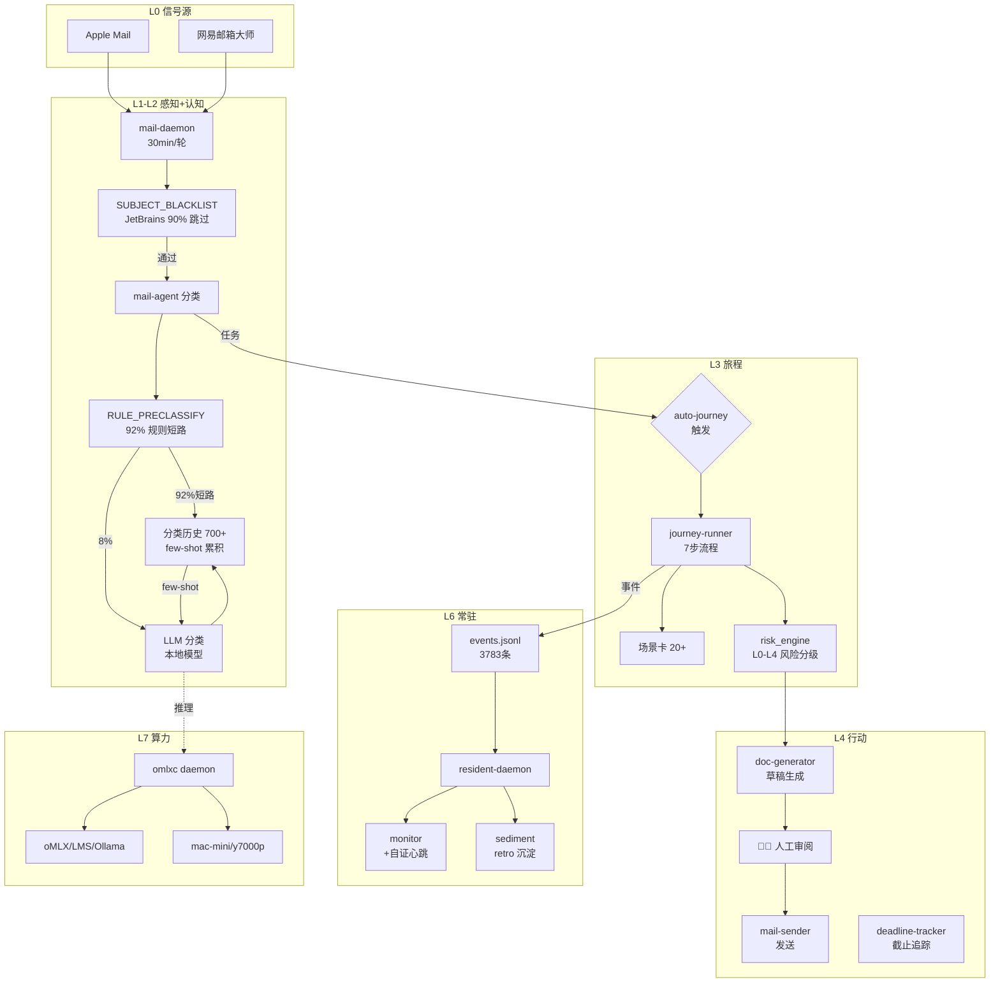

# omostation (eCOS v6) 全生态架构图解

> 基于 2026-08-28 实测数据: 26 个 launchd 常驻服务 · 3783 条事件流 · 18 个算力模型 · 700+ 邮件分类

## 一、总览图 (九层全生态)

```
╔══════════════════════════════════════════════════════════════════════════════╗
║  L0 信号源层 (Signal Sources)                                               ║
║  ┌──────────┐ ┌──────────┐ ┌──────────┐ ┌──────────┐ ┌──────────┐           ║
║  │Apple Mail│ │网易邮箱大师│ │ Seeyon OA │ │  日历    │ │  IM/微信  │  ← 未来  ║
║  └────┬─────┘ └────┬─────┘ └────┬─────┘ └──────────┘ └──────────┘           ║
╚═══════╪════════════╪════════════╪═══════════════════════════════════════════╝
        │              │              │
        ▼              ▼              │
╔═════════════════════════════════╪═══════════════════════════════════════════╗
║  L1 感知层 (Perception) ─ launchd: com.omostation.mail-daemon (30min)      ║
║  ┌──────────────────────────────┴──────────────────────────────────┐        ║
║  │ mail_daemon.py (runtime/ssot-stable 固化副本)                    │        ║
║  │   ├─ SUBJECT_BLACKLIST ★P1a: JetBrains 刷屏 90% 分类前跳过      │        ║
║  │   ├─ read_apple_mail() + read_netease_mail() → 20 封/轮         │        ║
║  │   └─ 心跳 → .omo/state/mail-daemon.jsonl                        │        ║
║  │ signal-poller.py ── 其他信号源轮询                               │        ║
║  └────────────────────────┬────────────────────────────────────────┘        ║
╚═════════════════════════════╪═══════════════════════════════════════════════╝
                              │
                              ▼
╔═════════════════════════════════════════════════════════════════════════════╗
║  L2 认知层 (Cognition) ── mail_agent.py                                     ║
║  ┌────────────────────────────────────────────────────────────────┐          ║
║  │ ① RULE_PRECLASSIFY 规则短路 (92% 邮件不进 LLM)                │          ║
║  │ ② LLM 分类 (剩余 8%) → category: 通知/任务/参考/垃圾/个人     │          ║
║  │ ③ extract_task() → 任务提取 (类型/截止/优先级)                 │          ║
║  │ ④ 累积闭环: mail-classification-history.jsonl (700+条)        │          ║
║  │    └─ few-shot 注入 → 同发件人分类一致性                       │          ║
║  └────────────────────────┬───────────────────────────────────────┘          ║
╚════════════════════════════╪════════════════════════════════════════════════╝
                             │ category == "任务" && has_task
                             ▼
╔═════════════════════════════════════════════════════════════════════════════╗
║  L3 旅程层 (Journey) ── journey-runner.py (runtime/ssot-stable)            ║
║  ┌────────────────────────────────────────────────────────────────┐          ║
║  │ auto-journey 自动触发 (★闭环最后一公里, 30min 内)              │          ║
║  │   ├─ admin-notification-workflow (7 步: 收件→分类→转发→收集    │          ║
║  │   │   →汇总→审阅→提交, v3 flat schema)                          │          ║
║  │   ├─ health-medical-workflow (4 状态: 记录→准备→就诊→归档)     │          ║
║  │   │   └─ ★P1 健康域新增, draft 状态                            │          ║
║  │   └─ subject 去重 → mail-journey-triggered.json                │          ║
║  │ 场景卡 (scene-card/v2): 20+ 张 (admin×7 + health×4 + ...)     │          ║
║  │ 风险闸 risk_engine: L0 自动 / L1-L2 审批 / L3-L4 强 HITL       │          ║
║  │   └─ health 域: generate:report=L0, send_email:doctor=L2      │          ║
║  └────────────────────────┬───────────────────────────────────────┘          ║
╚════════════════════════════╪════════════════════════════════════════════════╝
                             │ 全程草稿模式 (HITL 挡发送)
                             ▼
╔═════════════════════════════════════════════════════════════════════════════╗
║  L4 行动层 (Action) ── 人类审阅 → 发送                                      ║
║  ┌────────────────────────────────────────────────────────────────┐          ║
║  │ 草稿生成: doc_generator.py (通知/收集/报告/工作计划 模板)      │          ║
║  │   └─ ~/Documents/_inbox/*-mail-briefing.md (每日简报)          │          ║
║  │ 邮件发送: mail_sender.py (网易工作邮箱) ← 人工确认后            │          ║
║  │ 截止追踪: deadline_tracker (launchd 30min, 提醒)               ║
║  └────────────────────────────────────────────────────────────────┘          ║
╚═════════════════════════════════════════════════════════════════════════════╝

╔═════════════════════════════════════════════════════════════════════════════╗
║  L5 治理层 (Governance) ── 贯穿所有层                                      ║
║  ┌────────────────────────────────────────────────────────────────┐          ║
║  │ BET 台账 (3y-bet-ledger.yaml): 145 个 BET, T1-T10 十条轨道     │          ║
║  │ agent-workflow (ADR-0203): start→claim→verify→closeout 全程    │          ║
║  │ GaC 本地门: 57 checks (gac-local-gate)                         ║          ║
║  │ Worktree 协作标准: .omo/standards/multi-agent-worktree-*.md    │          ║
║  │ 治理 agent: scope 审查 (混装 PR 会被关闭, #2308/#2322 案例)    │          ║
║  │ 减法配额: rule_baseline=180(实际74), script_baseline=504       │          ║
║  │ Ruff baseline: 11 条 cockpit F811 (行号归一化后对位移鲁棒)     │          ║
║  └────────────────────────────────────────────────────────────────┘          ║
╚═════════════════════════════════════════════════════════════════════════════╝

╔═════════════════════════════════════════════════════════════════════════════╗
║  L6 常驻运行时 (Resident Agent) ── 12 个 launchd 服务 (com.l4.resident.*) ║
║  ┌────────────────────────────────────────────────────────────────┐          ║
║  │ 事件流: workflow-mesh/events.jsonl (3783 条, 2.28MB)           │          ║
║  │                                                                 │          ║
║  │ 五角色:                                                         │          ║
║  │  ├─ daemon (orchestrator): 事件路由/决策 (tick 94s 前)         │          ║
║  │  ├─ heartbeat: 系统健康 2min/次 (degraded→recovered 自愈✓)     │          ║
║  │  ├─ monitor: 告警外发 + ★P1b 自证心跳 monitor-alive:TH 每小时  │          ║
║  │  ├─ sediment: 工作流沉淀 390 runs (retro 候选提取)             │          ║
║  │  └─ ledger: 事件链 chain ok (sequence 39)                      │          ║
║  │                                                                 │          ║
║  │ 辅助: event-ingest / execute / inbox / promote / signals       │          ║
║  └────────────────────────────────────────────────────────────────┘          ║
╚═════════════════════════════════════════════════════════════════════════════╝

╔═════════════════════════════════════════════════════════════════════════════╗
║  L7 算力层 (Compute) ── omlxc + AetherForge                                ║
║  ┌────────────────────────────────────────────────────────────────┐          ║
║  │ omlxc daemon (com.omlxc.daemon, 常驻): 18 个模型, 多后端路由   │          ║
║  │   ├─ MBP 本地: oMLX App (:8000) / LM Studio (:1234) /          │          ║
║  │   │  Ollama (:11434)                                            │          ║
║  │   └─ Remote 节点: mac-mini / y7000p (tailscale 组网)            │          ║
║  │ AetherForge gateway: 云端模型池 (free-tier 扫描/轮换)           │          ║
║  │ watchdog (com.omlxc.watchdog, 5min): 链路守护 + 内存哨兵       │          ║
║  └────────────────────────────────────────────────────────────────┘          ║
╚═════════════════════════════════════════════════════════════════════════════╝

╔═════════════════════════════════════════════════════════════════════════════╗
║  L8 观测层 (Observability)                                                 ║
║  ┌────────────────────────────────────────────────────────────────┐          ║
║  │ observability events: .omo/_delivery/observability/events.jsonl║          ║
║  │ BCOS: 信号路由 → 进化引擎 → 北极星度量 (W1-W4, 信号源待接入)    ║
║  │ meta-doctor: 治理活性巡检 (心跳/断链/ritual)                    ║
║  │ unified-health-score: 综合健康分                                │          ║
║  └────────────────────────────────────────────────────────────────┘          ║
╚═════════════════════════════════════════════════════════════════════════════╝
```

## 二、数据流向图 (核心链路)



## 三、launchd 常驻服务全景 (26 个)

### 数字大脑链 (4)
| 服务 | 周期 | 职责 |
|------|------|------|
| com.omostation.mail-daemon | 30min | 邮件感知→分类→简报→草稿→auto-journey |
| com.omostation.deadline-tracker | 30min | 截止日期追踪提醒 |
| com.omostation.signal-poller | - | 多信号源轮询 |
| com.l4.mail.daemon | - | L4 邮件链路守护 |

### Resident 体系 (12)
| 服务 | 角色 |
|------|------|
| com.l4.resident.orchestrator | daemon 核心（事件路由/决策） |
| com.l4.resident.heartbeat | 心跳（2min/次） |
| com.l4.resident.monitor | 监控告警（+自证心跳/时） |
| com.l4.resident.sediment | 沉淀（retro 候选） |
| com.l4.resident.decision | 决策 |
| com.l4.resident.execute | 执行 |
| com.l4.resident.event-ingest | 事件摄取 |
| com.l4.resident.inbox | 收件 |
| com.l4.resident.promote | 晋升 |
| com.l4.resident.signals | 信号 |
| com.omostation.agent-tick-daemon | agent 心跳 (5min) |
| com.omostation.autoloop-daily | 日自动循环 |

### 算力层 (3)
| 服务 | 职责 |
|------|------|
| com.omlxc.daemon | omlxc 控制面（路由/探测/数据面） |
| com.omlxc.watchdog | 链路守护（5min）+ 内存哨兵 + 节点告警 |
| com.omlxc.ollama-env | Ollama 环境配置 |

### 治理/观测 (7)
| 服务 | 职责 |
|------|------|
| com.omostation.governance-scanner | 治理扫描 |
| com.omostation.evolution-agent | 进化 agent |
| com.omostation.problem-detector | 问题检测 |
| com.omostation.knowledge-foundry | 知识铸造 |
| com.l4.gac.watchdog | GaC 看门狗 |
| com.l4.governance.watch | 治理监听（watchpaths 触发） |
| com.l4.omo.sync | omo 同步 |

## 四、关键状态文件

| 文件 | 内容 | 规模 |
|------|------|------|
| `.omo/state/mail-daemon.jsonl` | 邮件处理心跳 | 持续追加 |
| `.omo/state/mail-classification-history.jsonl` | 分类累积（few-shot 源） | 700+ 条 |
| `.omo/state/mail-journey-triggered.json` | auto-journey 去重 | 0 条（等首任务） |
| `.omo/state/resident-monitor.jsonl` | 告警台账 + **自证心跳** | 3 条心跳/3小时 |
| `.omo/state/resident-heartbeat.jsonl` | 系统心跳 | 2min/条 |
| `.omo/_knowledge/workflow-mesh/events.jsonl` | resident 统一事件流 | 3783 条 |
| `.omo/state/system_health.yaml` | 系统健康快照 | 48h SLA |
| `docs/plans/3y-bet-ledger.yaml` | BET 台账 SSOT | 145 条 |

## 五、生命周期门与协作纪律

```
想法 → BET 立项 (T7-SCENE 轨道) → spec 绑定 (sha256) → worktree 隔离开发
  → pre-push 双闸 (子仓 sync + reachability) → ci-local-fast (57 checks)
  → PR → 治理 agent scope 审查 → CI 全绿 → 合并 → closeout (retro 五问)
  → sediment 沉淀 → 知识库
```

**五大复盘根因的对应防御** (2026-08-27 复盘):
- R1 预算上调≠修复 → `_is_discoverable` 相对路径兼容 ✓
- R3 admin merge 绕 CI → `post-merge-validate.yml` ✓
- R5 写侧无护栏 → `fix-frontmatter.py` 三护栏 ✓
- F5 静默失败 → monitor 自证心跳 ✓
- F7 进行中工作冻结 push → script-registry `ls-tree HEAD` ✓

## 六、域扩展路线 (数字大脑 P0→P3)

| 域 | 状态 | 场景卡 | Journey |
|----|------|--------|---------|
| **P0 工作** | ✅ 活跃 | admin×7 (1 active + 6 draft) | admin-notification-workflow |
| **P1 健康** | ✅ 契约落地 | health×4 (draft) | health-medical-workflow |
| P2 家庭 | 📋 规划 | - | - |
| P3 个人 | 📋 规划 | - | - |
| P4 教育 | 📋 规划 | - | - |
