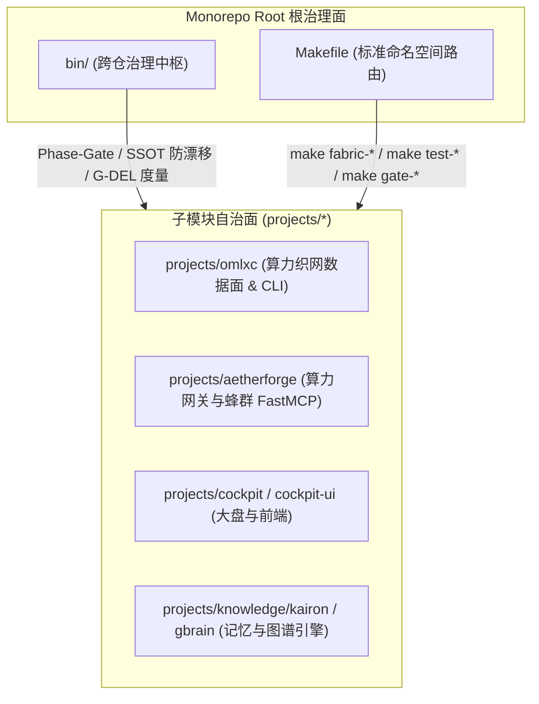

# 🏛️ Monorepo 脚本与工具治理架构规范 (bin/ & scripts/ & Makefile)

---

## 1. 背景与治理目标

随着 OmoStation 从单体仓库演进为拥有 18+ 独立子模块的现代 Monorepo 架构，早期遗留的 `scripts/` 与根目录 `bin/` 逐渐出现了**职责边界不清、影子大仓重复、废弃临时生成器堆积、Makefile 指令碎片化**等问题。

为彻底践行 **SharedBrain 核心基因（真实、严谨、客观、代码洁癖）**，确立本治理架构规范（ADR-0413 治理闭环）。

---

## 2. 目录分工与下沉原则 (Sinking & Boundary Contract)

### 2.1 根目录 `bin/` 的专属职责（保留）
`bin/` 只保留**跨子模块协同、全局契约守卫、Monorepo 调度面**的工具，划分为以下标准子目录：
1. **`bin/gac/` (Governance as Code)**：本地极速门禁 (`ci-local-fast.py`)、分层依赖拓扑 (`affected-graph.py`)、Phase-Gate、Worktree 守护。
2. **`bin/ssot/` (Single Source of Truth)**：能力注册表、CI Surfaces 0 漂移校验、Agent Skills 规范门禁 (`check-agent-skills.py`)、子模块指针一致性。
3. **`bin/delivery/` (Delivery & Telemetry)**：多节点物理度量与 G-DEL 交付价值流。
4. **`bin/mof/` (Meta-Object Facility)**：M1~M4 元模型对齐、健康打分 (`m4-health-score.py`) 与架构演进。
5. **`bin/sweep/` (Pyright/Ruff Scanning)**：全仓批量 Lint 与类型清理。
6. **`bin/adr/` (Architecture Decision Records)**：ADR 编号生成与审计。

### 2.2 业务脚本“下沉”原则 (Submodule Sinking)
- **子系统内部行为必须下沉**：涉及具体业务（如 Neo4j 记忆容器启动、模型量化下载、前端组件生成）必须下沉到对应的 `projects/<submodule>/scripts/` 或封装为原生 CLI 命令（如 `omlxc fabric warm`, `omlxc fabric inspect`）。
- **临时生成器归档**：历史收敛战役（如 `execute-bin-scripts-*.py`）完成后统一归档至 `bin/_archive/`，禁止在 `bin/` 根目录长期滞留。

### 2.3 `scripts/` 的处置定性
- 根目录 `scripts/` 为历史影子大仓遗留，不再承担新的脚本维护职责。
- 根仓调用全部收敛至 `bin/`，禁止在 Monorepo 根层维护重复的 `scripts/` 影子大仓。

---

## 3. Makefile 命名空间规范 (Namespaces)

根 `Makefile` 统合各子模块入口，严格按以下 6 大命名空间组织：

| 命名空间 | 命令示例 | 功能与目标 |
| :--- | :--- | :--- |
| 🌟 **`fabric-*`** | `make fabric-inspect` `make fabric-warm` `make fabric-vram` `make fabric-bench` | 调度 `omlxc` 本地算力织网、0ms TTFT 预热与显存自愈估算 |
| 🛡️ **`gate-*`** | `make gate-local` `make gate-skills` `make gate-ci-surfaces` `make gate-layers` `make gate-mof` | 运行本地极速门禁、Agent 技能规范、CI 防漂移与元模型校验 |
| 🧪 **`test-*`** | `make test-all` `make test-omlxc` `make test-aetherforge` `make test-cockpit` `make test-kairon` | 触发全仓级联测试或针对特定子项目执行单测与类型检查 |
| 📚 **`ssot-*`** | `make sync-all-docs` `make sync-submodules` `make check-docs-drift` `make ssot-status` | 全量同步能力注册表（571 MCP 工具）、BOS 路由与 CLI 参考文档 |
| 🧹 **`hygiene-*`** | `make hygiene-worktree` `make hygiene-dir` `make hygiene-janitor` | 扫描和安全清理过期 Worktree、未追踪文件与废弃分支 |
| 👁️ **`omo-*`** | `make omo-status` `make omo-top` `make swarm-activity` | 渲染多智能体 Swarm 实时 4 象限大盘与活动看板 |

---

## 4. 自动化防护与 CI 防退化门禁

1. **Agent Skills 门禁**：通过 `python3 bin/ssot/check-agent-skills.py`（已并入 `ci-lint.yml`）静态防御损坏的 Frontmatter。
2. **CI Surfaces 注册表**：通过 `python3 bin/gac/check-ci-surfaces.py` 确保 121 个 CI 表面无孤立、无未声明的脚本调用。
3. **文档无漂移门禁**：通过 `make check-docs-drift` 确保任何能力注册表变更都有对应的派生文档生成。
