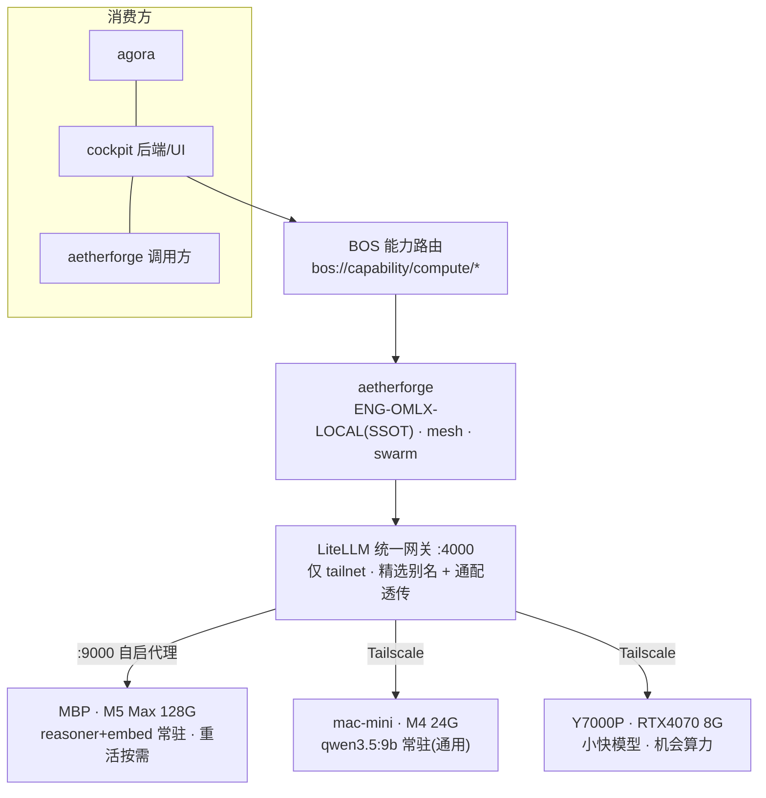

# omlx × aetherforge 本地算力集群 — 架构与运维

> 最后更新: 2026-07-05 · 三机 Tailscale 集群 · 统一 LiteLLM 网关 · aetherforge/agora/cockpit 消费

## 1. 总览

一套自建的本地大模型算力底座:三台机器经 Tailscale 组网,由 MBP 上的 **LiteLLM 统一网关** 收敛成单一 OpenAI 兼容入口;上层 aetherforge / agora / cockpit 全部经 BOS 能力路由调用,不直接碰模型。



## 2. 三机分配(算力自治)

| 机器 | Tailnet IP | 角色 | 常驻 | 说明 |
|---|---|---|---|---|
| **MBP M5 Max 128G** | 100.96.126.35 | 工作机 + 网关宿主 | `reasoner`(GLM-4.7-Flash 综合)+ `embed` | 重模型(coder/mythos)按需;autopilot 空闲自动卸 |
| **mac-mini M4 24G** | 100.99.210.78 | 常在线副机 | `qwen3.5:9b`(ollama keep_alive=-1) | 日常通用,给 MBP 分流,不占工作机 |
| **Y7000P RTX4070 8G** | 100.64.43.36 | 机会算力(时开时关) | 无(在线才用) | 小快模型;整机离线时网关自动跳过 |

**设计原则**:MBP 最强但你在用它 → 只留 1 个综合模型 + 空闲自动释放;常用通用模型放闲着的副机 → 用它时 GPU 不动 MBP,不卡。

## 3. 分层调用链

1. **消费方** → 不直连模型,统一发 `bos://capability/compute/{generate,mesh-status}`
2. **aetherforge** → `ENG-OMLX-LOCAL`(SSOT,指向网关)解析模型;mesh 实时探活各节点;swarm 多 Agent
3. **LiteLLM 网关 :4000** → 绑 tailscale IP(局域网其它机器连不上);两种路由:
   - **精选别名**(稳定契约):`coder/reasoner/vision/mythos/mythos-fast/embed/mini-9b/fast/mid`
   - **通配透传**:`macmini/*`、`macmini-ollama/*`、`y7000p/*` → 那台机任意模型即时可达
   - **fallback**:MBP 忙/冷 → 溢出到副机(`reasoner→mini-9b→mid`),不再连环点 MBP 重模型
4. **后端**:MBP 经 `:9000 自启代理` 按需拉起 omlx 后端(8080–8185);副机是各自的 LMStudio(:1234)/ Ollama(:11434)

## 4. 关键机制

- **:9000 自启代理**(`com.omlx.autostart`):网关把 MBP 路由指到 `127.0.0.1:9000/<key>/v1`,代理收到请求若后端没起就 `omlx serve` 拉起。开机自启(等外置盘挂载)。
- **autopilot**(`com.omlx.autopilot`,每 5 min):预热常驻集 + 按日志 mtime 卸载空闲非常驻(idle_ttl 900s)。治"模型越堆越卡"。
- **网关 guard**(`omlx-gw-guard`):启动前 `NO_PROXY=*` + 装了 socksio,防系统 SOCKS 代理(Clash)致 litellm 崩。
- **background_health_checks: false**:关掉每 60s 保温所有模型的健康检查(曾是卡的主因)。

## 5. 运维 Runbook

```bash
# 看三机在跑什么 / 全部模型 + loaded 态
omlxc node ps            # 各节点已加载
omlxc node models macmini   # 某节点全部模型
omlxc cluster            # 三机服务状态大盘

# 远程管理副机模型(HTTP,无需 SSH)
omlxc node load macmini <model>     # 加载(Ollama 真载 / LMStudio JIT)
omlxc node unload macmini <model>   # 卸载(Ollama)

# 本地(MBP)
omlxc serve <key>    # 拉起本地后端    omlxc stop <key>|all   # 停(pidfile 失联会按端口兜底)
omlxc status         # 本地后端 + 内存

# 网关
omlxc gw status|sync|start|stop      # sync: 换模型后刷路由的真实路径

# 备份(live → git 仓,再 commit 即快照)
bash ~/omlx-orchestration/bin/omlx-backup.sh && git -C ~/omlx-orchestration commit -am snapshot
```

**日常怎么调**:通用问答→`mini-9b`(mac-mini);强推理→`reasoner`(MBP,常驻秒回);写代码→`coder`(MBP 按需);RAG→`embed`。

## 6. 关键位置

| 东西 | 位置 |
|---|---|
| 网关(运行时读) | `~/Library/Application Support/omlx-gateway/litellm-config.yaml` |
| 模型清单 SSOT | `/Volumes/Model/omlx/conf/models.json`(含 cluster/autopilot 段) |
| omlx CLI | `/Volumes/Model/omlx/bin/omlx`(→ `omlxc`) |
| 模型权重 | `/Volumes/Model/LMStudio/…`(外置盘,必须挂着) |
| 编排层备份仓 | `~/omlx-orchestration`(git · RESTORE.md 恢复指南) |
| aetherforge SSOT | `~/Workspace/projects/ecos/src/ecos/ssot/mof/m1/compute_engine/ENG-OMLX-LOCAL.yaml` |
| 端口登记 | `~/Workspace/protocols/port-registry.yaml`(omlx 占 818x) |

## 7. 依赖与前置

- **Tailscale** 必须连着同一 tailnet(网关绑 tailscale IP)。
- **外置盘 `/Volumes/Model`** 必须挂着(模型 + omlx CLI + config 都在上面)。
- 系统若开 SOCKS 代理(Clash),网关已用 `NO_PROXY=*` + socksio 兜住。

## 8. 已知边界 / 待办

- **Y7000P** 整机离线时够不着(HTTP/SSH 都不通);要可靠化需在那台机上开 SSH + WoL + 开机起 LMStudio。
- **LMStudio HTTP 卸载**无官方接口(`node unload` 对 LMStudio 只能靠 idle TTL 或 lms CLI)。
- **智能路由**目前是静态别名 + fallback;进一步可让 mesh 动态选最闲的在线节点。
- 网关 master key `sk-omlx-admin` 为静态,备份仓含端点/密钥(须私有仓)。
