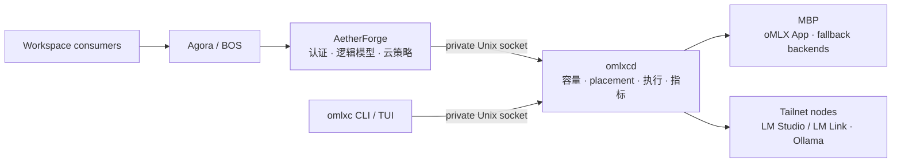

# omlxc v3 × AetherForge 本地算力中枢

> `omlxc` 管本地物理算力，AetherForge 管公共推理策略；唯一公共算力入口是
> `bos://compute/aetherforge/infer`。运行时节点、模型、端点与健康状态必须从 API
> 或 CLI 查询，本文不复制易漂移清单。

## 1. 稳定边界


```mermaid
flowchart LR
  C["Workspace consumers"] --> B["Agora / BOS"]
  B --> A["AetherForge<br/>认证 · 逻辑模型 · 云策略"]
  A -->|"private Unix socket"| D["omlxcd<br/>容量 · placement · 执行 · 指标"]
  T["omlxc CLI / TUI"] -->|"private Unix socket"| D
  D --> M["MBP<br/>oMLX App · fallback backends"]
  D --> R["Tailnet nodes<br/>LM Studio / LM Link · Ollama"]
```

职责不可交叉：

| 层 | 拥有的决策 | 不拥有的决策 |
|---|---|---|
| Agora / BOS | 能力发现与 `bos://compute/aetherforge/infer` 寻址 | 模型 placement、后端控制 |
| AetherForge | 认证、逻辑别名、敏感流约束、云端 fallback 与成本策略 | 本地容量、驻留、物理 fallback |
| `omlxcd` | 节点健康、模型生命周期、容量准入、物理 placement、并发、作业、指标与本地执行 | 业务别名、认证、自动启用云端 |
| 后端 adapter | 能力发现、加载/卸载、推理与真实生成探针 | 跨后端策略 |

`omlxc` 不提供绕过 AetherForge 的公共 BOS URI。它的数据面仅供本机受控消费者
通过权限受限的 Unix Socket 使用。

## 2. SSOT

| 事实 | 权威来源 |
|---|---|
| 逻辑别名、认证、云策略 | AetherForge 配置与策略层 |
| 节点、后端、模型 placement、本地策略 | `omlxc` schema v1 TOML 用户配置 |
| 凭据 | TOML 中的 Keychain 引用；不保存明文密钥 |
| 在线状态、容量、作业、路由与指标 | `omlxcd` API；持久状态由 daemon 自己管理 |
| 对 Workspace / MOF 的模型投影 | `omlxc` API 或显式只读导出 |
| 服务生命周期 | [服务注册表](../../.omo/_truth/registry/services.yaml) |
| 引擎与模型语义 | [eCOS MOF](../../projects/ecos/src/ecos/ssot/mof/m1/) |

旧跨仓模型 JSON、独立模型端口和 CLI 子进程调用不是 v3 的事实源。旧配置只允许通过
`omlxc config migrate` 进入 schema v1；迁移默认只生成计划，显式确认后才原子写入。

配置优先级固定为：安全默认值 → TOML → `OMLXC_` 环境变量 → 单次命令参数。
地址不是节点身份；tailnet 节点必须通过稳定 ID 和显式 allowlist 校验。

## 3. 请求路径

```text
consumer
  → bos://compute/aetherforge/infer
  → AetherForge 认证并解析逻辑模型
  → AetherForge 将已解析的本地模型 ID 交给 omlxcd
  → omlxcd 过滤健康、能力、上下文、内存、并发与安全约束
  → omlxcd 选择物理 placement 并调用对应 adapter
  → 结果沿原链返回
```

- `local` 请求的本地阶段失败时返回 typed error，不得静默转云。
- `hybrid` 是否进入云端由 AetherForge 决定；`omlxc` 永不自行启用云服务。
- 首 token 前可在剩余 deadline 内切换本地候选；首 token 后断流必须显式报错，
  不得重放请求。
- thinking 默认关闭。只有质量策略且调用方明确授权时，才允许传递后端 reasoning
  参数；响应仍不得泄漏隐藏推理。

## 4. 三机与后端

- MBP 是权威 daemon 主机，oMLX App 是主要 Apple Silicon 执行后端；LM Studio 与
  Ollama 可作为配置驱动的本机 fallback。
- 远端机器通过 Tailscale 身份与 allowlist 纳入节点池。LM Studio / LM Link 与
  Ollama 都是 `omlxcd` 管理的物理 backend，不是 AetherForge 中的平行本地路由器。
- SSH 只用于受控加载、卸载或探测；推理优先走已授权的 tailnet API。SSH 参数使用
  数组并严格校验 known-host，不拼接 shell 字符串。
- 离线或 stale 节点只从候选中剔除，不得阻塞其他节点。

具体机器地址、模型路径、端口、驻留模型和资源预算属于用户配置或运行时 API，
不写入 Workspace 文档。

## 5. 控制面与本地数据面

控制 API 位于 `/api/v1/*`，本地 OpenAI 兼容数据面位于 `/openai/v1/*`；二者使用
同一私有 Unix Socket。控制操作返回 Job，事件通过版本化事件流增量交付。JSON、
NDJSON 与错误响应携带 schema version 和 request ID。

CLI 与 TUI 都是 daemon client，不直接读取数据库、扫描后端或启动临时状态库。
常用入口：

```bash
# 总览与诊断
omlxc
omlxc status
omlxc doctor --direct --json

# 节点、模型与路由
omlxc nodes list
omlxc nodes probe
omlxc models list
omlxc models load <model-id> --yes --json
omlxc models unload <model-id> --yes --json
omlxc models reconcile
omlxc routes plan <model-id> --profile interactive --json
omlxc routes test <model-id>

# 作业、指标、配置与服务
omlxc jobs list
omlxc jobs watch --output ndjson
omlxc metrics show
omlxc config validate
omlxc config diff
omlxc daemon status
```

破坏性或持久化操作遵循风险门：只读查询直接执行；加载、卸载和临时 pin 需要一次
确认；服务重启与持久配置必须展示影响、二次确认并建立回滚点。

## 6. 可靠性与安全约束

- 健康必须证明真实生成就绪，不能只证明端口存在或模型目录可读。
- 节点、backend 与 placement 各自有并发闸门；加载使用 single-flight。
- 健康 TTL、stale 状态、熔断与半开恢复都由 daemon 维护。
- 本地 Socket 父目录与文件使用私有权限；Keychain 引用、日志和错误均须脱敏。
- 事件队列可以丢弃低优先级指标，但不能丢失 Job 状态转换。
- daemon 断开时 TUI 保留最后快照并明确标为 stale，不伪装实时状态。

## 7. 发布与回滚

正式路径是 AetherForge `active` 模式。`shadow` 只做一次只读 route plan，真实推理
仍走一次 legacy 路径；`legacy` 仅作为回滚入口。三种模式都不能产生重复推理。

回滚按边界逆序执行：AetherForge 切回 `legacy` → 停止 `omlxcd` → 恢复旧 CLI
入口与配置快照。回滚不重写子仓历史、不移动发布标签，也不删除旧归档。

运行状态用 CLI/API 验证；公共链路用 `bos://compute/aetherforge/infer` 验证。禁止用
本文中的示例替代真实健康、路由与指标证据。
