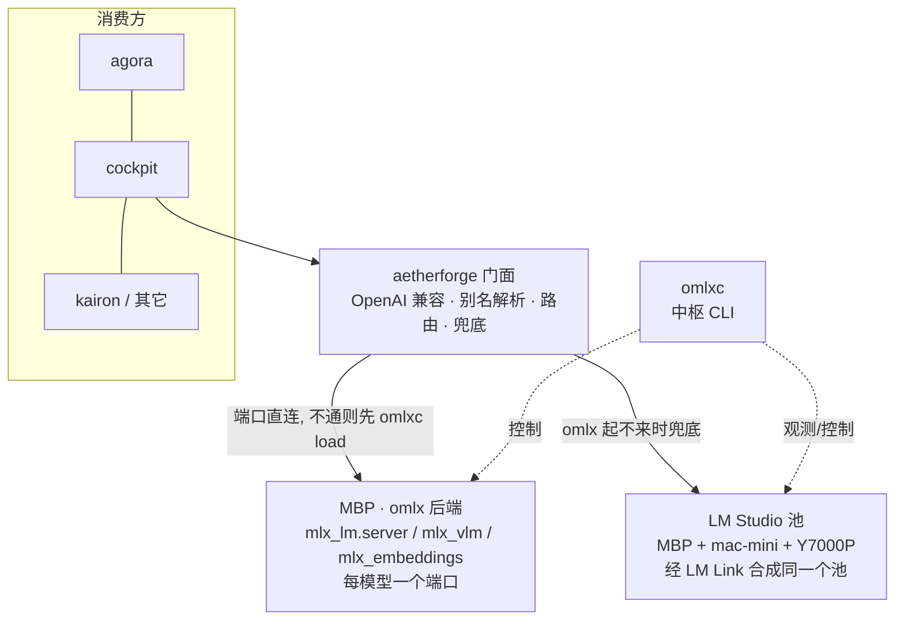

# omlx × aetherforge 本地算力中枢 — 架构与运维

> 三机 Tailscale 组网 · omlxc 为中枢 · aetherforge 门面为唯一 OpenAI 入口
> 运行时事实(模型清单/端口/在线状态)一律从 CLI 与注册表读, 本文不复制。

## 1. 形状


```mermaid
flowchart TD
  subgraph 消费方
    A1[agora] --- A2[cockpit] --- A3[kairon / 其它]
  end
  A2 --> AF["aetherforge 门面<br/>OpenAI 兼容 · 别名解析 · 路由 · 兜底"]
  AF -->|端口直连, 不通则先 omlxc load| OMLX["MBP · omlx 后端<br/>mlx_lm.server / mlx_vlm / mlx_embeddings<br/>每模型一个端口"]
  AF -->|omlx 起不来时兜底| LMS["LM Studio 池<br/>MBP + mac-mini + Y7000P<br/>经 LM Link 合成同一个池"]
  CLI["omlxc<br/>中枢 CLI"] -.控制.-> OMLX
  CLI -.观测/控制.-> LMS
```

两条职责分得很清:

- **omlxc 是控制面** —— 谁在哪台机器上、加载什么、当前状态如何、一个名字该打到哪里。
  它不承载推理流量(内部那几处 `/v1/chat/completions` 只用于探活与预热)。
- **aetherforge 门面是数据面** —— 消费方唯一的 OpenAI 兼容入口。

## 2. 引擎分工

SSOT 是 `~/omlx/conf/models.json` 的 `engine_policy` 段, 不要在别处复述:

| 机器 | 主引擎 | 兜底 | 说明 |
|---|---|---|---|
| MBP | omlx(mlx_lm.server 等) | LM Studio | 每个模型一个端口; omlx 同时是加载器 |
| mac-mini | LM Studio | 无 | |
| Y7000P | LM Studio | 无 | 时开时关, 离线自动跳过 |

三台的 LM Studio 经 **LM Link** 合成同一个池: 任一端点都能看见全部模型,
具体在哪台执行由 LM Link 决定。所以别名里**不携带机器地址** —— 要指定机器
用 `lms link set-preferred-device`, 而不是在别名里编码 IP。

> 2026-08-10 教训: MBP 的 LM Studio 当时并未运行, 池子从 43 个模型缩到 17 个,
> 而没有任何检查报警。它现在有 `com.lmstudio.server` 这个 LaunchAgent, 并在
> `services.yaml` 里登记, 就是为了让"少了一台"这件事能被看见。

## 3. 一个请求怎么走

```
消费者给一个意图名(coder / triage / ...)
  → 别名展开(aliases.yaml)
  → 落在 omlx 本机 key 上?
      是 → 端口通? 直连
           端口不通? omlxc load 拉起 → 就绪探针 → 直连
           拉不起来? 按 models.json 的 fallback 落 LM Studio
           都不行? 如实报错(不模糊匹配, 不静默换模型)
      否 → registry/provider(LM Link 池 或 云端)
```

想知道某个名字实际会走哪条路, 不要读代码猜, 直接问中枢:

```bash
omlxc resolve coder            # 人类视图: 归属 / 端点 / 当前状态 / 兜底是谁
omlxc resolve coder --json     # 机器视图
```

## 4. 几条来自事故的硬约束

这些不是设计偏好, 是踩过才写下来的:

- **健康检查必须证明"能干活", 不能只证明"活着"**。mlx_lm.server 会进入一种
  卡死态: TCP 照收、`GET /v1/models` 照答 200、CPU 0%、一串 CLOSE_WAIT 挂着,
  但 POST 永不处理。所有基于 `/v1/models` 的探活全绿, 而请求全挂。
  门面加载后会补一发 `max_tokens=1` 的真生成作为就绪探针, 不过就回收后端。
- **不做子串模糊匹配**。曾经 `reasoning` 会撞上 `...-reasoning-distilled`、
  `embedding` 会撞上云端的 `gemini-embedding-001`, 且返回 200, 错得悄无声息。
- **空回复不算成功**。thinking 段剥完没正文 = 没回答, 必须让 fallback 继续。
- **绑定范围变大时鉴权不能消失**。门面绑到 loopback 之外必须配
  `AETHERFORGE_API_KEY`, 否则拒绝启动。
- **启动路径不得有外部网络依赖**, 且要显式隔离系统代理 —— LiteLLM 栽过。
- **launchd 不能执行外置卷上的二进制**(macOS TCC)。omlx 控制面因此从
  `/Volumes/Model/omlx` 迁到 `~/omlx`; 模型权重仍在外置卷, 只是不被 launchd 直接 exec。

## 5. Runbook

```bash
# 看
omlxc ls                  # 全节点模型 + 加载态
omlxc status              # MBP 本地后端
omlxc resolve <名>        # 这个名字会打到哪
omlxc stats               # 用量 / 显存
lms ps                    # LM Link 池里谁在跑、在哪台

# 控
omlxc load|unload <模型>  # 自动判断本地还是远程
omlxc warm <预设>         # 切常驻模式
omlxc serve|stop <key>    # 只管 MBP 本地

# 门面
curl -s localhost:9290/health
tail -f ~/Library/Logs/aetherforge-gateway.log
```

## 6. 关键位置

| 内容 | 位置 |
|---|---|
| 模型/集群/引擎分工/兜底映射 | `~/omlx/conf/models.json`(已入 git) |
| 中枢 CLI | `~/omlx/bin/omlx`(`omlxc` 是它的软链) |
| 别名表 | `projects/aetherforge/packages/gateway/src/llm_gateway/aliases.yaml` |
| 门面代码 | `projects/aetherforge/packages/gateway/src/llm_gateway/openai_proxy.py` |
| 路由逻辑 | 同上目录 `gateway.py` |
| 引擎 SSOT | `projects/ecos/src/ecos/ssot/mof/m1/compute_engine/ENG-*.yaml` |
| 服务注册 | `.omo/_truth/registry/services.yaml` |

## 7. 待办

- 调用方从 `:4000` 迁到 `:9290`(kairon 约 10 处 / cockpit 2 处 / `bin/gac` 1 处)。
  门面过渡期同时监听两个端口, 所以这件事不阻塞 LiteLLM 下线。
- 迁完后把门面的 `:4000` 摘掉, 并从 port-registry 注销 LiteLLM。
- 成本落账接到门面。
- LM Link 的派发目前会把 12B 模型放到 Y7000P(三台里最弱), 冷启动实测上百秒。
  是否设 preferred-device 待定 —— 放本机会和 omlx 抢内存。
