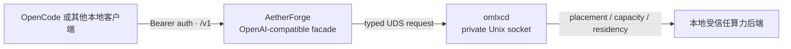

# 让 OpenCode、Pi、oh-my-pi、Kilo Code 接入 AetherForge + omlxc

本指南面向 OpenCode、Pi、oh-my-pi、Kilo Code、aider、Continue、桌面聊天客户端和自研脚本这类**支持 OpenAI Chat Completions 与自定义 base URL** 的本地工具。目标是让它们安全地使用本机算力，而不暴露节点拓扑、私有 Unix socket 或后端端口。

> **一条规则：客户端只连接 AetherForge 的 OpenAI 兼容门面；绝不直连 `omlxcd`。**

`omlxcd` 是私有控制/数据平面，使用 Unix socket，负责模型驻留、容量、节点授权和后端选择。AetherForge 是经过鉴权的公开门面，负责逻辑模型别名、调用策略及统一的 OpenAI 兼容响应。跳过它会绕开这些边界，也会让客户端与内部实现强耦合。



## 1. 接入前检查

你需要具备以下条件：

1. AetherForge 已由受管服务以 `active` 模式运行；不要在客户端项目里自行再起一个代理。
2. `omlxcd` 已就绪。对本机执行平面做无副作用检查：

   ```bash
   omlxc status --json
   ```

   输出应表示 daemon 已就绪且未降级。日常客户端接入不需要、也不应使用会探测远端的诊断命令。

3. 你有 AetherForge 的获准访问凭据。**不要因为门面只绑定 loopback 就假定它无需 key**：是否要求 Bearer 认证由受管服务配置决定；只要目录请求返回 `401`，就必须从获准的本地密钥来源注入凭据。
4. 客户端支持 OpenAI 兼容的 `baseURL` 与 Chat Completions。OpenCode 的自定义 provider 正符合这一模式。

不要把内部 socket 文件、节点地址、后端原始端口或私有配置复制进客户端配置。

## 2. 公开接口与边界

把以下 base URL 放进客户端配置。默认本机门面示例为：

```text
http://127.0.0.1:9290/v1
```

如果你的受管部署使用了不同的本机端口或绑定地址，**只**从服务运维说明获取对应 base URL；不要猜测或扫描端口。

| 接口 | 用途 | 客户端应如何使用 |
| --- | --- | --- |
| `GET /health` | 仅检查门面进程是否存活 | 可在启动前做一次只读检查；它不证明某个模型可生成。 |
| `GET /v1/models` | 列出当前可选的逻辑模型 ID | 用返回的 `data[].id` 填 OpenCode 的 `models` 键。不要手写物理后端名。 |
| `POST /v1/chat/completions` | 非流式和 SSE 流式聊天 | 这是编码助手的主接口。`stream: true` 使用标准 SSE。 |
| `POST /v1/embeddings` | 文本向量 | 仅在模型列表与实际策略允许 embedding 时使用。 |

当前公开契约不要求客户端直接调用内部路由规划、加载、卸载或作业接口；这些是 `omlxc` 的受控运维面。客户端请求会由 AetherForge 与 `omlxcd` 共同决定是否存在合格、本地且有容量的 placement。

### 本地优先与模型选择

- AetherForge 接收**逻辑模型 ID**，并在受管策略内解析它；`omlxc` 才决定实际 placement。
- 普通客户端请求默认采用 `local` 路由模式。若你的 SDK 能发送扩展 body，可显式传递 `routing_mode: "local"`；不要把 `hybrid` 或 `cloud` 当作无意的兜底。
- 模型可用性是动态的。每次启动客户端或修改 provider 前，都以 `GET /v1/models` 的实际返回值为准。
- 不把请求体里的模型 ID 当作节点或后端标识，也不要把内部 placement ID 写入项目配置。

## 3. 安全地准备环境变量

把地址和凭据放在终端会话、受管 secret store 或系统钥匙串导出的环境变量中；不要把 key 写进仓库、`opencode.json`、shell history、截图或 issue。

```bash
export AETHERFORGE_BASE_URL="http://127.0.0.1:9290/v1"
test -n "${AETHERFORGE_BASE_URL}"
```

如果部署启用了认证，再从获准的本地密钥来源注入 key：

```bash
export AETHERFORGE_API_KEY="从获准的本地密钥来源读取的值"
test -n "${AETHERFORGE_API_KEY}"
```

上例的 key 文本只是占位符，不能原样使用。是否可无 key 仅由受管服务的认证策略决定，而不是由绑定地址决定；仍建议在客户端配置中保留环境变量引用，便于策略变化后不改项目文件。

若要把环境变量长期交给客户端启动器，使用操作系统的 secret 管理机制或权限为 `0600` 的、本机私有的环境文件。不要把 `.env` 加入版本控制。

## 4. 先做无推理连通性验证

先验证门面和模型目录，再发真实请求。以下命令不会执行推理：

```bash
auth_header=()
if [[ -n "${AETHERFORGE_API_KEY:-}" ]]; then
  auth_header=(-H "Authorization: Bearer ${AETHERFORGE_API_KEY}")
fi

curl --fail --silent --show-error \
  "${AETHERFORGE_BASE_URL%/v1}/health" | jq .

curl --fail --silent --show-error \
  "${auth_header[@]}" \
  "${AETHERFORGE_BASE_URL}/models" \
  | jq -r '.data[] | .id'
```

记录其中一个返回的模型 ID，以下用 `<model-id-from-models>` 表示。没有任何模型时，不要伪造 model ID 或让客户端直接连接后端；先由运维面处理容量、授权或库存问题。

### 模型目录的判定表

这一步经常被误读。按下表处理，**不要**因为目录暂时不可用就绕过 AetherForge：

| 现象 | 正确结论 | 下一步 |
| --- | --- | --- |
| `GET /v1/models` 返回 `401` | 门面要求认证；这不是“没有模型”。 | 从获准本地密钥来源注入变量后，重新做一次只读目录请求。 |
| 返回 `200`，但 `data` 为空 | 门面当前没有可安全公布的逻辑模型；不能用猜测的 model ID。 | 停止客户端接入，检查受管服务状态并交给运维面处理。 |
| 返回非空目录，但 OpenCode/Pi/omp 看不到对应选择项 | 客户端配置未解析、别名写错，或工具缓存仍是旧配置。 | 做本指南中对应工具的离线配置检查；不要刷新/扫描内部后端目录。 |
| 返回 `503` 或 `504` | 本地目录或执行平面暂不可用。 | 记录状态码与时间，停止重试；不要让客户端驱动 load/unload。 |

active 模式的公开目录应只公布 `omlxcd` 已知的逻辑模型 ID。它与内部的私有控制目录不是让客户端直接依赖的第二套 API；后者只是 AetherForge 用来保持“目录能列出什么”与“实际能执行什么”一致的受控来源。

## 5. OpenCode 配置

当前 OpenCode 的正式配置使用 `provider` 结构；这台机器也已经有名为 `omlxc` 的 provider。**增量修改这个 provider，不要并行新增第二个指向相同门面的 provider，也不要覆写既有的其它 provider。** 这样能保持既有 alias 与权限策略不变。

已做过只读比对：该 provider 的部分既有模型映射已不在当前 `omlxcd` 逻辑目录中。这属于旧目录遗留，不表示后端模型服务宕机。稳定观察窗口结束后，按本节的“增量更新”方式只替换失效条目的 `id`；保留 provider ID、现有选择名和权限策略。观察窗口内不要修改用户级 OpenCode 配置。

OpenCode 的 provider 模板适用于任何 OpenAI 兼容服务：使用 `@ai-sdk/openai-compatible`、指定 `options.baseURL`，并把实际模型 ID 写入 `models`。不要混入来自旧教程、实验分支或第三方适配层的 `providers`、`package`、`settings` 或 `modelID` 键。配置语法始终以 [OpenCode Providers](https://opencode.ai/docs/providers/) 与 [OpenCode Config](https://opencode.ai/docs/config/) 的当前版本为准。

保留既有 `provider.omlxc` 的 `npm`、`options`、models 和所有其它 provider。需要新增或更新一个模型时，只在它的 `models` 对象内加入下列条目；`local-coding` 是 OpenCode 的选择名，`id` 才是发送给门面的逻辑模型 ID：

```json
{
  "provider": {
    "omlxc": {
      "npm": "@ai-sdk/openai-compatible",
      "options": {
        "baseURL": "{env:AETHERFORGE_BASE_URL}",
        "apiKey": "{env:AETHERFORGE_API_KEY}"
      },
      "models": {
        "local-coding": {
          "id": "REPLACE_WITH_A_LOGICAL_MODEL_ID",
          "name": "AetherForge local coding"
        }
      }
    }
  }
}
```

说明：

- `omlxc` 是已有 provider ID；不要改为物理后端或节点名。
- `{env:…}` 是 OpenCode 的环境变量替换语法。环境变量不存在时会展开为空，因此先做上一节的 `test -n`。
- `models` 的 key 是 OpenCode 本地选择名；其中的 `id` 必须与 `GET /v1/models` 返回的 `id` **完全一致**。模型列表变化后，只更新这一项的 `id`。
- `permission.edit` 与 `permission.bash` 设为 `ask`，使编码助手的文件和命令操作逐次确认；模型可用不等于应自动执行本机命令。
- `share: "disabled"` 是适合本地工作区的保守默认值。按团队的合规要求单独调整它。

随后启动 OpenCode，通过 `/models` 选择 `omlxc/local-coding`；也可先运行 `opencode models omlxc` 只查看现有配置的候选项。不要让它自动从旧的、混合的后端目录导入模型。active 模式的目录收敛补丁落地前，优先使用已配置且已验证的 `omlxc/*` alias；补丁落地后，再从认证的 `/v1/models` 更新 `id`。

对现有配置做**无推理**校验：先备份用户配置，再运行下文的“迁移前只读预检”；它只输出 provider 是否存在和条目数量。不要在终端录屏、CI 日志或共享会话中运行 `opencode debug config`，因为该命令可能展示已解析的认证配置。

### 迁移前的只读预检

在稳定观察窗口结束后、**但仍未修改配置前**，先执行下列预检。它只输出条目数量，不输出 key、模型名、节点信息或内部地址：

```bash
python3 - <<'PY'
from __future__ import annotations

import json
import os
from pathlib import Path
from urllib.error import HTTPError, URLError
from urllib.request import Request, urlopen

config_path = Path.home() / ".config/opencode/opencode.json"
if not config_path.exists():
    raise SystemExit("OpenCode user configuration was not found; do not create one automatically.")
config = json.loads(config_path.read_text())
models = config.get("provider", {}).get("omlxc", {}).get("models", {})
configured = {
    entry.get("id")
    for entry in models.values()
    if isinstance(entry, dict) and isinstance(entry.get("id"), str)
}
base_url = os.environ.get("AETHERFORGE_BASE_URL", "").rstrip("/")
if not base_url:
    raise SystemExit("AETHERFORGE_BASE_URL is not set; do not fall back to a private daemon endpoint.")
request = Request(f"{base_url}/models")
api_key = os.environ.get("AETHERFORGE_API_KEY")
if api_key:
    request.add_header("Authorization", f"Bearer {api_key}")
try:
    with urlopen(request, timeout=3.0) as response:  # noqa: S310 -- user-supplied local facade
        catalog = json.load(response)
except HTTPError as exc:
    raise SystemExit(f"public model directory returned HTTP {exc.code}; stop and fix access first.") from exc
except URLError:
    raise SystemExit("public model directory is unavailable; stop and fix the managed facade first.") from None
items = catalog.get("data") if isinstance(catalog, dict) else None
if not isinstance(items, list):
    raise SystemExit("public model directory response is malformed; do not use a private fallback.")
available = {
    item["id"]
    for item in items
    if isinstance(item, dict) and isinstance(item.get("id"), str) and item["id"]
}
print({
    "configured": len(configured),
    "still_available": len(configured & available),
    "needs_update": len(configured - available),
})
PY
```

只有 `needs_update` 为零时，既有映射才无需处理。若它大于零，先从**认证后的 AetherForge 公共目录**选择等价逻辑 ID，再对 `provider.omlxc.models` 的对应 `id` 做最小更新；不要删除整个 provider、不要批量替换所有模型、也不要把私有目录或物理后端 ID 写进 OpenCode。

### 只在当前项目生效

把 provider 放到项目级 `opencode.json` 可避免影响其他代码库。该文件不应包含真实 key，因而可以提交；真正的 secret 只通过环境变量注入。

如需限制 OpenCode 只显示该 provider，可按 OpenCode 当前版本的配置文档设置 provider allowlist。不要通过删除全局认证文件来达到隔离效果。

## 6. Pi

Pi 使用 `~/.pi/agent/models.json` 注册自定义 provider。该文件是用户私有配置；不要写进项目仓库。Pi 的模型条目直接向 API 传递 `id`，所以 `id` 必须替换为认证后 `GET /v1/models` 的一个逻辑 ID。AetherForge 当前是 Chat Completions 兼容面，使用 `openai-completions`，并明确关闭 Pi 可能附加的 reasoning 参数。

```json
{
  "providers": {
    "aetherforge": {
      "baseUrl": "http://127.0.0.1:9290/v1",
      "api": "openai-completions",
      "apiKey": "$AETHERFORGE_API_KEY",
      "authHeader": true,
      "compat": {
        "supportsDeveloperRole": false,
        "supportsReasoningEffort": false
      },
      "models": [
        {
          "id": "REPLACE_WITH_A_LOGICAL_MODEL_ID",
          "name": "AetherForge local coding",
          "reasoning": false,
          "input": ["text"],
          "contextWindow": 32768,
          "maxTokens": 8192
        }
      ]
    }
  }
}
```

Pi 的 `$AETHERFORGE_API_KEY` 是环境变量引用，缺失时 provider 会不可用；不要把真实 key 写成 JSON 字面量。首次运行后使用 `/model` 选择 `aetherforge/REPLACE_WITH_A_LOGICAL_MODEL_ID`。Pi 会在每次打开 `/model` 时重新读取该配置，所以不需要重启守护进程。这里的 context/output 数值只是保守客户端上限；在将它设为默认模型前，必须以选定逻辑模型的实际限制替换。

## 7. oh-my-pi

oh-my-pi（`omp`）的自定义 provider 放在 `~/.omp/agent/models.yml`。这是当前的 canonical 配置；旧的 `models.json` 仅作为迁移输入，不能同时手工维护两份。它把 `apiKey` 解析为“已存在的环境变量名或字面量”；`authHeader: true` 才会向门面发送 Bearer 认证头。因此，模板必须使用环境变量名，不能使用假的占位 key。

```yaml
providers:
  aetherforge:
    baseUrl: http://127.0.0.1:9290/v1
    api: openai-completions
    apiKey: AETHERFORGE_API_KEY
    authHeader: true
    models:
      - id: REPLACE_WITH_A_LOGICAL_MODEL_ID
        name: AetherForge local coding
        contextWindow: 32768
        maxTokens: 8192
```

启动前只需在受管 shell 或私有环境文件中提供 `AETHERFORGE_API_KEY`；不要用仓库内 `.env` 覆盖该值。稳定观察窗口内只做 YAML 语法/配置加载检查；不要运行 `omp models`，因为它可能刷新 provider 目录。窗口结束后，确认 AetherForge 目录可用，再在模型选择器中选 `aetherforge/REPLACE_WITH_A_LOGICAL_MODEL_ID`。在将它设为默认模型前，将 `contextWindow` 与 `maxTokens` 替换为选定逻辑模型的实际限制。若它提示 provider 未启用，检查 `disabledProviders` 中没有 `aetherforge`；该数组在项目级配置中会整体覆盖全局数组，不能假定自动合并。

## 8. Kilo Code

Kilo Code 的终端版与 VS Code 扩展都支持 OpenAI-compatible provider。凭据引用只能放在可信的全局配置中：`~/.config/kilo/kilo.jsonc`。**不要**把带 `{env:AETHERFORGE_API_KEY}` 的 provider 提交到项目级 `kilo.json[c]`：Kilo 会为了防止项目窃取凭据而拒绝解析该引用。

在 Kilo 的 Providers UI 中选择 **Custom provider**、Provider API 选 **OpenAI Compatible**，填入 loopback base URL，并从认证后的 `/v1/models` 选择一个逻辑模型。UI 会写入当前版本支持的 provider 结构；若需手工维护全局 `kilo.jsonc`，使用官方的 `openai-compatible` 形状：

```jsonc
{
  "$schema": "https://app.kilo.ai/config.json",
  "model": "openai-compatible/local-coding",
  "provider": {
    "openai-compatible": {
      "options": {
        "apiKey": "{env:AETHERFORGE_API_KEY}",
        "baseURL": "http://127.0.0.1:9290/v1"
      },
      "models": {
        "local-coding": {
          "id": "REPLACE_WITH_A_LOGICAL_MODEL_ID",
          "name": "AetherForge local coding",
          "reasoning": false,
          "tool_call": false,
          "limit": {
            // Replace both caps with limits confirmed for the selected logical model.
            "context": 32768,
            "output": 8192
          }
        }
      }
    }
  },
  "privacy_mode": true
}
```

`tool_call: false` 是安全默认值：模型是否可生成文本，不代表已经验证了 tool/function calling。Kilo 的文件与命令执行权限仍由客户端控制，保持其交互确认默认值，直到你在非敏感项目验证后再放宽。当前机器未安装 Kilo CLI，因此本轮只验证了配置结构；不要根据未安装版本猜测 `kilo models` 一类子命令。初次真实 agent 任务属于推理实验，应在当前稳定观察窗口结束后、单独记录地进行。

## 9. 统一实验流程

四个工具共用同一条规则：**先确认模型目录，后写配置，最后才做一次有界的非敏感推理实验。** 在当前稳定观察窗口内，实验停在配置和只读目录校验，不能为了“验证”触发推理、模型加载或远端探测。

| 阶段 | OpenCode | Pi | oh-my-pi | Kilo Code |
| --- | --- | --- | --- | --- |
| 配置位置 | 既有用户级 `opencode.json` 的 `provider.omlxc` | `~/.pi/agent/models.json` | `~/.omp/agent/models.yml` | `~/.config/kilo/kilo.jsonc` |
| 认证来源 | `{env:AETHERFORGE_API_KEY}` | `$AETHERFORGE_API_KEY` | `AETHERFORGE_API_KEY` | `{env:AETHERFORGE_API_KEY}` |
| 模型选择 | `omlxc/<本地选择名>` | `aetherforge/<逻辑 ID>` | `aetherforge/<逻辑 ID>` | `aetherforge/<本地选择名>` |
| 当前可做的验证 | 本文的脱敏预检脚本 | JSON 语法检查 | YAML 配置加载 | JSONC 语法检查 |

对于任何工具：

1. 导出凭据时只检查变量是否为空，不能 `echo` 它。
2. 从已认证的 `GET /v1/models` 取得逻辑 ID；active 目录修复合入前，沿用现有已验证的 `omlxc/*` 映射，不把物理目录导入工具。
3. 全局私有配置权限保持为用户可读写；不要将 key、prompt、内部地址或模型驻留信息提交进仓库。
4. 初次推理仅用一个短的非敏感请求，明确超时和零重试；记录 HTTP 状态、客户端版本、请求是否流式，不记录正文、密钥或内部拓扑。
5. 若返回 409/503/504，停止而不是直接连接后端或让客户端执行 load/unload。

## 10. 其他 OpenAI 兼容客户端

任何支持自定义 base URL 的客户端都使用同一对环境变量。下面是 Python SDK 的最小示例；它只展示协议形状，不包含真实业务内容或凭据：

```python
import os

from openai import OpenAI

client = OpenAI(
    base_url=os.environ["AETHERFORGE_BASE_URL"],
    api_key=os.environ["AETHERFORGE_API_KEY"],
)

response = client.chat.completions.create(
    model="<model-id-from-models>",
    messages=[{"role": "user", "content": "Reply with OK."}],
    stream=False,
)
print(response.choices[0].message.content)
```

流式调用只需把 `stream` 改为 `True` 并按 SDK 的迭代方式消费事件。客户端取消流时，AetherForge 和 `omlxcd` 会收敛直属流资源；不要以断开连接代替显式的客户端取消处理。

### Tools、结构化输出与多模态

- 编码助手的文件读取、编辑与 shell 执行是**客户端能力**。把它们设置为需要确认，不要误以为模型服务会限制本机工具权限。
- OpenAI 风格的额外 body 字段会保留给下游能力协商，但工具调用和结构化输出是否可用取决于所选模型与实际后端。先在非敏感项目验证，不要把它作为初次接入的前置条件。
- 图像消息会要求 vision 能力；embedding 请求会要求 embedding 能力。没有相应 placement 时，服务会拒绝请求，而不是把普通聊天模型伪装成对应能力。
- 优先选择客户端支持的 Chat Completions 流程；不要假定 `/v1/responses` 或厂商私有扩展存在。

## 11. 常见错误与正确处理方式

| HTTP 状态 | 含义 | 客户端侧处理 |
| --- | --- | --- |
| `400` | 请求格式或受支持参数不正确 | 检查 JSON、model ID 与客户端插件版本；不要重试原样坏请求。 |
| `401` | Bearer 凭据缺失或无效 | 重新从获准密钥来源注入变量；不要把 key 粘进配置文件或日志。 |
| `403` | 安全或策略拒绝 | 视为策略结果，保留最少元数据后联系运维方。 |
| `409` | 没有满足条件的本地容量或候选 | 等待资源恢复或选择模型目录中的另一逻辑模型；客户端不得直接 load/unload。 |
| `502` | 本地推理链内部失败 | 收集状态码、时间和安全的 request metadata；不要附带 prompt、key、节点信息或原始日志。 |
| `503` | 当前后端不可用 | 先检查 `/health`、`/v1/models` 与 `omlxc status --json`；不要扫描或直连后端。 |
| `504` | 在调用预算内未完成 | 适度提高客户端超时或缩短上下文；不要用无限重试掩盖容量问题。 |

`/health` 返回成功只表示门面进程存活；模型可用性仍以 `/v1/models` 与具体调用的 typed 结果为准。

## 12. 排障顺序

按这个顺序排查，既能缩小范围，也不会触发模型加载、卸载或远端探测：

1. 检查环境变量是否非空；不要打印 key。
2. `GET /health`：确认 AetherForge 门面进程存活。
3. `GET /v1/models`：确认至少一个逻辑模型 ID 可供客户端配置。
4. `omlxc status --json`：确认私有执行平面正常。
5. 仅用一个短、非敏感的聊天请求验证非流式；成功后再验证流式。
6. 若仍失败，报告时间、HTTP 状态、客户端版本、是否流式、是否使用图片/embedding；不要报告 prompt、密钥、Unix socket 路径、节点地址或完整日志。

不要把 `omlxc doctor --direct` 当作常规客户端排障命令。它属于运维诊断路径，可能触发额外的后端发现；本指南的接入检查只使用本机只读状态和门面接口。

## 13. 数据与安全实践

- 把 AetherForge 视为唯一信任边界：客户端只知道逻辑模型和公开兼容 API，不知道物理 placement。
- 使用 loopback 或部署批准的受控绑定；不要把门面随意绑定到局域网地址，更不要关闭非 loopback 暴露所需的认证。
- 不要在 OpenCode 的项目说明、共享会话、截图、shell history、错误报告或 git 配置中保存 key。
- 先为编码客户端启用 `edit: ask` 与 `bash: ask`；模型输出不是授权执行任意修改的依据。
- 将项目的密钥文件、构建产物、数据目录和生成缓存放进客户端的忽略规则，避免它们被自动收集进上下文。
- telemetry 只应使用安全的请求元数据；任何问题报告都应排除 prompt、内容正文、认证头、URL、身份与内部拓扑。

## 14. 运维分工

| 事项 | 负责人 | 客户端是否应处理 |
| --- | --- | --- |
| 逻辑模型、鉴权、请求策略 | AetherForge | 否；客户端只传逻辑 model ID。 |
| placement、容量、加载状态、后端选择 | omlxc | 否；客户端接受 typed 成功或拒绝。 |
| 本地文件、shell 与确认策略 | OpenCode 等客户端 | 是；通过客户端权限配置明确控制。 |
| 配置、服务生命周期、模型 load/unload | 受权运维流程 | 否；不要把这些命令封装进编码助手。 |

这层分工是可升级性的关键：更换后端、增加节点或调整容量时，客户端配置仍只需保持 AetherForge base URL、凭据和逻辑模型 ID。

## 15. 上线检查表

- [ ] AetherForge 使用受管的 active 门面，未在项目中启动旁路代理。
- [ ] `omlxc status --json` 表示 daemon 就绪、未降级。
- [ ] `/health` 成功，`/v1/models` 返回至少一个模型。
- [ ] OpenCode 配置用 `{env:…}` 引用凭据，仓库中没有真实 key。
- [ ] 模型 ID 从 `/v1/models` 复制，而不是猜测或使用物理后端名。
- [ ] `permission.edit` 与 `permission.bash` 已设为 `ask` 或更严格的团队策略。
- [ ] 已用一次非敏感的非流式和流式请求验证，并按最少信息原则记录结果。
- [ ] 失败时先看 typed HTTP 状态，不做无限重试、直连后端或客户端驱动的模型生命周期操作。

## 16. 参考

- [OpenCode Providers](https://opencode.ai/docs/providers/)：自定义 OpenAI-compatible provider、`baseURL` 和模型映射。
- [OpenCode Config](https://opencode.ai/docs/config/)：环境变量替换、权限与分享设置。
- [Pi Custom Models](https://pi.dev/docs/latest/models)：`models.json`、OpenAI Completions provider、环境变量与兼容开关。
- [oh-my-pi Providers](https://github.com/can1357/oh-my-pi/blob/main/docs/providers.md)：`models.yml`、`apiKey` 解析和 `authHeader`。
- [Kilo Code Custom Models](https://kilo.ai/docs/code-with-ai/agents/custom-models)：自定义 OpenAI-compatible provider、可信配置中的环境变量与模型限制。
- [Kilo Code CLI configuration](https://kilo.ai/docs/code-with-ai/platforms/cli)：全局/项目级配置位置、模型和权限配置。
- [omlxc README](../README.md)：私有 daemon、CLI 和受控运维边界。
