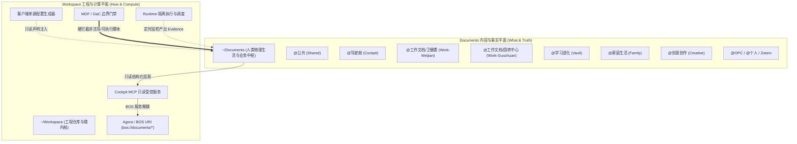

# Documents 域现状深度剖析、架构防腐全景与新建 Bet 演进方案

> **归属工程**：omostation / eCOS v6 主干治理  
> **审计日期**：2026-09-06  
> **责任组织**：Chief Architect & Governance Team  
> **关联依据**：[ADR-0191](file:///Users/xiamingxing/Workspace/docs/adr/ADR-0191-workspace-documents-dual-plane-architecture.md) (双平面架构) · [T6-17 文档盘点报告](file:///Users/xiamingxing/Workspace/docs/reports/doc-ssot-inventory-2026-09-05.md) · [3Y-BET-LEDGER](file:///Users/xiamingxing/Workspace/docs/plans/3y-bet-ledger.yaml)

---

## 1. 架构定位与双平面定律 (Dual-Plane Separation Law)

在 `omostation` / `eCOS` 生态中，**Documents** 拥有明确且不可替代的顶层定位：

### 双平面分离定律核心契约
1. **内容事实平面 (`~/Documents`)**：只负责 **What & Truth**。包含人类日常业务报告、结构化事实 YAML、科研笔记、法律合同与家庭资产记录。**严禁安装 Python/Node 依赖，严禁落地任何可执行脚本，严禁存放长生命周期的独立 Runtime 或 Skill 实现**。
2. **工程执行平面 (`~/Workspace`)**：只负责 **How & Compute**。承载代码、编译器、执行器、MCP Server、调度守护与 CI 门禁。
3. **交互边界契约**：所有外部与本地 Agent 访问 Documents 域，必须通过受控的只读 Facade（`bos://documents/*` 或 Cockpit Documents MCP），严禁物理绝对路径直接裸写。

---

## 2. 现状实测审计与五大痛点诊断 (Gap Analysis)

经过对当前工作空间全量 Documents 注册表、迁移校验器、客户端配置与运行时任务的深度实测，诊断出 5 大核心痛点：

### 痛点 1：ADR-0191 E-DOC 边界门禁「长期悬空 (DESIGN-ONLY)」
- **实测证据**：
  - ADR-0191 §2.2 明确定义了 5 条红线（`E-DOC-001`~`005`，禁止脚本、禁止依赖、跨域写拦截、事实保鲜、多客户端配置单源）。
  - 但 `.omo/_knowledge/audits/2026-08-17-edoc-rules-effective-status.md` 审计确认：MOF 规则引擎（`governance-checks.yaml`）、CI 门禁与 pre-commit hooks 中**实现全零命中**，被标注为 `DESIGN-ONLY (not enforced)` 待排期。
- **危害**：缺乏物理硬拦截，Agent 随时可能再次向 Documents 写入可执行脚本、安装环境依赖或直接篡改配置，历史 44,534 处违规的根本隐患未彻底消除。

### 痛点 2：迁移存量未终态收敛 (13 个家族仍处于 non-terminal)
- **实测证据**：
  - 执行 `python3 bin/gac/documents-content-plane-migration-check.py --json`，17 个家族中仅 4 个终态（2 个 verified，2 个 retired），其余 **13 个处于 non_terminal**：
    - `family-dashboard-app`（in_progress，待 Phase B/C 迁移收尾）；
    - 5 大内容归档族（`career-code-archives`, `family-content-archives`, `learning-content-archives`, `work-content-archives`, `creative-content-archives`，全部 pending）；
    - 外挂工具与缓存（`toolbox-staging`, `zotero-app-data`, `root-oneoff-assets`，全部 pending）；
    - 运行时委派（`family-runtime-kems`, `learning-runtime`, `public-runtime`, `opc-tools`）。
- **危害**：无法达成 100% 物理纯净度，阻碍 iCloud/Git 跨端无损云同步。

### 痛点 3：Runtime Jobs 校验器 Schema 缺陷与调度荒废
- **实测证据**：
  - 执行 `python3 bin/gac/documents-domain-project-check.py` 报错：
    `runtime job documents-learning-decay has unknown fields: evidence_relative_path, evidence_schema`
    `runtime job documents-learning-decay owner must be l4-kernel`
  - 根因：`documents-domain-projects.yaml` 中新增了 `runtime-learning` 任务（BET-Y1Q3-T10-85），但 `bin/gac/documents_domain_jobs.py` 的校验分发器中遗漏了对 `runtime-learning` 的识别分支，误走入 fallback 的 manifest job 校验分支！
  - 且 7 个声明的 runtime jobs（`creative-manifest-check`, `documents-learning-decay`, `documents-learning-orphans`, `documents-weijian-facts-audit`, `documents-weijian-controller-shadow`, `documents-weijian-model-freshness`, `documents-weijian-sanyi-status-audit`）全部为 `schedule: manual`，无常态化守护。
- **危害**：CI 检查存在潜在报错；大量关键事实巡检未自动产出 evidence。

### 痛点 4：多客户端配置漂移与缺乏一键自愈入口
- **实测证据**：
  - `documents-claude-desktop-config.py check` 返回 `status: drift`（`mcpServers.cockpit does not match the Workspace contract`）；
  - `documents-codex-profile.py check` 返回 `required Codex MCP server is missing: cockpit`；
  - 各客户端配置校验分散在各个独立脚本中，缺少统一纳管与一键自愈的 `documents-client-sync.py`。
- **危害**：人类或 Agent 切换到 Claude Desktop 或 Codex 时无法正确加载 Cockpit 受控上下文。

### 痛点 5：存量文档 SSOT 治理深化与生命周期自动流转
- **实测证据**：
  - 2026-09-05 的 T6-17 盘点报告表明：全仓 3216 篇 Markdown 中有 226 篇无 frontmatter，723 篇已完结一次性文档（completed ephemeral）散落在各目录中未归档，存在 `ARCHITECTURE-EVOLUTION` 等主题重复文档。
  - Documents 物理目录下的历史事实与总结同样缺乏生命周期去重机制。

---

## 3. 新建 Bet 系统规划 (New Bet Portfolio)

为彻底解决上述 5 大痛点，在 3 年规划台账（`docs/plans/3y-bet-ledger.yaml`）中新增 **5 个高价值、可度量、严格自闭环的 Bet**：

| 编号 | 赛道 | 标题 | 核心目标 | 预计工期 |
|---|---|---|---|---|
| **BET-Y1Q4-T6-20** | `T6-SUBTRACT` | **ADR-0191 E-DOC 双平面边界门禁落地与 CI/Pre-commit 硬拦截** | E-DOC-001~005 规则接入 MOF 规则引擎与 pre-commit，实现违规 100% 拦截与自愈诊断 | 2 days |
| **BET-Y1Q4-T10-123** | `T10-MATURITY` | **Documents 5 大内容归档族只读冻结与外挂工具终态清退** | 5 大归档族 SHA-256 冻结，清退 DeepTutor/Zotero 外挂，压缩 non-terminal 家族至 ≤ 6 | 3 days |
| **BET-Y1Q4-T10-124** | `T10-MATURITY` | **Documents Runtime Jobs 契约对齐与自动化守护常态化** | 修复 `documents_domain_jobs.py` 对 runtime-learning 的校验缺陷，将 7 个 jobs 接入自动化调度 | 2 days |
| **BET-Y1Q4-T6-21** | `T6-EVOLUTION` | **Documents 多客户端配置自愈守护与 BOS 统一事实服务网关** | 研发 `documents-client-sync.py` 一键自愈多端配置，打通 `bos://documents/*` 统一只读事实网关 | 2 days |
| **BET-Y1Q4-T6-22** | `T6-SUBTRACT` | **文档生命周期体系落地与主仓+Documents 存量文档深度去重指针化** | 实现 `doc-lifecycle.py`，226 篇无 frontmatter 补齐，已完结一次性文档自动归档，重复主题合并 | 3 days |

---

## 4. 详细 Bet 契约声明 (Specification Details)

### BET-Y1Q4-T6-20: ADR-0191 E-DOC 双平面边界门禁落地与 CI/Pre-commit 硬拦截
- **Goal**: 将 ADR-0191 长期处于 DESIGN-ONLY 的 E-DOC-001~005 边界规则正式接线入 MOF 规则引擎与 CI 门禁，实现 Documents 内容平面零脚本、零构建缓存、零跨域裸写与客户端配置防漂移硬拦截。
- **Done When**:
  1. 交付 `bin/gac/check-documents-boundary.py`，实现 5 项红线扫描；
  2. 在 `governance-checks.yaml` 正式接入 E-DOC 规则；
  3. 拦截器支持 Diagnostic Envelope 建议，单元测试拦截率 100%。
- **Verify**: `uv run --with pyyaml python bin/gac/check-documents-boundary.py --documents-root ~/Documents --json`

### BET-Y1Q4-T10-123: Documents 5 大内容归档族只读冻结与外挂工具终态清退
- **Goal**: 终态收敛 `documents-content-plane-migrations.yaml` 中停滞的 9 个 pending 家族：对 5 大内容归档族实施只读哈希冻结，清理并重定位 toolbox-staging、zotero-app-data 与 root-oneoff-assets。
- **Done When**:
  1. 5 大归档族生成 SHA-256 清单并标记为 verified/content_archive；
  2. toolbox-staging 重定位至 Workspace；
  3. non_terminal_families 下降至 ≤ 6 个。
- **Verify**: `uv run --with pyyaml python bin/gac/documents-content-plane-migration-check.py --json`

### BET-Y1Q4-T10-124: Documents Runtime Jobs 契约对齐与自动化守护常态化
- **Goal**: 修复 `documents_domain_jobs.py` 对 `runtime-learning` 任务的 Schema 缺失与校验崩溃，恢复 `documents-domain-project-check.py` 绿灯；将 7 个 manual 运行时巡检任务接入常态化自动化调度管道。
- **Done When**:
  1. `documents_domain_jobs.py` 支持 `runtime-learning` 及 `audit_concept_decay` / `list_orphan_concepts`；
  2. `documents-domain-project-check.py` 返回 ok=true 零错误；
  3. 7 个 jobs 配置规范的 host-level 定时调度。
- **Verify**: `uv run --with pyyaml python bin/gac/documents-domain-project-check.py --domain-registry ~/Documents/@公共/_control/L4-DOMAIN-REGISTRY.yaml --project-registry .omo/_truth/registry/documents-domain-projects.yaml --json`

### BET-Y1Q4-T6-21: Documents 多客户端配置自愈守护与 BOS 统一事实服务网关
- **Goal**: 研发统一的客户端多端配置守护工具 `bin/gac/documents-client-sync.py`，消除 Claude Desktop 与 Codex 当前的 drift 报错；在 Agora/BOS 中构建统一的只读事实穿透网关（`bos://documents/{domain}/{resource}`）。
- **Done When**:
  1. 交付 `bin/gac/documents-client-sync.py`，一键修复 Claude Desktop、Codex、Zed、ZCode 配置漂移；
  2. Agora 注册 `bos://documents/*` 服务契约；
  3. 单元测试与端到端 mock 验证通过。
- **Verify**: `uv run --with pyyaml python bin/gac/documents-client-sync.py check`

### BET-Y1Q4-T6-22: 文档生命周期体系落地与主仓+Documents 存量文档深度去重指针化
- **Goal**: 基于 T6-17 盘点发现，实现自动化的文档生命周期引擎 `bin/ssot/doc-lifecycle.py`：批量为无 frontmatter 的 226 篇文档补齐元数据，自动归档 723 篇 completed ephemeral 文档，合并消歧架构与战略重复文档。
- **Done When**:
  1. 交付 `bin/ssot/doc-lifecycle.py`；
  2. 主仓无 frontmatter 文档数清零；
  3. 完成已识别主题重复文档的合并指针化。
- **Verify**: `uv run --with pyyaml python bin/ssot/doc-ssot-lint.py --json`

---

## 5. 预期交付价值与架构收益 (Expected Value)

1. **防腐硬化 (Zero Regression)**：E-DOC 门禁生效后，任何企图向 Documents 目录写脚本、装包的操作均在本地提交前毫秒级拦截并给出重定向建议。
2. **存量清零 (Clean Content Plane)**：终态解决 44,534 处历史违规中的绝大多数归档和工具残留，使 Documents 真正恢复为纯粹的人类业务与生活事实中枢。
3. **多端一致 (Unified Persona & Tools)**：Claude Desktop、Codex、Zed、ZCode 全面统一挂载受控 Cockpit MCP，告别单端配置漂移与工具不可用。
4. **统一认知中枢 (BOS Knowledge Facade)**：将 Documents 沉淀的卫健委公文、家庭资产、学习进化笔记通过 BOS URI 标准化输出，无缝供给主干 AI 与超级个体分身使用。
