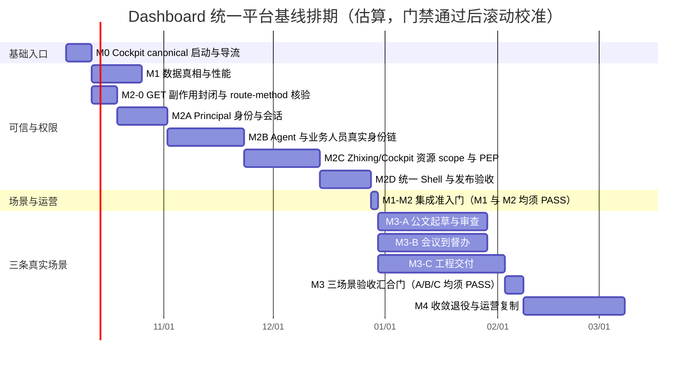

# 织星统一 Dashboard 平台收敛与落地执行基线

> 本计划绑定白皮书 v2.1 原件 `/Users/xiamingxing/Documents/学习进化/基建架构/2026-09-26-织星主权智能操作系统v2.1-审阅包/2026-09-26-织星主权智能操作系统白皮书-v2.1.md`，实测 SHA-256 为 `969fd87cda1fd49d0f81b4515710728167c3c335845657f94a9f99d481f2ea3f`；接受信封为同目录 `2026-09-26-织星主权智能操作系统v2.1-接受信封.yaml`，实测 SHA-256 `959b63d1cc72c4dfe2bb4116ea72cc531e0af53c6021354b6c3326c6ececf82f`。Principal 接受回执为同目录 `2026-09-30-Principal接受回执-ZX-SOVEREIGN-OS-V21-ACCEPTANCE-2026-09-26.yaml`，实测 SHA-256 `6b01e8a2dadb8aad8e30d8bab99a4cb21802a357d3a7fd4b5c2f48ac3db2c274`，精确接受该信封摘要；回执明确排除 workspace mutation、ledger binding、claims activation、deployment、service control 和外部副作用。该回执只证明 v2.1 文件包被接受，不证明 Workspace binding/G0、BET/Run admission 或发布批准；当前 Workspace 中仍未发现 binding 收据，DCP-00 需继续记录白皮书需求映射及后续 binding 凭证。本文仍是待审阅的实施基线，所有工期均须在对应门禁通过后重估。

## 1. 目标与范围

把 Cockpit-UI 的 `/panorama` 收敛为唯一的人类主控体验，按管理员、Agent、业务人员提供清晰分层；将战略、运行、治理、任务、知识与业务结果放进同一导航和交互体系。Dashboard 必须呈现真实来源、观察时间、数据年龄和失败原因；不可用、陈旧、未验证状态不得伪装成成功。平台最终要证明白皮书北极星——每周成功完成且被实际消费的真实闭环旅程数——而不是只展示工程指标。

该目标覆盖入口与部署、路由和角色、数据契约、交互体验、真实业务旅程、观测运营、反馈改进、迁移与退役。目标架构为 Cockpit 人类入口、Agora Agent/能力入口、OMO 任务/运行/审批/证据真相、Runtime 执行、知识层沉淀可复用上下文；Dashboard 聚合这些权威，不复制其状态。入口切换在 ADR-0456 与运行服务注册表仍未一致前视为未批准，不以产品目标绕过当前禁用状态。

## 1.1 白皮书需求追踪基线

| 需求 ID | 白皮书/架构依据 | 本计划对应验收 |
|---|---|---|
| WP-01 单一意图到结果 | 白皮书 v2.1（SHA-256 如上）；`docs/VISION-ROADMAP.md` 愿景与北极星段 | 三条 Tier-0 场景均有统一入口、上下文、计划、执行、交付、回执/确认、消费和记忆回流证据。 |
| WP-02 真实状态与可恢复 | `docs/VISION-ROADMAP.md` 愿景原则 1/3/5 | LIVE/STALE/UNKNOWN、来源时间、失败原因、接管/恢复/回滚贯穿所有页面与 API；无默认成功值。 |
| WP-03 三主体协作 | 白皮书 v2.1；用户确认的管理员（人类）/Agent/业务人员分层 | persona × route × action × resource scope 矩阵由服务端执行并通过拒绝/越权测试。 |
| WP-04 局部能力不分裂内核 | `docs/VISION-ROADMAP.md` 愿景架构；`docs/STRATEGY-3YEAR-PANORAMA.md` | Cockpit/Agora/OMO/Runtime/知识层职责唯一；多场景复用同一 Episode/Run/Outcome/Receipt 合同。 |
| WP-05 第一波三条真实闭环 | `docs/VISION-ROADMAP.md:58-67,95-102` | 公文起草与审查、会议到督办、工程交付各自通过真实用户采用/提交/派发/引用验收；不得以其中一条代替其余两条。 |
| WP-06 受控进化与本地优先 | `docs/VISION-ROADMAP.md` 愿景原则 6/8 | 敏感原文留在受控边界；改进先评测/审批/灰度，可撤销；无自动晋级。 |

以上六行是导航索引，不是白皮书全量需求分母。另有逐项矩阵候选 [`2026-10-07-whitepaper-v21-traceability-matrix.md`](/Users/xiamingxing/Workspace/docs/plans/2026-10-07-whitepaper-v21-traceability-matrix.md)，绑定同一白皮书 SHA，按 24 条原则、8 个体系、5 个横切平面、20 个对象、8 项权利、6 个 Epoch、三条场景和 BP/RM 条款展开；该矩阵仍标为 `draft-for-review`，`DCP-TRACE-01` 未关闭。矩阵内逐条证据仍需按其时间戳核验，不能把历史状态当作当前状态。任何功能完成度结论都必须逐条引用该矩阵对应的源条款和当前实现/运行/业务证据，不能从六行摘要推算。

## 2. 当前基线（2026-10-04）

| 维度 | 判定 | 当前证据与差距 |
|---|---|---|
| 产品愿景 | 已定义 | `docs/VISION-ROADMAP.md` 定义意图到计划、协同执行、产物/回执、被消费结果和记忆改进的闭环，并明确真实状态与失败恢复原则。 |
| 单一入口 | 未落地 | 接受的 SSOT 规范指定 Cockpit-UI `:5173/:8090 /panorama`；现场 `5173` 有 Vite listener，`/panorama` 页面壳 HTTP 200，但 `/api/governance/panorama` HTTP 502，`8090` 无 listener。`43910` 返回 302 到该页面壳。`43191` 的 Zhixing 人类主页和精简全景刷新接口当前可达，但尚未被统一入口裁决指定为 canonical。 |
| 入口权威 | 未解决 | 接受的 `2026-09-25-dashboard-ssot-documentation-convergence` 指定 Cockpit-UI `/panorama`；较旧 `docs/DASHBOARDS.md:13-38` 仍称 `43191` 为唯一人类主入口；`.omo/_truth/registry/services.yaml:267-300` 把 `cockpit.dashboard` 设为 disabled，原文引用“不切换人类 UI 入口，待 ADR-0456”。当前 ADR-0456 文件是治理 closeout 分级决策，不能佐证入口切换；BET-Y2Q4-T10-205 复盘也记录 B2-B 曾由 principal 明确押后，要求逐批核实 blast radius 后确认。M0 须厘清 registry 引用与当前 ADR 的对应关系，裁决既有 SSOT、Zhixing 基座偏好与 B2-B hold，再同步 registry/验证命令。 |
| 页面/接口可用性 | 部分可达，Cockpit 数据链路失败 | 本轮实测 `5173/panorama` HTTP 200，但其 `/api/governance/panorama` HTTP 502；`8090` 无 listener，服务 registry 保持 disabled。`43910` 跳转到该页面壳。`43191/`、`/__panorama_data__`、`/health` HTTP 200；`/data.json` HTTP 503。页面外壳可达不等于 Dashboard 业务可用。 |
| 数据新鲜度 | 不合格 | 快照 `generation_id=105a0390c30c67375e5b`，所有源 `observed_at=2026-10-03T03:51:52.181160Z`；本机检查时约 13 小时未更新，scheduler/workflow 标为 `STALE_UNAVAILABLE`。新鲜 lease 不能证明 payload 新鲜。 |
| 性能 | 不合格 | 运行日志记录 Git `show HEAD:live_server.py` 10 秒超时。非 health 请求同步重算 Dashboard Git 身份并重新校验投影；观察值随刷新负载在约 2 秒至 13.9 秒/超时之间波动，另有刷新竞争期间约 19–23 秒记录。需要按 revision 缓存并在指针/manifest 变化时重新 fail-closed 校验。 |
| 状态真实性 | 代码切片独立 PASS；未发布、未做现场验收 | Cockpit-UI 初版 fallback 曾把 API 错误显示为成功。本轮 LIVE/STALE/UNKNOWN 修复已由独立 reviewer PASS；全量单测 96 files、847 passed、3 skipped，ESLint、TypeScript、`git diff --check` 均通过，`dist/` 无最终差异。失败/陈旧/未来/不完整源数据不再授权成功 KPI，抽屉也隐藏未验证健康断言。LOW 遗留：上游未定义的 BET 状态枚举尚未收紧。代码仍在未提交的 Cockpit 子仓候选中，未 build/publish/启动；真实服务数据源、路由集成和端到端运行验收仍未通过，因此 M1 不得标记完成。 |
| 角色与权限 | 未落地 | 当前前端角色是默认 `admin` 的自由字符串；路由均可直接打开，无服务端会话绑定、能力矩阵或拒绝态。展示模式不能作为访问控制。 |
| 业务价值闭环 | 未证明 | 白皮书要求真实输入、计划、执行、回执/人工确认和结果消费；工程状态和能力清单不能替代一次被真实用户采用的业务成果。 |
| 交付门禁 | 未准入 | Documents 中最新完整 Authority Writer 候选为 v1.3（`G0-BIND-AUTHORITY-WRITER-005`，candidate SHA-256 `cd67af9323d00127e49189b5fb541953e6a9093c0c6869180d689b3237c93ba5`，manifest SHA-256 `41f241e9b88d346c18504e4a5c59cd0c111ff3bb04a2b28dba15e5d48d6e2132`），但结论为 `HOLD_STALE_BASELINE_AND_M0_FAIL`，`production_apply_enabled=false` 且无 Principal mandate。v0.6 的 REJECT 是历史证据。未取得新鲜基线、M0 PASS、独立复核和精确 Principal mandate 前，不执行 G0-BIND、Run/Claim 或 Dashboard 发布。 |

## 2.1 当前运行复测与实现候选（2026-10-07 01:26 CST）

以下是现场复测，优先于上面的 2026-10-04 历史基线：

| 入口/能力 | 现场证据 | 判定 |
|---|---|---|
| Cockpit UI `localhost:5173/panorama` | 页面壳 HTTP 200；Vite 监听 `127.0.0.1:5173`；`/api/governance/panorama` HTTP 502。代理指向 `localhost:8090`，当前无 8090 listener。注册表把 `cockpit.dashboard` 设为 `enabled: false`，disabled_reason 引用“待 ADR-0456”，但当前 ADR 文件内容与入口切换无关；另有服务 venv 缺失。 | 前端可达，业务数据 API 不可用；不得据页面壳 200 宣称 Cockpit 可用。 |
| 旧导流口 `43910` | 当前 PID 1993 监听 `127.0.0.1:43910`，HTTP 302 到 `http://localhost:5173/panorama`。 | 导流服务在运行，目标页面壳可达但数据 API 失败；导流不构成后端可用证明。 |
| Zhixing `127.0.0.1:43191` | `/` HTTP 200（8,149,940 字节）；`/__panorama_data__` HTTP 200（62,450 字节），但它返回 generation `3a19b52b82a7c61b64bc`、`generated_at=2026-10-06T13:02:24Z`，距复测约 4 小时 24 分；`/health` 显示 `BOUND_FRESH`、`code_drift=false`、lease 到 `17:34:25Z`；`/data.json` HTTP 503。精简数据报告 BOS verifier `70` errors / `225` ok、connector `iris` 缺失。刷新器手动成功更新了部署目录 `current.json` 至 `17:24Z`，但 HTTP revision artifact 仍是旧 generation。 | 主页可达但投影内容陈旧；fresh lease 只是 revision 租约，不代表快照新鲜。完整 projection API 仍不可用。 |
| Zhixing revision payload 边界 | 16 MiB 限定于 bound revision artifact，legacy 保持 1 MiB。最终实现候选独立复审 PASS；四个源码/测试文件已按精确 SHA 移植到主工作区，主树聚焦套件 54 passed，语法和 diff 检查通过。 | 已集成主工作区源码，尚未发布到安装 checkout。单文件 host-sync 后，旧 checkout 的身份守卫因工作树脏拒绝启动；已从自动 `.before-restore` 备份还原旧服务文件并恢复 43191。完整运行态记录：`/Users/xiamingxing/Workspace/.omo/evidence/2026-10-07-zhixing-live-recovery-and-code-drift.md`；复审与集成证据：`/Users/xiamingxing/.codex/worktrees/dashboard-panorama-api/Workspace/.omo/evidence/2026-10-07-zhixing-provenance-boundary-repair.md`、`/Users/xiamingxing/Workspace/.omo/evidence/2026-10-07-zhixing-provenance-main-integration.md`。 |
| Zhixing provenance 发布合同 | publisher 从受控 `state_root/current.json` 读取快照并重算 provenance；拒绝 symlink、非普通文件、超限或无效 JSON，并校验 generation/时间序。完整伪造 envelope 回归输出 UNKNOWN。候选独立复审 PASS，主树 SHA 与复审候选一致。 | 源码仅集成在主工作区，尚未进入部署身份所绑定的 clean `origin/main` Git 树，未发布。发布前置检查要求 code root 为 `origin/main` 且工作树 clean；当前共享 Workspace 有既存未提交工作，未重置或清理。 |
| Cockpit BFF 合同 | 只读适配器已增量集成到主 Cockpit 子仓；主仓 venv 实际运行 10 项测试通过。总上游 deadline 为 3.5 秒；缺少字段级 provenance 的 facets 标记 `PARTIAL/UNKNOWN`；认证复用服务端 guard，错误使用稳定代码。候选代码独立审查 PASS（review runtime 为 WATCH，因其本地依赖缺失不能复跑；主仓已补实测）。 | 源码未提交，未启动 8090；业务 API 仍 502，只有源级通过，不代表运行时可用。复审记录：`/Users/xiamingxing/.codex/worktrees/dashboard-panorama-api/Workspace/projects/cockpit/.omo/evidence/2026-10-07-panorama-bff-provenance-review.md`；主仓验证：`/Users/xiamingxing/Workspace/projects/cockpit/.omo/evidence/2026-10-07-cockpit-panorama-bff-main-integration.md`。 |
| Cockpit UI PARTIAL 语义 | 主工作区已有 fail-closed UI 更新；证据记录 8 个相关 Vitest 文件、67 项测试通过，TypeScript 与 `git diff --check` 通过，覆盖 PARTIAL gates/alerts 隐藏未验证内容及 UNKNOWN 呈现。 | 源码仍未提交，运行页面仍因 8090 无 listener 而拿不到 BFF 数据。证据：`/Users/xiamingxing/Workspace/projects/cockpit-ui/.omo/evidence/2026-10-07-cockpit-partial-panorama-ui-main.md`。 |

运行态切换仍须依照 `BET-Y2Q4-T10-205`（ADR-0456 B2-B）逐批完成授权与发布；上述候选验证不构成对 LaunchAgent、端口、重定向或生产服务的启动/停止授权，也不代表 M0/M1 验收通过。

## 2.2 现场跟进（2026-10-06 17:44 UTC）

本节覆盖 2.1 之后的实际运行变化；更早记录保留作历史基线。

| 入口/能力 | 最新现场证据 | 判定 |
|---|---|---|
| Zhixing 完整投影发布 | 从专用发布检出 `/Users/xiamingxing/.local/opt/omostation-publisher` 运行与 `origin/main=ae561572bdea8fb7925918308b7b54722ffdeff3` 绑定的 collector；根与子模块匹配现有 producer 身份，专用检出原本 clean（仅 `git clean -ndx` 显示忽略的 `bin/ssot/__pycache__/`）。发布成功，revision `5bd61854c1b12b628d99e5cb6ceab886db844712e41de4e2d32a008ac5787990`，generation `5aea417149c2f3ac138c`，`generated_at=2026-10-06T17:38:45Z`；`/health` 为 `BOUND_FRESH`，lease 到 `17:49:58Z`，`/__panorama_data__` 同代 HTTP 200。 | 首页 `/` HTTP 200（8.61 MB），完整内嵌 snapshot 约 7.09 MB 且可解析，但模板依赖的 11 个字段缺失；`refresh`/`source_states` 缺失会把失败源误呈现为空，`anomaly_events`/`current_findings`/`value_loop` 则退化为无数据。`/__panorama_data__` 是 62.7 KB 的精简 live refresh 投影，不承担完整页面合同；`/agent-brief.json` 31.4 KB、结构完整，适用于 Agent 上下文。`/data.json` 的 503 根因为部署版 `live_server.py` 把 bound artifact 限制为 1 MiB，而实际文件 8,762,878 字节；Workspace host asset 已有经审查、54 项聚焦测试通过的 16 MiB bound-artifact 修复，尚未随 code identity 合法发布。 |
| Cockpit API 本机 smoke | 当前工作区的 Cockpit API 进程 PID `18800` 监听回环 `127.0.0.1:8090`；`/api/health` HTTP 200、`/api/governance/panorama` HTTP 200，但 BFF 因读取 Zhixing `/data.json` 503 而返回 `data_state=UNKNOWN`、`error=upstream_request_failed`。 | API 服务可达不等于全景数据可用。该进程由带 `--help` 的模块命令启动，属于临时现场 smoke，不是受管 LaunchAgent 启动或 DCP-01 完成证明；不再重复启动/停止。完整数据端点修复发布前，BFF 可以回退到 `/__panorama_data__` 和/或 `/agent-brief.json`，但它们缺少完整全景字段；未具备直接证据的 gates、alerts 等分面必须保持 UNKNOWN/PARTIAL。 |
| Cockpit UI 与入口裁决 | `localhost:5173/panorama` HTTP 200；`/api/governance/panorama` 经 Vite 代理当前响应 200，但内容是 UNKNOWN；`43910` 仍 302 到该 UI。已接受 SSOT 确认 Cockpit 为人类 canonical 入口，Zhixing 作为只读投影/数据底座符合该分层。 | 当前只完成 loopback smoke；LaunchAgent 未加载，服务注册仍 disabled，Vite 仍由手工进程提供。DCP-00 需把 SSOT、用户关于 Zhixing 底座和 Cockpit 入口的决策、旧 ADR 编号冲突及 B2-B blast-radius 一并形成可追溯记录后，再对齐服务登记和受管启动。 |

## 2.3 用户访问故障复测与恢复（2026-10-06 18:15 UTC）

| 面 | 现场证据 | 判定与剩余项 |
|---|---|---|
| Cockpit 页面渲染 | `localhost:5173/panorama` 和 `127.0.0.1:5173/panorama` 均 HTTP 200；Chromium 实测 React 页面已从 `Loading...` 完成挂载并呈现全景内容。`43910` 跳转到 Cockpit。`127.0.0.1:8090/api/health` HTTP 200。 | “打不开”表现为首次页面停留 Loading 和面板退化，而不是页面端口拒绝连接。当前 Vite 进程 `97933` 与 Cockpit 后端进程 `67003` 都是本机手工启动，尚无受管自启动/冷启动恢复证据。 |
| Cockpit–Zhixing 数据 | 受信 BFF 在完整 `/data.json` 返回已知 503 `agent_projection_unavailable` 时，才回退读取匹配 generation/revision 的 `/__panorama_data__` 与 `/agent-brief.json`。真实投影年龄超过 5 分钟时保留数据并标为 `STALE`，不再将整页降为 `UNKNOWN`。本轮聚焦测试 8 passed、Ruff passed。 | 18:15 UTC 探测为 `PARTIAL`；18:20 UTC 再探测同一 generation `5aea417149c2f3ac138c`、`generated_at=2026-10-06T18:13:06.584501Z` 后已转 `STALE`。门禁摘要列出 A2/A4–A9/RF0 failing，但只有 RC-DL 有逐项 reference-cell verdict，其余未被提升为未经证实的 PASS。缺少字段继续 UNKNOWN。 |
| Zhixing 服务 | `localhost:43191/`、`/health`、`/__panorama_data__`、`/agent-brief.json` 均 HTTP 200；正式 collector 从 clean 的专用 publisher checkout (`ae561572...` 与 origin/main 相同) 重新发布后，compact 与 brief generation 时间对齐，revision `cba1131453fdedbe6ad88b2d859fa2fc225dfa4b3f2efc9b90307d90055b0545`，健康状态 `BOUND_FRESH`。 | `/data.json` 仍 HTTP 503，根因为部署版 bound artifact 1 MiB 上限低于实际约 8.76 MB。完整 reader 的 16 MiB 修复只存在于未提交 Workspace host asset，runtime code identity 未更新，因此不直接覆盖安装目录。刷新 cadence 存在断层：`projection-fullrefresh` 每 21600 秒；8 分钟 republisher 日志明确 `data_observed_at_preserved=true`，只续投影租约；4 分钟旧 `panorama-dashboard-refresh` 更新的是 `runtime/dashboard/index.html`（43910 旧展示），未推进 43191 的 compact/brief generation。因此手工刷新后约 5 分钟 Cockpit 又转 STALE。`43191` 健康页和紧凑接口可用，但完整细节合同未恢复。 |
| UI 浏览器实测 | Headless Chromium 等待 React 挂载后读取页面文字：出现“织星体系全景控制舱”、`PARTIAL`、来源年龄约 2 分钟；未停留 Loading。捕获到的 503 均为预期的 `/live-api/data.json` 大文件读取失败，Cockpit BFF 降级路径仍 HTTP 200。 | 主入口可访问；到 18:20 UTC，来源年龄约 7 分钟，页面转为 STALE 并将未满足新鲜度门槛的指标显示 UNKNOWN。刷新频率不匹配尚未修复，不能称数据已持续恢复。DCP-00/01、code identity 受控发布、完整 source contract、LaunchAgent 与三类角色授权仍未完成；总体项目目标保持进行中。 |

## 2.4 用户再次反馈访问异常后的复核（2026-10-07 02:57 Asia/Shanghai）

| 面 | 最新实测 | 判定与动作 |
|---|---|---|
| Cockpit `localhost:5173/panorama` | HTTP 200；Headless Chromium 3.5 秒后 React 已挂载，标题为 `Cockpit | eCOS v6`，页面明确显示 `STALE`、`projection_stale`、观测时间和年龄。浏览器捕获的 503 来自直连 `/live-api/data.json`，不是 HTML 路由失败。一次并发探测经 Vite 获得 `upstream_timeout`，直接 8090 随后返回 STALE；重测 Vite 返回 STALE。 | 同机页面能打开；数据展示陈旧。顶栏把 SSE `CONNECTED` 与 `SNAPSHOT UNKNOWN` 分开，门禁和健康度保持 UNKNOWN。改进了历史门禁、部分告警与遥测状态的显示，不声称当前健康。测得四次串行来源读取累计约 3.6 秒，超过旧 BFF 的 3.5 秒预算，且 UI 的 4 秒请求超时短于 BFF 8 秒总预算；源码现为 BFF 8 秒总预算和 UI 10 秒请求超时，慢源回归通过，仍需受控加载后再验证运行态。 |
| Zhixing `127.0.0.1:43191` | `/` HTTP 200（8,610,892 字节），Chromium 约 4.6 秒挂载；`/health` HTTP 200、`BOUND_FRESH`、`code_drift=false`、lease 到 `2026-10-06T19:02:26Z`；compact 与 brief 均 HTTP 200，generation `5aea417149c2f3ac138c`、`generated_at=2026-10-06T18:13:06.584501Z`；完整 `/data.json` HTTP 503。 | 健康 lease 新鲜不等于数据观测新鲜。Zhixing HTML 当前仍出现“系统全域绿灯 / 100% 实时对齐”，与快照年龄及完整数据接口失败矛盾。已修复 Workspace 的模板源：以 `observed_at` 判新鲜度，并让过期/无效时间优先显示 STALE/UNKNOWN；回归用例通过。运行目录和 43191 尚未更新。 |
| 准入与发布 | DCP-00/01 仍 HOLD；受管 `live_server.py` 与 HTML 模板没有按 code identity 发布。 | 本轮没有重启服务、改 LaunchAgent、覆盖安装目录或重新发布。模板、Cockpit UI 和回归验证留在工作树，等待既定发布门禁。 |

本次现场证据与限制记录在 `.omo/evidence/2026-10-07-dashboard-browser-recheck.md`。Cockpit UI 的聚焦检查为 9 suites / 81 tests passed，TypeScript 与 `git diff --check` 通过；Cockpit adapter 9 tests 与 Ruff 通过；Zhixing freshness 回归用例 1 passed。UI 全量基线仍有 ReactFlow invalid-hook-call 失败，不能声称全套通过。

## 2.5 最新访问故障复核（2026-10-07 03:11–03:21 Asia/Shanghai）

| 面 | 最新实测 | 判定与动作 |
|---|---|---|
| Cockpit 页面与 BFF | `127.0.0.1:5173/panorama`、`/src/main.tsx`、`/src/App.tsx` 均 HTTP 200；`8090/api/health` HTTP 200；BFF HTTP 200 但 `data_state=STALE`，generation `5aea417149c2f3ac138c`，源观测时间仍为 `2026-10-06T19:03:23.325460Z`，最新读取时间 `2026-10-06T19:21:14.150831Z`。 | 同机 HTTP/模块链路可达；本轮未取得浏览器 DOM/console，故视觉挂载状态未重新证明。页面数据不可视为实时。 |
| Zhixing 页面与投影 | `43191/` HTTP 200（8,607,332 字节）；`/health` HTTP 200、`projection_status=BOUND_FRESH`，当前 revision `7baac07d4b222d346dc3a7aac4f0e65ef4ddd11ea4c6232ecc88981420ac4f09` 的 lease 到 `19:26:27Z`，其 `data.json` 为 8,759,325 字节；`/data.json` HTTP 503、`/__panorama_data__` HTTP 200（62,460 字节）。运行版 `live_server.py` 的 `MAX_DOCUMENT_BYTES` 为 1 MiB，bound revision artifact 超限后走 `agent_projection_unavailable`。 | 已确认 503 的直接原因是运行版读取边界与投影大小不匹配。lease 延长不推进 Cockpit 所见 generation 的源观测时间；精简接口继续响应，Cockpit 仍正确标为 STALE。 |
| 已有源码修复 | Workspace host asset 将有来源绑定的 revision artifact 单独限制为 16 MiB，legacy 无绑定文档和 registry document 仍为 1 MiB；`uv run --no-sync pytest tests/unit/test_live_server_projection_size.py tests/unit/test_panorama_template_freshness.py -q`：5 passed。 | 源码侧边界修复通过聚焦测试，尚未进入安装 checkout/运行服务。必须通过现有 code identity 与发布门禁后才能恢复完整接口；本轮未做服务控制。 |
| 采集节奏 | Launchd registry 将 projection republisher 设为 480 秒（只续租），full refresh 设为 21,600 秒；现场 `launchctl print` 显示 full refresh 上次退出码 0、共 8 次运行；最近一次全量发布日志为 `2026-10-06T19:03:55Z`，republisher 已运行 398 次。 | 全量采集节奏与 Cockpit 的 5 分钟 STALE 阈值不匹配。缩短间隔前需量出一次全量刷新耗时并设计增量/按 facet freshness，不能用续租刷新观测时间，也不能无依据地放宽 STALE 阈值。 |
| 浏览器及二次复审 | Chromium 实际挂载 Cockpit，标题 `Cockpit | eCOS v6`，没有 page/console JS error；BFF 请求 HTTP 200，最终显示 `BFF READY · SNAPSHOT STALE`。Zhixing 首页仍同时含“系统全域绿灯”和“100% 实时对齐”及 STALE 标记。独立 reviewer 对统一数据链返回 REVISE：STALE 门禁点颜色、巡检抽屉测试仍用旧遥测 mock、深度抽屉 SSOT 文案三项需修。 | Cockpit 页面可访问但全景数据陈旧；Zhixing 运行页面仍有假绿旧文案，Workspace 模板修复未加载。UI reviewer 的问题已分派窄范围修复，复审完成前不宣称统一数据契约 PASS。 |
| 网络范围 | `5173`、`8090`、`43191` 的监听地址均为 loopback（`127.0.0.1`）。 | 本机访问与局域网访问是两回事；当前配置不对其他设备开放。 |

完整观察记录：`.omo/evidence/2026-10-07-dashboard-unified-diagnostics-0313.md`。本次只读取运行态并验证已有源码候选，没有改动安装 checkout、进程、LaunchAgent、重定向或投影数据。

## 2.6 统一数据与入口收敛推进（2026-10-07 03:49–04:05 Asia/Shanghai）

### 架构裁决

唯一人类产品入口为 Cockpit UI `/panorama`；Zhixing `:43191` 保留为只读采集、发布和 provenance 投影底座；浏览器只请求 Cockpit BFF；OMO、Runtime、Knowledge 继续持有事实和写入权。这样保留用户提出的“以 Zhixing 为底座”，同时落实已接受 BET-Y2Q2-T10-166 对 Cockpit `/panorama` 唯一人类视窗的规定。`docs/DASHBOARDS.md`、`docs/PANORAMA-DASHBOARD.md` 和端口注册备注已更新为此边界。

独立 Architect 审查确认该分层与接受规范一致；同时指出 T10-166 中“已全部迁入 UI、Zhixing 已下线”的历史完成叙述不构成当前运行证据。T10-205 的 B2-B 生产服务切换仍需 code-identity 发布与逐批运行验收，因此本文没有把文档/开发态实现记作生产完成。

### 当前实测和候选实现

| 维度 | 证据 | 判定 |
|---|---|---|
| 投影刷新 | 经 `launchctl kickstart gui/501/com.omostation.zhixing-projection-fullrefresh` 触发既有全量刷新任务；PID `93033` 正常退出、退出码 `0`、总运行次数到 `9`。新 revision `660ca37a5a42335e77e29fd05e28d7ae72ff99aaf15d46d25bd41ee4e5dacafc`，`generated_at=2026-10-06T19:52:32Z`。 | 真实全量刷新完成；republisher 续租本身仍不算刷新。 |
| Cockpit BFF | `8090/api/governance/panorama` 与 Vite 代理均 HTTP 200；新生成时间一致，`data_state=PARTIAL`、`error=bound_reader_unavailable`、来源为 compact fallback。 | 相比之前 `STALE` 快照已前进；数据源部分可用，不能标为完整 LIVE。 |
| Zhixing 完整合同 | `/data.json` 仍 HTTP 503 `bound_reader_unavailable`；`/__panorama_data__` HTTP 200。部署版 bound artifact reader 仍为 1 MiB，约 8.76 MB artifact 超限。 | 已验证的 16 MiB 源码修复单测 5 passed，尚未按 deployment code identity 发布。完整 projection 是当前主要运行阻断。 |
| 单一浏览器数据路径 | Panorama 顶栏、Hero、壁板、popover 和抽屉统一复用 `useGovernancePanorama()` / `['governance-panorama']`；源码无 `/live-api`、浏览器数据直连 43191 或 Zhixing SSE。 | 数据契约在源级统一；字段级 provenance 缺失仍标为 PARTIAL/UNKNOWN。 |
| 单一用户导航与真实状态文案 | 首页和治理桥接条链接改为 Cockpit 内部路由；删除 43191 外跳、模拟 74 秒倒计时、无依据“在线/健康”文案。Guardian 门禁按 PASS/FAIL/WARN/UNKNOWN 分色；STALE/UNKNOWN 告警空列表不再渲染为绿色无告警。 | 用户入口朝一套 UI 收敛；Zhixing 根页面仍在运行，暂不退役。 |
| UI 源码验证 | 15 个 Vitest suites / 99 项通过；`bunx tsc --noEmit`、`git diff --check`、临时目录生产构建通过。 | 源码可构建并通过聚焦范围验证；生产 8090 的旧 dist 尚未更新，5173 是 Vite 开发态。 |
| 投影边界验证 | `tests/unit/test_live_server_projection_size.py` 与 `test_panorama_template_freshness.py`：5 passed。 | 仅验证源码，不构成发布或运行态修复证据。 |

实测细节记录于 `.omo/evidence/2026-10-07-dashboard-convergence-progress.md`。总体阶段仍为 M0 架构/资料边界已统一、M1 数据链路实现中、DCP-01 生产启动与发布未验收；三类主体服务端授权及三条真实业务闭环尚未完成。

## 2.7 访问与数据链路复核（2026-10-07 04:20–04:27 Asia/Shanghai）

| 面 | 最新实测 | 判定与后续 |
|---|---|---|
| Cockpit `/panorama` | `127.0.0.1:5173/panorama` HTTP 200；`8090/api/governance/panorama` HTTP 200。BFF 快照生成时间为 `2026-10-06T19:52:32.074120Z`，本次读取为 `20:27:13Z`，`data_state=STALE`、`projection_stale`，十个分面为 PARTIAL。 | 同机页面/API 可达；陈旧状态来自采集节奏与数据观测时间，不是服务可达性失败。不得以 HTTP 200 或租约有效标 LIVE。 |
| Zhixing `:43191` | `/`、`/health`、`/__panorama_data__` 均 HTTP 200；`/data.json` HTTP 503 `agent_projection_unavailable`。当前已绑定 `data.json` 为 8.76 MB；运行代码仍受 1 MiB 文档上限约束。 | 服务和紧凑接口可读，完整分面不可读；仍保持 Zhixing 为投影底座，Cockpit 为唯一人类主入口。 |
| Reader 修复候选 | Zhixing 自身源仓现有隔离 worktree `codex/projection-artifact-limit-20261006`：已绑定工件单独上限 16 MiB，legacy 仍为 1 MiB。新增边界测试覆盖恰好 16 MiB、超限和 legacy 超限；完整 `test_live_server.py` 为 45 tests / 28 subtests 通过，`py_compile`、`git diff --check` 通过，独立代码复审 PASS。 | 变更仅是本机未提交的源码候选，未进入 `origin/main`、未安装、未发布；不能据此宣称运行故障已修复。 |
| DCP-11 新鲜度 | 独立架构审查确认当前没有可信的轻量观测采集器：全量 bound projection 每 21,600 秒运行；每 480 秒运行的 republisher 只续 lease 并保留 `observed_at`。当前完整快照没有 `source_states`，不能从新 lease 推导各分面新鲜。 | 正在推进源级 compact-observation 实现：只允许实时读取权威来源的分面携带时间、耗时、错误和 provenance；single-flight；失败保留旧成功时间；全量昂贵验证保持独立。实现、独立复审及集成验收前，WP-02/M1/DCP-11 继续 HOLD。 |
| 白皮书落地审查 | 独立逐项审查确认 WP-01/03/05/06 未达或未证；管理员、Agent、业务人员 API 仅通用 API-key 校验，三条 Tier-0 场景缺少真实消费回执；Cockpit 尚未受管启动，Zhixing 根页仍在运行。 | 当前目标仍是整个平台收敛，reader 和 freshness 只处理可靠性子门，不能代替角色权限、三条真实业务闭环、受控进化、managed runtime 与旧入口退役。 |

## 2.8 全量刷新后的可用性复核（2026-10-07 10:22–10:24 UTC）

本节由本次全量发布与运行探测生成；它更新运行基线，不改变里程碑验收规则。

| 面 | 最新证据 | 判定 |
|---|---|---|
| Zhixing 发布 | 用 `bin/panorama/projection-full-refresh.py` 在专用发布检出完成刷新；日志记录同步 commit `5dbe543a6038ab351bc8f96dfd9b1a91a9784e41`、revision `8737ec59e3ce445f6055d6966fde3a9bf3daef53d01ac98e0a708e23048f7c02`、快照 `generated_at=2026-10-07T10:23:10.858018Z`。`43191/`、`/health`、`/data.json` 均 HTTP 200；`/data.json` 为 8,844,267 bytes 且 JSON 可解析；health 为 `BOUND_FRESH`、`code_drift=false`。 | Zhixing 完整投影接口已恢复可读；刷新没有使用共享 Workspace 的 reset/clean。六小时刷新与五分钟 freshness 目标仍不匹配；8 分钟 republisher 仍只续租。 |
| Cockpit 与 Vite | `8090/api/health`、`8090/api/governance/panorama`、Vite 代理 `/api/governance/panorama`、`5173/panorama` 和 `8090/panorama` 均 HTTP 200。BFF 与代理返回相同 revision、11 gates、`data_state=PARTIAL`、`error=field_provenance_partial`，观察时间与新 revision 一致。 | 入口和接口当前可达；新快照不等于所有 facets 有 field-level provenance。HTTP 200 不能替代持续新鲜度或视觉 E2E 验收。 |
| 前后端状态处理 | 当前工作树聚焦验证：Cockpit UI 13 项测试通过；TypeScript/Vite production build 通过；Cockpit panorama adapter 14 项 pytest 通过。前端对未知或矛盾声明 fail-closed，响应体读取纳入 10 秒 deadline；BFF 规范化已知非终态 gate verdict。 | 源码行为和本机 API 验证通过；子仓工作仍未提交，8090 仍是手工启动进程，生产 code-identity 发布与冷启动/自恢复未验收。 |
| 轻量新鲜度采集 | `compact-observation.py` 与聚焦测试存在于当前 Workspace 工作树，但独立审查发现 timeout 可能只结束直接子进程，且采集器尚未接入部署调度。 | DCP-11 保持 HOLD；当前正在修复 timeout 的进程树边界。输出未部署/未持续生成前，不能用全量刷新的一次成功宣称 freshness loop 已闭合。 |
| 统一入口与角色 | `cockpit.dashboard` 服务注册仍为 disabled；`5173` 与 `8090` 手工进程，`43191` Zhixing 页面仍可访问；三类主体的权限矩阵与 API 服务端拒绝验收未完成。 | DCP-00/01/20/21 继续开放；仍未达到“一个受管产品平台”，不退役 Zhixing 兼容页，不开启未验证写能力。 |

验证报告：[`docs/reports/2026-10-07-dashboard-availability-and-freshness-1024UTC.md`](../reports/2026-10-07-dashboard-availability-and-freshness-1024UTC.md)。目标总览与白皮书 WP-01—WP-06 追踪表仍见本计划第 1.1 节；WP-01/03/05/06 均未被本次服务可用性或刷新验证替代。

### 2.8.1 Lease expiry 修复及后续复核（2026-10-07 10:39 UTC）

读取端租约在一次全量刷新后仍会于后续调度之间过期。复核发现旧 `RENEW_THRESHOLD=180s` 小于 480 秒 launchd 间隔；当任务在 180 秒与 480 秒剩余窗口之间运行时会跳过续租，下一次触发已错过 10 分钟 lease。阈值已改为 540 秒，并用回归测试核对该值至少为实际 interval 加 60 秒抖动裕量且小于 lease；另覆盖 facet 后代忽略 SIGTERM 时的 SIGKILL 回退。相关 9 项测试通过。按受管 republisher label kickstart 后，`--status` 报告剩余 lease 568 秒；`/health` 为 `BOUND_FRESH`/`code_drift=false`，完整 `/data.json` HTTP 200 且 JSON 解析成功。

同轮 BFF 与 Vite 代理 HTTP 200，但均为 `STALE/projection_stale`（11 gates；请求分别 3.919s、3.108s），因来源观察时间仍停在 `2026-10-07T10:23:10.858018Z`。租约恢复没有刷新快照；全量采集仍每 21,600 秒运行，compact-observation 候选尚未进入部署调度。DCP-11 与 M1 保持开放，p95 <2s 目标也尚无满足证据。细节见上述运行复核报告。

### 2.8.2 限界观测调度与 BFF 全量路径接线（2026-10-07 10:54 UTC）

为避免全量投影六小时刷新与五分钟 facet freshness 窗口冲突，已将 `bin/panorama/compact-observation.py` 注册为独立 LaunchAgent `com.omostation.panorama-compact-observation`，每 240 秒运行；只写 `runtime/dashboard/compact-observation.json`，仅允许四个有实时 collector 的 facet。采集器保持 45 秒单 facet timeout、240 秒总预算、single-flight 锁、进程组超时终止和原子 last-good；失败不推进 `observed_at` / `last_success_at`。独立服务 PATH 明确包含 `/Users/xiamingxing/.local/bin`，以满足 launchd 下 `iris` connector 依赖。

服务已通过单服务生成入口 `--service-id` 生成并加载；验证 `launchctl print` 显示 `run interval=240 seconds`，目标 plist `plutil -lint` 与 scoped `--check` 通过。首次调度在修 PATH 前报告 connectors `collector_error`，保留其上一份观测；随后在 10:53:55Z 与 10:58:09Z 两次连续周期分别用时 14.7 秒、14.0 秒，四 facet 均为 `OBSERVED`。Cockpit adapter 现在在完整投影和 compact fallback 两条路径读取观测，并为每 facet 独立计算 freshness；10:54 UTC 实测 BFF HTTP 200、整体投影仍 `STALE/projection_stale`，但四 facet 为 `LIVE`，缺失来源的其他 facet 仍显示部分状态。Cockpit UI 全景页现展示直接观测 facet 状态和观察年龄，并以 18 项聚焦测试及生产构建验证。

11:02 UTC 现场 `/health` 曾报告 `CODE_DRIFT`，三个投影读取接口为 503，BFF 正确返回 UNKNOWN。通过既有 `com.omostation.zhixing-projection-fullrefresh` 的专用发布检出同步 `bbcb4e2795dce3ec30eec76bc1250e15dc109f7d` 并于 11:03:34Z 发布 revision `78bdc03102368f8d37d642ad1990a82c2dd109bd937dcd6fb307fddfe9f54efe`；随后 health `BOUND_FRESH`、`code_drift=false`，Cockpit 与 Vite 均 HTTP 200，状态为 `PARTIAL/field_provenance_partial`，四直接观测 facet `LIVE`。截至 11:06:36Z 已有四次连续 240 秒观察调度成功，最近两次分别耗时 14,182 ms 和 12,661 ms。

验证：根仓服务生成器与 compact-observation 定向测试 25 passed；Cockpit adapter 契约测试 15 passed；Cockpit UI 聚焦测试 22 passed，TypeScript/Vite build 成功。UI hook 对缺失/未来 facet 时间 fail-closed，对超 5 分钟的 LIVE 声明降为 STALE。此证据说明有限 facet 的观测链已部署、与 BFF 接线并进入全景 UI，且 code drift 有已验证的发布检出恢复路径；不代表完整 Dashboard 为 LIVE，也未关闭 DCP-11/M1：还需 p50/p95 样本、浏览器现场验收及冷启动受管恢复。身份/角色权限、真实业务闭环、Zhixing 人类根页退役仍为独立未完门。

### 2.8.4 Cockpit 受管启动与崩溃恢复（2026-10-07 11:20–11:25 UTC）

`cockpit.dashboard` 已从 disabled 登记改为由 `services.yaml` 生成的本机 LaunchAgent，使用前台 wrapper 执行固定 Workspace 下的 `uv --project ... run python -m cockpit.dashboard_server`，服务只绑定 `127.0.0.1:8090`。健康探针修正为 JSON API `/api/health`，避免 SPA fallback 的 HTML 200 被误判为健康。生成 plist 通过 `plutil -lint`、`--check --service-id cockpit.dashboard`（零漂移）与 `--validate`（零违规）。

第一次故障注入杀死受管 `uv` 主进程后，`KeepAlive: crashed` 未重新启动；该失败被保留为验收证据，随后改用 `KeepAlive: true` 并加 10 秒 throttle。第二次故障注入后 `launchctl print` 的 `runs` 从 1 增至 2，`/api/health` 第一次探测即恢复 HTTP 200，`/panorama` 和 `/api/governance/panorama` 均 HTTP 200。`services.yaml`、生成器与运行态服务 label 已对齐。

这证明受管进程启动和进程崩溃自恢复，不证明重启操作系统后的登录会话冷启动，也不证明 code identity 已绑定到干净、可复现的发布树。Cockpit 子仓与 Workspace 仍有既存脏改动；5173 仅是开发预览，Zhixing 43191 人类 root 页面和 43910 redirector 尚未收敛。DCP-00/01 继续开放；三类主体逐资源服务端授权、真实业务消费回执、compact-observation p50/p95 和整体 M1 仍未完成。

### 2.8.5 Zhixing 全量投影重新发布（2026-10-07 11:28–11:30 UTC）

Cockpit 受管启动后发现 lease 有效但快照停在 `11:07:27Z`，BFF 正确返回 `STALE/projection_stale`。通过专用 `com.omostation.zhixing-projection-fullrefresh` 服务刷新，publisher checkout 同步到 `f0b165d49524bd476f43a9d5c8d662bddd4aed5e`，于 `11:28:50Z` 生成并发布 revision `b86d7c0becae39def6f6dd85d98ed402b4d950c2e360cb8fc6669115cbbd709d`，job 退出码 0，Zhixing health 为 `BOUND_FRESH` 且 `code_drift=false`。更新后的 `/panorama` 在 Chrome 中真实渲染，无 console/page errors；BFF 是 HTTP 200、`PARTIAL/field_provenance_partial`，四直接观测 facet 为 LIVE，七个 facet 仍因缺字段级 provenance 处于 partial。发布日志仍报告投影契约缺少 `anomaly_events`、`current_findings`、`library`、`live_sources`、`observed_at`、`pending_publications`、`reconciliation_candidates`、`refresh` 和 `value_loop`；该数据完整性差距继续开放。

### 2.9 本轮入口、刷新节奏与治理状态复核（2026-10-07 11:35–11:44 UTC）

三个本机页面当前均 HTTP 200：开发预览 `5173/panorama`、Cockpit `8090/panorama`、Zhixing `43191/`。Cockpit LaunchAgent 状态为 running；Zhixing `/health` 为 `BOUND_FRESH`、`code_drift=false`，revision `af17490c0a4df5f3e3b31630004d7621db7cca4aacb31e307b604ab9f45c1bf6`，lease 到 `11:52:39Z`；该 revision 的完整快照 `generated_at=11:35:56Z`，Cockpit BFF 与 Vite API 于 `11:44Z` 均返回 HTTP 200 `STALE/projection_stale`。revision lease 续期不推进快照观测时间。

根因不是页面路由不可达，而是 6 小时全量刷新、4 分钟四 facet compact 观察与 5 分钟完整快照新鲜度门槛采用不同节奏。全量发布本轮约 41 秒完成；既有设计记录全量采集典型耗时 5–14 分钟，不能据单次短时结果推断提频安全。当前最小正确方向是按 facet 建立来源、TTL、`observed_at` 和 provenance 合同，重型基线继续单独标龄；不能通过续 lease 或放宽 freshness 状态伪装整体新鲜。九个缺失字段中 `live_sources`、`refresh`、`anomaly_events`、`current_findings`、`pending_publications`、`reconciliation_candidates`、`value_loop` 缺真实增量来源，`library` 应按低频基线处理，`observed_at` 必须区分生成时间与实际来源观测时间。

Cockpit start/stop/status 已统一走 LaunchAgent 管理脚本；start 先执行 scoped registry-to-plist drift check。三项相关 pytest 文件 31 passed，服务声明零 drift/零违规，script registry 715 项有效，doc SSOT lint 182 个文件零冲突。治理侧 `agent-workflow status --json` 实测 18 个 active Run、10 locks（6 stale、4 live），read-only `observe --json` 返回 `escalate`，列出 6 个过期锁；没有执行清理、接管或正式 bootstrap。Documents 最新完整 G0-BIND v1.3 仍为 `HOLD_STALE_BASELINE_AND_M0_FAIL`，不是可执行批准；DCP-00/01、DCP-11、DCP-20/21 和三条真实业务闭环仍未关闭。

## 3. 产品分层与角色能力

所有角色共享一个 Cockpit 壳、统一搜索、导航、上下文和数据投影；通过渐进披露提供不同工作空间。身份必须由受信会话/服务端 principal 提供，不能由前端下拉框或本地 store 自行授权。

| 主体 | 首要问题 | 应提供的能力 | 明确边界 |
|---|---|---|---|
| 管理员（人类） | 系统是否按策略运行，哪里需要决策或介入？ | 全局态势、审批/例外队列、策略和角色管理、跨项目风险、来源证据、回滚与审计。 | 高影响写操作需策略校验、二次确认和审计回执；Dashboard 不直接成为账本真相。 |
| Agent | 我被授权处理什么，执行到哪一步，如何交接？ | 被分配的 Run/Task、能力与资源边界、输入证据、执行工具、租约/心跳、失败恢复、回执和交接。 | 只在 principal、scope、capability 与有效 lease 范围内行动；不能通过 UI 可见性扩权。 |
| 业务人员 | 现在需要我处理什么，结果如何确认或消费？ | 场景工作队列、材料与上下文、计划草稿、人工复核、交付物、确认/退回和结果采用入口。 | 默认不暴露治理内部细节与系统配置；未经授权不可调用执行或管理操作。 |

路由导航、深链、命令面板和按钮写操作必须共用 capability contract；服务端逐请求授权。验收需覆盖三类 persona 的允许/拒绝路由、直接 URL、动作、对象范围和审计记录。前端隐藏菜单只能改善体验，不能算安全门禁。

## 4. 里程碑与阶段门

| 阶段 | 估算 | 交付与责任角色 | 通过条件 |
|---|---:|---|---|
| M0 入口权威裁决与恢复 | 1 周（裁决后再排启动） | Product/Architecture + Platform/Ops：比较已接受 SSOT、ADR-0456、服务 registry 与实际端口；形成明确决策记录；同步 `docs/DASHBOARDS.md`、`docs/PANORAMA-DASHBOARD.md`、`protocols/port-registry.yaml` 和 `.omo/_truth/registry/services.yaml`；通过 G0 后再补受管启动、健康检查、canonical URL 和 sunset 跳转。 | 单一入口有可追溯决策；文档、registry、LaunchAgent 和现场 listener 一致；目标 `/<panorama>` 的 HTTP/E2E、冷启动、自恢复通过；旧入口只跳到已健康目标。ADR 未解决时保持 no-go。 |
| M1 可信数据与性能 | 1–2 周 | Dashboard/API executor + 独立 reviewer：LIVE/STALE/UNKNOWN 契约、来源与时间显示、响应 schema 验证、请求校验缓存、采集 overrun 和 stale lease 区分。 | 断网/空包/未来时间/过期数据绝不显示成功；失败刷新不报成功；所有视图和抽屉覆盖；请求 p95 < 2 秒（本地目标，须以实测确认）；采集超时有可见告警和恢复说明。 |
| M2 身份与授权分阶段落地 | 先交付 GET 方法安全封闭，再交付 21A；其余阶段按身份源和 G0/M0 状态重估 | Product/Identity + OMO authority owner + API executor + independent reviewer：先确保 GET 无副作用，再接唯一 Principal 的可信认证与同源短期 session；随后才接真实 Agent 委托、业务人员 Space membership、统一资源 scope/PEP，并把 Zhixing 所有直连面纳入。 | 每个阶段独立验收；GET operation 全部纯读，写操作需认证/CSRF/capability/scope；未知身份、未登记路由、无可信 scope 默认拒绝；直连页面/API 无绕过；三类主体分别有真实 provisioning 和撤销证据。Decision Graph 在可信 producer/scope 绑定前保持关闭。 |
| M3 第一波三条 Tier-0 真实闭环 | 6–10 周，可并行 | 每条各设 Domain owner + Workflow/Agent executor + 业务验收人：M3-A 公文起草与审查；M3-B 会议到督办；M3-C 工程交付。每条打通真实信号、计划、分派、产物、复核、被消费结果、恢复与经验回流。 | 三条各自至少有一位真实用户完成连续真实案例；统一 episode/run/outcome/receipt 身份和来源证据；验收材料逐条证明采用/提交/派发/引用、恢复路径与价值；一条成功不能代替其他场景。 |
| M4 收敛、运营和扩展 | 2–4 周 | Product/Ops/QA：统一通知、监控、帮助、反馈、空状态、审计查询；收敛旧页面与链接；第二场景复用核心合同。 | 全入口注册表与运行一致；关键用户流程可访问性与 E2E 矩阵通过；旧入口退役无孤儿流量；第二场景不分叉任务/证据内核。 |

此排期从 2026-10-05 起算，只是容量规划；服务端身份集成、既有合同修复、Ledger/Run 门禁和真实业务参与者可能改变顺序或工期。不能因日期到期自动放行阶段门。

## 4.1 可分派工作包草案（不是正式 Ledger BET/Task）

以下 ID 仅供拆解与审阅；G0-BIND 与 Ledger 写入门禁通过前，不登记为正式 BET/Task/Run。

| 工作包 | Owner / 输入 | 输出与写入边界 | QA 命令/场景与期望 |
|---|---|---|---|
| DCP-00 入口权威裁决 | Product/Architecture；白皮书摘要、接受的 T10-166、ADR-0456、服务 registry、现场端口证据 | 决策记录和唯一入口 precedence；白皮书追踪登记（原件路径、精确摘要、接受凭证、WP-ID）；仅更新获准的 SSOT/registry；不安装服务 | 对原件计算 SHA-256 并与 `959b...cf82f` 比对，记录接受凭证路径；`rg` 检查四个注册/使用文档无冲突；决策明确 `approved/hold`、目标 URL、owner、回滚。原件/凭证未定位或 ADR 未决均为 HOLD，不能启动 M0。 |
| DCP-01 Canonical 启动与导流 | Platform/Ops；DCP-00 PASS、受管 Cockpit 仓和启动方式 | LaunchAgent/健康检查/停止与重启/runbook；只改受管安装路径；禁止旧入口指向未健康目标 | 仅在门禁通过后用 `launchctl bootstrap`/`kickstart`/`print`/`bootout` 操作 registry 批准的服务 label；冷启动后 `curl -fsS "$CANONICAL_BASE/health"` 与 `/panorama`，断言健康 JSON 与页面 HTTP 200；终止服务后验证受管自恢复；每个旧入口用 `curl -sSI` 断言 Location 精确指向同主机 canonical URL，且再请求该目标为 200。记录命令、时间、PID、状态码和结果；任一失败即 FAIL，不改其他 label/端口。 |
| DCP-10 Dashboard 数据状态契约 | Cockpit executor；接受的 source schema 和 source freshness 规则 | LIVE/STALE/UNKNOWN union、来源/生成时间/年龄/错误元数据；不得生成成功默认值 | `cd projects/cockpit-ui && bunx vitest run`；测试有效 LIVE、过期、未来/缺时间、HTTP 503、空/畸形 payload、网络失败；每个失败均无绿色 KPI/成功 toast。 |
| DCP-11 Projection/API 延迟和采集新鲜度 | Platform executor；干净受管源码根、revision/pointer/manifest 契约、collector 预算 | 建立 bounded compact-observation collector；只对有权威实时来源的分面输出 `observed_at`、`last_attempt_at`、`last_success_at`、`error_class`、耗时、overrun 与 provenance；single-flight；失败/超时保留 last-good 且不推进成功时间；republisher 只续租；全量高成本校验仍独立运行。将 `runtime_paths.py` 纳入 host asset，按不可变 revision 做可失效缓存。 | 成功/失败/超时/空包/未来时间/并发触发/lease-only renew 用例；每个失败均不推进 `observed_at` 且不能呈 LIVE。对 `/`, `/health`, `/api/snapshot`, `/__panorama_data__`, Cockpit BFF 各采至少 30 warm samples，在 refresh idle/busy 条件算 p50/p95；目标 p95 <2s；指针/manifest 改变强制重验；Git timeout fail-closed；超过 240s 显式 overrun 告警。 |
| DCP-20 Persona/Capability 合同与方法安全 | Identity/Product + Zhixing/Cockpit owners；两端 UI/API/动态 operation/静态资源 inventory | 版本化 persona/capability schema、默认拒绝矩阵；登记每个 HTTP method 的副作用和数据 scope；移除 generic GET 的执行型 operation | 契约和静态源码清单覆盖完整 route × method × operation；GET 全部证明无副作用；write/compute 路径要求认证、CSRF、capability/scope 和审计；验证 proposals/auto-heal/BOS/loops operation 不可由 GET 触发；unknown surface 默认拒绝。 |
| DCP-21 服务端身份、授权与交互守卫 | API/Identity executor + QA；DCP-20 覆盖 Cockpit 与 Zhixing 并完成 GET 副作用封闭；OMO authority subject resolution 可用；G0/M0 满足相应写入边界 | 先确保 GET 不触发副作用，再交付 Principal-only 同源 session 与默认拒绝；再补真实 Agent/业务人员 provisioning；最后统一 Cockpit 与 Zhixing route/action/resource PEP 和审计。Decision Graph 暂不作为首条数据切片，直到可信 producer 与对象 scope 绑定通过。 | 按 DCP-21A–D 分阶段验收：主体来源与撤销可复验；执行型 GET 不可触发；未经允许的登录、路由、对象和直连 API 均拒绝；session/CSRF/错误语义和审计满足设计；三类主体仅在各自真实身份链完成后开放。独立审查和 G0/M0/code identity 放行后方可发布。设计稿：[统一 Dashboard 身份、会话与数据授权设计](/Users/xiamingxing/Workspace/docs/superpowers/specs/2026-10-08-dashboard-principal-session-dcp21-design.md)。 |
| DCP-30A 公文起草与审查 | 文档域 owner + 业务验收人；真实用户授权材料和验收尺度 | input/source → draft → review → revised artifact → adoption/submission receipt → reusable feedback | Playwright/manual scenario：输入来源可追溯、审查修改可比较、人工确认后成果被提交/引用；失败可恢复；由业务验收人签收真实消费证据。 |
| DCP-30B 会议到督办 | 会议域 owner + 业务验收人；已授权脱敏纪要 fixture（至少两项行动，一项缺负责人作为拒绝案例）和责任/时限规则 | meeting signal → decision/action → owner/deadline → acknowledgement → completion receipt → outcome | 使用新增的 `projects/cockpit-ui` Playwright E2E（fixture 固定源段落、责任人、期限）；操作：导入纪要、复核行动项、分派、责任人确认、完成并由业务验收人确认消费。PASS 需每项输出保留 `source_span_id/owner_id/due_at/acknowledged_by/receipt_id/outcome_id`，Agent 对未分派项操作返回拒绝，缺负责人项进入待补充，退回/改派留下审计事件；最后由验收人确认该任务已进入真实跟踪。无真实用户消费回执不得计为闭环。 |
| DCP-30C 工程交付 | 工程域 owner + 独立 verifier；真实 issue/change 和验收基线 | intent → spec/task/run → PR/artifact → gates/review → release/handoff → consumed outcome | isolated worktree E2E：保存输入摘要、run/claim、验证证据、失败接管/回滚；结果由请求者接受或拒绝；不以 PR merged 自动视为业务成果。 |
| DCP-40 运营/反馈与退役 | Product Ops + QA；M0–M3 的生产可用证据 | freshness/latency/value/role dashboard、反馈事件、退役清单和回滚演练；本包新增 `bin/panorama/dashboard-ops-smoke.py` 与旧链接扫描器 | `dashboard-ops-smoke.py --base "$CANONICAL_BASE" --json` 检查 `/health`、`/panorama`、各源 `generated_at`、采集时长和所有 KPI 定义/来源/年龄/owner；STALE/UNKNOWN 必须非绿色，超过 240 秒采集必须告警；输出机器可读 PASS/FAIL。链接扫描器读取端口 registry、文档链接和导航路由，逐个请求确认目标存在，旧入口只能有一跳到健康 canonical URL，孤儿链接数必须为 0。每周价值复核逐条核对 episode/outcome/receipt 与业务消费人；无来源 KPI 或无消费证据时判 FAIL，不允许反馈事件自动晋级。 |

每个包必须在正式认领前补全 exact input digests、scope/allowlist、expected artifacts、test fixtures、回滚条件和 verifier。DCP-10 的真实状态兜底代码切片已有独立 PASS，但仍是未发布候选；须完成 API 集成、受控部署和现场/E2E 验收后才能关闭 DCP-10 或整体 M1。

## 5. 任务拆解、门禁自治与验收

1. **产品/架构主控（Codex）**：维护白皮书需求追踪矩阵、统一数据/能力契约、跨仓依赖图、风险/决策日志和阶段门证据；不以 PR 数或仪表盘绿灯代替价值结果。
2. **执行 Agent**：每次只认领一个有 owner、输入、预期产物、写入边界、验证命令和回滚方法的细化 bet/task；在隔离 worktree 交付，不修改其他 Agent 文件。
3. **独立 reviewer**：作者之外复核 diff、契约和失败路径；REVISE 必须闭环后用新摘要重审。
4. **Verifier/QA**：运行与需求范围一致的单元、契约、集成、E2E、权限绕过和现场验证；只报告其实际覆盖范围。
5. **业务验收人（用户或指定业务人员）**：确认成果是否被打开、采用、提交、派发或引用，并校验场景价值；Agent 不代替该确认。
6. **Ops**：维护受管启动、端口、健康/新鲜度 SLO、采集时限、告警、备份和回滚；不得直接刷新 lease 掩盖旧数据。

阶段门顺序：精确输入摘要与基线 → WorkPacket 预检 → 独立复核 PASS → 需要时用户接受精确摘要 → G0/数据写入准入 → 实现/运行 → 契约和 E2E 验收 → 业务消费确认 → Dashboard 发布。v0.6 的 G0-BIND REJECT 是历史状态；当前 Documents 最新完整候选 v1.3 仍因 stale baseline 和 M0 fail 而 HOLD，且缺 Principal mandate。本文不放宽该门禁。正式输入还要记录白皮书原件路径、精确摘要、接受记录和需求 ID 映射，单有摘要但无法定位原文不足以完成审计。

## 6. 运营仪表与反馈回路

Dashboard 顶层长期只保留五类问题：**现在需要我处理什么、系统是否健康、哪些数据不新鲜、业务结果是否被消费、失败后怎样接管/恢复**。每个指标必须提供定义、分子分母、来源、更新时间、负责人、阈值和下钻证据。

- 产品价值：真实闭环周完成数、结果消费率、用户确认率、从意图到首次可用成果的时间、人工确认负担。
- 可靠性：入口可用率、请求 p50/p95/p99、刷新时长及 overrun、按源 freshness、stale/unknown 占比、恢复耗时。
- 治理：BET/Task/Run/Claim 生命周期、门禁结果、孤立任务、租约过期与审计完整率。
- 角色：各 persona 的任务完成率、越权拒绝数、误拒/人工接管、API 侧鉴权证据。
- 反馈：每个真实旅程提供“采用/退回/需补证/恢复”反馈；反馈写入有权限的 SSOT，生成改进提案并经过评测与审批后再晋升。

每日自动探测 canonical route、数据年龄和失败源；每周由产品/技术/业务 owner 联合审阅阻塞和实际消费证据；每个阶段结束由独立 verifier 生成 PASS/REVISE/UNPROVABLE，并把差距同步回路线图和 Dashboard。状态不变时避免重复告警，发生 stale、超时、越权异常、价值指标退化或门禁变化时升级。

## 7. 当前执行顺序与未完成项

1. **代码切片已完成并独立复核 PASS**：Cockpit 候选将源状态显式标记为 LIVE/STALE/UNKNOWN，并通过 96 文件、847 项单测及 lint/typecheck；下一步是在准入后绑定真实 API 契约、跑端到端场景并现场验证，不提前关闭 DCP-10/M1。
2. 性能根因进一步定位到 SSE 请求重复读取、哈希和解析约 10 MB 投影。隔离候选已在 `runtime_paths.py` 加入单 revision 有界缓存与并发单飞；56 项回归、ruff、py_compile 和 diff 检查通过，独立代码审查为 APPROVE。候选未发布；现场受管重启后约 1 分钟再次超时，故不得关闭 M1。将 `runtime_paths.py` 纳入宿主同步资产并按 revision/pointer/manifest 变化失效仍是发布前置；共享 Workspace dirty，不能直接发布。
3. Chromium 现场确认 `5173/panorama` 可渲染 Cockpit，可见 26 个按钮与 14 个链接，console 与网络请求无错误；当前页面数据为 `SNAPSHOT PARTIAL`，健康/台账 UNKNOWN，门禁 11 项仅 2 项 PASS。10 月 7 日 18:43 UTC 的五路径探针均返回 HTTP 200，10 月 7 日 18:52 UTC 又从当前会话确认 `127.0.0.1:5173/panorama`、Cockpit BFF、Zhixing health/data.json 均返回 HTTP 200；后者 Chrome headless DOM 检查显示 Cockpit 已渲染，但当前标签页的交互/控制台未验证。18:52 revision `d45c6d101d65e25240f5165b902ab6771ce06fd516135400ce53a04a205469c8` 为 `BOUND_FRESH` 且无代码漂移，投影有效至 19:00:05Z。Cockpit 数据仍 `PARTIAL`，7 个分面缺少 provenance；BFF 新样本 3.31 秒，超过 2 秒目标。探针证明短时可达，不证明长时稳定或交互闭环；仍需逐路由和角色做真实浏览器验收，并在 G0 后统一 canonical 与服务启动配置。
4. 三类角色的 persona/capability 合同候选覆盖冻结 Cockpit 基线 56 条 UI route、35 条 `cockpit.dashboard.routes` API path 与 15 条 redirect；当前共享 dirty Workspace 该模块有效 API 面为 36 条，新增 `GET /api/governance/panorama` 已纳入 overlay。完整面候选 v0.2 已列 56 个服务端注册源和 300 条静态 source route，并将运行中 `/openapi.json` 的 347 paths/363 operations 对账：336 个 operation 有静态候选来源，27 个运行时额外 operation 显式标记 `UNPROVEN/HOLD` 并 deny，静态侧无额外未映射 operation。该候选还保留 6 类运行时导入、可选路由、动态路由/SPA fallback、重复注册与页面内部动作 HOLD。基线/共享 Workspace overlay 测试 12/12 通过；独立复审 `APPROVE`，唯一 LOW 是 OpenAPI 对账绑定当前快照，路由变化后需重新对账。DCP-20 合同候选质量通过，但 DCP-20 运行态仍为 `PARTIAL/HOLD`，因为候选明确 `authorization_deployed=false`。代码确有 `authenticate_api_principal()` 严格 credential 绑定路径，特定 proposal/workflow 写操作使用它；Dashboard 决策图仍只挂在全局可选 `_AUTH_DEPS` 下，summary、node 与 Zhixing 页面/数据接口存在无凭证访问路径，且图节点没有受信 `principal_id`/`project_id` scope。DCP-21 v0.4 延续 OMO Principal 唯一身份根与 Principal-authorized RoleAssignment/Mandate 写入契约，并新增 P0 前置：必须先移除 Zhixing generic GET 的写入/执行副作用，再接真实 Principal session、Agent/业务人员身份链、资源 scope/PEP；Decision Graph 因无可信 producer/binding 暂时关闭。v0.3 的设计复核 `APPROVE` 不自动覆盖 v0.4；v0.4 已获独立设计复核 `APPROVE`，但仍待 Principal 审阅；任何设计批准都不代表代码已实现。
5. 按公文起草与审查、会议到督办、工程交付三条已定义 Tier-0 场景分别推进；三条均须形成真实闭环证据与业务验收，任何一条都不能替代另外两条。
6. 先由 Authority Writer owner 决定是否以 Documents 中 v1.3 为输入刷新基线，或另行准备新的完整候选；修复 M0 失败和 stale baseline，取得独立 PASS 与精确 Principal mandate 后，才进入 G0-BIND。10 月 7 日 v0.7-reverification 只有四项静态测试记录，不能视为完整候选。Ledger writer 的共同锁/preimage CAS 和被授权的五个 run 仍须遵循正式准入与 owner 边界。
7. 每个门禁成功后更新运行 dashboard 和本文的实施状态；未通过项保持 UNKNOWN/PARTIAL，不用手工编辑生成快照。

### 2026-10-07 19:10–19:16 UTC（2026-10-08 03:10–03:16 CST）准入与身份源复核

只读复查确认 Dashboard 工作树 HEAD 为 `a55d20536586db0b6e0c4dbc85333b06a2439a5f`，本地 `origin/main` 为 `3dd69ef5f71869155e56af31b7f191135ca3d44b`，共享树仍有 57 项改动；不能将它作为新鲜、干净的 G0 apply 基线。`agent-workflow observe --json` 为 `ok=false / escalate`，223 runs、10 locks，列出 6 个 expired lock 与 2 个 active run missing locks；未清理、接管或写状态。Portfolio strict lint 通过（528 BET / 16 tracks），strict coverage 仍因 `KR-TRUST-CHAIN-COVERAGE` 和 `KR-HOLDABILITY-ORPHAN-BETS` 缺少重复覆盖理由失败；projection check 仍报告 Markdown 与 `.omo/goals/current.yaml` bytes drift；governance surfaces 仍因 `_inbox` 未登记失败。前三类 M0 阻塞在本轮新鲜复测中仍存在。

身份源复查发现 `cockpit.web.auth.authenticate_api_principal()` 可严格校验 API key 并生成 credential-bound principal；少量 proposals/workflow routes 已用它。普通 Dashboard routes 仍由默认允许匿名的 `_AUTH_DEPS` 保护不足；决策图 summary 与 node endpoint 无凭证实测均返回 HTTP 200。图对象没有可信 Principal/project scope。DCP-21 v0.2 独立复核为 `NEEDS_REVISION`；v0.3 补齐 grant/replace/revoke 授权契约、时序残余风险处置和精确 401/403/404 语义，获独立设计复核 `APPROVE`。后续 route inventory 发现执行型 operation 可经 generic GET 触发；v0.4 已将此列为 DCP-20 P0 封闭门，并要求所有 GET 先通过纯读证明。独立复核已批准 v0.4 的设计边界；Principal 审阅完成前不进入实现。时间和准入状态以本记录内后续证据复核为准。

本基线将随每个里程碑验收更新版本和证据。当前仍为 `draft-for-review`，尚未登记正式 BET/Spec/Task，也不构成 Dashboard 发布或 G0-BIND mandate。

### 2026-10-07 19:49–19:51 UTC（2026-10-08 03:49–03:51 CST）运行与方法安全复核

当前运行态复测：`127.0.0.1:5173/panorama`、Cockpit BFF `127.0.0.1:8090/api/governance/panorama`、Zhixing `:43191/`、`/health`、`/data.json` 和 `/__panorama_data__` 均为 HTTP 200。listener 只绑定回环地址；跨机器直接访问 `localhost` 不会到达该服务。Zhixing health 显示 `BOUND_FRESH`、`code_drift=false`、`read_only=true`，投影生成于 `19:49:04Z`、观测于 `19:49:27Z`、有效到 `19:59:04Z`；其首页约 13.83 MB，data JSON 约 14.77 MB。上述 GET 探针未提供 Cookie 或 Authorization。Cockpit BFF 返回 `data_state=PARTIAL`、同一投影 revision，明确缺少 `posture`、`guardian`、`topology`、`evolution`、`workspace`、`launchd_health`、`agent_visibility` 七个 provenance 分面。HTTP 成功证明当前本机服务可达，不等于交互验收或授权完成。

源码核验发现 `live_server.py.asset::_allowed()` 只校验 loopback Host、可选 Origin 与 `Sec-Fetch-Site`；`do_GET()` 的 `/api/v1/<operation>` 将路由交给 `ObservationIndex.query()`。该 allowlist 中 `proposals/submit`、`proposals/adjudicate`、`health/auto-heal`、`health/execute-heal`、`bos/invoke`、`loops/step` 对应实际写入或执行分支。投影模式只在 POST 上返回 405，不能阻止这些执行型 GET；本轮没有调用它们。此为 DCP-20 P0 阻断项：在任何 persona 读取功能和 DCP-21A 上线前，必须移除这些 GET 副作用并加入 route × method × operation 负测。

> 历史基线提示：§2 的启动时状态表与上面 20:01–20:16Z 记录均保留当时证据。最新访问复核见 [SSE/过载恢复报告 §20:27–20:28Z](/Users/xiamingxing/Workspace/docs/reports/2026-10-08-dashboard-sse-overload-recovery.md)；该复核发现真实浏览器并发加载仍会触发 Zhixing `projection_validation_busy` 503。当前可达不等于全量 API 稳定，发布和验收结论以该报告的最新证据为准。

### 2026-10-07 20:01–20:16 UTC（2026-10-08 04:01–04:16 CST）访问复发、受管恢复与运行代码更正

本机复测确认 Cockpit `:5173/panorama`（Vite 预览）、`:8090/panorama`（LaunchAgent 管理的打包入口）和 Zhixing `:43191/` 均能渲染。Zhixing 重启前，首页浏览器调用的七个数据接口连接重置；受管 LaunchAgent kickstart 后，预热期 summary/search 有短暂超时，预热完成后 manifest、summary、search、topology、MOF、proposals、swarm GET 均返回 200。稳定样本 summary 1.59 秒、search 1.34 秒；`/health` 为 `BOUND_FRESH`、`code_drift=false`，20:14:47Z 生成的 revision 有效至 20:24:47Z。一个 3 秒 `sample` 显示 SSE 请求线程处于等待；PID `40898` 的 RSS 后续约 582 MB、CPU 瞬时样本约 0.1%。这些是本机当前恢复和短时低负载证据，未满足长时压测、连接爬升及 p95 验收。

运行代码状态也有关键更新：安装仓库 `/Users/xiamingxing/.local/share/zhixing-dashboard` 的 `main` 与 `origin/main` 均为 `1da01d6a1e5378e14acf3b5ae7f30d2e0ea28414`，工作树干净；`/health` 报告同一 Dashboard code OID，运行 `live_server.py` SHA-256 为 `8b0978405b0ed2158e98ce16a19950b44d5435459915751370255b2447346918`。该版本提交 `fix(dashboard): coalesce validated projection reads (#18)` 已把单飞锁与文件身份指纹缓存部署到运行树，复用当前已验证 revision 的 artifact bytes；pointer、manifest、路径、新鲜度和 artifact identity 仍逐次检查，缓存异常时清空并 fail closed。因此 19:51Z 报告中的“revision cache 候选未部署”已过时，应以本节为当前状态；仍需在连接并发/断连条件下验证稳定性。

执行复测时发现并终止两组已运行超过 1 小时、使用独立临时 profile 的旧 headless DOM 检查进程。未改写安装目录或 Workspace 代码。Cockpit BFF 当前仍为 `PARTIAL`，缺来源证明的分面是 `posture`、`guardian`、`topology`、`evolution`、`workspace`、`launchd_health`、`agent_visibility`；这不能算白皮书功能验收通过。三个端口均绑定 `127.0.0.1`，本轮只证明本机可达。

逐项治理和产品差距仍开放：最新 G0-BIND v1.3 仍是 `HOLD_STALE_BASELINE_AND_M0_FAIL`；共享 Workspace 保持大量既有改动；DCP-20 P0 的执行型 GET 安全封闭未实施；DCP-21 v0.4 虽通过独立设计复核，仍待 Principal 对该精确版本审阅；三条 Tier-0 真实业务闭环和完整来源 provenance 尚未验收。此次运行恢复没有放行 G0、登记 BET/Run/Lock、变更 canonical 入口或改变上述设计门。

实时准入复测使用 `/opt/homebrew/bin/python3`（3.14；系统 `python3` 为 3.9，与仓库 `requires-python >=3.13` 不兼容）。`agent-workflow status --json` 返回 `ok=false`，显示 18 条 active run 记录与当前共享树改动；只读 `observe --json` 返回 `ok=false / escalate`、223 runs、10 locks、6 项 expired lock 及 2 项 active run missing locks。Portfolio/coverage/projection 的新鲜基线仍未证明；当前 G0-BIND v1.3 仍 `HOLD_STALE_BASELINE_AND_M0_FAIL`。本轮未修改 run/lock/Ledger，也未重启服务。
