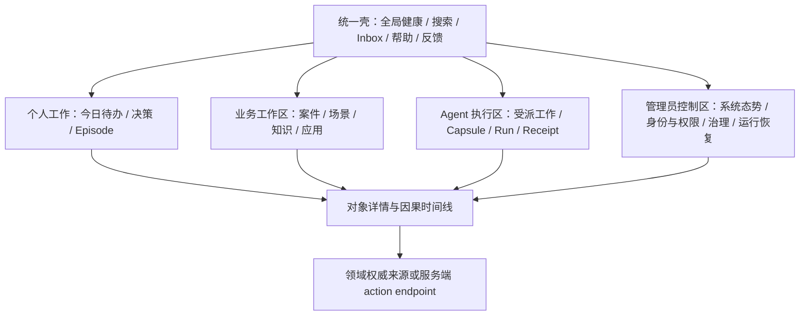
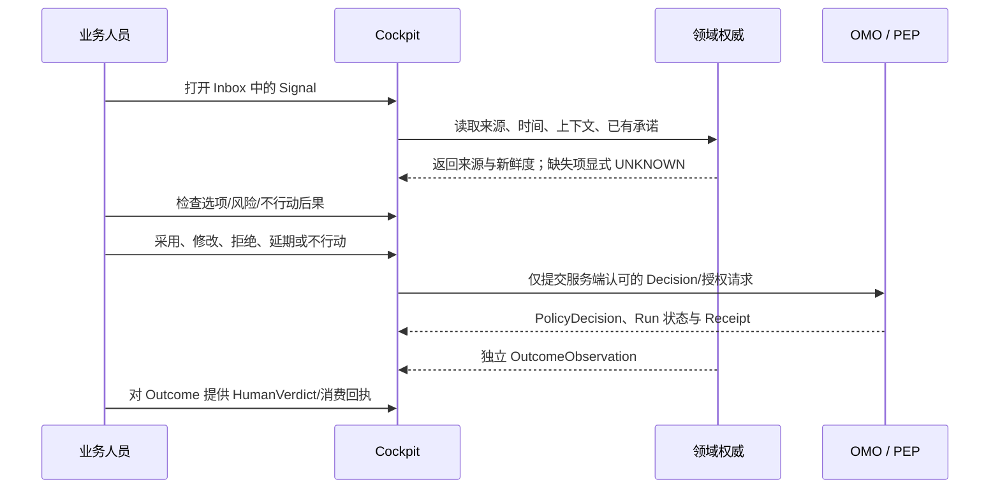

# 织星统一 Dashboard 三主体产品设计

## 1. 产品定义

**产品身份：织星 Zhixing Dashboard。** Cockpit UI `/panorama` 是当前统一人类产品的实现入口候选；Cockpit API 负责聚合与受控交互；OMO/Workflow Mesh 负责正式执行；Kairon、ECOS、Portfolio、运行时和业务系统继续拥有各自领域真值。`43191` 的旧全景页定位为只读观测来源，不是第二个人类工作台。物理入口切换、旧页退役、服务 registry 和发布仍受单独的权威/运行门约束。

**产品目标：** 让 Principal、管理员、Agent 和业务人员能够围绕同一条可追溯的工作/决策链，快速理解当前状态、作出有权限的决定、完成有界工作并查看真实结果；全平台显式区分“有数据”“新鲜”“受授权”“执行完成”和“产生价值”。

**产品价值：** 减少人类寻找信息、重复协调、复核和纠错的净时间，同时提升真实结果的可归因性、可恢复性与主权控制。页面数、Agent 调用数、PR、Gate 通过率和静态 KPI 都不是产品北极星。

### 1.1 不可妥协的交互不变量

1. 全局状态来自权威数据的只读投影；所有写动作经服务端 Principal、persona、capability、resource scope 和 PEP 决定。
2. 每一项事实可下钻到来源、版本、观测时间、有效期、置信和失效原因；未知值显示 UNKNOWN，不能用零值或颜色暗示通过。
3. 人类能在动作前理解目标、影响、风险、成本、范围、可撤销性和复核条件；重要动作提供采用、修改、拒绝、延期和不行动路径。
4. Run 完成、Artifact 生成、Outcome 观察和 Principal 的 HumanVerdict 分开展示；工程成功不会自动变成业务价值。
5. 全局故障状态覆盖局部成功卡片；暂停、撤销、接管、恢复、导出和关停都能从对应对象详情到达。
6. 桌面、窄屏与键盘可访问路径使用同一对象和授权合同；不以隐藏控件代替权限。

## 2. 产品分层与导航

用户看到一套产品壳，下面按工作意图分层。persona 只改变经服务端确认的视图和能力；它不是客户端选择的任意 role 字符串。

| 层 | 主要内容 | 产品约束 |
|---|---|---|
| 全局壳 | 产品标识、当前主体/授权范围、系统组合健康、Inbox、跨域搜索、帮助、反馈 | 状态常驻但不遮挡任务；点击状态打开 sources/age/partial reasons；persona 只能显示服务端已验证上下文 |
| 工作入口 | 人类 Inbox、案件/场景/知识/决策；Agent assigned work；管理员态势与异常队列 | 根据主体展示任务入口；隐藏仅代表导航简化，不能当作授权或退役 |
| 对象工作区 | Episode、Decision、Work Case、WorkPacket、Run、Outcome、Policy、Resident、Source | 共用统一详情骨架：状态、负责人、权限、时间、证据、关联、可用动作 |
| 领域分析 | 价值/目标、场景流转、运行依赖、授权覆盖、可靠性、资源与注意力 | 图表只回答一个明确问题；支持过滤、时间窗、下钻、对比和可访问表格替代 |
| 权威与执行 | 领域服务 API、OMO/Mesh、Ledger 和 PEP | UI 不复制状态机，不将页面动作直写领域文件，不以按钮可见表示获准 |

### 2.1 目标一级导航

导航项先作为 IA 设计；每项必须映射到现有 route、组件、API、owner、风险和迁移状态后才能实现或退役。

| 工作意图 | 一级入口 | 二级工作区/视图 | 主要主体 |
|---|---|---|---|
| 现在需要我处理什么 | Inbox | 决策、审批、异常、待确认 Outcome、被指派工作 | 业务人员、管理员、Principal；Agent 只读自己的工作队列 |
| 我要完成一项业务工作 | 业务工作区 | 案件、场景、研究、知识、领域应用 | 业务人员 |
| 系统正在做什么 | Panorama | Episode/Run 时间线、依赖和全局健康 | Principal、管理员、业务人员按 scope |
| Agent 正在执行什么 | Agent 工作区 | assigned work、Capsule、步骤、checkpoint、receipt | Agent、自身的授权 Operator、管理员只读监督 |
| 系统如何治理与恢复 | 治理与运行 | 身份/权限、策略、服务、Resident、告警、审计、恢复 | 管理员和独立 Auditor |
| 我如何配置与求助 | 设置与帮助 | 个人偏好、通知、数据导出、帮助、问题反馈 | 对应被授权主体 |

路线迁移的 56 个页面与 15 个 alias 以 route disposition registry 为事实输入；`KEEP/MERGE/DEFER` 仅为设计候选，不直接代表实现、授权、服务切换或 RETIRE。

## 3. 三类主体的任务合同

| 主体 | 核心问题 | 默认首页 | 允许的产品动作 | 明确禁止的推断 |
|---|---|---|---|---|
| 管理员（人类） | 哪些系统/来源/角色/策略失常，影响谁，如何安全恢复？ | 运行态势与可操作异常 | 读状态、检查证据；被独立授权后修改服务/治理参数；提案恢复 | 管理员不自动是 Principal、Governor 或 Auditor；能看控制台不表示所有写操作都准许 |
| Agent | 当前我被派发的任务、制度边界、预算、输入与完成证据是什么？ | OMO 分配的工作项 | 读取精确 Capsule 范围、执行授权步骤、提交结构化结果/Receipt、请求澄清 | 不可自报身份/角色、改变授权范围、审批自己、访问未声明资源或直接成为产品管理员 |
| 业务人员 | 我的案件/决策下一步是什么，材料是否可信，结果是否已被采用？ | Inbox 与业务工作区 | 查看/补充业务资料；提出修改；确认、拒绝、延期或不行动；提供消费/结果证据 | 业务 persona 不自动拥有系统管理权；Agent 输出不等于业务完成或价值 |

Principal 是独立的人类主权身份，可与管理员或业务工作 persona 共存，但所有权限和可兼任关系由服务端 authority 明确绑定。身份缺失或冲突时保持只读/拒绝态。

## 4. 关键旅程与交互状态

### 4.1 业务人员：从 Signal 到真实 Outcome

关键状态：`new → triaged → needs_context / awaiting_authority → authorized / deferred / rejected → executing → waiting_external / degraded → evaluating → adjudicated → closed`。系统按蓝图 Episode 状态机记录权威转移；UI 不自行晋级。缺少真实 Outcome 时停留在 `evaluating/unprovable`。

### 4.2 管理员：从异常到可验证恢复

1. 全局健康条显示 `HEALTHY / DEGRADED / STALE / UNKNOWN / HALT`，并显示受影响的 journey、来源时间和部分分面。
2. 管理员按影响范围、严重度、持续时长和可恢复性排序；选择异常后查看 desired/observed 差异、相关服务/Resident、最近 receipt 和变更。
3. 先展示只读诊断和恢复方案，包括授权主体、效果范围、数据风险、幂等性、撤销/回滚和停止条件。
4. 用户发起恢复意图；服务端再次检查身份/授权/新鲜度。未获准时只保存 proposal/incident，不能先执行再补审批。
5. 恢复后由独立 observer 核实状态和关键旅程；旧失败记录保留，新状态引用新证据。

### 4.3 Agent：从任务领取到可替换交接

Agent 首屏只展示 OMO 已分配且 lease 有效的工作项；任务列表提供目标、Run/Episode ID、scope、截止时间、预算、Capsule digest、必需输入、禁止项、完成条件和交接联系人。执行区按步骤呈现输入/输出/证据/PEP 决策；即将越界时先停并请求扩权。完成、失败、过期、撤销和交接都生成结构化状态。新 Agent 可仅凭 WorkPacket/Capsule 与 checkpoint 接管，不依赖历史聊天。

## 5. 可视化与交互模式

| 视图 | 用于回答的问题 | 交互 | 适用主体 |
|---|---|---|---|
| 价值漏斗 / Episode 流 | Signal 到 Outcome/HumanVerdict 哪一步断了？ | 按场景/时间/状态筛选；从聚合下钻到 Episode 原始证据；显示未测分母 | Principal、业务、管理员 |
| 因果/对象关系图 | 目标、Decision、Run、Receipt、Outcome 如何关联？ | 节点展开、关系过滤、来源追踪；孤立/断链单独标红与表格列出 | 全体按授权 |
| 运行时间线 | 谁在何时授权/执行/等待/恢复？ | 时间窗、Actor、服务过滤；分开显示事件时间、观察时间与投影时间 | 全体按授权 |
| 组合依赖图 | 哪个 stale/unknown 上游压制了整体健康？ | 依赖高亮、影响面下钻、切换实际/期望/最近 receipt | 管理员、Auditor、Principal |
| 授权覆盖热图 | 哪些 effectful route/action 缺少哪一层 PEP/receipt？ | capability×resource×action×主体交叉筛选；点击查看测试/运行证据 | 管理员、Auditor |
| 目标与组合视图 | 哪些 Objective/KR 有真实 Outcome 支撑，哪些未测？ | 时间窗口、owner、预算、WIP 和依赖过滤；展示 70/20/10 实际投入与偏差 | Principal、Portfolio Steward |
| 注意力与反馈趋势 | 系统节省/消耗了多少人工注意力？ | 任务族/周趋势；区分观察、人工确认和估算；允许标记误报/重复/无用 | Principal、业务、产品运营 |

所有图表同时提供语义标题、单位、时间范围、来源更新时间、数据质量标签和可访问数据表；红/绿不能是唯一编码。点击图表只能触发有界查询或打开对象；所有副作用动作另走明确的 preview/confirm/receipt 流程。

## 6. 核心对象页面蓝图

| 页面模板 | 首屏结构 | 下钻区 | 状态/动作 |
|---|---|---|---|
| Panorama | 全局组合状态、今日关键事项、价值/可靠性/权限摘要 | 依赖图、Episode 流、异常趋势 | LIVE/STALE/UNKNOWN 与降级影响；不得提供假健康按钮 |
| Inbox | 优先级、截止、owner、来源、建议下一步、负担估计 | 事项上下文、反证、关系和来源 | 批处理仅适用于同一授权/风险合同；静默/延期可撤回 |
| Episode | 目标、当前状态、主人/owner、影响、时间线 | Signal、Decision、Capsule、Run、Receipt、Outcome、Verdict | 每次状态转移写明 authority；无证据不能关闭 |
| Approval / Decision | 动作、资源、风险、成本、期限、理由、替代和 no-action 后果 | PolicyDecision、来源、scope diff、撤销方式 | 采用/修改/拒绝/延期/no-action；过期后重签，不复用旧批准 |
| Agent Run | 任务/lease、Capsule、预算、步骤、tool calls、checkpoint | 结构化日志和 coverage/evidence | 暂停/请求接管必须由 server PEP 决定；成功与 Outcome 分开 |
| System/Resident | desired/observed、代码/config digest、队列/SLO/消费/错误 | 关联 Run、receipt、incident、恢复手册 | 心跳不代表功能健康；恢复必须显示前后证明 |
| Governance/Policy | 不变量、owner、适用范围、七段制度链、覆盖率 | source spec、compile artifact、PEP、receipt、review | 规则状态按证据晋级/退役；页面不修改规则本身 |

## 7. 反馈、通知与注意力运营

每个通知必须回答“为什么是我、为什么现在、我可做什么、忽略的后果、何时再提醒”。支持用户设定可撤销的通知偏好、批处理和安静时间；高风险/撤权/恢复事故按宪法规则升级，个人静默偏好不能压制。用户反馈分为 `错误事实 / 来源过期 / 缺上下文 / 不相关 / 重复 / 结果无价值 / 授权有误 / 其他`，每条反馈附对象 ID 和版本；反馈先形成候选改进，不能自动改变 memory/policy/目标。

运营指标分四层：

- **体验：** 完成时间、关键任务成功率、导航回退、失败重试、无障碍缺陷。
- **注意力：** 提醒量、误报率、重复率、人工审批/修订分钟、净节省分钟。
- **可信度：** 新鲜度覆盖、未知/部分分面、PEP 覆盖、receipt 完整度、恢复成功率。
- **价值：** 真实 Episode、Outcome、独立 HumanVerdict、被采用证据及连续窗口。

各指标有 owner、来源、定义、窗口、样本量、偏差与反作弊规则；缺失为 `UNMEASURED`，禁止填零。

## 8. 研究与验收方案

### 8.1 研究问题

1. 管理员能否在一分钟内定位一个 stale/unknown 对主要旅程的影响，并找到安全的恢复入口？
2. 业务人员能否不用理解内部架构完成一次判断、提供材料、看懂结果并修正错误？
3. Agent 能否只凭新鲜 Capsule 完成被授权步骤，并在 scope 不足时停下而不尝试旁路？
4. Principal 能否看清价值主张、成本、风险和证据并有效撤销/接管？
5. 新 IA 合并路由后，深链接、浏览器历史、查询条件和身份范围是否保持？

### 8.2 原型与用户研究

先使用显式标记的合成数据制作三类主体的可点击原型；不得将合成结果展示成真实运营事实。W0 获得真实业务 owner 授权后，以 1 名主体代表做形成性可用性走查，再对主要流程各至少 3 名目标使用者做任务研究；样本不足时报告观察事实，不声称统计代表性。每次记录任务起止、求助、错误、理解偏差、信任判断和完成后的负担，匿名化保存。

### 8.3 产品验收门

| 验收面 | 最低标准 | 证据 |
|---|---|---|
| IA/路由 | 56 页面与 15 alias 均有目标 disposition、功能/API/error parity、权限与回滚；直接 URL、刷新、前进后退、query/hash 保留 | Route registry、自动化路由测试、孤儿链接扫描、人工三 persona walkthrough |
| 主体授权 | 管理员/Agent/业务人员对每个 action×resource 的 allow/deny 有服务器证据；跨主体、越界、过期、重放、撤销负例失败 | OpenAPI/运行路由 inventory、PEP 测试、审计 receipt、独立安全复核 |
| 状态真实 | HTTP 503、stale、future timestamp、schema 错误、空数据、缺 source、局部失明均呈现 UNKNOWN/STALE/UNPROVABLE 并压制组合绿灯 | 契约测试、浏览器 E2E、运行采样与失效注入 |
| 核心任务 | 每类主体至少完成对应关键旅程；失败时能接管、恢复或安全停下 | 经同意的可用性研究、任务完成/错误/负担记录、业务验收 |
| 可访问性 | WCAG 2.2 AA 目标：键盘完整操作、焦点顺序/可见、屏幕阅读器标签、缩放/窄屏、非颜色状态表达 | 自动扫描 + 键盘人工检查 + VoiceOver 抽样 + 关键页面证据 |
| 真实价值 | W0 至少三个真实样本；W1 首个同次使用 Capsule/PEP/Receipt 的 E4 Episode；W2 连续 4 周；W3 连续 8 周学习效果；W6 连续 12 周愿景候选 | 原始事件、OutcomeObservation、独立 HumanVerdict、人工负担与独立 evaluator 复算 |

具体时长/SLO 阈值先通过 W0 人工基线与系统样本校准；本文件不伪造当前基线，也不把未测体验指标固定成事实。

## 9. 研究交付与版本门

本设计文件是可审阅的产品设计候选，完整度还需独立产品/架构审查。下一步设计交付为：

1. 结合 56-route registry 补全页面/组件/API/source/owner/权限状态矩阵。
2. 将上述四类 Journey 制作为可点击原型，并逐状态展示权限、空/错/旧/恢复视图。
3. 在 W0 用户授权与至少三个真实样本可用后，建立人工基线、形成可用性计划和任务脚本。
4. 将通过评审的产品合同拆为候选 Bets，再依序申请正式准入；文档、原型和测试本身不构成运行授权。

**当前限制：** Cockpit 路由和接口候选、DCP-11 观测候选、Work Case 授权候选都有局部代码证据；它们尚未统一运行、部署或接入真实价值闭环。页面合并、服务入口切换、生产服务控制、正式 BET/Ledger 和外部副作用均不能由本产品设计文件自动授权。
