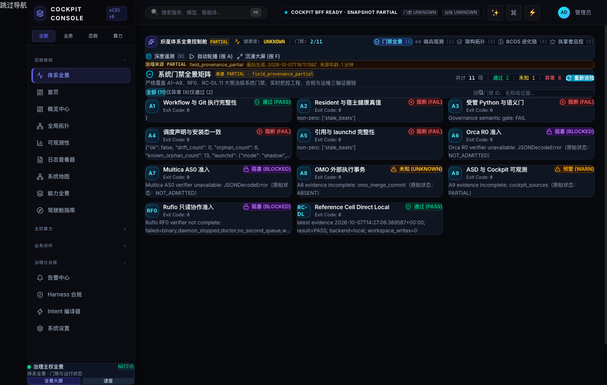

# Dashboard SSE 过载复发与受管恢复

本记录复核 2026-10-07 17:15–17:18 UTC 的 Zhixing `43191`、Cockpit `8090` 和 Vite `5173`。此前一次受管重启曾短暂恢复；本次再次出现 `43191` 无响应，证明当前恢复不等于根因修复。

`generated-at` 是首次记录时间；`updated-at` 对应新增复发复测、G0 v1.3 基线更正、接口采样、宿主版本核验及 Chromium 页面检查。

## 现场结果

| 入口/接口 | 重启前 | 受管重启后 |
|---|---|---|
| `http://127.0.0.1:5173/panorama` | HTTP 200，约 2 ms | 页面壳可达；本轮未再单独测量 |
| `http://127.0.0.1:8090/panorama` | HTTP 200，约 3 ms | 本轮未单独测量 |
| Cockpit `:8090/api/governance/panorama` | HTTP 200，8.02 s，`UNKNOWN` | HTTP 200，1.53 s，`PARTIAL`，快照时间 `2026-10-07T17:14:35.427288Z` |
| Zhixing `:43191/health` | 6 s 超时、无响应 | HTTP 200，首测 2.44 s，随后 1.19 s；`BOUND_FRESH`、`code_drift=false` |
| Zhixing `:43191/` | 未测 | HTTP 200，0.68 s，9,608,543 bytes |
| Zhixing `:43191/api/snapshot` | 未测 | HTTP 200，0.60 s，4,688 bytes |

使用浏览器当前相同的 `localhost` 主机名复测后，`localhost:5173/panorama`、`localhost:8090/panorama` 与 `localhost:43191/health` 均 HTTP 200，连接解析到 `127.0.0.1`；`lsof` 也确认三个 listener 都绑定 IPv4 loopback。因此当前并非 `localhost` 解析到 IPv6 而造成的连接失败。接口可达仍不能排除浏览器渲染、前端请求或数据完整性问题。

重启前进程 PID 18996 已运行 7 分钟，CPU 样本为 121.3%。日志有多条客户端连接重置的 `ConnectionResetError`。受管服务 `gui/501/com.omostation.zhixing-dashboard` 被 `launchctl kickstart -k` 拉起后，PID 为 37912；刚启动 18 秒时 CPU 样本仍为 33.6%，应继续观察长期负载。

重启后 4 分 20 秒再观察，PID 37912 CPU 瞬时样本为 24.0%；`localhost` 路径仍为 HTTP 200，健康接口约 2.08 秒。单次 CPU 样本不是持续负载分布，仍需候选修复发布后的采样验证。

随后对 PID 37912 做了 3 秒系统采样：进程有 5 个已建立 HTTP 连接、7 个线程；`top` 样本内 CPU 在 20.8%–53.8% 变化，常驻内存约 1.1–1.2 GB。采样栈显示请求线程大量落在 Python JSON decoder。与当前安装代码对应：每个 SSE 长连接每秒调用一次 `projection_revision()`；`ProjectionRevisionStore.load()` 会重新读取并哈希所有 revision artifact，并再次解析约 10 MB 的 `data` JSON。五条连接会并行放大这项工作。这把问题定位到可重复的具体负载路径，而不只是一般性的连接积压。

## 判断与修复候选

本次已直接采样确认 SSE polling 请求反复进入 projection revision 加载路径，并在 Python JSON decoder 上消耗显著 CPU。先前候选把每连接检查从每秒降为每 5 秒并缓存代码身份，解决了主要放大器的一部分；但每个 SSE 连接仍会独立重读、重哈希、重解析完整投影，所以它还没有消除 revision artifact 的共享工作。候选应继续加入有界、可失效、并发单飞的 immutable-revision 加载缓存，并通过文件替换/内容变动/指针切换负测证明失效正确，再重新独立评审。

隔离候选分支 `codex/zhixing-request-identity-cache-20261008` 的本地提交为 `4b235a03d35b231f4721d796e104ba092f9d5f87`，实现昂贵的 Git/代码身份校验缓存、SSE 间隔复用 5 秒轮询周期，并在 SSE 结束时关闭连接。候选分支测试记录为 live-server 49 项通过、SSE 聚焦测试 2 项通过、Workspace 投影大小测试 4 项通过；独立 reviewer 已批准该 patch。候选尚未进入正在运行的 Zhixing 服务。

首次现场 health 报告部署代码 OID `764e956ec0381e2f77f19b8e63d490cd3191e682`，部署脚本 SHA-256 `ff0f025d68f01331a909148950ca0df6137ae161d1b567d09ba19283453cb090`。当时 `zhixing-host-sync.py check` 报告 `template.html`、`refresh.py` 和 `live_server.py` 三项仓库/宿主部署漂移；候选 `live_server.py` asset SHA-256 为 `03a6a22e8676f2cc2dbac4cb6153df07cdbdf4655811a02d4581336c98fa301a`。不要通过手工覆盖运行目录来绕开该同步边界。

## 发布与验收状态

- 本轮只使用已注册的 LaunchAgent 做受管重启；没有直接杀进程、改写运行目录、刷新投影或重启其他服务。
- Workspace 仍有多处既有脏改动；`agent-workflow status --json` 为 `ok:false`，显示 18 个 active runs。使用系统 Python 3.9 调用时还会因 `datetime.UTC` 不存在而失败；经 `/opt/homebrew/bin/python3` 才能读取状态。该状态不能作为新 Dashboard BET 的写入/发布准入。
- Dashboard convergence execution plan 仍为 `draft-for-review`。G0-BIND v0.6 的 REJECT 是历史审查结果；当前 Documents 最新完整候选 v1.3 仍为 HOLD，DCP-00/01 保持 hold。受管服务恢复授权不自动等同于正式代码发布、身份绑定或项目 Ledger 认领。
- Cockpit 当前 `PARTIAL`，这意味着页面可达，但字段来源证明和白皮书功能验收尚未完整。浏览器视觉验收、本轮长时稳定性、持续 p95、三类角色服务端授权和真实业务闭环均未由本次接口探针证明。

## 后续顺序

1. 先解决 active-run/lock 冲突和 Dashboard G0-BIND / DCP-00/01 准入，形成精确输入摘要及受管部署计划。
2. 按 `zhixing-host-sync.py` 的版本化 capture/restore 流程收敛三项宿主漂移，并由独立 verifier 检查最终文件摘要；不得直接复制候选文件到运行目录。
3. 受控发布候选 SSE 修复后，验证 health、首页、snapshot、Cockpit BFF 和浏览器交互；在 SSE 客户端连接/断开、页面并发与闲置条件下持续采样 CPU、线程/连接数和 p50/p95。
4. 只有新鲜度、字段来源、性能与角色授权门槛均有独立证据后，才关闭相应里程碑；本次 200 状态码不构成整体验收。

## 2026-10-08 复发复核

本次复核中故障再次出现。`localhost:5173/panorama` 与 `localhost:8090/panorama` 仍分别 HTTP 200（约 2 ms、4 ms），但 `localhost:43191/health`、`/api/snapshot` 与 Cockpit `:8090/api/governance/panorama` 均连续超时 8 秒。随后通过已注册 LaunchAgent 执行 `launchctl kickstart -k gui/501/com.omostation.zhixing-dashboard`：三个接口恢复 HTTP 200，但端到端耗时分别约 5.83 s、7.54 s、8.91 s，仍不满足本地响应目标。复核时间为 2026-10-07 17:36–17:39 UTC（本机时钟）。

重启前服务进程 CPU 样本约 95.9%；重启后约 1 分钟采样 CPU 约 34.9%，RSS 约 2.3 GB。`lsof` 显示该进程存在十余条已建立连接及多条 `CLOSE_WAIT`。LaunchAgent 的运行脚本仍来自宿主旧安装目录，候选提交没有发布；因此两次重启均只恢复了短时响应，没有消除持续高成本的投影读取路径。当前最可靠的判断仍是 SSE/重复投影加载导致 CPU、解析和连接资源放大；新观察到的 `CLOSE_WAIT` 提示还需在缓存修复中验证断连后的 handler/socket 清理。

再过约 1 分钟复测，`/health` 与 `/api/snapshot` 各自 12 秒超时；Cockpit BFF 返回 HTTP 200 但耗时 8.02 秒。由此确认重启后的短暂成功不可持续，不能把刚重启时的 200 当作用户端稳定可用。

随后完成隔离候选 `fix/projection-store-cache-20261008`：`ProjectionRevisionStore` 只缓存当前一个已验证 revision 的 artifact bytes；每次请求仍验证 pointer、manifest、path、freshness 与 artifact 文件身份，身份变化时重新读取/哈希，异常则清缓存并失败关闭。作者运行 `python -m unittest -q test_live_server.py` 得到 56/56 通过，ruff、py_compile、差异检查通过；独立代码审查推荐 `APPROVE`，并额外通过 7 个聚焦缓存场景。候选未合入宿主同步资产，也未部署；线上当前状态不会因此改善。

17:57–17:58 UTC 的补充探针再次显示间歇性：`5173/panorama` HTTP 200、约 2 ms；Zhixing `/health` 两次 HTTP 200、约 0.49 s 和 3.42 s，响应状态 `BOUND_FRESH`，该快照在 17:57:56 UTC 声称有效至 18:04:36 UTC；Cockpit BFF 一次 HTTP 200、约 1.78 s，紧接着一次 5 秒超时。最新证据表明 Zhixing 可能恢复了短时响应，但 Cockpit 数据链路仍不稳定，接口状态不能替代浏览器交互验收。

18:02:39–18:03:05 UTC 再做三轮短时探针，每轮依次访问 UI、Cockpit BFF、Zhixing health，间隔约 10 秒。九个请求均返回 HTTP 200；UI 约 3–7 ms，BFF 为 1.68/2.29/2.22 秒，health 为 1.09–1.19 秒。这个 26 秒窗口显示当前短时可响应，但 BFF 有样本超过计划中的 2 秒目标，样本量也不足以证明持续稳定或达成 p95。

本轮后续 health 在 18:04:43 UTC 报告 Dashboard 代码 OID 已为 `576b068ef32c8d0ae1d4a896713efb627cfc3945`，部署仓库 `/Users/xiamingxing/.local/share/zhixing-dashboard` 的 `main` 与 `origin/main` 同步在该 OID，工作树干净；此版本包含 Dashboard PR #17 的变更。投影报告 `producer_root_oid=b18ee139f89bd68bc7c269a580fe6f6c3c1af3b0`、`projection_status=BOUND_FRESH`，有效期至 18:11:35 UTC。宿主 `runtime_paths.py` SHA-256 仍为 `a8821ed7ed787f4bca5858248887aa0cd39a8d792586c2fd0256217db15e3f06`，与隔离缓存候选 `0339d85d1bffa28bf77d1c32e5b3070249d781e43d01a2856dcd5396d9494448` 不同；因此最新 PR 发布没有包含本轮 revision artifact cache 候选。

18:13:21 UTC 用独立临时 Chromium 配置真实加载并刷新 `http://localhost:5173/panorama`。DOM `readyState=complete`，标题为 `Cockpit | eCOS v6`，有 26 个按钮与 14 个链接；本次采样未观察到 JS console error 或网络请求失败。页面不是空白：顶部明确标出 `COCKPIT BFF READY · SNAPSHOT PARTIAL`，健康与台账显示 `UNKNOWN`，门禁矩阵显示 11 项中 2 项 PASS、1 项 UNKNOWN、其余 8 项为异常/阻塞状态；来源年龄约 1 分钟。故浏览器确实能渲染 Cockpit，但产品数据处于 PARTIAL，门禁矩阵也显示未完成。此次仅核验页面加载和显示，不代表 26 个控件、所有路由或业务闭环已通过交互验收。

### G0 基线版本更正

本报告此前引用 G0-BIND v0.6 `REJECT` 是历史记录，不是 Documents 中最新候选。独立只读盘点确认当前最新完整 Authority Writer 候选为 Documents 下的 v1.3（`G0-BIND-AUTHORITY-WRITER-005`，SHA-256 `cd67af9323d00127e49189b5fb541953e6a9093c0c6869180d689b3237c93ba5`；manifest SHA-256 `41f241e9b88d346c18504e4a5c59cd0c111ff3bb04a2b28dba15e5d48d6e2132`）。其 39/39 隔离 E2E 通过及生产输入绑定通过只证明候选机制；候选状态仍为 `HOLD_STALE_BASELINE_AND_M0_FAIL`，`production_apply_enabled=false`，缺少 Principal mandate。Workspace 计划仍需补记这一较新基线；本报告不把 v1.3 视为已准入，也不以用户对白皮书 v2.1 的接受代替该 mandate。

### 18:22 UTC 当前访问与数据状态复核

本机 UTC `2026-10-07T18:22:30Z` 复测：`localhost:5173/panorama` 与入口脚本均 HTTP 200（约 5 ms 与 1 ms）；`localhost:5173/api/governance/panorama` 通过 Vite 代理返回 HTTP 200（约 2.39 s）；Cockpit BFF `localhost:8090/api/governance/panorama` 返回 HTTP 200（约 1.42 s）；Zhixing `localhost:43191/health` 返回 HTTP 200（约 0.96 s）。三个端口均由预期本地进程监听，`localhost` 可正常解析并访问。Zhixing health 的投影为 `BOUND_FRESH`、`code_drift=false`，生成时间 `18:22:19Z`、有效至 `18:32:19Z`，代码 OID 为 `576b068ef32c8d0ae1d4a896713efb627cfc3945`。

Cockpit BFF 数据状态仍为 `PARTIAL`，来源明确返回 `field_provenance_partial`，缺少 provenance 的分面为 posture、guardian、topology、evolution、workspace、launchd_health、agent_visibility。门禁 11 项中 2 PASS、4 FAIL、3 BLOCKED、1 UNKNOWN、1 WARN。当前证据支持“入口已可访问、数据与治理状态不完整”；HTTP 探针不能解释用户先前看到的浏览器错误，也不能证明长期稳定或完成交互验收。若仍无法从该桌面浏览器打开，需从同一浏览器取新鲜错误页和失败请求信息，避免将服务端可达误判为完整恢复。

### 18:43 UTC 持续复测

UTC `18:43:15Z` 附近再测五条路径：`localhost:5173/panorama` HTTP 200（约 2 ms）；Vite 代理与直接 Cockpit BFF 均 HTTP 200（约 2.85 s、2.51 s）；Zhixing `/health` HTTP 200（约 0.79 s），`/data.json` HTTP 200（14,768,363 bytes，约 0.39 s）。Health 报告 revision `9e90426c714f32230238d7adf55521ea56566329fcbd94a7341b94fb73c18710`、`BOUND_FRESH`、无代码漂移，投影生成于 `18:39:33Z`、有效至 `18:49:33Z`。Cockpit 仍 `PARTIAL / field_provenance_partial`，且 BFF 单样本超过 2 秒目标；该短时采样不构成长时可用率或 p95 证明。

**当前可用性结论：**截至 18:43 UTC 的本轮五条路径均返回 200，Chromium 在 18:13 UTC 完成过真实页面渲染；最近 BFF 单样本为 2.51 秒，18:02 UTC 的三轮样本为 1.68–2.29 秒，此前同一运行周期出现 5 秒和 12 秒超时。页面可短时访问，但数据与门禁显示 PARTIAL/UNKNOWN/异常；整体 Dashboard 仍应判为 `PARTIAL/UNRELIABLE`，尚未证明长时稳定、p95 目标或所有交互完成。

### 18:52 UTC 当前会话复核

本次从当前主机重新访问 `127.0.0.1:5173/panorama`、Cockpit `:8090/api/governance/panorama`、Zhixing `:43191/health` 与 `/data.json`，均返回 HTTP 200。Cockpit 页面壳约 2 ms，BFF 本次约 3.31 秒；Zhixing health 约 0.69 秒，数据约 1.89 秒、14,768,364 bytes。隔离 Chrome headless 实际渲染页面 DOM，标题为 `Cockpit | eCOS v6`，页面显示 `COCKPIT BFF READY · SNAPSHOT PARTIAL`，顶部门禁与台账摘要为 UNKNOWN；这证明当时页面可渲染，不能证明当前用户标签页已恢复交互，也未采集该浏览器控制台。

同一时刻 health 报告 `projection_status=BOUND_FRESH`、`code_drift=false`、PID `92335`，当前 revision `d45c6d101d65e25240f5165b902ab6771ce06fd516135400ce53a04a205469c8`，投影生成于 `18:50:05Z`、有效至 `19:00:05Z`。BFF 数据源为 `PARTIAL / field_provenance_partial`，仍缺 `posture`、`guardian`、`topology`、`evolution`、`workspace`、`launchd_health`、`agent_visibility` 七项字段来源；11 项门禁是 2 PASS、4 FAIL、3 BLOCKED、1 UNKNOWN、1 WARN。因 Cockpit BFF 再次超过 2 秒目标，且旧窗口有 5–12 秒超时，整体保持 `PARTIAL/UNRELIABLE`。若用户仍打不开，应优先检查当前标签实际地址/浏览器错误页/浏览器控制台与页面请求；本机端口拒绝连接目前不是复测到的状态。

### 20:01–20:16 UTC 当前运行态重核与修正

本轮在用户再次反馈“网页打不开”后，对 `5173`、`8090`、`43191` 做了同机 HTTP 与真实浏览器检查。Cockpit `5173/panorama` 和受 LaunchAgent 管理的 `8090/panorama` 均 HTTP 200，Chromium 实际渲染导航与全景内容，未观察到 JS 错误或资源失败；`8090` 是 Cockpit 打包入口，`5173` 是 Vite 开发预览。Zhixing `43191/` 页面在约 2.4 秒内渲染主界面，但重启前浏览器的 manifest、summary、search、topology、MOF、proposals、swarm 请求均出现 `ERR_CONNECTION_RESET`。服务当时 RSS 约 1.7 GB，活动连接多，stderr 有重复 `ConnectionResetError`；另有两组在临时 profile 中运行 1 小时以上的 headless DOM 检查仍挂着，确认它们是旧检查命令后以 TERM 结束。

通过已登记的 `gui/501/com.omostation.zhixing-dashboard` LaunchAgent 受管 kickstart 恢复服务。重启预热期曾出现 summary/search 超时；稳定后同一批 manifest、summary、search、topology、MOF、proposals、swarm GET 均返回 HTTP 200。后续单次 summary 约 1.59 秒、search 约 1.34 秒、manifest 约 1.26 秒。`/api/v1/events/stream` 是有意保持打开的 SSE 长连接，8 秒 curl 截止时已收到 482 字节；该探针超时本身不能判为接口故障。3 秒 `sample` 中请求线程停在 `time.sleep`，20:16 UTC 服务 RSS 约 582 MB、CPU 采样约 0.1%。这支持本轮当前稳定，但还不足以形成持续压力下的 p95/可用率证明。

**修正此前“revision cache 候选尚未部署”的过期结论：** 现场 `/health` 报告运行代码 OID `1da01d6a1e5378e14acf3b5ae7f30d2e0ea28414`；安装仓库 `/Users/xiamingxing/.local/share/zhixing-dashboard` 的 `main` 与 `origin/main` 同在该 OID，工作树干净。该提交 `fix(dashboard): coalesce validated projection reads (#18)` 已包含在运行代码中。已核验 `runtime_paths.py::ProjectionRevisionStore` 通过单飞锁和文件身份指纹缓存当前已验证 revision 的 artifact bytes；pointer、manifest、路径、freshness 与 artifact identity 仍逐次验证，失效或异常会清除缓存并失败关闭。`live_server.py` SHA-256 与 `/health` 的当前代码 SHA 一致，`projection_status=BOUND_FRESH`、`code_drift=false`。因此之前报告所述的“缓存候选未部署”已被后续 `origin/main` 更新取代。

截至 `20:16:35Z`，Zhixing `/health` 报告 PID `40898`、revision 在 `20:14:47Z` 生成、有效至 `20:24:47Z`。Cockpit BFF 仍为 `PARTIAL`，最近生成于 `20:13:11Z`，缺来源证明的分面仍是 `posture`、`guardian`、`topology`、`evolution`、`workspace`、`launchd_health`、`agent_visibility`。因此本轮结论是：三个本机页面可访问，Zhixing 核心数据端点恢复；Cockpit 数据完整性、门禁与长时稳定性仍未达验收。

三个服务均绑定 `127.0.0.1`，仅证明本机访问，不证明 LAN/手机可访问。此次重启和结束 headless 检查都只作用于已登记的本机服务/本任务的临时检查进程；没有改写安装代码、刷新投影、修改 Workspace 源码或改变 Ledger、Run、Lock 状态。

### 20:27–20:28 UTC 并发页面加载复核（2026-10-08 04:27–04:28 CST）

本机现行入口再次核验：`127.0.0.1:5173/panorama` 页面可由 Chromium 渲染，标题为 `Cockpit | eCOS v6`，页面状态为 `COCKPIT BFF READY · SNAPSHOT PARTIAL`，健康度 UNKNOWN，11 项门禁中 2 项 PASS、1 项 UNKNOWN、8 项异常；`127.0.0.1:8090/panorama` 返回 HTTP 200。Cockpit 页面壳可用，但来源完整性和门禁状态仍不合格。

Zhixing 首页 `127.0.0.1:43191/` 在 Chromium 中有时直接返回 HTTP 503，正文为 `projection_validation_busy`；同一页面成功加载时标题为 `织星 · 体系全景`，主视图能显示，但实时遥测为“重连中”。成功页面首轮并发加载中，`/api/v1/summary`、`/api/logs`、`/api/v1/value/metrics` 和 `/api/v1/events/stream` 有请求返回 503。关闭本轮独立 Chromium 检查会话后，health 在 69 ms 返回 HTTP 200、`projection_status=BOUND_FRESH`、`code_drift=false`；revision `853ca33018aff8308ba3` 生成于 `20:27:01Z`，有效至 `20:37:01Z`。新开单一 Zhixing 标签后首页 HTTP 200 且正文渲染，但这次单页中的若干并发 API 请求仍有 503。由此确认根因与并发校验竞争相关，不能将首页成功等同于整页数据加载稳定。

运行代码中 `ProjectionRevisionStore.load()` 和 `DashboardCodeIdentityCache.resolve()` 都通过共享锁串行化投影/代码校验，获取锁的上限各为 2 秒；超时使用相同公开错误 `projection_validation_busy` 并让请求返回 503。`do_GET()` 在大多数路由响应前都会运行 revision 与身份校验，页面首屏会同时发起多路请求。这解释了间歇性 503 与“零散 curl 200、浏览器页面接口失败”并存。本轮没有改动安装代码、刷新投影或重启服务；锁竞争的代码级修复、并发验收和发布仍未完成。

**更正本报告 20:16Z 结论的适用范围：**20:16Z 的“核心数据端点恢复”只描述当时顺序探针的短时样本；20:27Z 的真实浏览器并发加载已证明仍会触发 503。因此 Zhixing 当前应判为 `PARTIAL/UNRELIABLE`，而非整站恢复。Cockpit 与 Zhixing 都仅绑定 `127.0.0.1`，只支持本机访问。

### 20:34–20:35 UTC 最新顺序健康探针

关闭本轮独立浏览器后，Zhixing `/health` 返回 HTTP 200（51 ms），`BOUND_FRESH`、`code_drift=false`、无 `projection_error`。当前 revision `fb85c5345adbd0a06f0150c67bab9d6722ef71ed346b7c5a1603aaca10fed8e8` 生成于 `20:34:02Z`、有效至 `20:44:02Z`；Cockpit BFF 返回 HTTP 200（1.71 秒），`data_state=PARTIAL`。这次探针说明顺序 health/BFF 可读，不推翻上一节记录的并发浏览器 API 503，也不构成长时稳定性证明。

### 2026-10-08 08:29–08:47 UTC 当前会话可访问性恢复

当前标签起始地址 `127.0.0.1:5173/panorama` 无监听；受管 Cockpit 产品入口 `127.0.0.1:8090/panorama` 与 `/api/health` 可达。Zhixing `:43191` 的 PID `25966` 仍持有 listener，但 `/health` 超时，错误日志持续出现断连与 BrokenPipe。按照已登记 LaunchAgent 重新启动时，第一次启动在 `resolve_dashboard_code_identity()` 中退出，日志给出的直接错误是 `git show HEAD:live_server.py` 在 0.524 秒总身份校验截止时间内超时并导致 `IDENTITY_UNBOUND`；同一 `git show` 随后的独立读取为 0.031 秒。重新加载现有 LaunchAgent 后 PID `27696` 成功监听，未改写运行文件。

恢复后的连续三次只读 `/health` 均 HTTP 200，耗时 0.443/0.040/0.038 秒；三次均为 `BOUND_FRESH`、`code_drift=false`。`/api/snapshot` HTTP 200，但耗时 6.004 秒；Cockpit BFF HTTP 200、6.193 秒，数据状态 `PARTIAL`、错误 `field_provenance_partial`。本机隔离 Chromium 实际加载 `8090/panorama`，HTTP 200、标题 `Cockpit | eCOS v6`、`readyState=complete`，显示 26 个按钮和 14 个链接，未观察到浏览器 JS/console error；页面仍显示 `PARTIAL`、11 项门禁仅 2 项 PASS，其余 8 项异常、1 项 UNKNOWN。

本次结论是 Cockpit 产品页已实测可渲染，推荐访问 `http://127.0.0.1:8090/panorama`；5173 是手动开发预览，当前未运行。Zhixing 健康检查已恢复，但投影请求仍慢，间歇过载问题未根治。当前运行态用的 `runtime-clean-20261008` 与 Workspace 宿主资产存在漂移，且已有 SSE/重复投影读取修复候选尚未进入实际运行版本。此复核没有触发任一 `/api/v1` 操作路由，没有刷新投影，也没有改动 BET Ledger、Run 或 Lock。

### 2026-10-08 09:01–09:06 UTC 浏览器入口与 DCP-20 方案复核

用户当前标签地址为 `localhost:5173/panorama`；该端口没有 listener，curl 返回连接失败。Cockpit 受管产品入口 `127.0.0.1:8090/panorama` 返回 HTTP 200（约 39 ms），`/api/health` 返回 HTTP 200（约 2 ms）；Zhixing `127.0.0.1:43191/` 与 `/health` 均 HTTP 200。运行服务 PID `54364`，health 为 `code_drift=false`，运行代码 SHA-256 `8ab0587844af3cde1b16623b8ddf9e2570f07c062eb6e969b0da701c1fc67543`。本轮没有重启或修改任一服务。推荐访问：Cockpit `http://127.0.0.1:8090/panorama`；Zhixing 原始页面 `http://127.0.0.1:43191/`。

Cockpit BFF 返回 HTTP 200，但 `data_state=PARTIAL`、`source.status=PARTIAL`、`error=field_provenance_partial`。revision `d1ed451f2e3247da54ac4d9bb8822e8902427e0f2f39f16cac5233cca73a793d` 于 `09:04:53Z` 生成，有效期至 `09:14:53Z`；因此当前是数据来源证明不完整，不是 HTTP 服务不可达。

DCP-20 原 v1.0 Spec 的独立复核为 `NEEDS_REVISION`：host-sync 原地复制与干净 Git 身份冲突；查询层禁止副作用会连带影响共用该层的 POST；route/operation、目标根身份和多文件回滚定义不充分。修订候选 v1.1.0 增加 operation × method 清单、暂停 effectful POST、不可变版本晋升边界和生产部署阻断。候选还须独立复核通过并由 Principal 接受精确 SHA 后才能替代当前绑定 Spec。

Ledger 中 BET-Y2Q4-T10-236 的 `accepted_specifications` 仍绑定 v1.0 SHA `73e2e6951f3788b58cf58b09616cf0c72f9a6251f155fa22075a8ffd4139217a`；BET completion evidence 已按 schema 修正，Ledger lint 为 `529 bets, 16 tracks, no errors`。只读 `agent-workflow observe --json` 仍返回 `escalate`：6 个旧 Run 的 expired locks 与 2 项 active-run-missing-lock 警告。没有清理、接管或修改这些 Run/Lock，也未启动 BET 实际 claim 或发布流程。当前只完成入口定位和方案候选，DCP-20 代码修复与安全门发布均未完成。

### 2026-10-08 09:18 UTC 复测与 DCP-20 v1.1 候选复核完成

再次核验确认：`localhost:5173/panorama` 仍无服务；Cockpit `127.0.0.1:8090/panorama`、Cockpit `/api/health`、Zhixing `127.0.0.1:43191/` 和 `/health` 均 HTTP 200。Cockpit BFF 本次约 0.94 秒，仍为 `PARTIAL / field_provenance_partial`，七项来源缺失分面保持 `posture`、`guardian`、`topology`、`evolution`、`workspace`、`launchd_health`、`agent_visibility`。新 revision `233717594eff629e16df36c6f026dbbd1e5b7ac82aac4a8057204c555f3b0918` 生成于 `09:18:50Z`，有效至 `09:28:50Z`。Zhixing PID `54364`、`BOUND_FRESH`、`code_drift=false`；未重启服务。

DCP-20 v1.1.0 候选已通过独立技术规格复核，复核结论 `APPROVE` 仅代表可进入 Principal 接受/绑定审阅，不表示开始实现或部署。候选 SHA-256 为 `6cd451a934cadce4e5b94a5192056ebe48328cb535eb596c6c899695d3f05ef7`。当前 Ledger 仍仅接受原 v1.0 SHA；同时 workflow observer 仍因旧 Run/Lock 事实返回 `escalate`，没有进行 claim、锁清理、代码修改或生产发布。

只读追溯 `observe` 阻塞的遗留状态：Run `20261005T130234Z-project-code-change-b338bd88` 对应 TASK-263EF9EC 和 PR #4649（当前仍 OPEN，远程更新时间 `2026-10-05T15:50:46Z`）；其 worktree `/Users/xiamingxing/Workspace/.worktrees/w-t263` 为干净状态，位于已推送分支 `fix/worktree-removal-submodule-gate`。因关联 PR 仍开放，不清理该 Run 或五个过期 path locks。Run `20261006T020319Z-governance-state-mutation-9ce306c0` 的目标是复审 `.omo/_truth/registry/omo-governance-surfaces.yaml`；其唯一 path lock 已过期，events 只见 start/claim，无 verify/close。两个 Run 的 owner 都记录为 `xiamingxing`。这证据说明 observer 的阻断来自未结束的既有交付，而不是本次 Dashboard 服务故障；继续保留其状态并等待已有交付流程收尾。

### 2026-10-08 09:25 UTC 入口复测

当前浏览器仍指向 `localhost:5173/panorama`，但本机 `5173` 没有监听，因此该 URL 会连接失败。Cockpit 受管产品入口 `http://127.0.0.1:8090/panorama` 与 `/api/health` 均 HTTP 200；Zhixing 原始页面 `http://127.0.0.1:43191/` 与 `/health` 也均 HTTP 200。Zhixing PID `54364`，`projection_status=BOUND_FRESH`、`code_drift=false`；revision `ad1e765cfeaadc6fbfc25b7371ed3ce293e4b78046a89b93fb9ea1c257412bff` 生成于 `09:22:13Z`、有效至 `09:32:13Z`。

Cockpit BFF 返回 HTTP 200，但 `data_state=PARTIAL`，来源状态仍为 `field_provenance_partial`；缺少来源证明的分面仍是 `posture`、`guardian`、`topology`、`evolution`、`workspace`、`launchd_health`、`agent_visibility`。这次复测支持的判断是：5173 地址失效，两个受管页面入口目前可达；Cockpit 的数据完整性仍有缺口，Zhixing 投影当前新鲜。没有重启服务、重发投影或调用操作 API。

### 字段缺口根因追踪

对当前 `data.json` 与 `panorama-collect.py` 的交叉检查进一步区分了两类问题：`posture`、`guardian`、`topology` 三项不在当前聚合投影中，Cockpit 适配层只能给出零值、不可用对象或空列表，因此这是数据契约/生产端缺口；单靠把分面从 `partial_facets` 删除会制造错误的完整性信号。`evolution`、`workspace`、`launchd_health`、`agent_visibility` 四项已在投影中，但缺少 Cockpit 可验证的逐字段观察记录。

现有聚合器分别实现了 `collect_evolution()`、`collect_workspace_hygiene()`、`collect_launchd_health()`，并在聚合末尾派生 `collect_agent_visibility(payload)`；但 `compact-observation.py` 和 Cockpit `_apply_compact_observation()` 当前只支持 `knowledge_health`、`experience_graph`、`connectors`、`bos_verifier` 四个观察面。因此后四项可以通过增加受限观察契约补齐来源证明；前三项必须先定义权威 producer、字段 schema、采样时间与失效语义，再接入适配层。验收时还要确认数据本身真实有效，不能以“存在字段”代替来源与时效证明。

### 2026-10-08 09:35 UTC M1 来源合同与执行门复核

进一步核对发现，`collect_workspace_hygiene()` 当前把 lock 文件枚举输出为 `orphan_locks`，但函数没有判定 lock 是否孤立；Cockpit 不能把这个名称当成“可清理孤儿锁”结论。`agent_visibility` 是同一 projection generation 的派生摘要，不是 Agent 心跳；投影新鲜不能提升其输入中 `UNPROVABLE` 项的可信等级。`posture` 也没有已定义的聚合公式，不能从 health KPI、gate 通过率和 Agent 数量拼成综合健康分。以上字段的语义限制已纳入独立规格草案。

本次直接重测 Zhixing `/health`：PID `54364`、`BOUND_FRESH`、`code_drift=false`；revision `ff1d10bad194cb9861f0893acd256ecd3e7a05d37ff46560acd5ee711500a9e5` 于 `09:32:23Z` 生成，有效至 `09:42:23Z`。Cockpit BFF HTTP 200，仍为 `PARTIAL / field_provenance_partial`，七项分面没有变化。

执行工作流检查方面，`dashboard-evolution` 的 `start --dry-run` 明确要求 `--bet`，当前 Ledger 没有可用于此 M1 facet 完整性切片的专属 BET；现有 DCP-20 BET 只授权其明确的 GET 安全与宿主发布范围，不能挪作数据合同实现。已新建草案 `docs/superpowers/specs/2026-10-08-dashboard-m1-facet-provenance-contract.md`，状态为 `draft`、`implementation_authorized: false`，正在独立审查。没有绑定 Ledger、启动 Run、领取路径锁或执行代码/部署。

### 2026-10-08 09:46 UTC 当前浏览器入口与产品数据复核

当前浏览器访问的 `http://localhost:5173/panorama` 连接失败，本机 5173 没有 listener。端口注册表将 5173 标记为 cockpit-ui 的 Vite 开发端口，并明确唯一受管产品入口为 Cockpit `http://127.0.0.1:8090/panorama`；该入口、`/health`、`/api/health`、`/api/governance/panorama` 均 HTTP 200。Cockpit LaunchAgent `com.cockpit.dashboard` 处于 running，PID 55068。Zhixing `http://127.0.0.1:43191/` 与 `/health` 均 HTTP 200，health 为 `BOUND_FRESH`、`code_drift=false`；它是 Cockpit 使用的只读投影来源，不是人类主入口。

产品 API 当前为 `PARTIAL / field_provenance_partial`。全量 projection 与 compact artifact 的 `generation_id` 相同，compact `source` 与 health `state_revision` 相同；但全量 artifact 自身没有 `source/state_revision`，门禁条目带 `live=true` 却没有逐项 observed time/source provenance。BFF 当前把来源缺失的 posture、guardian、topology、evolution 返回为零值、`offline` 与空数组，造成数据语义失真。已通过独立复审的候选合同 SHA-256 为 `f7a81a4aa28a14e7c31a45c45e955c548c875313e6be6b4805f442f6722c1753`，状态仍为 draft；本次未重发投影或重启服务，修复在进行中。

### 2026-10-08 18:19 UTC Cockpit 入口修复与来源失败闭合

针对当前浏览器中的 `localhost:5173/panorama` 无监听，本轮确认 `5173` 是开发预览端口；Cockpit 受 LaunchAgent 管理的产品入口是 `http://127.0.0.1:8090/panorama`。完成 Panorama 适配器与 UI 的来源校验修复，并重新构建静态 UI、重载 `com.cockpit.dashboard`。重载后 `/panorama`、`/health`、`/api/health`、`/api/governance/panorama` 及 Zhixing `/health` 均 HTTP 200；LaunchAgent 为 running，Cockpit PID `61653`。`5173` 仍没有服务，这符合开发预览未启动的状态。

这次将来源不明的门禁、告警与指标统一降为 `UNKNOWN/PARTIAL`：全量投影必须携带与 health revision 和字段值摘要匹配的逐字段证明；compact 回退不再因 agent brief 时间戳相同而信任门禁；直接观察必须通过固定 source_ref、当前 collector SHA-256、值摘要和时效校验；UI 缺失 partial 声明/证明时失败闭合，同时保留通过 direct observation 验证的业务字段。projection-derived `agent_visibility` 必须有双方非空且一致的 generation/revision 绑定。

重载后实际 BFF 状态为 `PARTIAL / field_provenance_partial`，11 项门禁全部 `UNKNOWN`；posture 为 null，guardian 为 `UNKNOWN`，topology/evolution 为 null。当前 Zhixing 的健康端点可达，但现有上游快照不满足细粒度来源证明，因此 Cockpit 不再展示此前伪造的 PASS/FAIL、零值、offline 或空成功。独立代码复审最终 `APPROVE`。验证结果：Cockpit adapter 19 passed，compact observation 8 passed，UI hook 21 passed，TypeScript typecheck 与生产构建均通过。没有重发布 Zhixing 投影、改写 Ledger/Run/Lock、commit 或 push。
