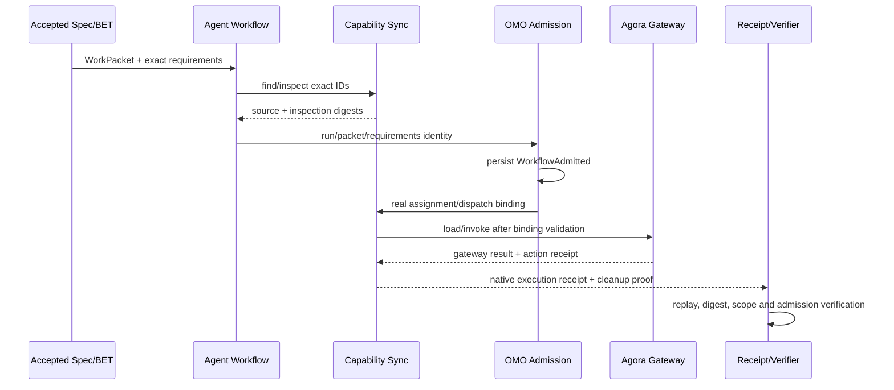

# Wave B Exact Capability Binding 设计

## 1. 目的

把当前彼此分离的四条强能力链收敛为一个可执行、可重放、可拒绝的默认路径：

```text
accepted Spec
  → BET / WorkPacket v2
  → exact capability requirements
  → find / inspect / load
  → admission / assignment / dispatch
  → native execution receipt
  → independent verification
```

本设计只解决工程执行面能力绑定，不把供给侧工程事件、PR、测试、Agent 自评或 maturity 分数提升为个人价值。
Golden Slice、Human Verdict、principal-bound decision_outcome 与连续价值观测属于后续独立 Wave。

## 2. 当前事实

### 2.1 已存在并复用

1. `bin/agent-workflow.py` 已在 start 时绑定 `bet_id`、`spec_binding`、`instruction_binding`、
   `work_packet` 与 `work_packet_hash`；Spec/Instruction drift 会 fail-closed。
2. `bin/capability-sync.py` 已有单一 generated projection、exact ID resolution、ambiguous/not-found
   拒绝、native inspection 和 Agora gateway load/invoke。
3. `lib/capability_trace_binding.py` 已定义八字段因果信封：correlation、workflow run、packet、
   packet hash、assignment、dispatch、actor、delivery attempt。
4. `lib/capability_native_execution_receipt.py` 已有 material、marker、completed receipt、cleanup、
   replay 与 value firewall 的纯函数合同。
5. OMO 已有 accepted Spec 校验、worker admission、required capability matching、health/approval gate、
   policy digest、request identity、Workflow Mesh 与 worker ACK。

### 2.2 尚未闭合

1. WorkPacket/agent-workflow 没有把任务所需 exact native capability IDs 编译为默认执行约束。
2. skill/workflow 可以 exact inspect，但未与 MCP/BOS 共用统一 find/load 消费链。
3. `capability-sync load/invoke` 不强制 trace binding；Cockpit BOS invoke 不透传 binding。
4. B4-D execution receipt 只有库与测试，没有生产消费者。
5. OMO `StepDispatched` 前没有重新核对持久化 admitted state、admission id 与 policy digest。
6. Cockpit KEMS 裸 dispatch 已 fail-closed 但成为死入口；agent-runtime、runtime registry 和候选
   AGE-v2 Agent Cell 仍可能成为平行派工面。

### 2.3 Phase8 root bypass 事实（2026-08-25 scope amendment 1.1.0）

1. Cockpit 子仓 PR #78（分支 `codex/t1-12-cockpit-parallel-entry-retire-20260825`，
   source head `43dbf115db0fece980d3ffe2d8339e4fbc1b5b59`，child main merge
   `82dddbc926cc4377808fe530bf135f08213cd213`，2026-08-25）已删除
   `cockpit/commands/daemon.py` 并退役 `_subcommands.py`、`cli.py`、`commands/governance.py`、
   `tui/swarm_collector.py` 中的未绑定入口面，以 `test_parallel_entrypoints_retired.py` 锁定。
2. 根仓 main 的 `bin/omostation` 仍暴露 `daemon` / `watchdog` / `scenario` / `top` /
   `run <module>` 五条旁路命令：`daemon` 分支 import 的 `cockpit.commands.daemon.daemon_cli`
   在 child main `82dddbc9` 已不存在，`top` 分支 import 的 `cockpit.tui.swarm_dashboard`
   在 child main 从未存在——root gitlink 前进到 child main 后这两条命令立即 ImportError，
   `top` 与 `daemon` 同为无法恢复的幽灵入口，必须一并退休。
3. `bin/gac/daemon-watchdog.py` 的自愈路径 `restart_daemon()` 同样 import child 已删除的
   `cockpit.commands.daemon.restart_daemon_service`，且以 zero-human-intervention 方式直接
   重启服务，绕过 admission 与 capability receipt。
4. `bin/ssot/real-scenario-runner.py` 直接向 Agora Bus 发布 A2A 事件并写 resident decision
   提案，不经 accepted WorkPacket、admission 或 trace binding。
5. 上述两脚本仍登记为 active script registry 条目
   （`bin/_registry/scripts/governance/daemon-watchdog.yaml`、
   `bin/_registry/scripts/governance/real-scenario-runner.yaml`）。
6. 截至 2026-08-25，根仓 gitlink 仍指向 `d8af11c2`（child main 为 `82dddbc9`），
   root 尚未跟进 child 的入口退役，形成 child-first/root-follow-up 缺口。

## 3. 自举授权证据

```text
waiver: user-explicit
when: 2026-08-24T12:34:56Z
who: xiamingxing
quote: "本次 Wave B Exact Capability Binding 自举跳过 workflow start，允许使用 AGCP_REQUIREMENT_ITERATION_GATE=0；仅限 docs/superpowers/specs/2026-08-24-exact-capability-binding-design.md 与 docs/plans/3y-bet-ledger.yaml 中新增 BET-Y1Q3-T1-12 条目，并把本句写入 waiver 证据。"
scope: docs/superpowers/specs/2026-08-24-exact-capability-binding-design.md; docs/plans/3y-bet-ledger.yaml::BET-Y1Q3-T1-12
reason: start --bet requires an already-existing accepted Spec and BET, creating a self-bootstrap cycle
risk: these two files have no workflow run or claims during bootstrap
residual: every implementation file, test, submodule and closeout must use the new BET run and claims
gate_bypass: 1
no-run-id: true
```

该 waiver 不适用于任何实现文件、测试、子模块、运行态、PR 合并或其他 BET；constitution waiver 也不能复用。

## 4. 方案比较

### 方案 A：只在 workflow start 检查 capability

拒绝。start 时真实 worker、assignment、dispatch、health 与 admission 尚不存在；该门既无法验证真实执行身份，
也覆盖不了 Cockpit、Runtime 或 Agent Cell 的带外入口。

### 方案 B：start 声明与预检，dispatch 用真实 identity/receipt 再验证

采用。start 绑定 exact requirements 与 WorkPacket；dispatch 使用真实 assignment/dispatch identity 构造
trace、inspection、admission 和 execution receipts。所有入口复用既有 registry、digest、Workflow Mesh 与
gateway，不新增调度器或状态库。

### 方案 C：新增中央 capability broker/registry

拒绝。会形成新的权威、调度和运行状态面，与现有 generated registry、Agora gateway、OMO admission 和
WorkPacket 并列，增加跨仓漂移与维护成本。

## 5. 核心合同

### 5.1 CapabilityRequirement

任务侧必须声明有序、去重的 exact requirements。每项包含：

```yaml
capability_id: "skill:git-discipline"
operation: "load"
effect: "read_only"
```

合法 kind/operation：

| Kind | find/inspect | load | invoke |
|---|---:|---:|---:|
| `skill:<name>` | 必须 | 必须 | 禁止 |
| `workflow:<id>` | 必须 | 必须 | 仅由 workflow-controller |
| `mcp-server:<id>` | 必须 | 必须 | 禁止 |
| `mcp-tool:<server>:<tool>` | 必须 | 必须 | 仅由 mcp-pep |
| `bos-service:bos://...` | 必须 | 必须 | 仅由 bos-pep |

禁止 query first-match、通配符、未证明的 legacy invoke string 和调用方自报 adapter。

### 5.2 Start binding

`agent-workflow start` 必须：

1. 从 accepted BET/WorkPacket 取得 exact requirements；
2. 对每项执行 deterministic find/inspect；
3. 保存 capability ID、operation、source digest、inspection receipt digest 与 requirements digest；
4. 把这些字段加入 run delivery identity，并随 parent/child run 精确继承；
5. 缺失、歧义、重复 authority、source drift 或不支持 operation 时，在写 run/lock/ledger 前拒绝。

start receipt 只证明声明和源码，不声称 invoked/evidenced/independently_verified。

### 5.3 Dispatch binding

dispatch 必须使用真实八字段 trace binding，不接受调用方缩减字段：

```text
correlation_id
workflow_run_id
packet_id
packet_hash
assignment_id
dispatch_id
actor_id
delivery_attempt_id
```

dispatch 前重新验证：

- WorkPacket hash 与 run/assignment/dispatch 一致；
- capability requirements digest 与 start 记录一致；
- native source/inspection digest 未漂移；
- persisted run 为 admitted；
- admission id 与 policy digest 等于 WorkflowAdmitted 事件；
- worker capabilities 覆盖要求，health/approval/lease 仍有效。

### 5.4 Load/invoke 与执行回执

`capability-sync invoke` 必须接收并验证 binding；缺失时非零退出且 provider/router 调用次数为 0。
`load` 对传入的 binding 同样校验；任务驱动生产路径必须传入 binding。

执行产生 `native-execution-receipt/v1`：

- material 内嵌 binding、capability、inspection、admission、operation 与 request digest；
- invocation id 从完整 material 派生；
- durable marker 先于 effect；
- uncertain transport 不重放 effect；
- confirmed/failed 都有 cleanup proof；
- fallback.used 恒为 false；
- `value_indicator_policy=false`，不得出现 human verdict、decision outcome 或个人价值字段。

### 5.5 入口收敛

1. Cockpit BOS invoke 必须透传 binding 与 receipt，不构造第二套 identity。
2. Cockpit KEMS 裸 `dispatch_task` 改走 admission-bound 路径，或在无消费者时显式下线。
3. agent-runtime 与 runtime registry 在未接入本门前保持 isolated/non-authoritative，不允许注册为生产派工入口。
4. AGE-v2 Agent Cell 在合并前必须把 `cell_execute/cell_govern` 等路径接到同一 WorkPacket、admission、
   capability receipt 与 OMO dispatch identity；否则 defer。
5. 根仓统一 wrapper（`bin/omostation`）必须 compatibility-only：`daemon`、`watchdog`、
   `scenario`、`top` 与任意 `run <module>` 直通执行五类入口退休，直到对应能力被 Mesh-bound
   （accepted WorkPacket + OMO admission + capability receipt + dispatch identity）；wrapper
   只保留对已收敛入口的透传，不成为第四条执行面或新调度面。退役命令必须非零退出、零写入、
   零 provider/router 调用。

## 6. 数据流



## 7. 实施波次与跨仓顺序

### Wave A：Root contract 与 B4 消费

1. WorkPacket/ledger projection增加 exact requirements；
2. `capability-sync` 对 skill/workflow/MCP/BOS 完成 exact find/inspect/load 语义；
3. invoke mandatory binding；
4. B4-D receipt 接入生产路径；
5. root negative tests 与 replay tests 全绿。

### Wave B：OMO dispatch integrity

1. admitted state/admission id/policy digest 回验；
2. 删除不可达 legacy 空 capability grant；
3. worker/mesh/compensation 回归；
4. OMO 子仓先独立 PR、CI、merge、tag。

### Wave C：Cockpit/Agora consumer

1. consumer 先兼容新 binding contract；
2. Agora 仅在 receipt 字段确需透传时修改；
3. Cockpit BOS/KEMS/agent-runtime 入口收敛；
4. 子仓分别 merge 后，根仓只更新可达 gitlink。

### Wave D：生产拓扑 canary

使用一个低风险、无外发、可撤销的真实任务：

1. canonical Spec/BET/WorkPacket start；
2. exact skill + workflow + MCP/BOS capability load；
3. one admitted dispatch；
4. one confirmed read-only invocation；
5. replay receipt；
6. wrong digest、missing binding、wrong admission、ambiguous selector、uncertain transport 五类负例；
7. rollback/cleanup 与 clone lifecycle receipt。

### Wave E：Phase8 root recovery（scope amendment 1.1.0）

排序契约为 child-first / root-follow-up，任何一步不得倒置：

1. child main 先行：Cockpit PR #78（`43dbf115` → merge `82dddbc9`）已退役 unbound
   entrypoints，是既成事实；root 不得在其前重写、复刻或重新暴露这些入口；
2. root gitlink 跟进：仅在 child main merge SHA 可达后前进根仓 pointer；
3. root wrapper 收敛：与 pointer 前进同一批或紧随其后的 root 变更里，把 `bin/omostation`
   的 `daemon` / `watchdog` / `scenario` / `top` / `run` 五条旁路命令全部退休为
   compatibility-only（§5.5.5），同步退役 `bin/gac/daemon-watchdog.py` 与
   `bin/ssot/real-scenario-runner.py` 的执行面及其 active registry 登记与文档投影
   （CLI-REFERENCE / INDEX-MCP / capability-registry）；
4. 每步配 negative no-write 测试：被退役命令非零退出、零文件写入、provider/router 调用为 0，
   且不产生 human verdict、decision outcome 或个人价值字段（value firewall）；
5. host LaunchAgent 清理仅在代码 merge 之后执行，避免半退役状态下服务自拉起。

## 8. Rollout

新门禁遵循三段式：

1. `shadow`：记录现有 production path 中缺 binding、空 capability、旁路入口；不阻断既有流量；
2. `warning`：对新 WorkPacket/Agent Cell 入口报警，并给出 exact remediation；
3. `fail`：存量清零且 canary 通过后，生产入口默认拒绝无 binding 调用。

不新增独立 shadow daemon、数据库或 workflow；使用既有 run/mesh/receipt 和 gate reporting。

## 9. 验收标准

1. accepted Spec、BET、WorkPacket hash、run 与 claims 可重复读取且完全一致。
2. skill/workflow/MCP/BOS exact ID 均可 find/inspect/load；歧义和 first-match 执行被拒绝。
3. invoke 缺/错 binding 时 provider 调用为 0，CLI 非零退出且回执脱敏。
4. B4-D execution receipt 至少有一个真实生产消费者，marker/replay/uncertain/cleanup 负例全绿。
5. Cockpit/Agora 不丢失 binding/receipt digest，不构造第二 identity。
6. OMO 在 StepDispatched 前回验 persisted admission，伪造 grant 或跨 run admission 被拒绝且零副作用。
7. legacy 空 capability grant 与 KEMS 裸派工路径被删除、接线或显式下线。
8. agent-runtime/runtime registry/AGE-v2 未经本门不能成为生产权威入口。
9. root、OMO、Cockpit、Agora targeted tests、cross-repo negative tests、GaC、SSOT、reachability 与
   production-topology canary 全绿。
10. 子仓 commit/tag/PR/CI/merge 后才更新根仓 gitlink；所有 writer clone 由 lifecycle receipt 退役。
11. 每 2–3 个 PR 或一次跨仓 wave 后重放全增量纠偏，不让并行分支改变主线优先级。
12. `bin/omostation` 的 `daemon`/`watchdog`/`scenario`/`top`/`run` 五条旁路被退休为非零退出的
    compatibility-only 拒绝路径；退役命令零写入、零 provider 调用，script registry 与
    capability projection 不再把它们列为可用能力；host LaunchAgent 在代码 merge 后清理完毕。

## 10. 反指标

本 BET 不以以下项目作为成功：

- maturity score、ADR 数、雷达轴数、BET done 数；
- PR、测试、Token、Agent、MCP 或 capability 数量；
- fixture-only、静态 schema、文件存在或 worker 自报完成；
- agent 自动生成的 verdict、估算节省时长或 synthetic decision_outcome；
- daemon/list/health 存在但没有 per-operation receipt。

## 11. 回滚与断路器

立即停止并重新审议的条件：

- 需要新 registry writer、scheduler、database 或第二 dispatch truth；
- 必须放宽 WorkPacket、Spec、claim、author、admission 或 receipt digest 校验；
- 需要自动外发、自动 Human Verdict 或把执行回执提升为个人价值；
- 子仓 main 不可达、gitlink rewind、无法保留旧消费者兼容窗口；
- production canary 只能由 fixture/synthetic 数据替代。

回滚以单仓 PR revert 为单位；append-only mesh/receipt 不做数据迁移，错误新入口直接恢复 isolated 状态。

## 12. Decision Log

| # | 分叉 | 裁定 | 理由 |
|---|---|---|---|
| 1 | start-only / start+dispatch / new broker | start+dispatch | 真实身份在 dispatch 才完整，且不新增权威 |
| 2 | worker capability labels / native asset receipts | 两层都保留并显式区分 | 二者语义不同，不能同名冒充完成 |
| 3 | one giant cross-repo PR / staged PRs | staged PRs | 保持 child-first reachability，降低 main 红窗 |
| 4 | hard fail immediately / shadow-warning-fail | 三段式 | 新门禁先测存量，不用治理误伤锁死主干 |
| 5 | industrial threat model / bounded personal-system model | bounded model | 复用现有 digest/admission，不新增重型密码学与平台 |
| 6 | root wrapper 保留 `top`/`run` 兼容 / compatibility-only 收敛 | compatibility-only | PR #78 后 child main 无 `daemon_cli` 且从未有 `swarm_dashboard`，root 幽灵 import 无法恢复；Mesh-bound 前不允许第四条执行面 |
