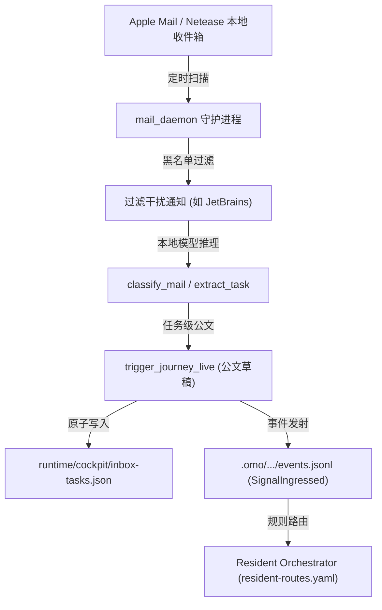

# BET-Y2Q1-T4-02: 真实业务流驱动的信号守护常驻与自主分发设计规范 (BCOS W5 Signal Daemon & Resident Loop)

## 1. 背景与问题陈述

在 `BET-Y2Q1-T4-01` 中，系统成功跑通了真实邮件感知的单次批处理链路（`mail_daemon.py --once`），并通过夏明星 `DefaultPrincipalAuthority` 签发凭证累积了 30/30 笔真实业务审阅凭据，突破了全局 `NOT_PROVEN` 瓶颈。

然而，目前系统仍存在以下断点，阻碍了端到端自主业务操作系统的形成：
1. **守护常驻能力缺失**：目前依赖人工手动触发 `--once`，缺少系统级守护集成（如 macOS `launchd`）及健康监控机制；
2. **事件总线孤岛**：邮件感知提炼出的任务只记录在孤立的 JSONL 文件中，未能向全局 Resident Event Ledger 发射标准事件，Resident Agent 无法感知；
3. **待办池未联通**：提取出的公文初稿和任务未能实时投影到 Cockpit 统一待办池（`runtime/cockpit/inbox-tasks.json`），用户无法在 Cockpit 统一入口一键审阅与署名；
4. **状态可观测性不足**：缺少统一的 `--status` 接口查看守护进程健康度、扫描周期、最后信号与草稿产出。

---

## 2. 目标与范围

### 目标 (Goals)
1. **守护常驻与生命周期加固**：
   - 强化 `mail_daemon.py`，完善单实例 PID 锁、健康心跳、信号处理（SIGTERM/SIGINT 优雅退出）、`--status` 运行诊断输出；
   - 提供系统级 macOS `launchd` 配置模板与安装脚本 `bin/ssot/install-mail-daemon-launchd.sh`。
2. **全局事件总线接入**：
   - 在感知到新任务级邮件并生成草稿后，向系统事件流（`.omo/_knowledge/workflow-mesh/events.jsonl` 及 `event-ledger.sqlite3`）发射标准 `SignalIngressed` 事件（topic: `mesh:signal:mail`）；
   - 在 `bin/ssot/resident-routes.yaml` 补充对 `SignalIngressed` 的路由定义。
3. **Cockpit 统一待办与初稿投影**：
   - 将提炼的待办、摘要及草稿路径原子化写入 `runtime/cockpit/inbox-tasks.json`，供 Cockpit HUD 与 CLI 实时呈现。
4. **防重入与幂等性保障**：
   - 维持基于 Subject/Message-ID 的去重状态机，严禁对同一邮件重复生成草稿堆积。

### 非目标 (Non-Goals)
- 严禁未经夏明星确认自动对外发送真实邮件（必须保持 D0 原则：AI 只产草稿，人工审阅署名放行）；
- 不修改底层 IMAP/AppleScript 读取协议的核心逻辑；
- 不破坏现有 11 项架构硬约束与 SFOP 定律。

---

## 3. 架构设计与数据契约

### 3.1 信号流转 DAG



### 3.2 数据契约

#### A. 事件契约 (`SignalIngressed`)
```json
{
  "event_type": "SignalIngressed",
  "topic": "mesh:signal:mail",
  "source": "apple_mail",
  "subject": "关于医共体建设方案的请示",
  "sender": "example@domain.com",
  "category": "任务",
  "task_summary": "审阅医共体方案初稿",
  "draft_path": "runtime/_drafts/admin-notification-workflow-xxx.md",
  "ts": "2026-09-21T14:50:00Z"
}
```

#### B. Cockpit 待办契约 (`inbox-tasks.json`)
```json
{
  "schema_version": "cockpit-inbox-tasks/v1",
  "updated_at": "2026-09-21T14:50:00Z",
  "tasks": [
    {
      "id": "mail-task-sha256",
      "source": "mail",
      "subject": "关于医共体建设方案的请示",
      "sender": "example@domain.com",
      "status": "pending_review",
      "priority": "P1",
      "draft_file": "runtime/_drafts/admin-notification-workflow-xxx.md",
      "created_at": "2026-09-21T14:50:00Z"
    }
  ]
}
```

---

## 4. 验收标准与验证证据

| 序号 | 断言条件 | 验证命令 | 证据类型 |
|------|----------|----------|----------|
| 1 | `mail_daemon.py --status` 返回包含 PID/运行状态/统计计数的有效 JSON | `python3 bin/ssot/mail_daemon.py --status` | stdout JSON |
| 2 | 守护单次运行可生成/更新 `inbox-tasks.json` 并发射 `SignalIngressed` 事件 | `python3 bin/ssot/mail_daemon.py --once` | file inspection |
| 3 | 单元测试全数通过（包括事件发射、待办投影、防重入） | `pytest tests/unit/test_mail_daemon_resident_loop.py` | exit 0 |
| 4 | `resident-routes.yaml` 包含 `SignalIngressed` 路由 | `grep -q SignalIngressed bin/ssot/resident-routes.yaml` | exit 0 |
| 5 | 本地门禁与台账 lint 100% 绿色 | `make gac-local-gate && uv run --with pyyaml python bin/plan/bet-ledger.py lint` | exit 0 |

---

## 5. 反指标 (Counter-metrics)

1. **零自发邮件**：任何自动化分支如果直接调用真实发送 API，测试立即 FAIL 阻断；
2. **零重复草稿**：同一未读邮件在未被用户标记处理前，绝对不能产生第二份同名/序列草稿；
3. **零僵尸进程**：守护进程退出时必须干净移除 PID 锁文件。

---

## 6. Decision Log

| # | 分叉选项 | 裁定 | 理由 |
|---|----------|------|------|
| 1 | 守护进程调度采用 launchd 还是外部 Docker/Cron？ | **macOS launchd plist + 脚本自驱轮询双轨** | 宿主环境为 macOS，launchd 原生支持系统开机常驻与异常自拉起，符合极简高可用设计。 |
| 2 | 事件总线采用 Kafka/Redis 还是本地 SQLite3/JSONL？ | **本地 SQLite3 + JSONL 双写** | 系统遵循主权边缘计算原则，不增加外部中间件负担，保证 0 运维开销。 |
| 3 | 待办呈现采用独立数据库还是 JSON 投影？ | **原子 JSON 文件投影 (`inbox-tasks.json`)** | Cockpit 与 Web 端均可零延迟通过文件或 BOS URI 直接读取，无状态耦合。 |
