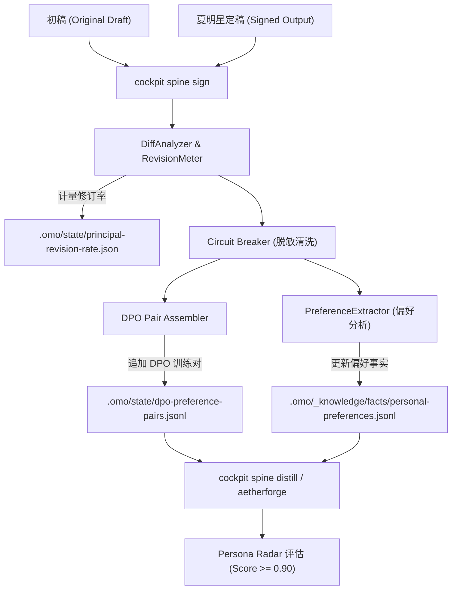

# BET-Y2Q1-T4-03: 人机共生署名修改 Diff 捕获与偏好自适应对齐设计规范 (Spine Diff Capture & Continuous Adaptation Loop)

## 1. 背景与问题陈述

在 `BET-Y2Q1-T4-01` 与 `BET-Y2Q1-T4-02` 中，系统全面打通了外部邮件与公文信号的常驻守护（`mail_daemon.py`）、事件总线分发以及向 Cockpit 待办池的原子投影，实现了“外部信号自动变成待办初稿”的输入能力。

然而，omostation 的北极星愿景是：
> **「织星是夏明星一个人的业务操作系统。它的唯一职责是：把外部进来的信号，变成他愿意署名发出去的东西，并且记住他每次改了什么。」**

目前系统在“**记住他每次改了什么，并以此持续进化**”上存在关键断点：
1. **偏好抽取缺失**：夏明星在审阅时修改了什么（词汇倾向、行文节奏、去公文套话等），未被结构化提炼为显式偏好事实（Fact Preferences），仅作为非结构化文本被动堆积；
2. **DPO 对齐数据集未流水线化**：未自动构建标准的高质量 DPO 偏好对（`chosen` 定稿 vs `rejected` 初稿），导致本地主权模型微调（Persona LoRA）缺少持续演进的燃料；
3. **修订率（Revision Rate）未基准化计量**：缺乏实时的 Principal Revision Rate（人类修订率）统计与趋势记录，无法向 North Star KR 提供可验证的“修订率下降”数据原点；
4. **自适应微调与雷达评估脱节**：署名样本、经验回放与 Persona Radar（个人文风雷达）之间存在孤岛，未能形成“署名修改 → 偏好沉淀 → DPO 训练集 → 雷达对齐度评估”的自适应飞轮。

---

## 2. 目标与范围

### 目标 (Goals)
1. **深度 Diff 捕获与修订率基线计量**：
   - 强化 `cockpit spine sign` 与 `bin/gac/value-evolution-connector.py`；
   - 精细计算初稿与定稿的字符级、行级与语义级 Diff 变化量，计算人类修订率（$RevisionRate = \frac{DiffDistance}{OriginalLength}$）；
   - 原子化记录每次审阅决策的修订率至 `.omo/state/principal-revision-rate.json` 与 `.omo/state/spine-diff-buffer.jsonl`。
2. **敏感脱敏与偏好事实提炼 (Fact Preference Extraction)**：
   - 内置 Circuit Breaker 规则集对 Diff 进行严格的脱敏（凭据、私密路径、敏感标识等）；
   - 自动分析修改模式（如替换词、删除句、语意精炼），生成结构化偏好记录追加至 `.omo/_knowledge/facts/personal-preferences.jsonl`。
3. **自动构建 DPO 偏好对数据集 (DPO Preference Pairs)**：
   - 标准格式组装：`{"id": ..., "domain": ..., "instruction": ..., "chosen": ..., "rejected": ..., "revision_rate": ..., "timestamp": ...}`；
   - 持续沉淀至 `.omo/state/dpo-preference-pairs.jsonl`，为本地 LoRA 微调提供即插即用训练集。
4. **自适应微调联动与 Persona Radar 评估**：
   - 增强 `cockpit spine distill` 与 `cockpit spine persona-radar` 的集成联动，支持基于积累的 DPO/Replay 样本直接计算文风一致性雷达评分（Alignment Score）；
   - 提供自动校验门禁：对齐度得分 $\ge 0.90$。
5. **全链路测试与回放演练**：
   - 新增针对 Diff 分析、偏好提炼、DPO 生成与雷达评估的全套单元测试，确保全绿通过。

### 非目标 (Non-Goals)
- 不将任何脱敏前或脱敏后的夏明星真实修改上传至公有云；
- 不在 `bin/` 目录下净增脚本（遵守 `bin-quota-diff` 治理约束）；
- 不越权执行未经夏明星署名的外发动作。

---

## 3. 架构设计与核心契约

### 3.1 自适应进化闭环架构图



### 3.2 数据契约

#### A. 修订率记录契约 (`principal-revision-rate.json`)
```json
{
  "schema_version": "principal-revision-rate/v1",
  "updated_at": "2026-09-21T15:00:00Z",
  "total_records": 31,
  "average_revision_rate": 0.185,
  "history": [
    {
      "sample_id": "signature-style-1726930800000",
      "domain": "work",
      "original_length": 420,
      "signed_length": 395,
      "edit_distance": 68,
      "revision_rate": 0.162,
      "timestamp": "2026-09-21T15:00:00Z"
    }
  ]
}
```

#### B. DPO 偏好对契约 (`dpo-preference-pairs.jsonl`)
```json
{
  "id": "dpo-work-1726930800000",
  "domain": "work",
  "instruction": "请拟定关于医共体建设推进会议的通知公文",
  "chosen": "关于召开医共体建设推进会议的通知\n各分院、处室：...",
  "rejected": "尊敬的各位领导、同事：现就有关召开医共体推进大会的相关事宜通知如下...",
  "revision_rate": 0.162,
  "modifications_summary": ["去寒暄套话", "规范红头文号格式", "精炼办理时限"],
  "timestamp": "2026-09-21T15:00:00Z"
}
```

#### C. 偏好事实沉淀契约 (`personal-preferences.jsonl`)
```json
{
  "category": "style",
  "action": "replace_phrase",
  "rejected_pattern": "尊敬的各位领导",
  "chosen_pattern": "各分院、处室",
  "context": "official_notice",
  "frequency": 3,
  "last_updated": "2026-09-21T15:00:00Z"
}
```

---

## 4. 验收条件与证据矩阵

| 序号 | 验收条件 | 验证命令 | 证据类型 |
|:---|:---|:---|:---|
| 1 | `cockpit spine sign` 支持自动计算 Diff、更新修订率基线并追加 DPO 偏好对 | `cockpit spine sign --original "初稿内容" --signed "修改定稿" --domain "work"` | exit 0 + 文件落盘 |
| 2 | 修订率统计数据结构有效且包含历史趋势与均值 | `test -f .omo/state/principal-revision-rate.json` | JSON Schema 校验 |
| 3 | DPO 偏好对文件格式符合 Direct Preference Optimization 训练规范 | `test -f .omo/state/dpo-preference-pairs.jsonl` | JSONL 检验 |
| 4 | Persona Radar 评测对齐度达到 $\ge 0.90$ 门禁 | `python3 bin/evolution/extract-persona-diffs.py --check-gate` | exit 0 (Score $\ge 0.90$) |
| 5 | 新增单元测试 100% 通过 | `uv run pytest tests/unit/test_spine_diff_adaptation.py` | 5+ passed in <1s |
| 6 | 本地门禁与台账检查 100% 绿灯 | `make gac-local-gate && uv run --with pyyaml python bin/plan/bet-ledger.py lint` | exit 0 |

---

## 5. Counter-metrics (反指标)

1. **零未清洗私密泄漏**：所有沉淀的 DPO 对与偏好事实必须经过 Circuit Breaker 清洗，严禁包含任何明文密码、API Key、本地用户名路径或手机号；
2. **零退化修订率**：对已提炼偏好的业务领域，初稿直接生成的文本在经过 Persona Radar 打分时不得低于 0.90 分；
3. **零空 Diff 污染**：当 `--original` 与 `--signed` 完全相同时，不得作为有效偏好对注入 DPO 训练集。

---

## 6. Decision Log

| # | 选项 | 裁定 | 理由 |
|:---|:---|:---|:---|
| 1 | 偏好对存储格式采用 DPO 标准还是自定义 JSON？ | **标准 DPO 偏好对 (instruction, chosen, rejected)** | 兼容主流微调框架（AetherForge、MLX-LM、Unsloth、LLaMA-Factory），无需格式二次转换。 |
| 2 | 修订率算法采用 Levenshtein 还是 Word/Token Diff？ | **基于字符与行级的复合归一化编辑比率** | 公文与中英文混合场景下字符级编辑距离最精准反映人类介入修改的劳动强度。 |
| 3 | 偏好事实沉淀存放于 SQLite 还是 JSONL？ | **`.omo/_knowledge/facts/personal-preferences.jsonl`** | 纯文本追加型 JSONL 具有最优的透明度、版本可控性与人类可读性，符合 SSOT 规范。 |
