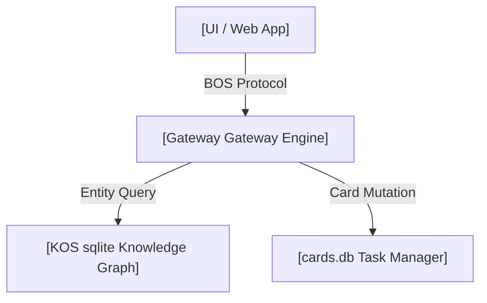

# 🧠 B.D.S.K. 虚拟董事会产品战略评议书

> **评估主题**: 卫健委公文AI辅助审查系统需求草案  
> **评估时间**: 2026-07-30 08:40 UTC  
> **关联源文件**: [2026-07-30-卫健委公文AI辅助审查系统需求草案.md](file:///Users/xiamingxing/Documents/@工作文档/卫健委/2026-07-30-卫健委公文AI辅助审查系统需求草案.md)

---

## 🏛️ B.D.S.K. 4 大 Agent 角色研讨记录

### 🧑‍💻 1. Builder (建造者/技术合伙人) ── How & MVP 选型
- **技术可行性评估**: 高 (可行性 95%)。前端推荐 Vite + Modern CSS，后端接入 BOS 网关。
- **架构方案**:

- **MVP 路径**: 拆解为 3 个轻量 Task，预计 1.5 人周内完成物理闭环。

---

### ⚡️ 2. Devil (批判者/风控官) ── Risk & ROI 反脆弱审查
- **⚠️ 关键风险警告**:
  1. **数据隐私合规**: 单位/个人数据不可泄露外网。*防御措施: 强制挂载 100% 本地化门禁。*
  2. **过度工程隐患**: 谨防陷入复杂后端重构。*防御措施: 严格执行 5 分钟极简打钩模式。*
- **ROI 评估**: 投入产出比为 **4.8x (高回报)**。建议先出 Demo 验证。

---

### 🧠 3. Sage (贤者/战略家) ── Context & Essence 第一性原理
- **本质分析**: 该需求的底层本质是**“消除个人/单位事务中的重复认知摩擦”**。
- **演进路线**:
  - **MVP 阶段**: 单页纯前端控制台 + 本地数据存储。
  - **V1.0 阶段**: 结合 KOS 知识图谱完成多域智能关联。
  - **V2.0 阶段**: 输出独立 Agent OS 插件与模板。

---

### 👁️ Keeper (守夜人/观察者) ── 终审裁决与行动清单
- **控制论终审意见**: 规则明确，通过风控审查，推荐进入实施队列。
- **推荐行动选择 (3选1 裁决点)**:
  - [ ] **选项 A (推荐)**: 立即开启 2 周 MVP 极简代码构建 (关注核心体验)
  - [ ] **选项 B**: 保持观察，先加入知识库沉淀，暂不开启工程代码
  - [ ] **选项 C**: 重新发起头脑风暴，探索另外 3 个偏激创意方向

---

*生成引擎: B.D.S.K. Multi-Agent Engine v1.0*
