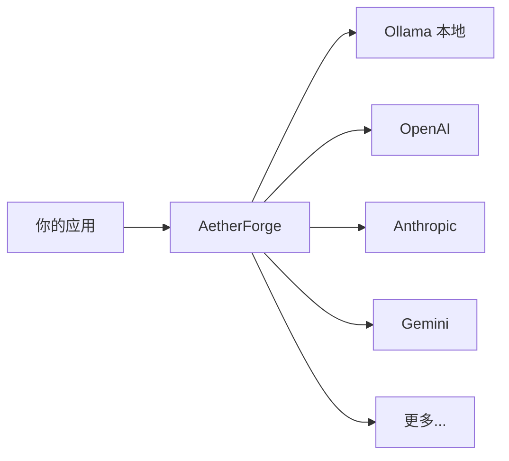

# 🔮 AetherForge

> 你的个人 AI 算力中心 — LLM 网关 + 算力网格 + 多 Agent 编排

---

## 为什么需要 AetherForge？



**一个入口调用所有 LLM。** 不用再记 6 套 API、不用管每个 Provider 的认证方式、不用担心账单失控。

## 快速体验

```bash
pip install aetherforge
aetherforge demo
aetherforge gateway generate "什么是 AI？"
```

## 核心能力

### 🚪 Gateway — 统一 LLM 入口
支持 9 个 Provider，内置限流、熔断、智能路由。

### 🌐 Mesh — 算力网格
自动发现本地 + 云端算力节点，智能路由到最优节点。

### 🤖 Swarm — 多 Agent 协作
GroupChat、拍卖市场、图工作流，零门槛多 Agent 编排。

## 下一步

- [快速开始](quickstart.md) — 5 分钟上手
- [API 参考](api.md) — 完整 API 文档
- [架构](architecture.md) — 系统设计
