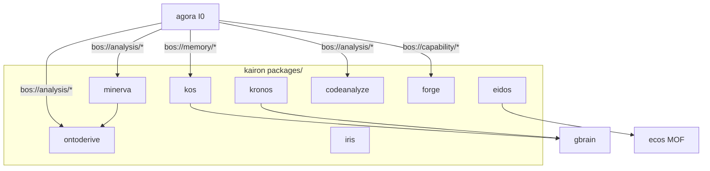

# kairon — Architecture

> **Layer**: L2 引擎面
> **Role**: 知识工程与研究引擎 / 14 packages monorepo (post 2026-07-26 cleanup, P30.5/STRAT-P81)
> **Stack**: Python 3.13+, uv workspace, pytest
> **Health**: See local CI and package-level verification
> **SSOT**: 运行时健康、测试规模、包数量以本项目 CI、本地测试命令和 workspace governance SSOT 为准
>
> **架构审计 (2026-07-13 → 2026-07-26 5 轮 review)**: 详见下方 §6 演进 + [`docs/analysis/architecture-audit-2026-07-13.md`](docs/analysis/architecture-audit-2026-07-13.md)
> 2026-07-26 累计清理: 11 broken module 修, 70 0-ref module 删, 21 跨项目 kairon_events 引用清
> ADR-0239 (P30 拆分清理), ADR-0241 (RUF100 + untrack), ADR-0243 (L0 orphan 删), ADR-0244 (4 巨包 0-ref)
>
> 系统全景参见：[`../../docs/PANORAMA.md`](../../docs/PANORAMA.md)

---

## 1. 内部架构



## 2. 入口

| Type | Entry | Port / Notes |
|:--|:--|:--|
| CLI | `per-package (kos, kronos, minerva, ...)` | 16 个 `__main__`, 开发调试用 |
| BOS | `bos://memory/*, bos://analysis/*, bos://persona/*` | agora 统一外部入口 |
| MCP | 9 个 server (kos/minerva/eidos/ontoderive/kronos/iris/sophia/forge) | ⚠️ 碎片化 + 协议割裂 (kos/eidos stdio 手写, 其他 FastMCP); 见审计 §2 |

## 3. 核心模块

| Module | Responsibility |
|:--|:--|
| `packages/kos/` | 跨域语义搜索 / KOS 知识图谱 |
| `packages/minerva/` | 深度研究引擎 |
| `packages/eidos/` | 认知记忆系统 (memory/nks/continuity/CRDT/learning + schema) — **kairon 枢纽**, 36K LOC, 被 codeanalyze/iris/kos/minerva 依赖 (反向零耦合) |
| `packages/kronos/` | 知识摄取管线 |
| `packages/ontoderive/` | 本体推导与推理，包含单项/批量验证与演化流水线；外部通过 Agora `bos://analysis/ontoderive/derive` 路由 |
| `packages/codeanalyze/` | AST 代码分析 |
| `packages/forge/` | Agent/工具集市 |
| `packages/iris/` | 发现与召回 |

## 4. 测试

```bash
cd projects/kairon && make test-diff  # or make test
```

## 5. 架构概览

参见工作区架构概览图：[`../../docs/ARCHITECTURE-DIAGRAM.md`](../../docs/ARCHITECTURE-DIAGRAM.md)

## 6. 演进

### 6.1 当前包清单

包清单、版本与依赖以根 `pyproject.toml` 及各 `packages/*/pyproject.toml` 为准，不在架构文档固化易漂移计数。

### 6.2 近期清理与恢复

- 删除已确认无引用的历史模块和派生日志，收敛根目录平铺面。
- 删除跨项目 `kairon_events` 孤儿包并同步消费者。
- 恢复清理中误删但仍被 `validation_steps` 导入的 `pipeline_models`、`context_compiler`、`meta_validate` 与 `meta_evolve` 契约。
- 为 Minerva、Eidos 与 OntoDerive 的关键路径补充增量回归测试。

### 6.3 OntoDerive 验证流水线契约

`ValidateStep`/`BatchValidateStep` 调用 `MetaValidateEngine`，`EvolveStep`/`BatchEvolveStep` 调用 `MetaEvolveEngine`。批量项的 `status`、`result`、`error` 由 `pipeline_models.BatchItem` 统一承载；缺少对齐报告的项目保持 `SKIPPED`，不会计入完成项。具体使用和限时验证命令见 [`packages/ontoderive/README.md`](packages/ontoderive/README.md)。

### 6.4 后续债

- Minerva 大模块按职责拆分。
- Eidos 子包边界继续收敛。
- 持续提升增量测试覆盖，覆盖率与测试数量读取 CI 产物，不在本文硬编码。
- 按需同步 Kairon 与 Agora、AetherForge、runtime 的跨项目 API 文档。
